# 中华人民共和国国家标准

建筑抗震设计规范

GB 50011 - 2010

(2016年版)

条文说明

## 修订说明

本次修订系根据原建设部《关于印发〈2006年工程建设标准规范制订、修订计划（第一批）的通知〉》（建标〔2006〕77号）的要求，由中国建筑科学研究院会同有关的设计、勘察、研究和教学单位，于2007年1月开始对《建筑抗震设计规范》GB 50011-2001（以下简称2001规范）进行全面修订。

本次修订过程中，发生了2008年“5·12”汶川大地震，其震害经验表明，严格按照2001规范进行设计、施工和使用的建筑，在遭遇比当地设防烈度高一度的地震作用下，可以达到在预估的罕遇地震下保障生命安全的抗震设防目标。汶川地震建筑震害经验对我国建筑抗震设计规范的修订具有重要启示，地震后，根据住房和城乡建设部落实国务院《汶川地震灾后恢复重建条例》的要求，对2001规范进行了应急局部修订，形成了《建筑抗震设计规范》GB50011-2001（2008年版），此次修订共涉及31条规定，主要包括灾区设防烈度的调整，增加了有关山区场地、框架结构填充墙设置、砌体结构楼梯间、抗震结构施工要求的强制性条文，提高了装配式楼板构造和钢筋伸长率的要求。

在完成 2008 年版局部修订之后，《建筑抗震设计规范》的全面修订工作继续进行，于 2009 年 5 月形成了“征求意见稿”并发至全国勘察、设计、教学单位和抗震管理部门征求意见，其方式有三种：设计单位或抗震管理部门召开讨论会，形成书面意见；设计、勘察及研究人员直接用书面或电子邮件提出意见；以及有关刊物上发表论文。累计共收集到千余条次意见。同年 8 月，对所收集的意见进行分析、整理，修改了条文，开展了试设计工作。

与2001版规范相比，《建筑抗震设计规范》GB50011-2010

的条文数量有下列变动：

2001 版规范共有 13 章 54 节 11 附录，共 554 条；其中，正文 447 条，附录 107 条。

《建筑抗震设计规范》GB 50011－2010 共有 14 章 59 节 12 附录，共 630 条。其中，正文增加 39 条，占原条文的 9%；附录增加 37 条，占 36%。

原有各章修改的主要内容见前言。新增的内容是：大跨屋盖建筑、地下建筑、框排架厂房、钢支撑-混凝土框架和钢框架-混凝土筒体房屋，以及抗震性能化设计原则，并删去内框架房屋的有关内容。

2001 规范 2008 年局部修订后共有 58 条强制性条文，本次修订减少了 2 条：设防标准直接引用《建筑工程抗震设防分类标准》GB 50223；对隔震设计的可行性论证，不再作为强制性要求。

2009年11月，由住房和城乡建设部标准定额司主持，召开了《建筑抗震设计规范》修订送审稿审查会。会议认为，修订送审稿继续保持2001版规范的基本规定是合适的，所增加的新内容总体上符合汶川地震后的要求和设计需要，反映了我国抗震科研的新成果和工程实践的经验，吸取了一些国外的先进经验，更加全面、更加细致、更加科学。新规范的颁布和实施将使我国的建筑抗震设计提高到新的水平。

本次修订，附录 A 依据《中国地震动参数区划图》GB 18306-2001 及其第 1、2 号修改单进行了设计地震分组。目前，《中国地震动参数区划图》正在修订，今后，随着《中国地震动参数区划图》的修订和施行，该附录将及时与之协调，进行修改。

2001 规范的主编单位：中国建筑科学研究院

2001 规范的参编单位：中国地震局工程力学研究所、中国建筑技术研究院、冶金工业部建筑研究总院、建设部建筑设计院、机械工业部设计研究院、中国轻工国际工程设计院（中国轻工）

工业北京设计院）、北京市建筑设计研究院、上海建筑设计研究院、中南建筑设计院、中国建筑西北设计研究院、新疆建筑设计研究院、广东省建筑设计研究院、云南省设计院、辽宁省建筑设计研究院、深圳市建筑设计研究总院、北京勘察设计研究院、深圳大学建筑设计研究院、清华大学、同济大学、哈尔滨建筑大学、华中理工大学、重庆建筑大学、云南工业大学、华南建设学院（西院）。

2001 规范的主要起草人：徐正忠 王亚勇（以下按姓氏笔画排列）

王迪民 王彦深 王骏孙 韦承基 叶燎原 刘惠珊

吕西林 孙平善 李国强 吴明舜 苏经宇 张前国 陈 健

陈富生 沙 安 欧进萍 周炳章 周锡元 周雍年 周福霖

胡庆昌 袁金西 秦 权 高小旺 容柏生 唐家祥 徐 建

徐永基 钱稼茹 龚思礼 董津城 赖 明 傅学怡 蔡益燕

樊小卿 潘凯云 戴国莹

本次修订过程中，2001规范的一些主要起草人如胡庆昌、徐正忠、龚思礼、张前国等作为此次修订的顾问专家，对规范修订的原则、指导思想及具体条文的技术规定等提出了中肯的意见和建议。

## 目次

1 总则 …… 282  
2 术语和符号 …… 286  
3 基本规定 …… 287  
3.1 建筑抗震设防分类和设防标准 …… 287  
3.2 地震影响 …… 289  
3.3 场地和地基 …… 290  
3.4 建筑形体及其构件布置的规则性 …… 292  
3.5 结构体系 …… 298  
3.6 结构分析 …… 301  
3.7 非结构构件 …… 304  
3.8 隔震与消能减震设计 …… 305  
3.9 结构材料与施工 …… 305  
3.10 建筑抗震性能化设计 …… 308  
3.11 建筑物地震反应观测系统 …… 314  
附录 A 我国主要城镇抗震设防烈度、设计基本地震加速度和设计地震分组 …… 315  
4 场地、地基和基础 …… 317  
4.1 场地 …… 317  
4.2 天然地基和基础 …… 324  
4.3 液化土和软土地基 …… 325  
4.4 桩基 …… 337  
5 地震作用和结构抗震验算 …… 340  
5.1 一般规定 …… 340  
5.2 水平地震作用计算 …… 347  
5.3 竖向地震作用计算 …… 352

5.4 截面抗震验算 …… 353  
5.5 抗震变形验算 …… 355  
6 多层和高层钢筋混凝土房屋 …… 362  
6.1 一般规定 …… 362  
6.2 计算要点 …… 370  
6.3 框架的基本抗震构造措施 …… 378  
6.4 抗震墙结构的基本抗震构造措施 …… 383  
6.5 框架-抗震墙结构的基本抗震构造措施 …… 385  
6.6 板柱-抗震墙结构抗震设计要求 …… 386  
6.7 筒体结构抗震设计要求 …… 386  
7 多层砌体房屋和底部框架砌体房屋 …… 389  
7.1 一般规定 …… 389  
7.2 计算要点 …… 394  
7.3 多层砖砌体房屋抗震构造措施 …… 398  
7.4 多层砌块房屋抗震构造措施 …… 402  
7.5 底部框架-抗震墙砌体房屋抗震构造措施 …… 403  
附录 F 配筋混凝土小型空心砌块抗震墙房屋抗震设计要求 …… 406  
8 多层和高层钢结构房屋 …… 412  
8.1 一般规定 …… 412  
8.2 计算要点 …… 416  
8.3 钢框架结构的抗震构造措施 …… 421  
8.4 钢框架-中心支撑结构的抗震构造措施 …… 426  
8.5 钢框架-偏心支撑结构的抗震构造措施 …… 426  
附录 G 钢支撑-混凝土框架和钢框架-钢筋混凝土核心筒结构房屋抗震设计要求 …… 428  
9 单层工业厂房 …… 432  
9.1 单层钢筋混凝土柱厂房 …… 432  
9.2 单层钢结构厂房 …… 442  
9.3 单层砖柱厂房 …… 451

附录 H 多层工业厂房抗震设计要求 …… 456  
10 空旷房屋和大跨屋盖建筑 …… 460  
10.1 单层空旷房屋 …… 460  
10.2 大跨屋盖建筑 …… 462  
11 土、木、石结构房屋 …… 470  
11.1 一般规定 …… 470  
11.2 生土房屋 …… 472  
11.3 木结构房屋 …… 473  
11.4 石结构房屋 …… 475  
12 隔震和消能减震设计 …… 477  
12.1 一般规定 …… 477  
12.2 房屋隔震设计要点 …… 480  
12.3 房屋消能减震设计要点 …… 486  
附录 L 隔震设计简化计算和砌体结构隔震措施 …… 489  
13 非结构构件 …… 493  
13.1 一般规定 …… 493  
13.2 基本计算要求 …… 494  
13.3 建筑非结构构件的基本抗震措施 …… 497  
13.4 建筑附属机电设备支架的基本抗震措施 …… 499  
附录 M 实现抗震性能设计目标的参考方法 …… 500  
14 地下建筑 …… 504  
14.1 一般规定 …… 504  
14.2 计算要点 …… 505  
14.3 抗震构造措施和抗液化措施 …… 509

## 1 总 则

1.0.1 国家有关建筑的防震减灾法律法规，主要指《中华人民共和国建筑法》、《中华人民共和国防震减灾法》及相关的条例等。

本规范对于建筑抗震设防的基本思想和原则继续同《建筑抗震设计规范》GBJ 11-89（以下简称89规范）、《建筑抗震设计规范》GB 50011-2001（以下简称2001规范）保持一致，仍以“三个水准”为抗震设防目标。

抗震设防是以现有的科学水平和经济条件为前提。规范的科学依据只能是现有的经验和资料。目前对地震规律性的认识还很不足，随着科学水平的提高，规范的规定会有相应的突破；而且规范的编制要根据国家的经济条件的发展，适当地考虑抗震设防水平，制定相应的设防标准。

本次修订，继续保持89规范提出的并在2001规范延续的抗震设防三个水准目标，即“小震不坏、中震可修、大震不倒”的某种具体化。根据我国华北、西北和西南地区对建筑工程有影响的地震发生概率的统计分析，50年内超越概率约为63%的地震烈度为对应于统计“众值”的烈度，比基本烈度约低一度半，本规范取为第一水准烈度，称为“多遇地震”；50年超越概率约10%的地震烈度，即1990中国地震区划图规定的“地震基本烈度”或中国地震动参数区划图规定的峰值加速度所对应的烈度，规范取为第二水准烈度，称为“设防地震”；50年超越概率2%~3%的地震烈度，规范取为第三水准烈度，称为“罕遇地震”，当基本烈度6度时为7度强，7度时为8度强，8度时为9度弱，9度时为9度强。

与三个地震烈度水准相应的抗震设防目标是：一般情况下

（不是所有情况下），遭遇第一水准烈度——众值烈度（多遇地震）影响时，建筑处于正常使用状态，从结构抗震分析角度，可以视为弹性体系，采用弹性反应谱进行弹性分析；遭遇第二水准烈度——基本烈度（设防地震）影响时，结构进入非弹性工作阶段，但非弹性变形或结构体系的损坏控制在可修复的范围[与89规范、2001规范相同，其承载力的可靠性与《工业与民用建筑抗震设计规范》TJ11-78（以下简称78规范）相当并略有提高]；遭遇第三水准烈度——最大预估烈度（罕遇地震）影响时，结构有较大的非弹性变形，但应控制在规定的范围内，以免倒塌。

## 还需说明的是：

1 抗震设防烈度为 6 度时，建筑按本规范采取相应的抗震措施之后，抗震能力比不设防时有实质性的提高，但其抗震能力仍是较低的。

2 不同抗震设防类别的建筑按本规范规定采取抗震措施之后，相应的抗震设防目标在程度上有所提高或降低。例如，丁类建筑在设防地震下的损坏程度可能会重些，且其倒塌不危及人们的生命安全，在罕遇地震下的表现会比一般的情况要差；甲类建筑在设防地震下的损坏是轻微甚至是基本完好的，在罕遇地震下的表现将会比一般的情况好些。

3 本次修订继续采用二阶段设计实现上述三个水准的设防目标：第一阶段设计是承载力验算，取第一水准的地震动参数计算结构的弹性地震作用标准值和相应的地震作用效应，继续采用《建筑结构可靠度设计统一标准》GB 50068规定的分项系数设计表达式进行结构构件的截面承载力抗震验算，这样，其可靠度水平同78规范相当，并由于非抗震构件设计可靠性水准的提高而有所提高，既满足了在第一水准下具有必要的承载力可靠度，又满足第二水准的损坏可修的目标。对大多数的结构，可只进行第一阶段设计，而通过概念设计和抗震构造措施来满足第三水准的设计要求。

第二阶段设计是弹塑性变形验算，对地震时易倒塌的结构、有明显薄弱层的不规则结构以及有专门要求的建筑，除进行第一阶段设计外，还要进行结构薄弱部位的弹塑性层间变形验算并采取相应的抗震构造措施，实现第三水准的设防要求。

4 在 89 规范和 2001 规范所提出的以结构安全性为主的“小震不坏、中震可修、大震不倒”三水准目标，就是一种抗震性能目标——小震、中震、大震有明确的概率指标；房屋建筑不坏、可修、不倒的破坏程度，在《建筑地震破坏等级划分标准》（建设部 90 建抗字 377 号）中提出了定性的划分。本次修订，对某些有专门要求的建筑结构，在本规范第 3.10 节和附录 M 增加了关于中震、大震的进一步定量的抗震性能化设计原则和设计指标。

1.0.2 本条是强制性条文，要求处于抗震设防地区的所有新建建筑工程均必须进行抗震设计。以下，凡用粗体表示的条文，均为建筑工程房屋建筑部分的强制性条文。

1.0.3 本规范的适用范围，继续保持89规范、2001规范的规定，适用于6～9度一般的建筑工程。多年来，很多位于区划图6度的地区发生了较大的地震，6度地震区的建筑要适当考虑一些抗震要求，以减轻地震灾害。

工业建筑中，一些因生产工艺要求而造成的特殊问题的抗震设计，与一般的建筑工程不同，需由有关的专业标准予以规定。

因缺乏可靠的近场地震的资料和数据，抗震设防烈度大于9度地区的建筑抗震设计，仍没有条件列入规范。因此，在没有新的专门规定前，可仍按1989年建设部印发（89）建抗字第426号《地震基本烈度X度区建筑抗震设防暂行规定》的通知执行。

2001 规范比 89 规范增加了隔震、消能减震的设计规定，本次修订，还增加了抗震性能化设计的原则性规定。

1.0.4 为适应强制性条文的要求，采用最严的规范用语“必须”。

作为抗震设防依据的文件和图件，如地震烈度区划图和地震

动参数区划图，其审批权限，由国家有关主管部门依法规定。

1.0.5 在 89 规范和 2001 规范中，均规定了抗震设防依据的“双轨制”，即一般情况采用抗震设防烈度（作为一个地区抗震设防依据的地震烈度），在一定条件下，可采用经国家有关主管部门规定的权限批准发布的供设计采用的抗震设防区划的地震动参数（如地面运动加速度峰值、反应谱值、地震影响系数曲线和地震加速度时程曲线）。

本次修订，按2009年发布的《中华人民共和国防震减灾法》对“地震小区划”的规定，删去2001规范对城市设防区划的相关规定，保留“一般情况”这几个字。

新一代的地震区划图正在编制中，本次修订的有关条文和附录将依据新的区划图进行相应的协调性修改。

## 2 术语和符号

抗震设防烈度是一个地区的设防依据，不能随意提高或降低。

抗震设防标准，是一种衡量对建筑抗震能力要求高低的综合尺度，既取决于建设地点预期地震影响强弱的不同，又取决于建筑抗震设防分类的不同。本规范规定的设防标准是最低的要求，具体工程的设防标准可按业主要求提高。

结构上地震作用的涵义，强调了其动态作用的性质，不仅包括多个方向地震加速度的作用，还包括地震动的速度和动位移的作用。

2001 规范明确了抗震措施和抗震构造措施的区别。抗震构造措施只是抗震措施的一个组成部分。在本规范的目录中，可以看到一般规定、计算要点、抗震构造措施、设计要求等。其中的一般规定及计算要点中的地震作用效应（内力和变形）调整的规定均属于抗震措施，而设计要求中的规定，可能包含有抗震措施和抗震构造措施，需按术语的定义加以区分。

本次修订，按《中华人民共和国防震减灾法》的规定，补充了“地震动参数区划图”这个术语。明确在国家法律中，“地震动参数”是“以加速度表示地震作用强弱程度”，“区划图”是将国土“划分为不同抗震设防要求区域的图件”。

## 3 基本规定

### 3.1 建筑抗震设防分类和设防标准

3.1.1 根据我国的实际情况——经济实力有了较大的提高，但仍属于发展中国家的水平，提出适当的抗震设防标准，既能合理使用建设投资，又能达到抗震安全的要求。

89 规范、2001 规范关于建筑抗震设防分类和设防标准的规定，已被国家标准《建筑工程抗震设防分类标准》GB 50223 所替代。按照国家标准编写的规定，本次修订的条文直接引用而不重复该国家标准的规定。

按照《建筑工程抗震设防分类标准》GB 50223－2008，各个设防分类建筑的名称有所变更，但明确甲类、乙类、丙类、丁类是分别作为特殊设防类、重点设防类、标准设防类、适度设防类的简称。因此，在本规范以及建筑结构设计文件中，继续采用简称。

《建筑工程抗震设防分类标准》GB 50223－2008 进一步突出了设防类别划分是侧重于使用功能和灾害后果的区分，并更强调体现对人员安全的保障。

自1989年《建筑抗震设计规范》GBJ11-89发布以来，按技术标准设计的所有房屋建筑，均应达到“多遇地震不坏、设防地震可修和罕遇地震不倒”的设防目标。这里，多遇地震、设防地震和罕遇地震，一般按地震基本烈度区划或地震动参数区划对当地的规定采用，分别为50年超越概率63%、10%和2%~3%的地震，或重现期分别为50年、475年和1600年~2400年的地震。

针对我国地震区划图所规定的烈度有很大不确定性的事实，在建设行政主管部门领导下，89规范明确规定了“小震不坏、

中震可修、大震不倒”的抗震设防目标。这个目标可保障“房屋建筑在遭遇设防地震影响时不致有灾难性后果，在遭遇罕遇地震影响时不致倒塌”。2008年汶川地震表明，严格按照现行抗震规范进行设计、施工和使用的房屋建筑，达到了规范规定的设防目标，在遭遇到高于地震区划图一度的地震作用下，没有出现倒塌破坏——实现了生命安全的目标。因此，《建筑工程抗震设防分类标准》GB50223-2008继续规定，绝大部分建筑均可划为标准设防类（简称丙类），将使用上需要提高防震减灾能力的房屋建筑控制在很小的范围。

在需要提高设防标准的建筑中，乙类需按提高一度的要求加强其抗震措施——增加关键部位的投资即可达到提高安全性的目标；甲类在提高一度的要求加强其抗震措施的基础上，“地震作用应按高于本地区设防烈度计算，其值应按批准的地震安全性评价结果确定”。地震安全性评价通常包括给定年限内不同超越概率的地震动参数，应由具备资质的单位按相关标准执行并对其评价报告的质量负责。这意味着，地震作用计算提高的幅度应经专门研究，并需要按规定的权限审批。条件许可时，专门研究还可包括基于建筑地震破坏损失和投资关系的优化原则确定的方法。

《建筑结构可靠度设计统一标准》GB 50068，提出了设计使用年限的原则规定。显然，抗震设防的甲、乙、丙、丁分类，也可体现设计使用年限的不同。

还需说明，《建筑工程抗震设防分类标准》GB 50223 规定乙类提高抗震措施而不要求提高地震作用，同一些国家的规范只提高地震作用（10%～30%）而不提高抗震措施，在设防概念上有所不同：提高抗震措施，着眼于把财力、物力用在增加结构薄弱部位的抗震能力上，是经济而有效的方法，适合于我国经济有较大发展而人均经济水平仍属于发展中国家的情况；只提高地震作用，则结构的各构件均全面增加材料，投资增加的效果不如前者。

3.1.2 鉴于6度设防的房屋建筑，其地震作用往往不属于结构设计的控制作用，为减少设计计算的工作量，本规范明确，6度

设防时，除有明确规定的情况，其抗震设计可仅进行抗震措施的设计而不进行地震作用计算。

### 3.2 地震影响

多年来地震经验表明，在宏观烈度相似的情况下，处在大震级、远震中距下的柔性建筑，其震害要比中、小震级近震中距的情况重得多；理论分析也发现，震中距不同时反应谱频谱特性并不相同。抗震设计时，对同样场地条件、同样烈度的地震，按震源机制、震级大小和震中距远近区别对待是必要的，建筑所受到的地震影响，需要采用设计地震动的强度及设计反应谱的特征周期来表征。

作为一种简化，89规范主要藉助于当时的地震烈度区划，引入了设计近震和设计远震，后者可能遭遇近、远两种地震影响，设防烈度为9度时只考虑近震的地震影响；在水平地震作用计算时，设计近、远震用两组地震影响系数 $ \alpha $ 曲线表达，按远震的曲线设计就已包含两种地震用不利情况。

2001 规范明确引入了“设计基本地震加速度”和“设计特征周期”，与当时的中国地震动参数区划（中国地震动峰值加速度区划图 A1 和中国地震动反应谱特征周期区划图 B1）相匹配。

“设计基本地震加速度”是根据建设部1992年7月3日颁发的建标 $$ 1992 $$ 419号《关于统一抗震设计规范地面运动加速度设计取值的通知》而作出的。通知中有如下规定：

术语名称：设计基本地震加速度值。

定义：50 年设计基准期超越概率 10% 的地震加速度的设计取值。

取值：7度0.10g，8度0.20g，9度0.40g。

本规范表 3.2.2 所列的设计基本地震加速度与抗震设防烈度的对应关系即来源于上述文件。其取值与《中国地震动参数区划图》GB 18306-2015 附录 A 所规定的“地震动峰值加速度”相当：即在 0.10g 和 0.20g 之间有一个 0.15g 的区域，0.20g 和

0.40g 之间有一个 0.30g 的区域，在这二个区域内建筑的抗震设计要求，除另有具体规定外，分别同 7 度和 8 度，在本规范表 3.2.2 中用括号内数值表示。本规范表 3.2.2 中还引入了与 6 度相当的设计基本地震加速度值 0.05g。

“设计特征周期”即设计所用的地震影响系数的特征周期 $ (T_{g}) $ ，简称特征周期。89规范规定，其取值根据设计近、远震和场地类别来确定，我国绝大多数地区只考虑设计近震，需要考虑设计远震的地区很少（约占县级城镇的5%）。2001规范将89规范的设计近震、远震改称设计地震分组，可更好体现震级和震中距的影响，建筑工程的设计地震分为三组。根据规范编制保持其规定延续性的要求和房屋建筑抗震设防决策，2001规范的设计地震的分组在《中国地震动参数区划图》GB18306-2001附录B的基础上略作调整。2010年修订对各地的设计地震分组作了较大的调整，使之与《中国地震动参数区划图》GB18306-2001一致。此次局部修订继续保持这一原则，按照《中国地震动参数区划图》GB18306-2015附录B的规定确定设计地震分组。

为便于设计单位使用，本规范在附录 A 给出了县级及县级以上城镇（按民政部编 2015 行政区划简册，包括地级市的市辖区）的中心地区（如城关地区）的抗震设防烈度、设计基本地震加速度和所属的设计地震分组。

### 3.3 场地和地基

3.3.1 在抗震设计中，场地指具有相似的反应谱特征的房屋群体所在地，不仅仅是房屋基础下的地基土，其范围相当于厂区、居民点和自然村，在平坦地区面积一般不小于 $ 1km\times1km $ 。

地震造成建筑的破坏，除地震动直接引起结构破坏外，还有场地条件的原因，诸如：地震引起的地表错动与地裂，地基土的不均匀沉陷、滑坡和粉、砂土液化等。因此，选择有利于抗震的建筑场地，是减轻场地引起的地震灾害的第一道工序，抗震设防区的建筑工程宜选择有利的地段，应避开不利的地段并不在危险

的地段建设。针对汶川地震的教训，2008年局部修订强调：严禁在危险地段建造甲、乙类建筑。还需要注意，按全文强制的《住宅设计规范》GB 50096，严禁在危险地段建造住宅，必须严格执行。

场地地段的划分，是在选择建筑场地的勘察阶段进行的，要根据地震活动情况和工程地质资料进行综合评价。本规范第4.1.1条给出划分建筑场地有利、一般、不利和危险地段的依据。

3.3.2、3.3.3 抗震构造措施不同于抗震措施，二者的区别见本规范第2.1.10条和第2.1.11条。历次大地震的经验表明，同样或相近的建筑，建造于Ⅰ类场地时震害较轻，建造于Ⅲ、Ⅳ类场地震害较重。

本规范对Ⅰ类场地，仅降低抗震构造措施，不降低抗震措施中的其他要求，如按概念设计要求的内力调整措施。对于丁类建筑，其抗震措施已降低，不再重复降低。

对Ⅲ、Ⅳ类场地，除各章有具体规定外，仅提高抗震构造措施，不提高抗震措施中的其他要求，如按概念设计要求的内力调整措施。

3.3.4 对同一结构单元不宜部分采用天然地基部分采用桩基的要求，一般情况执行没有困难。在高层建筑中，当主楼和裙房不分缝的情况下难以满足时，需仔细分析不同地基在地震下变形的差异及上部结构各部分地震反应差异的影响，采取相应措施。

本次修订，对不同地基基础类型的要求，提出了较为明确的对策。

3.3.5 本条系在 2008 年局部修订时增加的，针对山区房屋选址和地基基础设计，提出明确的抗震要求。需注意：

1 有关山区建筑距边坡边缘的距离，参照《建筑地基基础设计规范》GB 50007-2002 第 5.4.1、第 5.4.2 条计算时，其边坡坡角需按地震烈度的高低修正——减去地震角，滑动力矩需计入水平地震和竖向地震产生的效应。

2 挡土结构抗震设计稳定验算时有关摩擦角的修正，指地震主动土压力按库伦理论计算时：土的重度除以地震角的余弦，填土的内摩擦角减去地震角，土对墙背的摩擦角增加地震角。

地震角的范围取 $ 1.5^{\circ}\sim10^{\circ} $ ，取决于地下水位以上和以下，以及设防烈度的高低。可参见《建筑抗震鉴定标准》GB 50023-2009第4.2.9条。

### 3.4 建筑形体及其构件布置的规则性

3.4.1 合理的建筑形体和布置（configuration）在抗震设计中是头等重要的。提倡平、立面简单对称。因为震害表明，简单、对称的建筑在地震时较不容易破坏。而且道理也很清楚，简单、对称的结构容易估计其地震时的反应，容易采取抗震构造措施和进行细部处理。“规则”包含了对建筑的平、立面外形尺寸，抗侧力构件布置、质量分布，直至承载力分布等诸多因素的综合要求。“规则”的具体界限，随着结构类型的不同而异，需要建筑师和结构工程师互相配合，才能设计出抗震性能良好的建筑。

本条主要对建筑师设计的建筑方案的规则性提出了强制性要求。在2008年局部修订时，为提高建筑设计和结构设计的协调性，明确规定：首先，建筑形体和布置应依据抗震概念设计原则划分为规则与不规则两大类；对于具有不规则的建筑，针对其不规程的具体情况，明确提出不同的要求；强调应避免采用严重不规则的设计方案。

概念设计的定义见本规范第 2.1.9 条。规则性是其中的一个重要概念。

规则的建筑方案体现在体型（平面和立面的形状）简单，抗侧力体系的刚度和承载力上下变化连续、均匀，平面布置基本对称。即在平立面、竖向剖面或抗侧力体系上，没有明显的、实质的不连续（突变）。

规则与不规则的区分，本规范在第3.4.3条规定了一些定量的参考界限，但实际上引起建筑不规则的因素还有很多，特别是

复杂的建筑体型，很难一一用若干简化的定量指标来划分不规则程度并规定限制范围，但是，有经验的、有抗震知识素养的建筑设计人员，应该对所设计的建筑的抗震性能有所估计，要区分不规则、特别不规则和严重不规则等不规则程度，避免采用抗震性能差的严重不规则的设计方案。

三种不规则程度的主要划分方法如下：

不规则，指的是超过表 3.4.3-1 和表 3.4.3-2 中一项及以上的不规则指标；

特别不规则，指具有较明显的抗震薄弱部位，可能引起不良后果者，其参考界限可参见《超限高层建筑工程抗震设防专项审查技术要点》，通常有三类：其一，同时具有本规范表3.4.3所列六个主要不规则类型的三个或三个以上；其二，具有表1所列的一项不规则；其三，具有本规范表3.4.3所列两个方面的基本不规则且其中有一项接近表1的不规则指标。

表 1 特别不规则的项目举例

<table border=1 style='margin: auto; width: max-content;'><tr><td style='text-align: center;'>序</td><td style='text-align: center;'>不规则类型</td><td style='text-align: center;'>简要涵义</td></tr><tr><td style='text-align: center;'>1</td><td style='text-align: center;'>扭转偏大</td><td style='text-align: center;'>裙房以上有较多楼层考虑偶然偏心的扭转位移比大于1.4</td></tr><tr><td style='text-align: center;'>2</td><td style='text-align: center;'>抗扭刚度弱</td><td style='text-align: center;'>扭转周期比大于0.9，混合结构扭转周期比大于0.85</td></tr><tr><td style='text-align: center;'>3</td><td style='text-align: center;'>层刚度偏小</td><td style='text-align: center;'>本层侧向刚度小于相邻上层的50%</td></tr><tr><td style='text-align: center;'>4</td><td style='text-align: center;'>高位转换</td><td style='text-align: center;'>框支墙体的转换构件位置：7度超过5层，8度超过3层</td></tr><tr><td style='text-align: center;'>5</td><td style='text-align: center;'>厚板转换</td><td style='text-align: center;'>7~9度设防的厚板转换结构</td></tr><tr><td style='text-align: center;'>6</td><td style='text-align: center;'>塔楼偏置</td><td style='text-align: center;'>单塔或多塔合质心与大底盘的质心偏心距大于底盘相应边长20%</td></tr><tr><td style='text-align: center;'>7</td><td style='text-align: center;'>复杂连接</td><td style='text-align: center;'>各部分层数、刚度、布置不同的错层或连体两端塔楼显著不规则的结构</td></tr><tr><td style='text-align: center;'>8</td><td style='text-align: center;'>多重复杂</td><td style='text-align: center;'>同时具有转换层、加强层、错层、连体和多塔类型中的2种以上</td></tr></table>

对于特别不规则的建筑方案，只要不属于严重不规则，结构设计应采取比本规范第3.4.4条等的要求更加有效的措施。

严重不规则，指的是形体复杂，多项不规则指标超过本规范

3.4.4 条上限值或某一项大大超过规定值，具有现有技术和经济条件不能克服的严重的抗震薄弱环节，可能导致地震破坏的严重后果者。

3.4.2 本条要求建筑设计需特别重视其平、立、剖面及构件布置不规则对抗震性能的影响。

3.4.3、3.4.4 2001规范考虑了当时89规范和《钢筋混凝土高层建筑结构设计与施工规范》JGJ3-91的相应规定，并参考了美国UBC（1997）日本BSL（1987年版）和欧洲规范8。上述五本规范对不规则结构的条文规定有以下三种方式：

1 规定了规则结构的准则，不规定不规则结构的相应设计规定，如 89 规范和《钢筋混凝土高层建筑结构设计与施工规范》JGJ 3-91。

2 对结构的不规则性作出限制，如日本 BSL。

3 对规则与不规则结构作出了定量的划分，并规定了相应的设计计算要求，如美国 UBC 及欧洲规范 8。

本规范基本上采用了第3种方式，但对容易避免或危害性较小的不规则问题未作规定。

对于结构扭转不规则，按刚性楼盖计算，当最大层间位移与其平均值的比值为1.2时，相当于一端为1.0，另一端为1.45；当比值1.5时，相当于一端为1.0，另一端为3。美国FEMA的NEHRP规定，限1.4。

对于较大错层，如超过梁高的错层，需按楼板开洞对待；当错层面积大于该层总面积30%时，则属于楼板局部不连续。楼板典型宽度按楼板外形的基本宽度计算。

上层缩进尺寸超过相邻下层对应尺寸的 1/4，属于用尺寸衡量的刚度不规则的范畴。侧向刚度可取地震作用下的层剪力与层间位移之比值计算，刚度突变上限（如框支层）在有关章节规定。

除了表 3.4.3 所列的不规则，UBC 的规定中，对平面不规则尚有抗侧力构件上下错位、与主轴斜交或不对称布置，对竖向

不规则尚有相邻楼层质量比大于 150% 或竖向抗侧力构件在平面内收进的尺寸大于构件的长度（如棋盘式布置）等。

图 1～图 6 为典型示例，以便理解本规范表 3.4.3-1 和表 3.4.3-2 中所列的不规则类型。

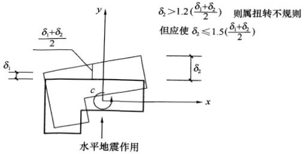

图 1 建筑结构平面的扭转不规则示例

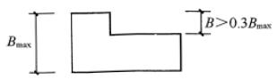

(a)

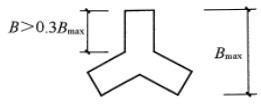

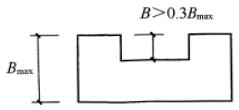

(b)

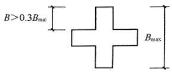

(d)

图 2 建筑结构平面的凸角或凹角不规则示例

本规范 3.4.3 条 1 款的规定，主要针对钢筋混凝土和钢结构的多层和高层建筑所作的不规则性的限制，对砌体结构多层房屋和单层工业厂房的不规则性应符合本规范有关章节的专门规定。

2010年修订的变化如下：

1 明确规定表 3.4.3 所列的不规则类型是主要的而不是全

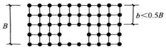

(a)

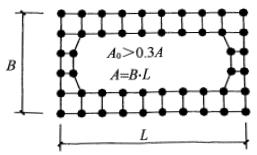

(b)

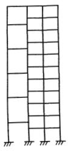

(c)

图 3 建筑结构平面的局部不连续示例（大开洞及错层）

 $$ K_{i}=V_{i}/\delta_{i} $$ 

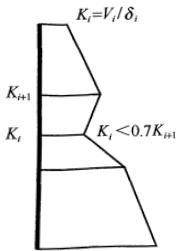

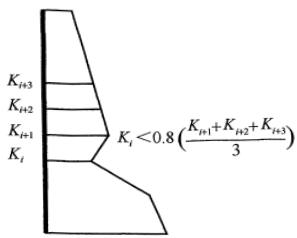

图 4 沿竖向的侧向刚度不规则（有软弱层）

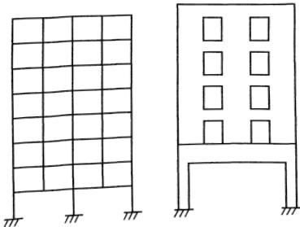

图 5 竖向抗侧力构件不连续示例

部不规则，所列的指标是概念设计的参考性数值而不是严格的数值，使用时需要综合判断。明确规定按不规则类型的数量和程度，采取不同的抗震措施。不规则的程度和设计的上限控制，可根据设防烈度的高低适当调整。对于特别不规则的建筑结构要求专门研究和论证。

2 对于扭转不规则计算，需注意以下几点：

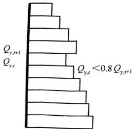

图 6 竖向抗侧力结构屈服抗剪强度非均匀化（有薄弱层）

1）按国外的有关规定，楼盖周边两端位移不超过平均位移2倍的情况称为刚性楼盖，超过2倍则属于柔性楼盖。因此，这种“刚性楼盖”，并不是刚度无限大。计算扭转位移比时，楼盖刚度可按实际情况确定而不限于刚度无限大假定。

2）扭转位移比计算时，楼层的位移不采用各振型位移的CQC组合计算，按国外的规定明确改为取“给定水平力”计算，可避免有时CQC计算的最大位移出现在楼盖边缘的中部而不在角部，而且对无限刚楼盖、分块无限刚楼盖和弹性楼盖均可采用相同的计算方法处理；该水平力一般采用振型组合后的楼层地震剪力换算的水平作用力，并考虑偶然偏心；结构楼层位移和层间位移控制值验算时，仍采用CQC的效应组合。

3）偶然偏心大小的取值，除采用该方向最大尺寸的5%外，也可考虑具体的平面形状和抗侧力构件的布置调整。

4）扭转不规则的判断，还可依据楼层质量中心和刚度中心的距离用偏心率的大小作为参考方法。

3 对于侧向刚度的不规则，建议根据结构特点采用合适的

方法，包括楼层标高处产生单位位移所需要的水平力、结构层间位移角的变化等进行综合分析。

4 为避免水平转换构件在大震下失效，不连续的竖向构件传递到转换构件的小震地震内力应加大，借鉴美国 IBC 规定取 2.5 倍（分项系数为 1.0），对增大系数作了调整。

本次局部修订，主要进行文字性修改，以进一步明确扭转位移比的含义。

3.4.5 体型复杂的建筑并不一概提倡设置防震缝。由于是否设置防震缝各有利弊，历来有不同的观点，总体倾向是：

1 可设缝、可不设缝时，不设缝。设置防震缝可使结构抗震分析模型较为简单，容易估计其地震作用和采取抗震措施，但需考虑扭转地震效应，并按本规范各章的规定确定缝宽，使防震缝两侧在预期的地震（如中震）下不发生碰撞或减轻碰撞引起的局部损坏。

2 当不设置防震缝时，结构分析模型复杂，连接处局部应力集中需要加强，而且需仔细估计地震扭转效应等可能导致的不利影响。

### 3.5 结构体系

3.5.1 抗震结构体系要通过综合分析，采用合理而经济的结构类型。结构的地震反应同场地的频谱特性有密切关系，场地的地面运动特性又同地震震源机制、震级大小、震中的远近有关；建筑的重要性、装修的水准对结构的侧向变形大小有所限制，从而对结构选型提出要求；结构的选型又受结构材料和施工条件的制约以及经济条件的许可等。这是一个综合的技术经济问题，应周密加以考虑。

3.5.2、3.5.3 抗震结构体系要求受力明确、传力途径合理且传力路线不间断，使结构的抗震分析更符合结构在地震时的实际表现，对提高结构的抗震性能十分有利，是结构选型与布置结构抗侧力体系时首先考虑的因素之一。2001规范将结构体系的要求

分为强制性和非强制性两类。第 3.5.2 条是属于强制性要求的内容。

多道防线对于结构在强震下的安全是很重要的。所谓多道防线的概念，通常指的是：

第一，整个抗震结构体系由若干个延性较好的分体系组成，并由延性较好的结构构件连接起来协同工作。如框架-抗震墙体系是由延性框架和抗震墙二个系统组成；双肢或多肢抗震墙体系由若干个单肢墙分系统组成；框架-支撑框架体系由延性框架和支撑框架二个系统组成；框架-筒体体系由延性框架和筒体二个系统组成。

第二，抗震结构体系具有最大可能数量的内部、外部赘余度，有意识地建立起一系列分布的塑性屈服区，以使结构能吸收和耗散大量的地震能量，一旦破坏也易于修复。设计计算时，需考虑部分构件出现塑性变形后的内力重分布，使各个分体系所承担的地震作用的总和大于不考虑塑性内力重分布时的数值。

本次修订，按征求意见的结果，多道防线仍作为非强制性要求保留在第3.5.3条，但能够设置多道防线的结构类型，在相关章节中予以明确规定。

抗震薄弱层（部位）的概念，也是抗震设计中的重要概念，包括：

1 结构在强烈地震下不存在强度安全储备，构件的实际承载力分析（而不是承载力设计值的分析）是判断薄弱层（部位）的基础；

2 要使楼层（部位）的实际承载力和设计计算的弹性受力之比在总体上保持一个相对均匀的变化，一旦楼层（或部位）的这个比例有突变时，会由于塑性内力重分布导致塑性变形的集中；

3 要防止在局部上加强而忽视整个结构各部位刚度、强度的协调；

4 在抗震设计中有意识、有目的地控制薄弱层（部位），使

之有足够的变形能力又不使薄弱层发生转移，这是提高结构总体抗震性能的有效手段。

考虑到有些建筑结构，横向抗侧力构件（如墙体）很多而纵向很少，在强烈地震中往往由于纵向的破坏导致整体倒塌，2001规范增加了结构两个主轴方向的动力特性（周期和振型）相近的抗震概念。

3.5.4 本条对各种不同材料的结构构件提出了改善其变形能力的原则和途径：

1 无筋砌体本身是脆性材料，只能利用约束条件（圈梁、构造柱、组合柱等来分割、包围）使砌体发生裂缝后不致崩塌和散落，地震时不致丧失对重力荷载的承载能力。

2 钢筋混凝土构件抗震性能与砌体相比是比较好的，但若处理不当，也会造成不可修复的脆性破坏。这种破坏包括：混凝土压碎、构件剪切破坏、钢筋锚固部分拉脱（粘结破坏），应力求避免；混凝土结构构件的尺寸控制，包括轴压比、截面长宽比，墙体高厚比、宽厚比等，当墙厚偏薄时，也有自身稳定问题。

3 提出了对预应力混凝土结构构件的要求。

4 钢结构杆件的压屈破坏（杆件失去稳定）或局部失稳也是一种脆性破坏，应予以防止。

5 针对预制混凝土板在强烈地震中容易脱落导致人员伤亡的震害，2008年局部修订增加了推荐采用现浇楼、屋盖，特别强调装配式楼、屋盖需加强整体性的基本要求。

3.5.5 本条指出了主体结构构件之间的连接应遵守的原则：通过连接的承载力来发挥各构件的承载力、变形能力，从而获得整个结构良好的抗震能力。

本条还提出了对预应力混凝土及钢结构构件的连接要求。

3.5.6 本条支撑系统指屋盖支撑。支撑系统的不完善，往往导致屋盖系统失稳倒塌，使厂房发生灾难性的震害，因此在支撑系统布置上应特别注意保证屋盖系统的整体稳定性。

### 3.6 结构分析

3.6.1 由于地震动的不确定性、地震的破坏作用、结构地震破坏机理的复杂性，以及结构计算模型的各种假定与实际情况的差异，迄今为止，依据所规定的地震作用进行结构抗震验算，不论计算理论和工具如何发展，计算怎样严格，计算的结果总还是一种比较粗略的估计，过分地追求数值上的精确是不必要的；然而，从工程的震害看，这样的抗震验算是有成效的，不可轻视。因此，本规范自1974年第一版以来，对抗震计算着重于把方法放在比较合理的基础上，不拘泥于细节，不追求过高的计算精度，力求简单易行，以线性的计算分析方法为基本方法，并反复强调按概念设计进行各种调整。本节列出一些原则性规定，继续保持和体现上述精神。

多遇地震作用下的内力和变形分析是本规范对结构地震反应、截面承载力验算和变形验算最基本的要求。按本规范第1.0.1条的规定，建筑物当遭受低于本地区抗震设防烈度的多遇地震影响时，主体结构不受损坏或不需修理可继续使用，与此相应，结构在多遇地震作用下的反应分析的方法，截面抗震验算（按照现行国家标准《建筑结构可靠度设计统一标准》GB 50068的基本要求），以及层间弹性位移的验算，都是以线弹性理论为基础，因此，本条规定，当建筑结构进行多遇地震作用下的内力和变形分析时，可假定结构与构件处于弹性工作状态。

3.6.2 按本规范第1.0.1条的规定：当建筑物遭受高于本地区抗震设防烈度的罕遇地震影响时，不致倒塌或发生危及生命的严重破坏，这也是本规范的基本要求。特别是建筑物的体型和抗侧力系统复杂时，将在结构的薄弱部位发生应力集中和弹塑性变形集中，严重时会导致重大的破坏甚至有倒塌的危险。因此本规范提出了检验结构抗震薄弱部位采用弹塑性（即非线性）分析方法的要求。

考虑到非线性分析的难度较大，规范只限于对不规则并具有

明显薄弱部位可能导致重大地震破坏，特别是有严重的变形集中可能导致地震倒塌的结构，应按本规范第5章具体规定进行罕遇地震作用下的弹塑性变形分析。

本规范推荐了两种非线性分析方法：静力的非线性分析（推覆分析）和动力的非线性分析（弹塑性时程分析）。

静力的非线性分析是：沿结构高度施加按一定形式分布的模拟地震作用的等效侧力，并从小到大逐步增加侧力的强度，使结构由弹性工作状态逐步进入弹塑性工作状态，最终达到并超过规定的弹塑性位移。这是目前较为实用的简化的弹塑性分析技术，比动力非线性分析节省计算工作量，但需要注意，静力非线性分析有一定的局限性和适用性，其计算结果需要工程经验判断。

动力非线性分析，即弹塑性时程分析，是较为严格的分析方法，需要较好的计算机软件和很好的工程经验判断才能得到有用的结果，是难度较大的一种方法。规范还允许采用简化的弹塑性分析技术，如本规范第5章规定的钢筋混凝土框架等的弹塑性分析简化方法。

3.6.3 本条规定，框架结构和框架-抗震墙（支撑）结构在重力附加弯矩 $ M_{a} $ 与初始弯矩 $ M_{0} $ 之比符合下式条件下，应考虑几何非线性，即重力二阶效应的影响。

 $$ \theta_{i}=\frac{M_{a}}{M_{0}}=\frac{\sum G_{i}\cdot\triangle u_{i}}{V_{i}\cdot h_{i}}>0.1 $$ 

式中： $ \theta_{i} $ ——稳定系数；

 $ \sum G_{i} $ ——i 层以上全部重力荷载计算值；

 $ \triangle u_{i} $ ——第 i 层楼层质心处的弹性或弹塑性层间位移；

 $ V_{i} $ ——第 i 层地震剪力计算值；

 $ h_{i} $ ——第 i 层层间高度。

上式规定是考虑重力二阶效应影响的下限，其上限则受弹性层间位移角限值控制。对混凝土结构，弹性位移角限值较小，上述稳定系数一般均在0.1以下，可不考虑弹性阶段重力二阶效应

影响。

当在弹性分析时，作为简化方法，二阶效应的内力增大系数可取  $ 1/(1-\theta) $ 。

当在弹塑性分析时，宜采用考虑所有受轴向力的结构和构件的几何刚度的计算机程序进行重力二阶效应分析，亦可采用其他简化分析方法。

混凝土柱考虑多遇地震作用产生的重力二阶效应的内力时，不应与混凝土规范承载力计算时考虑的重力二阶效应重复。

砌体结构和混凝土墙结构，通常不需要考虑重力二阶效应。

3.6.4 刚性、半刚性、柔性横隔板分别指在平面内不考虑变形、考虑变形、不考虑刚度的楼、屋盖。

3.6.6 本条规定主要依据《建筑工程设计文件编制深度规定》，要求使用计算机进行结构抗震分析时，应对软件的功能有切实的了解，计算模型的选取必须符合结构的实际工作情况，计算软件的技术条件应符合本规范及有关标准的规定，设计时对所有计算结果应进行判别，确认其合理有效后方可在设计中应用。

2008 年局部修订，注意到地震中楼梯的梯板具有斜撑的受力状态，增加了楼梯构件的计算要求：针对具体结构的不同，“考虑”的结果，楼梯构件的可能影响很大或不大，然后区别对待，楼梯构件自身应计算抗震，但并不要求一律参与整体结构的计算。

复杂结构指计算的力学模型十分复杂、难以找到完全符合实际工作状态的理想模型，只能依据各个软件自身的特点在力学模型上分别作某些程度不同的简化后才能运用该软件进行计算的结构。例如，多塔类结构，其计算模型可以是底部一个塔通过水平刚臂分成上部若干个不落地分塔的分叉结构，也可以用多个落地塔通过底部的低塔连成整个结构，还可以将底部按高塔分区分别归入相应的高塔中再按多个高塔进行联合计算，等等。因此本规范对这类复杂结构要求用多个相对恰当、合适的力学模型而不是截然不同不合理的模型进行比较计算。复杂结构应是计算模型复

杂的结构，不同的力学模型还应属于不同的计算机程序。

### 3.7 非结构构件

非结构构件包括建筑非结构构件和建筑附属机电设备的支架等。建筑非结构构件在地震中的破坏允许大于结构构件，其抗震设防目标要低于本规范第1.0.1条的规定。非结构构件的地震破坏会影响安全和使用功能，需引起重视，应进行抗震设计。

建筑非结构构件一般指下列三类：①附属结构构件，如：女儿墙、高低跨封墙、雨篷等；②装饰物，如：贴面、顶棚、悬吊重物等；③围护墙和隔墙。处理好非结构构件和主体结构的关系，可防止附加灾害，减少损失。在第3.7.3条所列的非结构构件主要指在人流出入口、通道及重要设备附近的附属结构构件，其破坏往往伤人或砸坏设备，因此要求加强与主体结构的可靠锚固，在其他位置可以放宽要求。2008年局部修订时，明确增加作为疏散通道的楼梯间墙体的抗震安全性要求，提高对生命的保护。

砌体填充墙与框架或单层厂房柱的连接，影响整个结构的动力性能和抗震能力。两者之间的连接处理不同时，影响也不同。建议两者之间采用柔性连接或彼此脱开，可只考虑填充墙的重量而不计其刚度和强度的影响。砌体填充墙的不合理设置，例如：框架或厂房，柱间的填充墙不到顶，或房屋外墙在混凝土柱间局部高度砌墙，使这些柱子处于短柱状态，许多震害表明，这些短柱破坏很多，应予注意。

2008 年局部修订时，第 3.7.4 条新增为强制性条文。强调围护墙、隔墙等非结构构件是否合理设置对主体结构的影响，以加强围护墙、隔墙等建筑非结构构件的抗震安全性，提高对生命的保护。

第 3.7.6 条提出了对幕墙、附属机械、电气设备系统支座和连接等需符合地震时对使用功能的要求。这里的使用要求，一般指设防地震。

### 3.8 隔震与消能减震设计

3.8.1 建筑结构采用隔震与消能减震设计是一种有效地减轻地震灾害的技术。

本次修订，取消了2001规范“主要用于高烈度设防”的规定。强调了这种技术在提高结构抗震性能上具有优势，可适用于对使用功能有较高或专门要求的建筑，即用于投资方愿意通过适当增加投资来提高抗震安全要求的建筑。

3.8.2 本条对建筑结构隔震设计和消能减震设计的设防目标提出了原则要求。采用隔震和消能减震设计方案，具有可能满足提高抗震性能要求的优势，故推荐其按较高的设防目标进行设计。

按本规范 12 章规定进行隔震设计，还不能做到在设防烈度下上部结构不受损坏或主体结构处于弹性工作阶段的要求，但与非隔震或非消能减震建筑相比，设防目标会有所提高，大体上是：当遭受多遇地震影响时，将基本不受损坏和影响使用功能；当遭受设防地震影响时，不需修理仍可继续使用；当遭受罕遇地震影响时，将不发生危及生命安全和丧失使用价值的破坏。

### 3.9 结构材料与施工

3.9.1 抗震结构在材料选用、施工程序特别是材料代用上有其特殊的要求，主要是指减少材料的脆性和贯彻原设计意图。

3.9.2、3.9.3 本规范对结构材料的要求分为强制性和非强制性两种。

1 本次修订，将烧结黏土砖改为各种砖，适用范围更宽些。

2 对钢筋混凝土结构中的混凝土强度等级有所限制，这是因为高强度混凝土具有脆性性质，且随强度等级提高而增加，在抗震设计中应考虑此因素，根据现有的试验研究和工程经验，现阶段混凝土墙体的强度等级不宜超过 C60；其他构件，9 度时不宜超过 C60，8 度时不宜超过 C70。当耐久性有要求时，混凝土的最低强度等级，应遵守有关的规定。

3 本次修订，对一、二、三级抗震等级的框架，规定其普通纵向受力钢筋的抗拉强度实测值与屈服强度实测值的比值不应小于1.25，这是为了保证当构件某个部位出现塑性铰以后，塑性铰处有足够的转动能力与耗能能力；同时还规定了屈服强度实测值与标准值的比值，否则本规范为实现强柱弱梁、强剪弱弯所规定的内力调整将难以奏效。在2008年局部修订的基础上，要求框架梁、框架柱、框支梁、框支柱、板柱-抗震墙的柱，以及伸臂桁架的斜撑、楼梯的梯段等，纵向钢筋均应有足够的延性及钢筋伸长率的要求，是控制钢筋延性的重要性能指标。其取值依据产品标准《钢筋混凝土用钢 第2部分：热轧带肋钢筋》GB 1499.2-2007规定的钢筋抗震性能指标提出，凡钢筋产品标准中带E编号的钢筋，均属于符合抗震性能指标。本条的规定，是正规建筑用钢生产厂家的一般热轧钢筋均能达到的性能指标。从发展趋势考虑，不再推荐箍筋采用HPB235级钢筋；当然，现有生产的HPB235级钢筋仍可继续作为箍筋使用。

4 钢结构中所用的钢材，应保证抗拉强度、屈服强度、冲击韧性合格及硫、磷和碳含量的限制值。对高层钢结构，按黑色冶金工业标准《高层建筑结构用钢板》YB4104-2000的规定选用。抗拉强度是实际上决定结构安全储备的关键，伸长率反映钢材能承受残余变形量的程度及塑性变形能力，钢材的屈服强度不宜过高，同时要求有明显的屈服台阶，伸长率应大于20%，以保证构件具有足够的塑性变形能力，冲击韧性是抗震结构的要求。当采用国外钢材时，亦应符合我国国家标准的要求。结构钢材的性能指标，按钢材产品标准《建筑结构用钢板》GB/T19879-2005规定的性能指标，将分子、分母对换，改为屈服强度与抗拉强度的比值。

5 国家产品标准《碳素结构钢》GB/T 700 中，Q235 钢分为 A、B、C、D 四个等级，其中 A 级钢不要求任何冲击试验值，并只在用户要求时才进行冷弯试验，且不保证焊接要求的含碳量，故不建议采用。国家产品标准《低合金高强度结构钢》

GB/T 1591 中，Q345 钢分为 A、B、C、D、E 五个等级，其中 A 级钢不保证冲击韧性要求和延性性能的基本要求，故亦不建议采用。

3.9.4 混凝土结构施工中，往往因缺乏设计规定的钢筋型号（规格）而采用另外型号（规格）的钢筋代替，此时应注意替代后的纵向钢筋的总承载力设计值不应高于原设计的纵向钢筋总承载力设计值，以免造成薄弱部位的转移，以及构件在有影响的部位发生混凝土的脆性破坏（混凝土压碎、剪切破坏等）。

除按照上述等承载力原则换算外，还应满足最小配筋率和钢筋间距等构造要求，并应注意由于钢筋的强度和直径改变会影响正常使用阶段的挠度和裂缝宽度。

本条在 2008 年局部修订时提升为强制性条文，以加强对施工质量的监督和控制，实现预期的抗震设防目标。

3.9.5 厚度较大的钢板在轧制过程中存在各向异性，由于在焊缝附近常形成约束，焊接时容易引起层状撕裂。国家产品标准《厚度方向性能钢板》GB/T 5313 将厚度方向的断面收缩率分为 Z15、Z25、Z35 三个等级，并规定了试件取材方法和试件尺寸等要求。本条规定钢结构采用的钢材，当钢材板厚大于或等于 40 mm 时，至少应符合 Z15 级规定的受拉试件截面收缩率。

3.9.6 为确保砌体抗震墙与构造柱、底层框架柱的连接，以提高抗侧力砌体墙的变形能力，要求施工时先砌墙后浇筑。

本条在 2008 年局部修订提升为强制性条文。以加强对施工质量的监督和控制，实现预期的抗震设防目标。

3.9.7 本条是新增的，将2001规范第6.2.14条对施工的要求移此。抗震墙的水平施工缝处，由于混凝土结合不良，可能形成抗震薄弱部位。故规定一级抗震墙要进行水平施工缝处的受剪承载力验算。验算依据试验资料，考虑穿过施工缝处的钢筋处于复合受力状态，其强度采用0.6的折减系数，并考虑轴向压力的摩擦作用和轴向拉力的不利影响，计算公式如下：

 $$ V_{\mathrm{wj}}\leqslant\frac{1}{\gamma_{\mathrm{RE}}}(0.6f_{\mathrm{y}}A_{\mathrm{s}}+0.8N) $$ 

式中： $ V_{wj} $  ——抗震墙施工缝处组合的剪力设计值；

 $ f_{y} $ ——竖向钢筋抗拉强度设计值；

 $ A_{s} $ ——施工缝处抗震墙的竖向分布钢筋、竖向插筋和边缘构件（不包括边缘构件以外的两侧翼墙）纵向钢筋的总截面面积；

N——施工缝处不利组合的轴向力设计值，压力取正值，拉力取负值。其中，重力荷载的分项系数，受压时为有利，取1.0；受拉时取1.2。

### 3.10 建筑抗震性能化设计

3.10.1 考虑当前技术和经济条件，慎重发展性能化目标设计方法，本条明确规定需要进行可行性论证。

性能化设计仍然是以现有的抗震科学水平和经济条件为前提的，一般需要综合考虑使用功能、设防烈度、结构的不规则程度和类型、结构发挥延性变形的能力、造价、震后的各种损失及修复难度等等因素。不同的抗震设防类别，其性能设计要求也有所不同。

鉴于目前强烈地震下结构非线性分析方法的计算模型及参数的选用尚存在不少经验因素，缺少从强震记录、设计施工资料到实际震害的验证，对结构性能的判断难以十分准确，因此在性能目标选用中宜偏于安全一些。

确有需要在处于发震断裂避让区域建造房屋，抗震性能化设计是可供选择的设计手段之一。

3.10.2 建筑的抗震性能化设计，立足于承载力和变形能力的综合考虑，具有很强的针对性和灵活性。针对具体工程的需要和可能，可以对整个结构，也可以对某些部位或关键构件，灵活运用各种措施达到预期的性能目标——着重提高抗震安全性或满足使用功能的专门要求。

例如，可以根据楼梯间作为“抗震安全岛”的要求，提出确保大震下能具有安全避难通道的具体目标和性能要求；可以针对特别不规则、复杂建筑结构的具体情况，对抗侧力结构的水平构件和竖向构件提出相应的性能目标，提高其整体或关键部位的抗震安全性；也可针对水平转换构件，为确保大震下自身及相关构件的安全而提出大震下的性能目标；地震时需要连续工作的机电设施，其相关部位的层间位移需满足规定层间位移限值的专门要求；其他情况，可对震后的残余变形提出满足设施检修后运行的位移要求，也可提出大震后可修复运行的位移要求。建筑构件采用与结构构件柔性连接，只要可靠拉结并留有足够的间隙，如玻璃幕墙与钢框之间预留变形缝隙，震害经验表明，幕墙在结构总体安全时可以满足大震后继续使用的要求。

3.10.3 我国的 89 规范提出了“小震不坏、中震可修和大震不倒”，明确要求大震下不发生危及生命的严重破坏即达到“生命安全”，就是属于一般情况的性能设计目标。本次修订所提出的性能化设计，要比本规范的一般情况较为明确，尽可能达到可操作性。

1 鉴于地震具有很大的不确定性，性能化设计需要估计各种水准的地震影响，包括考虑近场地震的影响。规范的地震水准是按50年设计基准期确定的。结构设计使用年限是国务院《建设工程质量管理条例》规定的在设计时考虑施工完成后正常使用、正常维护情况下不需要大修仍可完成预定功能的保修年限，国内外的一般建筑结构取50年。结构抗震设计的基准期是抗震规范确定地震作用取值时选用的统计时间参数，也取为50年，即地震发生的超越概率是按50年统计的，多遇地震的理论重现期50年，设防地震是475年，罕遇地震随烈度高度而有所区别，7度约1600年，9度约2400年。其地震加速度值，设防地震取本规范表3.2.2的“设计基本地震加速度值”，多遇地震、罕遇地震取本规范表5.1.2-2的“加速度时程最大值”。其水平地震影响系数最大值，多遇地震、罕遇地震按本规范表5.1.4-1取

值，设防地震按本条规定取值，7度（0.15g）和8度（0.30g）分别在7、8度和8、9度之间内插取值。

对于设计使用年限不同于50年的结构，其地震作用需要作适当调整，取值经专门研究提出并按规定的权限批准后确定。当缺乏当地的相关资料时，可参考《建筑工程抗震性态设计通则（试用）》CECS160：2004的附录A，其调整系数的范围大体是：设计使用年限70年，取1.15～1.2；100年取1.3～1.4。

2 建筑结构遭遇各种水准的地震影响时，其可能的损坏状态和继续使用的可能，与89规范配套的《建筑地震破坏等级划分标准》（建设部90建抗字377号）已经明确划分了各类房屋（砖房、混凝土框架、底层框架砖房、单层工业厂房、单层空旷房屋等）的地震破坏分级和地震直接经济损失估计方法，总体上可分为下列五级，与此后国外标准的相关描述不完全相同：

<table border=1 style='margin: auto; width: max-content;'><tr><td style='text-align: center;'>名称</td><td style='text-align: center;'>破坏描述</td><td style='text-align: center;'>继续使用的可能性</td><td style='text-align: center;'>变形参考值</td></tr><tr><td style='text-align: center;'>基本完好 （含完好）</td><td style='text-align: center;'>承重构件完好；个别非承重构件 轻微损坏；附属构件有不同程度 破坏</td><td style='text-align: center;'>一般不需修理即可继续使用</td><td style='text-align: center;'>&lt; [△u_e]</td></tr><tr><td style='text-align: center;'>轻微损坏</td><td style='text-align: center;'>个别承重构件轻微裂缝（对钢结构构件指残余变形），个别非承重构件明显破坏；附属构件有不同程度破坏</td><td style='text-align: center;'>不需修理或需稍加修理，仍可继续使用</td><td style='text-align: center;'>(1.5～2)[△u_e]</td></tr><tr><td style='text-align: center;'>中等破坏</td><td style='text-align: center;'>多数承重构件轻微裂缝（或残余变形），部分明显裂缝（或残余变形）；个别非承重构件严重破坏</td><td style='text-align: center;'>需一般修理，采取安全措施后可适当使用</td><td style='text-align: center;'>(3～4)[△u_e]</td></tr><tr><td style='text-align: center;'>严重破坏</td><td style='text-align: center;'>多数承重构件严重破坏或部分倒塌</td><td style='text-align: center;'>应排除大修，局部拆除</td><td style='text-align: center;'>&lt;0.9[△u_p]</td></tr><tr><td style='text-align: center;'>倒塌</td><td style='text-align: center;'>多数承重构件倒塌</td><td style='text-align: center;'>需拆除</td><td style='text-align: center;'>&gt; [△u_p]</td></tr></table>

注：1 个别指 5% 以下，部分指 30% 以下，多数指 50% 以上。

2 中等破坏的变形参考值，大致取规范弹性和弹塑性位移角限值的平均值，轻微损坏取 1/2 平均值。

参照上述等级划分，地震下可供选定的高于一般情况的预期

性能目标可大致归纳如下：

<table border=1 style='margin: auto; width: max-content;'><tr><td style='text-align: center;'>地震水准</td><td style='text-align: center;'>性能1</td><td style='text-align: center;'>性能2</td><td style='text-align: center;'>性能3</td><td style='text-align: center;'>性能4</td></tr><tr><td style='text-align: center;'>多遇地震</td><td style='text-align: center;'>完好</td><td style='text-align: center;'>完好</td><td style='text-align: center;'>完好</td><td style='text-align: center;'>完好</td></tr><tr><td style='text-align: center;'>设防地震</td><td style='text-align: center;'>完好，正常使用</td><td style='text-align: center;'>基本完好， 检修后继续使用</td><td style='text-align: center;'>轻微损坏， 简单修理后继续使用</td><td style='text-align: center;'>轻微至接近中等损坏，变形＜3[△u_e]</td></tr><tr><td style='text-align: center;'>罕遇地震</td><td style='text-align: center;'>基本完好， 检修后继续使用</td><td style='text-align: center;'>轻微至中等破坏，修复后继续使用</td><td style='text-align: center;'>其破坏需加固后继续使用</td><td style='text-align: center;'>接近严重破坏， 大修后继续使用</td></tr></table>

3 实现上述性能目标，需要落实到具体设计指标，即各个地震水准下构件的承载力、变形和细部构造的指标。仅提高承载力时，安全性有相应提高，但使用上的变形要求不一定满足；仅提高变形能力，则结构在小震、中震下的损坏情况大致没有改变，但抗御大震倒塌的能力提高。因此，性能设计目标往往侧重于通过提高承载力推迟结构进入塑性工作阶段并减少塑性变形，必要时还需同时提高刚度以满足使用功能的变形要求，而变形能力的要求可根据结构及其构件在中震、大震下进入弹塑性的程度加以调整。

完好，即所有构件保持弹性状态：各种承载力设计值（拉、压、弯、剪、压弯、拉弯、稳定等）满足规范对抗震承载力的要求 $ S<R/\gamma_{RE} $ ，层间变形（以弯曲变形为主的结构宜扣除整体弯曲变形）满足规范多遇地震下的位移角限值 $ \left[\triangle u_{e}\right] $ 。这是各种预期性能目标在多遇地震下的基本要求——多遇地震下必须满足规范规定的承载力和弹性变形的要求。

基本完好，即构件基本保持弹性状态：各种承载力设计值基本满足规范对抗震承载力的要求  $ S \leqslant R / \gamma_{RE} $  （其中的效应 S 不含抗震等级的调整系数），层间变形可能略微超过弹性变形限值。

轻微损坏，即结构构件可能出现轻微的塑性变形，但不达到屈服状态，按材料标准值计算的承载力大于作用标准组合的

效应。

中等破坏，结构构件出现明显的塑性变形，但控制在一般加固即恢复使用的范围。

接近严重破坏，结构关键的竖向构件出现明显的塑性变形，部分水平构件可能失效需要更换，经过大修加固后可恢复使用。

对性能 1，结构构件在预期大震下仍基本处于弹性状态，则其细部构造仅需要满足最基本的构造要求，工程实例表明，采用隔震、减震技术或低烈度设防且风力很大时有可能实现；条件许可时，也可对某些关键构件提出这个性能目标。

对性能 2，结构构件在中震下完好，在预期大震下可能屈服，其细部构造需满足低延性的要求。例如，某6度设防的核心筒-外框结构，其风力是小震的2.4倍，风载层间位移是小震的2.5倍。结构所有构件的承载力和层间位移均可满足中震（不计入风载效应组合）的设计要求；考虑水平构件在大震下损坏使刚度降低和阻尼加大，按等效线性化方法估算，竖向构件的最小极限承载力仍可满足大震下的验算要求。于是，结构总体上可达到性能2的要求。

对性能 3，在中震下已有轻微塑性变形，大震下有明显的塑性变形，因而，其细部构造需要满足中等延性的构造要求。

对性能 4，在中震下的损坏已大于性能 3，结构总体的抗震承载力仅略高于一般情况，因而，其细部构造仍需满足高延性的要求。

3.10.4 本条规定了性能化设计时计算的注意事项。一般情况，应考虑构件在强烈地震下进入弹塑性工作阶段和重力二阶效应。鉴于目前的弹塑性参数、分析软件对构件裂缝的闭合状态和残余变形、结构自身阻尼系数、施工图中构件实际截面、配筋与计算书取值的差异等等的处理，还需要进一步研究和改进，当预期的弹塑性变形不大时，可用等效阻尼等模型简化估算。为了判断弹塑性计算结果的可靠程度，可借助于理想弹性假定的计算结果，

从下列几方面进行综合分析：

1 结构弹塑性模型一般要比多遇地震下反应谱计算时的分析模型有所简化，但在弹性阶段的主要计算结果应与多遇地震分析模型的计算结果基本相同，两种模型的嵌固端、主要振动周期、振型和总地震作用应一致。弹塑性阶段，结构构件和整个结构实际具有的抵抗地震作用的承载力是客观存在的，在计算模型合理时，不因计算方法、输入地震波形的不同而改变。若计算得到的承载力明显异常，则计算方法或参数存在问题，需仔细复核、排除。

2 整个结构客观存在的、实际具有的最大受剪承载力（底部总剪力）应控制在合理的、经济上可接受的范围，不需要接近更不可能超过按同样阻尼比的理想弹性假定计算的大震剪力，如果弹塑性计算的结果超过，则该计算的承载力数据需认真检查、复核，判断其合理性。

3 进入弹塑性变形阶段的薄弱部位会出现一定程度的塑性变形集中，该楼层的层间位移（以弯曲变形为主的结构宜扣除整体弯曲变形）应大于按同样阻尼比的理想弹性假定计算的该部位大震的层间位移；如果明显小于此值，则该位移数据需认真检查、复核，判断其合理性。

4 薄弱部位可借助于上下相邻楼层或主要竖向构件的屈服强度系数（其计算方法参见本规范第5.5.2条的说明）的比较予以复核，不同的方法、不同的波形，尽管彼此计算的承载力、位移、进入塑性变形的程度差别较大，但发现的薄弱部位一般相同。

5 影响弹塑性位移计算结果的因素很多，现阶段，其计算值的离散性，与承载力计算的离散性相比较大。注意到常规设计中，考虑到小震弹性时程分析的波形数量较少，而且计算的位移多数明显小于反应谱法的计算结果，需要以反应谱法为基础进行对比分析；大震弹塑性时程分析时，由于阻尼的处理方法不够完善，波形数量也较少（建议尽可能增加数量，如不少于7条；数

量较少时宜取包络)，不宜直接把计算的弹塑性位移值视为结构实际弹塑性位移，同样需要借助小震的反应谱法计算结果进行分析。建议按下列方法确定其层间位移参考数值：用同一软件、同一波形进行弹性和弹塑性计算，得到同一波形、同一部位弹塑性位移（层间位移）与小震弹性位移（层间位移）的比值，然后将此比值取平均或包络值，再乘以反应谱法计算的该部位小震位移（层间位移），从而得到大震下该部位的弹塑性位移（层间位移）的参考值。

3.10.5 本条属于原则规定，其具体化，如结构、构件在中震下的性能化设计要求等，列于附录 M 中第 M.1 节。

### 3.11 建筑物地震反应观测系统

3.11.1 2001 规范提出了在建筑物内设置建筑物地震反应观测系统的要求。建筑物地震反应观测是发展地震工程和工程抗震科学的必要手段，我国过去限于基建资金，发展不快，这次在规范中予以规定，以促进其发展。

## 附录 A 我国主要城镇抗震设防烈度、设计基本地震加速度和设计地震分组

本附录系根据《中国地震动参数区划图》GB 18306－2015和《中华人民共和国行政区划简册2015》以及中华人民共和国民政部发布的《2015年县级以上行政区划变更情况（截至2015年9月12日）》编制。

本附录仅给出了我国各县级及县级以上城镇的中心地区（如城关地区）的抗震设防烈度、设计基本地震加速度和所属的设计地震分组。当在各县级及县级以上城镇中心地区以外的行政区域从事建筑工程建设活动时，应根据工程场址的地理坐标查询《中国地震动参数区划图》GB 18306-2015的“附录A（规范性附录）中国地震动峰值加速度区划图”和“附录B（规范性附录）中国地震动加速度反应谱特征周期区划图”，以确定工程场址的地震动峰值加速度和地震加速度反应谱特征周期，并根据下述原则确定工程场址所在地的抗震设防烈度、设计基本地震加速度和所属的设计地震分组：

抗震设防烈度、设计基本地震加速度和

GB 18306 地震动峰值加速度的对应关系

<table border=1 style='margin: auto; width: max-content;'><tr><td style='text-align: center;'>抗震设防烈度</td><td style='text-align: center;'>6</td><td colspan="2">7</td><td colspan="2">8</td><td style='text-align: center;'>9</td></tr><tr><td style='text-align: center;'>设计基本地震 加速度值</td><td style='text-align: center;'>0.05g</td><td style='text-align: center;'>0.10g</td><td style='text-align: center;'>0.15g</td><td style='text-align: center;'>0.20g</td><td style='text-align: center;'>0.30g</td><td style='text-align: center;'>0.40g</td></tr><tr><td style='text-align: center;'>GB18306:地震 动峰值加速度</td><td style='text-align: center;'>0.05g</td><td style='text-align: center;'>0.10g</td><td style='text-align: center;'>0.15g</td><td style='text-align: center;'>0.20g</td><td style='text-align: center;'>0.30g</td><td style='text-align: center;'>0.40g</td></tr></table>

注：g 为重力加速度。

## 设计地震分组与 GB 18306 地震动加速度

反应谱特征周期的对应关系

<table border=1 style='margin: auto; width: max-content;'><tr><td style='text-align: center;'>设计地震分组</td><td style='text-align: center;'>第一组</td><td style='text-align: center;'>第二组</td><td style='text-align: center;'>第三组</td></tr><tr><td style='text-align: center;'>GB 18306：地震加速度反应谱特征周期</td><td style='text-align: center;'>0.35s</td><td style='text-align: center;'>0.40s</td><td style='text-align: center;'>0.45s</td></tr></table>

## 4 场地、地基和基础

### 4.1 场地

4.1.1 有利、不利和危险地段的划分，基本沿用历次规范的规定。本条中地形、地貌和岩土特性的影响是综合在一起加以评价的，这是因为由不同岩土构成的同样地形条件的地震影响是不同的。2001规范只列出了有利、不利和危险地段的划分，本次修订，明确其他地段划为可进行建设的一般场地。考虑到高含水量的可塑黄土在地震作用下会产生震陷，历次地震的震害也比较重，当地表存在结构性裂缝时对建筑物抗震也是不利的，因此将其列入不利地段。

关于局部地形条件的影响，从国内几次大地震的宏观调查资料来看，岩质地形与非岩质地形有所不同。1970年云南通海地震和2008年汶川大地震的宏观调查表明，非岩质地形对烈度的影响比岩质地形的影响更为明显。如通海和东川的许多岩石地基上很陡的山坡，震害也未见有明显的加重。因此对于岩石地基的陡坡、陡坎等，本规范未列为不利的地段。但对于岩石地基的高度达数十米的条状突出的山脊和高耸孤立的山丘，由于鞭鞘效应明显，振动有所加大，烈度仍有增高的趋势。因此本规范均将其列为不利的地形条件。

应该指出：有些资料中曾提出过有利和不利于抗震的地貌部位。本规范在编制过程中曾对抗震不利的地貌部位实例进行了分析，认为：地貌是研究不同地表形态形成的原因，其中包括组成不同地形的物质（即岩性）。也就是说地貌部位的影响意味着地表形态和岩性二者共同作用的结果，将场地土的影响包括进去了。但通过一些震害实例说明：当处于平坦的冲积平原和古河道不同地貌部位时，地表形态是基本相同的，造成古河道上房屋震

害加重的原因主要因地基土质条件很差所致。因此本规范将地貌条件分别在地形条件与场地土中加以考虑，不再提出地貌部位这个概念。

4.1.2～4.1.6 89规范中的场地分类，是在尽量保持抗震规范延续性的基础上，进一步考虑了覆盖层厚度的影响，从而形成了以平均剪切波速和覆盖层厚度作为评定指标的双参数分类方法。为了在保障安全的条件下尽可能减少设防投资，在保持技术上合理的前提下适当扩大了Ⅱ类场地的范围。另外，由于我国规范中Ⅰ、Ⅱ类场地的 $ T_{g} $ 值与国外抗震规范相比是偏小的，因此有意识地将Ⅰ类场地的范围划得比较小。

在场地划分时，需要注意以下几点：

1 关于场地覆盖层厚度的定义。要求其下部所有土层的波速均大于 500m/s，在 89 规范的说明中已有所阐述。执行中常出现一见到大于 500m/s 的土层就确定覆盖厚度而忽略对以下各土层的要求，这种错误应予以避免。2001 规范补充了当地面下某一下卧土层的剪切波速大于或等于 400m/s 且不小于相邻的上层土的剪切波速的 2.5 倍时，覆盖层厚度可按地面至该下卧层顶面的距离取值的规定。需要注意的是，只有当波速不小于 400m/s 且该土层以上的各土层的波速（不包括孤石和硬透镜体）都满足不大于该土层波速的 40% 时才可按该土层确定覆盖层厚度；而且这一规定只适用于当下卧层硬土层顶面的埋深大于 5m 时的情况。

2 关于土层剪切波速的测试。2001 规范的波速平均采用更富有物理意义的等效剪切波速的公式计算，即：

 $$ v_{\mathrm{s e}}=d_{0}/t $$ 

式中， $ d_{0} $  为场地评定用的计算深度，取覆盖层厚度和 20m 两者中的较小值，t 为剪切波在地表与计算深度之间传播的时间。

本次修订，初勘阶段的波速测试孔数量改为不宜小于3个。多层与高层建筑的分界，参照《民用建筑设计通则》改为24m。

3 关于不同场地的分界。

为了保持与 89 规范的延续性并与其他有关规范的协调，2001 规范对 89 规范的规定作了调整，Ⅱ类、Ⅲ类场地的范围稍有扩大，并避免了 89 规范Ⅱ类至Ⅳ类的跳跃。作为一种补充手段，当有充分依据时，允许使用插入方法确定边界线附近（指相差±15%的范围）的  $ T_{g} $  值。图 7 给出了一种连续化插入方案。该图在场地覆盖层厚度  $ d_{ov} $  和等效剪切波速  $ v_{se} $  平面上用等步长和按线性规则改变步长的方案进行连续化插入，相邻等值线的  $ T_{g} $  值均相差 0.01s。

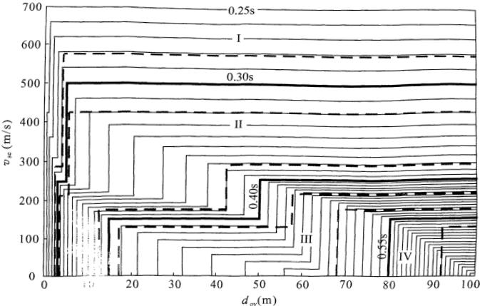

图 7 在  $ d_{ov}-v_{se} $  平面上的  $ T_{g} $  等值线图

（用于设计特征周期一组，图中相邻 $ T_{g} $ 等值线的差值均为0.01s）

本次修订，考虑到  $ f_{ak}<200 $  的黏性土和粉土的实测波速可能大于 250m/s，将 2001 规范的中硬土与中软土地基承载力的分界改为  $ f_{ak}>150 $  。考虑到软弱土的指标 140m/s 与国际标准相比略偏低，将其改为 150m/s 。场地类别的分界也改为 150m/s 。

考虑到波速为（500～800）m/s 的场地还不是很坚硬，将原场地类别Ⅰ类场地（坚硬土或岩石场地）中的硬质岩石场地明确为Ⅰ类场地。因此，土的类型划分也相应区分。硬质岩石的波

速，我国核电站抗震设计为700m，美国抗震设计规范为760m，欧洲抗震规范为800m，从偏于安全方面考虑，调整为800m/s。

4 高层建筑的场地类别问题是工程界关心的问题。按理论及实测，一般土层中的地震加速度随距地面深度而渐减。我国亦有对高层建筑修正场地类别（由高层建筑基底起算）或折减地震力建议。因高层建筑埋深常达10m以上，与浅基础相比，有利之处是：基底地震输入小了；但深基础的地震动输入机制很复杂，涉及地基土和结构相互作用，目前尚无公认的理论分析模型更未能总结出实用规律，因此暂不列入规范。深基础的高层建筑的场地类别仍按浅基础考虑。

5 本条中规定的场地分类方法主要适用于剪切波速随深度呈递增趋势的一般场地，对于有较厚软夹层的场地，由于其对短周期地震动具有抑制作用，可以根据分析结果适当调整场地类别和设计地震动参数。

6 新黄土是指  $ Q_{3} $  以来的黄土。

4.1.7 断裂对工程影响的评价问题，长期以来，不同学科之间存在着不同看法，经过近些年来的不断研究与交流，认为需要考虑断裂影响，这主要是指地震时老断裂重新错动直通地表，在地面产生位错，对建在位错带上的建筑，其破坏是不易用工程措施加以避免的。因此规范中划为危险地段应予避开。至于地震强度，一般在确定抗震设防烈度时已给予考虑。

在活动断裂时间下限方面已取得了一致意见：即对一般的建筑工程只考虑1.0万年（全新世）以来活动过的断裂，在此地质时期以前的活动断裂可不予考虑。对于核电、水电等工程则应考虑10万年以来（晚更新世）活动过的断裂，晚更新世以前活动过的断裂亦可不予考虑。

另外一个较为一致的看法是，在地震烈度小于8度的地区，可不考虑断裂对工程的错动影响，因为多次国内外地震中的破坏现象均说明，在小于8度的地震区，地面一般不产生断裂错动。

目前尚有看法分歧的是关于隐伏断裂的评价问题，在基岩以

上覆盖土层多厚，是什么土层，地面建筑就可以不考虑下部断裂的错动影响。根据我国近年来的地震宏观地表位错考察，学者们看法不够一致。有人认为30m厚土层就可以不考虑，有些学者认为是50m，还有人提出用基岩位错量大小来衡量，如土层厚度是基岩位错量的（25～30）倍以上就可不考虑等等。唐山地震震中区的地裂缝，经有关单位详细工作证明，不是沿地下岩石错动直通地表的构造断裂形成的，而是由于地面振动，表面应力形成的表层地裂。这种裂缝仅分布在地面以下3m左右，下部土层并未断开（挖探井证实），在采煤巷道中也未发现错动，对有一定深度基础的建筑物影响不大。

为了对问题更深入的研究，由北京市勘察设计研究院在建设部抗震办公室申请立项，开展了发震断裂上覆土层厚度对工程影响的专项研究。此项研究主要采用大型离心机模拟实验，可将缩小的模型通过提高加速度的办法达到与原型应力状况相同的状态；为了模拟断裂错动，专门加工了模拟断裂突然错动的装置，可实现垂直与水平二种错动，其位错量大小是根据国内外历次地震不同震级条件下位错量统计分析结果确定的；上覆土层则按不同岩性、不同厚度分为数种情况。实验时的位错量为1.0m～4.0m，基本上包括了8度、9度情况下的位错量；当离心机提高加速度达到与原型应力条件相同时，下部基岩突然错动，观察上部土层破裂高度，以便确定安全厚度。根据实验结果，考虑一定的安全储备和模拟实验与地震时震动特性的差异，安全系数取为3，据此提出了8度、9度地区上覆土层安全厚度的界限值。应当说这是初步的，可能有些因素尚未考虑。但毕竟是第一次以模拟实验为基础的定量提法，跟以往的分析和宏观经验是相近的，有一定的可信度。2001规范根据搜集到的国内外地震断裂破裂宽度的资料提出了避让距离，这是宏观的分析结果，随着地震资料的不断积累将会得到补充与完善。

近年来，北京市地震局在上述离心机试验基础上进行了基底断裂错动在覆盖土层中向上传播过程的更精细的离心机模拟，认

为以前试验的结论偏于保守，可放宽对破裂带的避让要求。本次修订，考虑到原条文中“前第四纪基岩隐伏断裂”的含义不够明确，容易引起误解；这里的“断裂”只能是“全新世活动断裂”或其活动性不明的其他断裂。因此删除了原条文中“前第四纪基岩”这几个字。还需要说明的是，这里所说的避让距离是断层面在地面上的投影或到断层破裂线的距离，不是指到断裂带的距离。

综合考虑历次大地震的断裂震害，离心机试验结果和我国地震区、特别是山区民居建造的实际情况，本次修订适度减少了避让距离，并规定当确实需要在避让范围内建造房屋时，仅限于建造分散的、不超过三层的丙、丁类建筑，同时应按提高一度采取抗震措施，并提高基础和上部结构的整体性，且不得跨越断层。严格禁止在避让范围内建造甲、乙类建筑。对于山区中可能发生滑坡的地带，属于特别危险的地段，严禁建造民居。

4.1.8 本条考虑局部突出地形对地震动参数的放大作用，主要依据宏观震害调查的结果和对不同地形条件和岩土构成的形体所进行的二维地震反应分析结果。所谓局部突出地形主要是指山包、山梁和悬崖、陡坎等，情况比较复杂，对各种可能出现的情况的地震动参数的放大作用都作出具体的规定是很困难的。从宏观震害经验和地震反应分析结果所反映的总趋势，大致可以归纳为以下几点：①高突地形距离基准面的高度愈大，高处的反应愈强烈；②离陡坎和边坡顶部边缘的距离愈大，反应相对减小；③从岩土构成方面看，在同样地形条件下，土质结构的反应比岩质结构大；④高突地形顶面愈开阔，远离边缘的中心部位的反应是明显减小的；⑤边坡愈陡，其顶部的放大效应相应加大。

基于以上变化趋势，以突出地形的高差 H，坡降角度的正切 H/L 以及场址距突出地形边缘的相对距离  $ L_{1}/H $  为参数，归纳出各种地形的地震力放大作用如下：

 $$ \lambda=1+\xi\alpha $$ 

式中： $ \lambda $ ——局部突出地形顶部的地震影响系数的放大系数；

α——局部突出地形地震动参数的增大幅度，按表2采用；

 $ \xi $ ——附加调整系数，与建筑场地离突出台地边缘的距离 $ L_{1} $ 与相对高差H的比值有关。当 $ L_{1}/H<2.5 $ 时， $ \xi $ 可取为1.0；当 $ 2.5\leq L_{1}/H<5 $ 时， $ \xi $ 可取为0.6；当 $ L_{1}/H\geq5 $ 时， $ \xi $ 可取为0.3。L、 $ L_{1} $ 均应按距离场地的最近点考虑。

表 2 局部突出地形地震影响系数的增大幅度

<table border=1 style='margin: auto; width: max-content;'><tr><td rowspan="2">突出地形 的高度H（m）</td><td style='text-align: center;'>非岩质地层</td><td style='text-align: center;'>H＜5</td><td style='text-align: center;'>5≤H＜15</td><td style='text-align: center;'>15≤H＜25</td><td style='text-align: center;'>H≥25</td></tr><tr><td style='text-align: center;'>岩质地层</td><td style='text-align: center;'>H＜20</td><td style='text-align: center;'>20≤H＜40</td><td style='text-align: center;'>40≤H＜60</td><td style='text-align: center;'>H≥60</td></tr><tr><td rowspan="4">局部突出台 地边缘的侧 向平均坡降 （H/L）</td><td style='text-align: center;'>H/L＜0.3</td><td style='text-align: center;'>0</td><td style='text-align: center;'>0.1</td><td style='text-align: center;'>0.2</td><td style='text-align: center;'>0.3</td></tr><tr><td style='text-align: center;'>0.3≤H/L＜0.6</td><td style='text-align: center;'>0.1</td><td style='text-align: center;'>0.2</td><td style='text-align: center;'>0.3</td><td style='text-align: center;'>0.4</td></tr><tr><td style='text-align: center;'>0.6≤H/L＜1.0</td><td style='text-align: center;'>0.2</td><td style='text-align: center;'>0.3</td><td style='text-align: center;'>0.4</td><td style='text-align: center;'>0.5</td></tr><tr><td style='text-align: center;'>H/L≥1.0</td><td style='text-align: center;'>0.3</td><td style='text-align: center;'>0.4</td><td style='text-align: center;'>0.5</td><td style='text-align: center;'>0.6</td></tr></table>

条文中规定的最大增大幅度 0.6 是根据分析结果和综合判断给出的。本条的规定对各种地形，包括山包、山梁、悬崖、陡坡都可以应用。

本条在 2008 年局部修订时提升为强制性条文。

#### 4.1.9 本条属于强制性条文。

勘察内容应根据实际的土层情况确定：有些地段，既不属于有利地段也不属于不利地段，而属于一般地段；不存在饱和砂土和饱和粉土时，不判别液化，若判别结果为不考虑液化，也不属于不利地段；无法避开的不利地段，要在详细查明地质、地貌、地形条件的基础上，提供岩土稳定性评价报告和相应的抗震措施。

场地地段的划分，是在选择建筑场地的勘察阶段进行的，要根据地震活动情况和工程地质资料进行综合评价。对软弱土、液化土等不利地段，要按规范的相关规定提出相应的措施。

场地类别划分，不要误为“场地土类别”划分，要依据场地覆盖层厚度和场地土层软硬程度这两个因素。其中，土层软硬程度不再采用89规范的“场地土类型”这个提法，一律采用“土层的等效剪切波速”值予以反映。

### 4.2 天然地基和基础

4.2.1 我国多次强烈地震的震害经验表明，在遭受破坏的建筑中，因地基失效导致的破坏较上部结构惯性力的破坏为少，这些地基主要由饱和松砂、软弱黏性土和成因岩性状态严重不均匀的土层组成。大量的一般的天然地基都具有较好的抗震性能。因此89规范规定了天然地基可以不验算的范围。

本次修订的内容如下：

1 将可不进行天然地基和基础抗震验算的框架房屋的层数和高度作了更明确的规定。考虑到砌体结构也应该满足2001规范条文第二款中的前提条件，故也将其列入本条文的第二款中。

2 限制使用黏土砖以来，有些地区改为建造多层的混凝土抗震墙房屋，当其基础荷载与一般民用框架相当时，由于其地基基础情况与砌体结构类同，故也可不进行抗震承载力验算。

条文中主要受力层包括地基中的所有压缩层。

4.2.2、4.2.3 在天然地基抗震验算中，对地基土承载力特征值调整系数的规定，主要参考国内外资料和相关规范的规定，考虑了地基土在有限次循环动力作用下强度一般较静强度提高和在地震作用下结构可靠度容许有一定程度降低这两个因素。

在 2001 规范中，增加了对黄土地基的承载力调整系数的规定，此规定主要根据国内动、静强度对比试验结果。静强度是在预湿与固结不排水条件下进行的。破坏标准是：对软化型土取峰值强度，对硬化型土取应变为 15% 的对应强度，由此求得黄土静抗剪强度指标  $ C_{s} $  、 $ \varphi_{s} $  值。

动强度试验参数是：均压固结取双幅应变5%，偏压固结取总应变为10%；等效循环数按7、7.5及8级地震分别对应12、

20 及 30 次循环。取等价循环数所对应的动应力  $ \sigma_{d} $ ，绘制强度包线，得到动抗剪强度指标  $ C_{d} $  及  $ \varphi_{d} $ 。

动静强度比为：

 $$ \frac{\tau_{\mathrm{d}}}{\tau_{\mathrm{s}}}=\frac{C_{\mathrm{d}}+\sigma_{\mathrm{d}}\mathrm{tg}\varphi_{\mathrm{d}}}{C_{\mathrm{s}}+\sigma_{\mathrm{s}}\mathrm{tg}\varphi_{\mathrm{s}}} $$ 

近似认为动静强度比等于动、静承载力之比，则可求得承载力调整系数：

 $$ \zeta_{\mathrm{a}}=\frac{R_{\mathrm{d}}}{R_{\mathrm{s}}}\approx\left(\frac{\tau_{\mathrm{d}}}{K_{\mathrm{d}}}\right)/\left(\frac{\tau_{\mathrm{s}}}{K_{\mathrm{s}}}\right)=\frac{\tau_{\mathrm{d}}}{\tau_{\mathrm{s}}}\cdot\frac{K_{\mathrm{s}}}{K_{\mathrm{d}}}=\zeta $$ 

式中： $ K_{d} $ 、 $ K_{s} $ ——分别为动、静承载力安全系数；

 $ R_{d} $ 、 $ R_{s} $ ——分别为动、静极限承载力。

试验结果见表 3，此试验大多考虑地基土处于偏压固结状态，实际的应力水平也不太大，故采用偏压固结、正应力  $ 100 kPa \sim 300 kPa $  、震级（7～8）级条件下的调整系数平均值为宜。本条据上述试验，对坚硬黄土取  $ \zeta = 1.3 $ ，对可塑黄土取 1.1，对流塑黄土取 1.0。

表 3  $ \zeta_{a} $  的平均值

<table border=1 style='margin: auto; width: max-content;'><tr><td style='text-align: center;'>名称</td><td colspan="4">西安黄土</td><td style='text-align: center;'>兰州黄土</td><td colspan="3">洛川黄土</td></tr><tr><td style='text-align: center;'>含水量W</td><td colspan="2">饱和状态</td><td colspan="2">20%</td><td style='text-align: center;'>饱和</td><td colspan="3">饱和状态</td></tr><tr><td style='text-align: center;'>固结比Kc</td><td style='text-align: center;'>1.0</td><td style='text-align: center;'>2.0</td><td style='text-align: center;'>1.0</td><td style='text-align: center;'>1.5</td><td style='text-align: center;'>1.0</td><td style='text-align: center;'>1.0</td><td style='text-align: center;'>1.5</td><td style='text-align: center;'>2.0</td></tr><tr><td style='text-align: center;'>ζa的平均值</td><td style='text-align: center;'>0.608</td><td style='text-align: center;'>1.271</td><td style='text-align: center;'>0.607</td><td style='text-align: center;'>1.415</td><td style='text-align: center;'>0.378</td><td style='text-align: center;'>0.721</td><td style='text-align: center;'>1.14</td><td style='text-align: center;'>1.438</td></tr></table>

注：固结比为轴压力 $ \sigma_{1} $ 与压力 $ \sigma_{3} $ 的比值。

4.2.4 地基基础的抗震验算，一般采用所谓“拟静力法”，此法假定地震作用如同静力，然后在这种条件下验算地基和基础的承载力和稳定性。所列的公式主要是参考相关规范的规定提出的，压力的计算应采用地震作用效应标准组合，即各作用分项系数均取1.0的组合。

### 4.3 液化土和软土地基

4.3.1 本条规定主要依据液化场地的震害调查结果。许多资料

表明在6度区液化对房屋结构所造成的震害是比较轻的，因此本条规定除对液化沉陷敏感的乙类建筑外，6度区的一般建筑可不考虑液化影响。当然，6度的甲类建筑的液化问题也需要专门研究。

关于黄土的液化可能性及其危害在我国的历史地震中虽不乏报导，但缺乏较详细的评价资料，在20世纪50年代以来的多次地震中，黄土液化现象很少见到，对黄土的液化判别尚缺乏经验，但值得重视。近年来的国内外震害与研究还表明，砾石在一定条件下也会液化，但是由于黄土与砾石液化研究资料还不够充分，暂不列入规范，有待进一步研究。

#### 4.3.2 本条是有关液化判别和处理的强制性条文。

本条较全面地规定了减少地基液化危害的对策：首先，液化判别的范围为，除6度设防外存在饱和砂土和饱和粉土的土层；其次，一旦属于液化土，应确定地基的液化等级；最后，根据液化等级和建筑抗震设防分类，选择合适的处理措施，包括地基处理和对上部结构采取加强整体性的相应措施等。

4.3.3 89 规范初判的提法是根据20世纪50年代以来历次地震对液化与非液化场地的实际考察、测试分析结果得出来的。从地貌单元来讲这些地震现场主要为河流冲洪积形成的地层，没有包括黄土分布区及其他沉积类型。如唐山地震震中区（路北区）为滦河二级阶地，地层年代为晚更新世 $ (Q_{3}) $ 地层，对地震烈度10度区考察，钻探测试表明，地下水位为3m～4m，表层为3m左右的黏性土，其下即为饱和砂层，在10度情况下没有发生液化，而在一级阶地及高河漫滩等地分布的地质年代较新的地层，地震烈度虽然只有7度和8度却也发生了大面积液化，其他震区的河流冲积地层在地质年代较老的地层中也未发现液化实例。国外学者T.L.Youd和Perkins的研究结果表明：饱和松散的水力冲填土差不多总会液化，而且全新世的无黏性土沉积层对液化也是很敏感的，更新世沉积层发生液化的情况很罕见，前更新世沉积层发生液化则更是罕见。这些结论是根据1975年以前世界范

围的地震液化资料给出的，并已被1978年日本的两次大地震以及1977年罗马尼亚地震液化现象所证实。

89 规范颁发后，在执行中不断有些单位和学者提出液化初步判别中第 1 款在有些地区不适合。从举出的实例来看，多为高烈度区（10 度以上）黄土高原的黄土状土，很多是古地震从描述等方面判定为液化的，没有现代地震液化与否的实际数据。有些例子是用现行公式判别的结果。

根据诸多现代地震液化资料分析认为，89规范中有关地质年代的判断条文除高烈度区中的黄土液化外都能适用。为慎重起见，2001规范将此款的适用范围改为局限于7、8度区。

4.3.4 89 规范关于地基液化判别方法，在地震区工程项目地基勘察中已广泛应用。2001 规范的砂土液化判别公式，在地面下 15m 范围内与 89 规范完全相同，是对 78 版液化判别公式加以改进得到的：保持了 15m 内随深度直线变化的简化，但减少了随深度变化的斜率（由 0.125 改为 0.10），增加了随水位变化的斜率（由 0.05 改为 0.10），使液化判别的成功率比 78 规范有所增加。

随着高层及超高层建筑的不断发展，基础埋深越来越大。高大的建筑采用桩基和深基础，要求判别液化的深度也相应加大，判别深度为15m，已不能满足这些工程的需要。由于15m以下深层液化资料较少，从实际液化与非液化资料中进行统计分析尚不具备条件。在20世纪50年代以来的历次地震中，尤其是唐山地震，液化资料均在15m以内，图8中15m下的曲线是根据统计得到的经验公式外推得到的结果。国外虽有零星深层液化资料，但也不太确切。根据唐山地震资料及美国H.B.Seed教授资料进行分析的结果，其液化临界值沿深度变化均为非线性变化。为了解决15m以下液化判别，2001规范对唐山地震砂土液化研究资料、美国H.B.Seed教授研究资料和我国铁路工程抗震设计规范中的远震液化判别方法与89建筑规范判别方法的液化临界值 $ \left(N_{\sigma}\right) $ 沿深度的变化情况，以8度区为例做了对比，见图8。

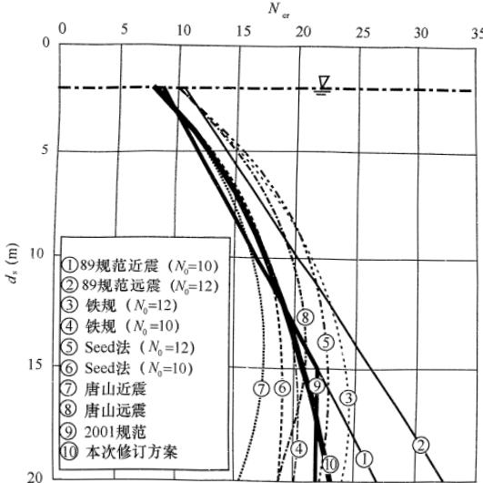

图 8 不同方法液化临界值随深度变化比较（以 8 度区为例）

从图 8 可以明显看出：在设计地震一组（或 89 规范的近震情况， $ N_{0}=10 $ ），深度为 12m 以上时，各种方法的临界锤击数较接近，相差不大；深度 15m～20m 范围内，铁路抗震规范方法比 H. B. Seed 资料要大 1.2 击～1.5 击，89 规范由于是线性延伸，比铁路抗震规范方法要大 1.8 击～8.4 击，是偏于保守的。经过比较分析，2001 规范考虑到判别方法的延续性及广大工程技术人员熟悉程度，仍采用线性判别方法。15m～20m 深度范围内取 15m 深度处的  $ N_{cr} $  值进行判别，这样处理与非线性判别方法也较为接近。铁路抗震规范  $ N_{0} $  值，如 8 度取 10，则  $ N_{cr} $  值在 15m～20m 范围内比 2001 规范小 1.4 击～1.8 击。经过全面分析对比后，认为这样调整方案既简便又与其他方法接近。

本次修订的变化如下：

1 液化判别深度。一般要求将液化判别深度加深到 20m，对于本规范第 4.2.1 条规定可不进行天然地基及基础的抗震承载力验算的各类建筑，可只判别地面下 15m 范围内土的液化。

2 液化判别公式。自 1994 年美国 Northridge 地震和 1995 年日本 Kobe 地震以来，北美和日本都对其使用的地震液化简化判别方法进行了改进与完善，1996、1997 年美国举行了专题研讨会，2000 年左右，日本的几本规范皆对液化判别方法进行了修订。考虑到影响土壤液化的因素很多，而且它们具有显著的不确定性，采用概率方法进行液化判别是一种合理的选择。自 1988 年以来，特别是 20 世纪末和 21 世纪初，国内外在砂土液化判别概率方法的研究都有了长足的进展。我国学者在 H. B. Seed 的简化液化判别方法的框架下，根据人工神经网络模型与我国大量的液化和未液化现场观测数据，可得到极限状态时的液化强度比函数，建立安全裕量方程，利用结构系统的可靠度理论可得到液化概率与安全系数的映射函数，并可给出任一震级不同概率水平、不同地面加速度以及不同地下水位和埋深的液化临界锤击数。式（4.3.4）是基于以上研究结果并考虑规范延续性修改而成的。选用对数曲线的形式来表示液化临界锤击数随深度的变化，比 2001 规范折线形式更为合理。

考虑一般结构可接受的液化风险水平以及国际惯例，选用震级 M=7.5，液化概率  $ P_{L}=0.32 $ ，水位为 2m，埋深为 3m 处的液化临界锤击数作为液化判别标准贯入锤击数基准值，见正文表 4.3.4。不同地震分组乘以调整系数。研究表明，理想的调整系数  $ \beta $  与震级大小有关，可近似用式  $ \beta=0.25M-0.89 $  表示。鉴于本规范规定按设计地震分组进行抗震设计，而各地震分组之间又没有明确的震级关系，因此本条依据 2001 规范两个地震组的液化判别标准以及  $ \beta $  值所对应的震级大小的代表性，规定了三个地震组的  $ \beta $  数值。

以 8 度第一组地下水位 2m 为例，本次修订后的液化临界值随深度变化也在图 8 中给出。可以看到，其临界锤击数与 2001

规范相差不大。

4.3.5 本条提供了一个简化的预估液化危害的方法，可对场地的喷水冒砂程度、一般浅基础建筑的可能损坏，作粗略的预估，以便为采取工程措施提供依据。

1 液化指数表达式的特点是：为使液化指数为无量纲参数，权函数 W 具有量纲  $ m^{-1} $ ；权函数沿深度分布为梯形，其图形面积判别深度 20m 时为 125。

2 液化等级的名称为轻微、中等、严重三级；各级的液化指数、地面喷水冒砂情况以及对建筑危害程度的描述见表4，系根据我国百余个液化震害资料得出的。

表 4 液化等级和对建筑物的相应危害程度

<table border=1 style='margin: auto; width: max-content;'><tr><td style='text-align: center;'>液化等级</td><td style='text-align: center;'>液化指数 (20m)</td><td style='text-align: center;'>地面喷水冒砂情况</td><td style='text-align: center;'>对建筑的危害情况</td></tr><tr><td style='text-align: center;'>轻微</td><td style='text-align: center;'>&lt;6</td><td style='text-align: center;'>地面无喷水冒砂，或仅在洼 地、河边有零星的喷水冒砂点</td><td style='text-align: center;'>危害性小，一般不至引起 明显的震害</td></tr><tr><td style='text-align: center;'>中等</td><td style='text-align: center;'>6~18</td><td style='text-align: center;'>喷水冒砂可能性大，从轻微 到严重均有，多数属中等</td><td style='text-align: center;'>危害性较大，可造成不均 匀沉陷和开裂，有时不均匀 沉陷可能达到200mm</td></tr><tr><td style='text-align: center;'>严重</td><td style='text-align: center;'>&gt;18</td><td style='text-align: center;'>一般喷水冒砂都很严重，地 面变形很明显</td><td style='text-align: center;'>危害性大，不均匀沉陷可 能大于200mm，高重心结构 可能产生不容许的倾斜</td></tr></table>

2001 规范中，层位影响权函数值  $ W_{i} $  的确定考虑了判别深度为 15m 和 20m 两种情况。本次修订明确采用 20m 判别深度。因此，只保留原条文中的判别深度为 20m 情况的  $ W_{i} $  确定方案和液化等级与液化指数的对应关系。对本规范第 4.2.1 条规定可不进行天然地基及基础的抗震承载力验算的各类建筑，计算液化指数时 15m 地面下的土层均视为不液化。

4.3.6 抗液化措施是对液化地基的综合治理，89规范已说明要注意以下几点：

1 倾斜场地的土层液化往往带来大面积土体滑动，造成严

重后果，而水平场地土层液化的后果一般只造成建筑的不均匀下沉和倾斜，本条的规定不适用于坡度大于 $ 10^{\circ} $ 的倾斜场地和液化土层严重不均的情况；

2 液化等级属于轻微者，除甲、乙类建筑由于其重要性需确保安全外，一般不作特殊处理，因为这类场地可能不发生喷水冒砂，即使发生也不致造成建筑的严重震害；

3 对于液化等级属于中等的场地，尽量多考虑采用较易实施的基础与上部结构处理的构造措施，不一定要加固处理液化土层；

4 在液化层深厚的情况下，消除部分液化沉陷的措施，即处理深度不一定达到液化下界而残留部分未经处理的液化层。

本次修订继续保持2001规范针对89规范的修改内容：

189 规范中不允许液化地基作持力层的规定有些偏严，改为不宜将未加处理的液化土层作为天然地基的持力层。因为：理论分析与振动台试验均已证明液化的主要危害来自基础外侧，液化持力层范围内位于基础直下方的部位其实最难液化，由于最先液化区域对基础直下方未液化部分的影响，使之失去侧边土压力支持。在外侧易液化区的影响得到控制的情况下，轻微液化的土层是可以作为基础的持力层的，例如：

例 1，1975 年海城地震中营口宾馆筏基以液化土层为持力层，震后无震害，基础下液化层厚度为 4.2m，为筏基宽度的 1/3 左右，液化土层的标贯锤击数  $ N=2\sim5 $ ，烈度为 7 度。在此情况下基础外侧液化对地基中间部分的影响很小。

例 2，1995 年日本阪神地震中有数座建筑位于液化严重的六甲人工岛上，地基未加处理而未遭液化危害的工程实录（见松尾雅夫等人论文，载“基础工”96年11期，P54）：

①仓库二栋，平面均为  $ 36 \, m \times 24 \, m $ ，设计中采用了补偿式基础，即使仓库满载时的基底压力也只是与移去的土自重相当。地基为欠固结的可液化砂砾，震后有震陷，但建筑物无损，据认为无震害的原因是：液化后的减震效果使输入基底的地震作用削

弱；补偿式筏式基础防止了表层土喷砂冒水；良好的基础刚度可使不均匀沉降减小；采用了吊车轨道调平，地脚螺栓加长等构造措施以减少不均匀沉降的影响。

②平面为  $ 116.8 \, m \times 54.5 \, m $  的仓库建在六甲人工岛厚  $ 15 \, m $  的可液化土上，设计时预期建成后欠固结的黏土下卧层尚可能产生  $ 1.1 \, m \sim 1.4 \, m $  的沉降。为防止不均匀沉降及液化，设计中采用了三方面的措施：补偿式基础+基础下  $ 2 \, m $  深度内以水泥土加固液化层+防止不均匀沉降的构造措施。地震使该房屋产生震陷，但情况良好。

例 3，震害调查与有限元分析显示，当基础宽度与液化层厚之比大于 3 时，则液化震陷不超过液化层厚的 1%，不致引起结构严重破坏。

因此，将轻微和中等液化的土层作为持力层不是绝对不允许，但应经过严密的论证。

2 液化的危害主要来自震陷，特别是不均匀震陷。震陷量主要决定于土层的液化程度和上部结构的荷载。由于液化指数不能反映上部结构的荷载影响，因此有趋势直接采用震陷量来评价液化的危害程度。例如，对4层以下的民用建筑，当精细计算的平均震陷值 $ S_{E}<5cm $ 时，可不采取抗液化措施，当 $ S_{E}=5cm\sim15cm $ 时，可优先考虑采取结构和基础的构造措施，当 $ S_{E}>15cm $ 时需要进行地基处理，基本消除液化震陷；在同样震陷量下，乙类建筑应该采取较丙类建筑更高的抗液化措施。

依据实测震陷、振动台试验以及有限元法对一系列典型液化地基计算得出的震陷变化规律，发现震陷量取决于液化土的密度（或承载力）、基底压力、基底宽度、液化层底面和顶面的位置和地震震级等因素，曾提出估计砂土与粉土液化平均震陷量的经验方法如下：

砂土

 $$ S_{\mathrm{E}}=\frac{0.44}{B}\xi S_{0}(d_{1}^{2}-d_{2}^{2})\left(0.01p\right)^{0.6}\left(\frac{1-D_{\mathrm{r}}}{0.5}\right)^{1.5} $$ 

粉土

 $$ S_{\mathrm{E}}=\frac{0.44}{B}\xi k S_{0}(d_{1}^{2}-d_{2}^{2})(0.01p)^{0.6} $$ 

式中： $ S_{E} $  ——液化震陷量平均值；液化层为多层时，先按各层次分别计算后再相加；

B——基础宽度（m）；对住房等密集型基础取建筑平面宽度；当 $ B\leqslant0.44d_{1} $ 时，取 $ B=0.44d_{1} $ ；

 $ S_{0} $ ——经验系数，对第一组，7、8、9度分别取0.05、0.15及0.3；

 $ d_{1} $ ——由地面算起的液化深度（m）；

 $ d_{2} $ ——由地面算起的上覆非液化土层深度（m）；液化层为持力层取 $ d_{2}=0 $ ；

p——宽度为 B 的基础底面地震作用效应标准组合的压力（kPa）；

 $ D_{r} $ ——砂土相对密实度（%），可依据标贯锤击数 N 取

 $ D_{r}=\left(\frac{N}{0.23\sigma_{v}'+16}\right)^{0.5} $ ;

k——与粉土承载力有关的经验系数，当承载力特征值不大于80kPa时，取0.30，当不小于300kPa时取0.08，其余可内插取值；

ξ——修正系数，直接位于基础下的非液化厚度满足本规范第4.3.3条第3款对上覆非液化土层厚度 $ d_{u} $ 的要求， $ \xi=0 $ ；无非液化层， $ \xi=1 $ ；中间情况内插确定。

采用以上经验方法计算得到的震陷值，与日本的实测震陷基本符合；但与国内资料的符合程度较差，主要的原因可能是：国内资料中实测震陷值常常是相对值，如相对于车间某个柱子或相对于室外地面的震陷；地质剖面则往往是附近的，而不是针对所考察的基础的；有的震陷值（如天津上古林的场地）含有震前沉降及软土震陷；不明确沉降值是最大沉降或平均沉降。

鉴于震陷量的评价方法目前还不够成熟，因此本条只是给出了必要时可以根据液化震陷量的评价结果适当调整抗液化措施的原则规定。

4.3.7～4.3.9 在这几条中规定了消除液化震陷和减轻液化影响的具体措施，这些措施都是在震害调查和分析判断的基础上提出来的。

采用振冲加固或挤密碎石桩加固后构成了复合地基。此时，如桩间土的实测标贯值仍低于本规范4.3.4条规定的临界值，不能简单判为液化。许多文献或工程实践均已指出振冲桩或挤密碎石桩有挤密、排水和增大桩身刚度等多重作用，而实测的桩间土标贯值不能反映排水的作用。因此，89规范要求加固后的桩间土的标贯值应大于临界标贯值是偏保守的。

新的研究成果与工程实践中，已提出了一些考虑桩身强度与排水效应的方法，以及根据桩的面积置换率和桩土应力比适当降低复合地基桩间土液化判别的临界标贯值的经验方法，2001规范将“桩间土的实测标贯值不应小于临界标贯锤击数”的要求，改为“不宜”。本次修订继续保持。

注意到历次地震的震害经验表明，筏基、箱基等整体性好的基础对抗液化十分有利。例如1975年海城地震中，营口市营口饭店直接坐落在4.2m厚的液化土层上，震后仅沉降缝（筏基与裙房间）有错位；1976年唐山地震中，天津医院12.8m宽的筏基下有2.3m的液化粉土，液化层距基底3.5m，未做抗液化处理，震后室外有喷水冒砂，但房屋基本不受影响。1995年日本神户地震中也有许多类似的实例。实验和理论分析结果也表明，液化往往最先发生在房屋基础下外侧的地方，基础中部以下是最不容易液化的。因此对大面积箱形基础中部区域的抗液化措施可以适当放宽要求。

4.3.10 本条规定了有可能发生侧扩或流动时滑动土体的最危险范围并要求采取土体抗滑和结构抗裂措施。

1 液化侧扩地段的宽度来自 1975 年海城地震、1976 年唐山地震及 1995 年日本阪神地震对液化侧扩区的大量调查。根据对阪神地震的调查，在距水线 50m 范围内，水平位移及竖向位移均很大；在 50m～150m 范围内，水平地面位移仍较显著；大

于 150m 以后水平位移趋于减小，基本不构成震害。上述调查结果与我国海城、唐山地震后的调查结果基本一致：海河故道、滦运河、新滦河、陡河岸波滑坍范围约距水线 100m～150m，辽河、黄河等则可达 500m。

2 侧向流动土体对结构的侧向推力，根据阪神地震后对受害结构的反算结果得到的：1）非液化上覆土层施加于结构的侧压相当于被动土压力，破坏土楔的运动方向是土楔向上滑而楔后土体向下，与被动土压发生时的运动方向一致；2）液化层中的侧压相当于竖向总压的1/3；3）桩基承受侧压的面积相当于垂直于流动方向桩排的宽度。

3 减小地裂对结构影响的措施包括：1）将建筑的主轴沿平行河流放置；2）使建筑的长高比小于3；3）采用筏基或箱基，基础板内应根据需要加配抗拉裂钢筋，筏基内的抗弯钢筋可兼作抗拉裂钢筋，抗拉裂钢筋可由中部向基础边缘逐段减少。当土体产生引张裂缝并流向河心或海岸线时，基础底面的极限摩阻力形成对基础的撕拉力，理论上，其最大值等于建筑物重力荷载之半乘以土与基础间的摩擦系数，实际上常因基础底面与土有部分脱离接触而减少。

4.3.11、4.3.12 从 1976 年唐山地震、1999 年我国台湾和土耳其地震中的破坏实例分析，软土震陷确是造成震害的重要原因，实有明确判别标准和抗御措施之必要。

我国《构筑物抗震设计规范》GB 50191 的 1993 年版根据唐山地震经验，规定 7 度区不考虑软土震陷；8 度区  $ f_{ak} $  大于 100kPa，9 度区  $ f_{ak} $  大于 120kPa 的土亦可不考虑。但上述规定有以下不足：

(1) 缺少系统的震陷试验研究资料。

（2）震陷实录局限于津塘8、9度地区，7度区是未知的空白；不少7度区的软土比津塘地区（唐山地震时为8、9度区）要差，津塘地区的多层建筑在8、9度地震时产生了15cm～30cm的震陷，比它们差的土在7度时是否会产生大于5cm的

震陷？初步认为对7度区 $ f_{k}<70kPa $  的软土还是应该考虑震陷的可能性并宜采用室内动三轴试验和H.B.Seed简化方法加以判定。

（3）对8、9度规定的 $ f_{ak} $ 值偏于保守。根据天津实际震陷资料并考虑地震的偶发性及所需的设防费用，暂时规定软土震陷量小于5cm者可不采取措施，则8度区 $ f_{ak}>90kPa $ 及9度区 $ f_{ak}>100kPa $ 的软土均可不考虑震陷的影响。

对少黏性土的液化判别，我国学者最早给出了判别方法。1980年汪闻韶院士提出根据液限、塑限判别少黏性土的地震液化，此方法在国内已获得普遍认可，在国际上也有一定影响。我国水利和电力部门的地质勘察规范已将此写入条文。虽然近几年国外学者[Bray et al.（2004）、Seed et al.（2003）、Martin et al.（2000）等]对此判别方法进行了改进，但基本思路和框架没变。本次修订，借鉴和考虑了国内外学者对该判别法的修改意见，及《水利水电工程地质勘察规范》GB50478和《水工建筑物抗震设计规范》DL5073的有关规定，增加了软弱粉质土震陷的判别法。

对自重湿陷性黄土或黄土状土，研究表明具有震陷性。若孔隙比大于0.8，当含水量在缩限（指固体与半固体的界限）与25%之间时，应该根据需要评估其震陷量。对含水量在25%以上的黄土或黄土状土的震陷量可按一般软土评估。关于软土及黄土的可能震陷目前已有了一些研究成果可以参考。例如，当建筑基础底面以下非软土层厚度符合表5中的要求时，可不采取消除软土地基的震陷影响措施。

表 5 基础底面以下非软土层厚度

<table border=1 style='margin: auto; width: max-content;'><tr><td style='text-align: center;'>烈 度</td><td style='text-align: center;'>基础底面以下非软土层厚度（m）</td></tr><tr><td style='text-align: center;'>7</td><td style='text-align: center;'>$ \geq $ 0.5b 且  $ \geq $ 3</td></tr><tr><td style='text-align: center;'>8</td><td style='text-align: center;'>$ \geq $ b 且  $ \geq $ 5</td></tr><tr><td style='text-align: center;'>9</td><td style='text-align: center;'>$ \geq $ 1.5b 且  $ \geq $ 8</td></tr></table>

注：b 为基础底面宽度（m）。

### 4.4 桩基

4.4.1 根据桩基抗震性能一般比同类结构的天然地基要好的宏观经验，继续保留89规范关于桩基不验算范围的规定。

本次修订，进一步明确了本条的适用范围。限制使用黏土砖以来，有些地区改为多层的混凝土抗震墙房屋和框架-抗震墙房屋，当其基础荷载与一般民用框架相当时，也可不进行桩基的抗震承载力验算。

4.4.2 桩基抗震验算方法已与《构筑物抗震设计规范》GB 50191 和《建筑桩基技术规范》JGJ 94 等协调。

关于地下室外墙侧的被动土压与桩共同承担地震水平力问题，大致有以下做法：假定由桩承担全部地震水平力；假定由地下室外的土承担全部水平力；由桩、土分担水平力（或由经验公式求出分担比，或用m法求土抗力或由有限元法计算）。目前看来，桩完全不承担地震水平力的假定偏于不安全，因为从日本的资料来看，桩基的震害是相当多的，因此这种做法不宜采用；由桩承受全部地震力的假定又过于保守。日本1984年发布的“建筑基础抗震设计规程”提出下列估算桩所承担的地震剪力的公式：

 $$ V=0.2V_{0}\sqrt{H}/\sqrt[4]{d_{f}} $$ 

上述公式主要根据是对地上（3～10）层、地下（1～4）层、平面 $ 14m\times14m $ 的塔楼所作的一系列试算结果。在这些计算中假定抗地震水平的因素有桩、前方的被动土抗力，侧面土的摩擦力三部分。土性质为标贯值 $ N=10\sim20 $ ，q（单轴压强）为 $ 0.5kg/cm^{2}\sim1.0kg/cm^{2} $ （黏土）。土的摩擦抗力与水平位移成以下弹塑性关系：位移≤1cm时抗力呈线性变化，当位移＞1cm时抗力保持不变。被动土抗力最大值取朗肯被动土压，达到最大值之前土抗力与水平位移呈线性关系。由于背景材料只包括高度45m以下的建筑，对45m以上的建筑没有相应的计算资料。但从计算结果的发展趋势推断，对更高的建筑其值估计不超过

0.9，因而桩负担的地震力宜在 $ 0.3\sim0.9 $   $ V_{0} $ 之间取值。

关于不计桩基承台底面与土的摩阻力为抗地震水平力的组成部分问题：主要是因为这部分摩阻力不可靠：软弱黏性土有震陷问题，一般黏性土也可能因桩身摩擦力产生的桩间土在附加应力下的压缩使土与承台脱空；欠固结土有固结下沉问题；非液化的砂砾则有震密问题等。实践中不乏有静载下桩台与土脱空的报导，地震情况下震后桩台与土脱空的报导也屡见不鲜。此外，计算摩阻力亦很困难，因为解答此问题须明确桩基在竖向荷载作用下的桩、土荷载分担比。出于上述考虑，为安全计，本条规定不应考虑承台与土的摩擦阻抗。

对于疏桩基础，如果桩的设计承载力按桩极限荷载取用则可以考虑承台与土间的摩阻力。因为此时承台与土不会脱空，且桩、土的竖向荷载分担比也比较明确。

4.4.3 本条中规定的液化土中桩的抗震验算原则和方法主要考虑了以下情况：

1 不计承台旁的土抗力或地坪的分担作用是出于安全考虑，拟将此作为安全储备，主要是目前对液化土中桩的地震作用与土中液化进程的关系尚未弄清。

2 根据地震反应分析与振动台试验，地面加速度最大时刻出现在液化土的孔压比为小于1（常为0.5～0.6）时，此时土尚未充分液化，只是刚度比未液化时下降很多，因之对液化土的刚度作折减。折减系数的取值与构筑物抗震设计规范基本一致。

3 液化土中孔隙水压力的消散往往需要较长的时间。地震时土中孔压不会排泄消散，往往于震后才出现喷砂冒水，这一过程通常持续几小时甚至一二天，其间常有沿桩与基础四周排水现象，这说明此时桩身摩阻力已大减，从而出现竖向承载力不足和缓慢的沉降，因此应按静力荷载组合校核桩身的强度与承载力。

式（4.4.3）主要根据由工程实践中总结出来的打桩前后土性变化规律，并已在许多工程实例中得到验证。

4.4.5 本条在保证桩基安全方面是相当关键的。桩基理论分析

已经证明，地震作用下的桩基在软、硬土层交界面处最易受到剪、弯损害。日本1995年阪神地震后对许多桩基的实际考查也证实了这一点，但在采用m法的桩身内力计算方法中却无法反映，目前除考虑桩土相互作用的地震反应分析可以较好地反映桩身受力情况外，还没有简便实用的计算方法保证桩在地震作用下的安全，因此必须采取有效的构造措施。本条的要点在于保证软土或液化土层附近桩身的抗弯和抗剪能力。

# 5 地震作用和结构抗震验算

### 5.1 一般规定

5.1.1 抗震设计时，结构所承受的“地震力”实际上是由于地震地面运动引起的动态作用，包括地震加速度、速度和动位移的作用，按照国家标准《建筑结构设计术语和符号标准》GB/T 50083的规定，属于间接作用，不可称为“荷载”，应称“地震作用”。

结构应考虑的地震作用方向有以下规定：

1 某一方向水平地震作用主要由该方向抗侧力构件承担，如该构件带有翼缘、翼墙等，尚应包括翼缘、翼墙的抗侧力作用。

2 考虑到地震可能来自任意方向，为此要求有斜交抗侧力构件的结构，应考虑对各构件的最不利方向的水平地震作用，一般即与该构件平行的方向。明确交角大于 $ 15^{\circ} $ 时，应考虑斜向地震作用。

3 不对称不均匀的结构是“不规则结构”的一种，同一建筑单元同一平面内质量、刚度分布不对称，或虽在本层平面内对称，但沿高度分布不对称的结构。需考虑扭转影响的结构，具有明显的不规则性。扭转计算应同时“考虑双向水平地震作用下的扭转影响”。

4 研究表明，对于较高的高层建筑，其竖向地震作用产生的轴力在结构上部是不可忽略的，故要求9度区高层建筑需考虑竖向地震作用。

5 关于大跨度和长悬臂结构，根据我国大陆和台湾地震的经验，9度和9度以上时，跨度大于18m的屋架、1.5m以上的悬挑阳台和走廊等震害严重甚至倒塌；8度时，跨度大于24m的

屋架、2m以上的悬挑阳台和走廊等震害严重。

5.1.2 不同的结构采用不同的分析方法在各国抗震规范中均有体现，底部剪力法和振型分解反应谱法仍是基本方法，时程分析法作为补充计算方法，对特别不规则（参照本规范表3.4.3的规定）、特别重要的和较高的高层建筑才要求采用。所谓“补充”，主要指对计算结果的底部剪力、楼层剪力和层间位移进行比较，当时程分析法大于振型分解反应谱法时，相关部位的构件内力和配筋作相应的调整。

进行时程分析时，鉴于不同地震波输入进行时程分析的结果不同，本条规定一般可以根据小样本容量下的计算结果来估计地震作用效应值。通过大量地震加速度记录输入不同结构类型进行时程分析结果的统计分析，若选用不少于二组实际记录和一组人工模拟的加速度时程曲线作为输入，计算的平均地震效应值不小于大样本容量平均值的保证率在85%以上，而且一般也不会偏大很多。当选用数量较多的地震波，如5组实际记录和2组人工模拟时程曲线，则保证率更高。所谓“在统计意义上相符”指的是，多组时程波的平均地震影响系数曲线与振型分解反应谱法所用的地震影响系数曲线相比，在对应于结构主要振型的周期点上相差不大于20%。计算结果在结构主方向的平均底部剪力一般不会小于振型分解反应谱法计算结果的80%，每条地震波输入的计算结果不会小于65%。从工程角度考虑，这样可以保证时程分析结果满足最低安全要求。但计算结果也不能太大，每条地震波输入计算不大于135%，平均不大于120%。

正确选择输入的地震加速度时程曲线，要满足地震动三要素的要求，即频谱特性、有效峰值和持续时间均要符合规定。

频谱特性可用地震影响系数曲线表征，依据所处的场地类别和设计地震分组确定。

加速度的有效峰值按规范表5.1.2-2中所列地震加速度最大值采用，即以地震影响系数最大值除以放大系数（约2.25）得到。计算输入的加速度曲线的峰值，必要时可比上述有效峰值适

当加大。当结构采用三维空间模型等需要双向（二个水平向）或三向（二个水平和一个竖向）地震波输入时，其加速度最大值通常按1（水平1）：0.85（水平2）：0.65（竖向）的比例调整。人工模拟的加速度时程曲线，也应按上述要求生成。

输入的地震加速度时程曲线的有效持续时间，一般从首次达到该时程曲线最大峰值的10%那一点算起，到最后一点达到最大峰值的10%为止；不论是实际的强震记录还是人工模拟波形，有效持续时间一般为结构基本周期的（5～10）倍，即结构顶点的位移可按基本周期往复（5～10）次。

抗震性能设计所需要对应于设防地震（中震）的加速度最大峰值，即本规范表3.2.2的设计基本地震加速度值，对应的地震影响系数最大值，见本规范3.10节。

本次修订，增加了平面投影尺度很大的大跨空间结构地震作用的下列计算要求：

1 平面投影尺度很大的空间结构，指跨度大于120m、或长度大于300m、或悬臂大于40m的结构。

2 关于结构形式和支承条件

对周边支承空间结构，如：网架，单、双层网壳，索穹顶，弦支穹顶屋盖和下部圈梁-框架结构，当下部支承结构为一个整体、且与上部空间结构侧向刚度比大于等于2时，可采用三向（水平两向加竖向）单点一致输入计算地震作用；当下部支承结构由结构缝分开、且每个独立的支承结构单元与上部空间结构侧向刚度比小于2时，应采用三向多点输入计算地震作用；

对两线边支承空间结构，如：拱，拱桁架；门式刚架，门式桁架；圆柱面网壳等结构，当支承于独立基础时，应采用三向多点输入计算地震作用；

对长悬臂空间结构，应视其支承结构特点，采用多向单点一致输入、或多向多点输入计算地震作用。

3 关于单点一致输入、多向单点输入、多点输入和多向多点输入

单点一致输入，即仅对基础底部输入一致的加速度反应谱或加速度时程进行结构计算。

多向单点输入，即沿空间结构基础底部，三向同时输入，其地震动参数（加速度峰值或反应谱最大值）比例取：水平主向：水平次向：竖向=1.00:0.85:0.65。

多点输入，即考虑地震行波效应和局部场地效应，对各独立基础或支承结构输入不同的设计反应谱或加速度时程进行计算，估计可能造成的地震效应。对于6度和7度Ⅰ、Ⅱ类场地上的大跨空间结构，多点输入下的地震效应不太明显，可以采用简化计算方法，乘以附加地震作用效应系数，跨度越大、场地条件越差，附加地震作用系数越大；对于7度Ⅲ、Ⅳ场地和8、9度区，多点输入下的地震效应比较明显，应考虑行波和局部场地效应对输入加速度时程进行修正，采用结构时程分析方法进行多点输入下的抗震验算。

多向多点输入，即同时考虑多向和多点输入进行计算。

## 4 关于行波效应

研究证明，地震传播过程的行波效应、相干效应和局部场地效应对于大跨空间结构的地震效应有不同程度的影响，其中，以行波效应和场地效应的影响较为显著，一般情况下，可不考虑相干效应。对于周边支承空间结构，行波效应影响表现在对大跨屋盖系统和下部支承结构；对于两线边支承空间结构，行波效应通过支座影响到上部结构。

行波效应将使不同点支承结构或支座处的加速度峰值不同，相位也不同，从而使不同点的设计反应谱或加速度时程不同，计算分析应考虑这些差异。由于地震动是一种随机过程，多点输入时，应考虑最不利的组合情况。行波效应与潜在震源、传播路径、场地的地震地质特性有关，当需要进行多点输入计算分析时，应对此作专门研究。

## 5 关于局部场地效应

当独立基础或支承结构下卧土层剖面地质条件相差较大时，

可采用一维或二维模型计算求得基础底部的土层地震反应谱或加速度时程、或按土层等效剪切波速对基岩地震反应谱或加速度时程进行修正后，作为多点输入的地震反应谱或加速度时程。当下卧土层剖面地质条件比较均匀时，可不考虑局部场地效应，不需要对地震反应谱或加速度时程进行修正。

5.1.3 按现行国家标准《建筑结构可靠度设计统一标准》GB 50068 的原则规定，地震发生时恒荷载与其他重力荷载可能的遇合结果总称为“抗震设计的重力荷载代表值 $ G_{E} $ ”，即永久荷载标准值与有关可变荷载组合值之和。组合值系数基本上沿用78规范的取值，考虑到藏书库等活荷载在地震时遇合的概率较大，故按等效楼面均布荷载计算活荷载时，其组合值系数为0.8。

表中硬钩吊车的组合值系数，只适用于一般情况，吊重较大时需按实际情况取值。

5.1.4 本次修订，表 5.1.4-1 增加 6 度区罕遇地震的水平地震影响系数最大值。与第 4 章场地类别相对应，表 5.1.4-2 增加 I 类场地的特征周期。

5.1.5 弹性反应谱理论仍是现阶段抗震设计的最基本理论，规范所采用的设计反应谱以地震影响系数曲线的形式给出。

本规范的地震影响系数的特点是：

1 同样烈度、同样场地条件的反应谱形状，随着震源机制、震级大小、震中距远近等的变化，有较大的差别，影响因素很多。在继续保留烈度概念的基础上，用设计地震分组的特征周期 $ T_{g} $ 予以反映。其中，Ⅰ、Ⅱ、Ⅲ类场地的特征周期值，2001规范较89规范的取值增大了0.05s；本次修订，计算罕遇地震作用时，特征周期 $ T_{g} $ 值又增大0.05s。这些改进，适当提高了结构的抗震安全性，也比较符合近年来得到的大量地震加速度资料的统计结果。

2 在  $ T \leqslant 0.1s $  的范围内，各类场地的地震影响系数一律采用同样的斜线，使之符合 T = 0 时（刚体）动力不放大的规律；在  $ T \geqslant T_{g} $  时，设计反应谱在理论上存在二个下降段，即速度控

制段和位移控制段，在加速度反应谱中，前者衰减指数为1，后者衰减指数为2。设计反应谱是用来预估建筑结构在其设计基准期内可能经受的地震作用，通常根据大量实际地震记录的反应谱进行统计并结合工程经验判断加以规定。为保持规范的延续性，地震影响系数在 $ T\leqslant5T_{g} $ 范围内与2001规范维持一致，各曲线的衰减指数为非整数；在 $ T>5T_{g} $ 的范围为倾斜下降段，不同场地类别的最小值不同，较符合实际反应谱的统计规律。对于周期大于6s的结构，地震影响系数仍专门研究。

3 按二阶段设计要求，在截面承载力验算时的设计地震作用，取众值烈度下结构按完全弹性分析的数值，据此调整了本规范相应的地震影响系数最大值，其取值继续与按78规范各结构影响系数C折减的平均值大致相当。在罕遇地震的变形验算时，按超越概率2%～3%提供了对应的地震影响系数最大值。

4 考虑到不同结构类型建筑的抗震设计需要，提供了不同阻尼比（0.02～0.30）地震影响系数曲线相对于标准的地震影响系数（阻尼比为0.05）的修正方法。根据实际强震记录的统计分析结果，这种修正可分二段进行：在反应谱平台段 $ (\alpha=\alpha_{\max}) $ ，修正幅度最大；在反应谱上升段 $ (T<T_{\mathrm{g}}) $ 和下降段 $ (T>T_{\mathrm{g}}) $ ，修正幅度变小；在曲线两端（0s和6s），不同阻尼比下的α系数趋向接近。

本次修订，保持2001规范地震影响系数曲线的计算表达式不变，只对其参数进行调整，达到以下效果：

1 阻尼比为 5% 的地震影响系数与 2001 规范相同，维持不变。

2 基本解决了 2001 规范在长周期段，不同阻尼比地震影响系数曲线交叉、大阻尼曲线值高于小阻尼曲线值的不合理现象。Ⅰ、Ⅱ、Ⅲ类场地的地震影响系数曲线在周期接近 6s 时，基本交汇在一点上，符合理论和统计规律。

3 降低了小阻尼（2%～3.5%）的地震影响系数值，最大降低幅度达18%。略微提高了阻尼比6%～10%的地震影响系数

值，长周期部分最大增幅约5%。

4 适当降低了大阻尼（20%～30%）的地震影响系数值，在 $ 5T_{g} $ 周期以内，基本不变，长周期部分最大降幅约10%，有利于消能减震技术的推广应用。

对应于不同特征周期  $ T_{g} $  的地震影响系数曲线如图 9 所示：

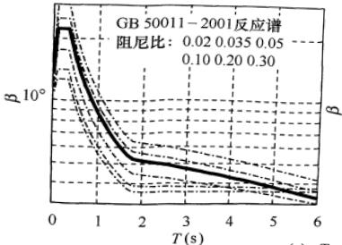

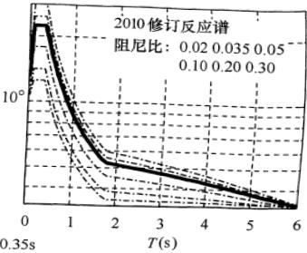

(a)  $ T_{g}=0.35s $ 

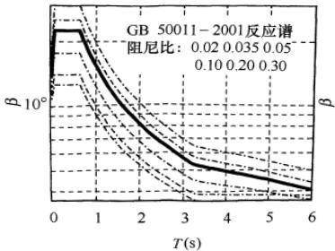

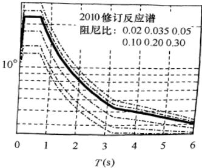

(b)  $ T_{g}=0.65s $ 

图 9 调整后不同特征周期  $ T_{g} $  的地震影响系数曲线

5.1.6 在强烈地震下，结构和构件并不存在最大承载力极限状态的可靠度。从根本上说，抗震验算应该是弹塑性变形能力极限状态的验算。研究表明，地震作用下结构和构件的变形和其最大承载能力有密切的联系，但因结构的不同而异。本条继续保持89规范和2001规范关于不同的结构应采取不同验算方法的规定。

1 当地震作用在结构设计中基本上不起控制作用时，例如6度区的大多数建筑，以及被地震经验所证明者，可不做抗震验算，只需满足有关抗震构造要求。但“较高的高层建筑（以后各章同）”，诸如高于40m的钢筋混凝土框架、高于60m的其他钢筋混凝土民用房屋和类似的工业厂房，以及高层钢结构房屋，其基本周期可能大于Ⅳ类场地的特征周期 $ T_{g} $ ，则6度的地震作用值可能相当于同一建筑在7度Ⅱ类场地下的取值，此时仍须进行抗震验算。本次修订增加了6度设防的不规则建筑应进行抗震验算的要求。

2 对于大部分结构，包括6度设防的上述较高的高层建筑和不规则建筑，可以将设防地震下的变形验算，转换为以多遇地震下按弹性分析获得的地震作用效应（内力）作为额定统计指标，进行承载力极限状态的验算，即只需满足第一阶段的设计要求，就可具有比78规范适当提高的抗震承载力的可靠度，保持了规范的延续性。

3 我国历次大地震的经验表明，发生高于基本烈度的地震是可能的，设计时考虑“大震不倒”是必要的，规范要求对薄弱层进行罕遇地震下变形验算，即满足第二阶段设计的要求。89规范仅对框架、填充墙框架、高大单层厂房等（这些结构，由于存在明显的薄弱层，在唐山地震中倒塌较多）及特殊要求的建筑做了要求，2001规范对其他结构，如各类钢筋混凝土结构、钢结构、采用隔震和消能减震技术的结构，也需要进行第二阶段设计。

### 5.2 水平地震作用计算

5.2.1 底部剪力法视多质点体系为等效单质点系。根据大量的计算分析，本条继续保持89规范的如下规定：

1 引入等效质量系数 0.85，它反映了多质点系底部剪力值与对应单质点系（质量等于多质点系总质量，周期等于多质点系基本周期）剪力值的差异。

2 地震作用沿高度倒三角形分布，在周期较长时顶部误差可达25%，故引入依赖于结构周期和场地类别的顶点附加集中地震力予以调整。单层厂房沿高度分布在9章中已另有规定，故本条不重复调整（取 $ \delta_{n}=0 $ ）。

5.2.2 对于振型分解法，由于时程分析法亦可利用振型分解法进行计算，故加上“反应谱”以示区别。为使高柔建筑的分析精度有所改进，其组合的振型个数适当增加。振型个数一般可以取振型参与质量达到总质量90%所需的振型数。

随机振动理论分析表明，当结构体系的振型密集、两个振型的周期接近时，振型之间的耦联明显。在阻尼比均为5%的情况下，由本规范式（5.2.3-6）可以得出（如图10所示）：当相邻振型的周期比为0.85时，耦联系数大约为0.27，采用平方和开方SRSS方法进行振型组合的误差不大；而当周期比为0.90时，耦联系数增大一倍，约为0.50，两个振型之间的互相影响不可忽略。这时，计算地震作用效应不能采用SRSS组合方法，而应采用完全方根组合CQC方法，如本规范式（5.2.3-5）和式（5.2.3-6）所示。

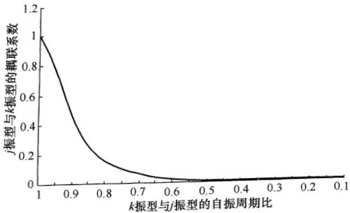

图 10 不同振型周期比对应的耦联系数

5.2.3 地震扭转效应是一个极其复杂的问题，一般情况，宜采用较规则的结构体型，以避免扭转效应。体型复杂的建筑结构，

即使楼层“计算刚心”和质心重合，往往仍然存在明显的扭转效应。因此，89规范规定，考虑结构扭转效应时，一般只能取各楼层质心为相对坐标原点，按多维振型分解法计算，其振型效应彼此耦联，用完全二次型方根法组合，可以由计算机运算。

89 规范修订过程中，提出了许多简化计算方法，例如，扭转效应系数法，表示扭转时某榀抗侧力构件按平动分析的层剪力效应的增大，物理概念明确，而数值依赖于各类结构大量算例的统计。对低于 40m 的框架结构，当各层的质心和“计算刚心”接近于两串轴线时，根据上千个算例的分析，若偏心参数 ε 满足  $ 0.1 < \varepsilon < 0.3 $ ，则边榀框架的扭转效应增大系数  $ \eta = 0.65 + 4.5\varepsilon $ 。偏心参数的计算公式是  $ \varepsilon = e_{y} s_{y} / (K_{\varphi} / K_{x}) $ ，其中， $ e_{y} $ 、 $ s_{y} $  分别为 i 层刚心和 i 层边榀框架距 i 层以上总质心的距离（y 方向）， $ K_{x} $ 、 $ K_{\varphi} $  分别为 i 层平动刚度和绕质心的扭转刚度。其他类型结构，如单层厂房也有相应的扭转效应系数。对单层结构，多采用基于刚心和质心概念的动力偏心距法估算。这些简化方法各有一定的适用范围，故规范要求在确有依据时才可用来近似估计。

本次修订，保持了2001规范的如下改进：

1 即使对于平面规则的建筑结构，国外的多数抗震设计规范也考虑由于施工、使用等原因所产生的偶然偏心引起的地震扭转效应及地震地面运动扭转分量的影响。故要求规则结构不考虑扭转耦联计算时，应采用增大边榀构件地震内力的简化处理方法。

2 增加考虑双向水平地震作用下的地震效应组合。根据强震观测记录的统计分析，二个水平方向地震加速度的最大值不相等，二者之比约为1:0.85；而且两个方向的最大值不一定发生在同一时刻，因此采用平方和开方计算二个方向地震作用效应的组合。条文中的地震作用效应，系指两个正交方向地震作用在每个构件的同一局部坐标方向的地震作用效应，如 x 方向地震作用下在局部坐标  $ x_{i} $  向的弯矩  $ M_{xx} $  和 y 方向地震作用下在局部坐标  $ x_{i} $  方向的弯矩  $ M_{xy} $ ；按不利情况考虑时，则取上述组合的最大弯

矩与对应的剪力，或上述组合的最大剪力与对应的弯矩，或上述组合的最大轴力与对应的弯矩等等。

3 扭转刚度较小的结构，例如某些核心筒-外稀柱框架结构或类似的结构，第一振型周期为  $ T_{\theta} $ ，或满足  $ T_{\theta} > 0.75 T_{x1} $ ，或  $ T_{\theta} > 0.75 T_{y1} $ ，对较高的高层建筑， $ 0.75 T_{\theta} > T_{x2} $ ，或  $ 0.75 T_{\theta} > T_{y2} $ ，均需考虑地震扭转效应。但如果考虑扭转影响的地震作用效应小于考虑偶然偏心引起的地震效应时，应取后者以策安全。但现阶段，偶然偏心与扭转二者不需要同时参与计算。

4 增加了不同阻尼比时耦联系数的计算方法，以供高层钢结构等使用。

5.2.4 突出屋面的小建筑，一般按其重力荷载小于标准层1/3控制。

对于顶层带有空旷大房间或轻钢结构的房屋，不宜视为突出屋面的小屋并采用底部剪力法乘以增大系数的办法计算地震作用效应，而应视为结构体系一部分，用振型分解法等计算。

5.2.5 由于地震影响系数在长周期段下降较快，对于基本周期大于3.5s的结构，由此计算所得的水平地震作用下的结构效应可能太小。而对于长周期结构，地震动态作用中的地面运动速度和位移可能对结构的破坏具有更大影响，但是规范所采用的振型分解反应谱法尚无法对此作出估计。出于结构安全的考虑，提出了对结构总水平地震剪力及各楼层水平地震剪力最小值的要求，规定了不同烈度下的剪力系数，当不满足时，需改变结构布置或调整结构总剪力和各楼层的水平地震剪力使之满足要求。例如，当结构底部的总地震剪力略小于本条规定而中、上部楼层均满足最小值时，可采用下列方法调整：若结构基本周期位于设计反应谱的加速度控制段时，则各楼层均需乘以同样大小的增大系数；若结构基本周期位于反应谱的位移控制段时，则各楼层i均需按底部的剪力系数的差值 $ \triangle\lambda_{0} $ 增加该层的地震剪力 $ \triangle F_{Eki}=\triangle\lambda_{0}G_{Ei} $ ；若结构基本周期位于反应谱的速度控制段时，则增加值应大于 $ \triangle\lambda_{0}G_{Ei} $ ，顶部增加值可取动位移作用和加速度作用二

者的平均值，中间各层的增加值可近似按线性分布。

需要注意：①当底部总剪力相差较多时，结构的选型和总体布置需重新调整，不能仅采用乘以增大系数方法处理。②只要底部总剪力不满足要求，则结构各楼层的剪力均需要调整，不能仅调整不满足的楼层。③满足最小地震剪力是结构后续抗震计算的前提，只有调整到符合最小剪力要求才能进行相应的地震倾覆力矩、构件内力、位移等等的计算分析；即意味着，当各层的地震剪力需要调整时，原先计算的倾覆力矩、内力和位移均需要相应调整。④采用时程分析法时，其计算的总剪力也需符合最小地震剪力的要求。⑤本条规定不考虑阻尼比的不同，是最低要求，各类结构，包括钢结构、隔震和消能减震结构均需一律遵守。

扭转效应明显与否一般可由考虑耦联的振型分解反应谱法分析结果判断，例如前三个振型中，二个水平方向的振型参与系数为同一个量级，即存在明显的扭转效应。对于扭转效应明显或基本周期小于3.5s的结构，剪力系数取 $ 0.2\alpha_{max} $ ，保证足够的抗震安全度。对于存在竖向不规则的结构，突变部位的薄弱楼层，尚应按本规范3.4.4条的规定，再乘以不小于1.15的系数。

本次修订增加了6度区楼层最小地震剪力系数值。

5.2.7 由于地基和结构动力相互作用的影响，按刚性地基分析的水平地震作用在一定范围内有明显的折减。考虑到我国的地震作用取值与国外相比还较小，故仅在必要时才利用这一折减。研究表明，水平地震作用的折减系数主要与场地条件、结构自振周期、上部结构和地基的阻尼特性等因素有关，柔性地基上的建筑结构的折减系数随结构周期的增大而减小，结构越刚，水平地震作用的折减量越大。89规范在统计分析基础上建议，框架结构折减10%，抗震墙结构折减15%～20%。研究表明，折减量与上部结构的刚度有关，同样高度的框架结构，其刚度明显小于抗震墙结构，水平地震作用的折减量也减小，当地震作用很小时不宜再考虑水平地震作用的折减。据此规定了可考虑地基与结构动力相互作用的结构自振周期的范围和折减量。

研究表明，对于高宽比较大的高层建筑，考虑地基与结构动力相互作用后水平地震作用的折减系数并非各楼层均为同一常数，由于高振型的影响，结构上部几层的水平地震作用一般不宜折减。大量计算分析表明，折减系数沿楼层高度的变化较符合抛物线型分布，2001规范提供了建筑顶部和底部的折减系数的计算公式。对于中间楼层，为了简化，采用按高度线性插值方法计算折减系数。本次修订保留了这一规定。

### 5.3 竖向地震作用计算

5.3.1 高层建筑的竖向地震作用计算，是89规范增加的规定。输入竖向地震加速度波的时程反应分析发现，高层建筑由竖向地震引起的轴向力在结构的上部明显大于底部，是不可忽视的。作为简化方法，原则上与水平地震作用的底部剪力法类似：结构竖向振动的基本周期较短，总竖向地震作用可表示为竖向地震影响系数最大值和等效总重力荷载代表值的乘积；沿高度分布按第一振型考虑，也采用倒三角形分布；在楼层平面内的分布，则按构件所承受的重力荷载代表值分配。只是等效质量系数取0.75。

根据台湾 921 大地震的经验，2001 规范要求高层建筑楼层的竖向地震作用效应应乘以增大系数 1.5，使结构总竖向地震作用标准值，8、9 度分别略大于重力荷载代表值的 10% 和 20%。

隔震设计时，由于隔震垫不仅不隔离竖向地震作用反而有所放大，与隔震后结构的水平地震作用相比，竖向地震作用往往不可忽视，计算方法在本规范12章具体规定。

5.3.2 用反应谱法、时程分析法等进行结构竖向地震反应的计算分析研究表明，对一般尺度的平板型网架和大跨度屋架各主要杆件，竖向地震内力和重力荷载下的内力之比值，彼此相差一般不太大，此比值随烈度和场地条件而异，且当结构周期大于特征周期时，随跨度的增大，比值反而有所下降。由于在常用的跨度范围内，这个下降还不很大，为了简化，本规范略去跨度的影响。

5.3.3 对长悬臂等大跨度结构的竖向地震作用计算，本次修订未修改，仍采用78规范的静力法。

5.3.4 空间结构的竖向地震作用，除了第5.3.2、第5.3.3条的简化方法外，还可采用竖向振型的振型分解反应谱方法。对于竖向反应谱，各国学者有一些研究，但研究成果纳入规范的不多。现阶段，多数规范仍采用水平反应谱的65%，包括最大值和形状参数。但认为竖向反应谱的特征周期与水平反应谱相比，尤其在远震中距时，明显小于水平反应谱。故本条规定，特征周期均按第一组采用。对处于发震断裂10km以内的场地，竖向反应谱的最大值可能接近于水平谱，但特征周期小于水平谱。

### 5.4 截面抗震验算

本节基本同89规范，仅按《建筑结构可靠度设计统一标准》GB 50068（以下简称《统一标准》）的修订，对符号表达做了修改，并修改了钢结构的 $ \gamma_{RE} $ 。

5.4.1 在设防烈度的地震作用下，结构构件承载力按《统一标准》计算的可靠指标 $ \beta $ 是负值，难于按《统一标准》的要求进行设计表达式的分析。因此，89规范以来，在第一阶段的抗震设计时取相当于众值烈度下的弹性地震作用作为额定设计指标，使此时的设计表达式可按《统一标准》的要求导出。

## 1 地震作用分项系数的确定

在众值烈度下的地震作用，应视为可变作用而不是偶然作用。这样，根据《统一标准》中确定直接作用（荷载）分项系数的方法，通过综合比较，本规范对水平地震作用，确定 $ \gamma_{Eh}=1.3 $ ，至于竖向地震作用分项系数，则参照水平地震作用，也取 $ \gamma_{Ev}=1.3 $ 。当竖向与水平地震作用同时考虑时，根据加速度峰值记录和反应谱的分析，二者的组合比为1：0.4，故 $ \gamma_{Eh}=1.3 $ ， $ \gamma_{Ev}=0.4\times1.3\approx0.5 $ 。

此次修订，考虑大跨、大悬臂结构的竖向地震作用效应比较显著，表5.4.1增加了同时计算水平与竖向地震作用（竖向地震

为主）的组合。

此外，按照《统一标准》的规定，当重力荷载对结构构件承载力有利时，取  $ \gamma_{G}=1.0 $ 。

## 2 抗震验算中作用组合值系数的确定

本规范在计算地震作用时，已经考虑了地震作用与各种重力荷载（恒荷载与活荷载、雪荷载等）的组合问题，在本规范5.1.3条中规定了一组组合值系数，形成了抗震设计的重力荷载代表值，本规范继续沿用78规范在验算和计算地震作用时（除吊车悬吊重力外）对重力荷载均采用相同的组合值系数的规定，可简化计算，并避免有两种不同的组合值系数。因此，本条中仅出现风荷载的组合值系数，并按《统一标准》的方法，将78规范的取值予以转换得到。这里，所谓风荷载起控制作用，指风荷载和地震作用产生的总剪力和倾覆力矩相当的情况。

## 3 地震作用标准值的效应

规范的作用效应组合是建立在弹性分析叠加原理基础上的，考虑到抗震计算模型的简化和塑性内力分布与弹性内力分布的差异等因素，本条中还规定，对地震作用效应，当本规范各章有规定时尚应乘以相应的效应调整系数 $ \eta $ ，如突出屋面小建筑、天窗架、高低跨厂房交接处的柱子、框架柱，底层框架-抗震墙结构的柱子、梁端和抗震墙底部加强部位的剪力等的增大系数。

## 4 关于重要性系数

根据地震作用的特点、抗震设计的现状，以及抗震设防分类与《统一标准》中安全等级的差异，重要性系数对抗震设计的实际意义不大，本规范对建筑重要性的处理仍采用抗震措施的改变来实现，不考虑此项系数。

5.4.2 结构在设防烈度下的抗震验算根本上应该是弹塑性变形验算，但为减少验算工作量并符合设计习惯，对大部分结构，将变形验算转换为众值烈度地震作用下构件承载力验算的形式来表现。按照《统一标准》的原则，89规范与78规范在众值烈度下有基本相同的可靠指标，研究发现，78规范钢结构构件的可靠

指标比混凝土结构构件明显偏低，故89规范予以适当提高，使之与砌体、混凝土构件有相近的可靠指标；而且随着非抗震设计材料指标的提高，2001规范各类材料结构的抗震可靠性也略有提高。基于此前提，在确定地震作用分项系数取1.3的同时，则可得到与抗力标准值 $ R_{k} $ 相应的最优抗力分项系数，并进一步转换为抗震的抗力函数（即抗震承载力设计值 $ R_{dE} $ ），使抗力分项系数取1.0或不出现。本规范砌体结构的截面抗震验算，就是这样处理的。

现阶段大部分结构构件截面抗震验算时，采用了各有关规范的承载力设计值 $ R_{d} $ ，因此，抗震设计的抗力分项系数，就相应地变为非抗震设计的构件承载力设计值的抗震调整系数 $ \gamma_{RE} $ ，即 $ \gamma_{RE}=R_{d}/R_{dE} $ 或 $ R_{dE}=R_{d}/\gamma_{RE} $ 。还需注意，地震作用下结构的弹塑性变形直接依赖于结构实际的屈服强度（承载力），本节的承载力是设计值，不可误作为标准值来进行本章5.5节要求的弹塑性变形验算。

本次修订，配合钢结构构件、连接的内力调整系数的变化，调整了其承载力抗震调整系数的取值。

5.4.3 本条在 2008 年局部修订时，提升为强制性条文。

### 5.5 抗震变形验算

5.5.1 根据本规范所提出的抗震设防三个水准的要求，采用二阶段设计方法来实现，即：在多遇地震作用下，建筑主体结构不受损坏，非结构构件（包括围护墙、隔墙、幕墙、内外装修等）没有过重破坏并导致人员伤亡，保证建筑的正常使用功能；在罕遇地震作用下，建筑主体结构遭受破坏或严重破坏但不倒塌。根据各国规范的规定、震害经验和实验研究结果及工程实例分析，采用层间位移角作为衡量结构变形能力从而判别是否满足建筑功能要求的指标是合理的。

对各类钢筋混凝土结构和钢结构要求进行多遇地震作用下的弹性变形验算，实现第一水准下的设防要求。弹性变形验算属于

正常使用极限状态的验算，各作用分项系数均取1.0。钢筋混凝土结构构件的刚度，国外规范规定需考虑一定的非线性而取有效刚度，本规范规定与位移限值相配套，一般可取弹性刚度；当计算的变形较大时，宜适当考虑构件开裂时的刚度退化，如取 $ 0.85E_{c}I_{0} $ 。

第一阶段设计，变形验算以弹性层间位移角表示。不同结构类型给出弹性层间位移角限值范围，主要依据国内外大量的试验研究和有限元分析的结果，以钢筋混凝土构件（框架柱、抗震墙等）开裂时的层间位移角作为多遇地震下结构弹性层间位移角限值。

计算时，一般不扣除由于结构重力  $ P-\triangle $  效应所产生的水平相对位移；高度超过 150m 或 H/B>6 的高层建筑，可以扣除结构整体弯曲所产生的楼层水平绝对位移值，因为以弯曲变形为主的高层建筑结构，这部分位移在计算的层间位移中占有相当的比例，加以扣除比较合理。如未扣除，位移角限值可有所放宽。

框架结构试验结果表明，对于开裂层间位移角，不开洞填充墙框架为1/2500，开洞填充墙框架为1/926；有限元分析结果表明，不带填充墙时为1/800，不开洞填充墙时为1/2000。本规范不再区分有填充墙和无填充墙，均按89规范的1/550采用，并仍按构件截面弹性刚度计算。

对于框架-抗震墙结构的抗震墙，其开裂层间位移角：试验结果为1/3300～1/1100，有限元分析结果为1/4000～1/2500，取二者的平均值约为1/3000～1/1600。2001规范统计了我国当时建成的124幢钢筋混凝土框-墙、框-筒、抗震墙、筒结构高层建筑的结构抗震计算结果，在多遇地震作用下的最大弹性层间位移均小于1/800，其中85%小于1/1200。因此对框-墙、板柱墙、框-筒结构的弹性位移角限值范围为1/800；对抗震墙和筒中筒结构层间弹性位移角限值范围为1/1000，与现行的混凝土高层规程相当；对框支层要求较框-墙结构加严，取1/1000。

钢结构在弹性阶段的层间位移限值，日本建筑法施行令定为

层高的 1/200。参照美国加州规范（1988）对基本自振周期大于 0.7s 的结构的规定，本规范取 1/250。

单层工业厂房的弹性层间位移角需根据吊车使用要求加以限制，严于抗震要求，因此不必再对地震作用下的弹性位移加以限制；弹塑性层间位移的计算和限值在本规范第5.5.4和第5.5.5条有规定，单层钢筋混凝土柱排架为1/30。因此本条不再单列对于单层工业厂房的弹性位移限值。

多层工业厂房应区分结构材料（钢和混凝土）和结构类型（框、排架），分别采用相应的弹性及弹塑性层间位移角限值，框排架结构中的排架柱的弹塑性层间位移角限值，在本规范附录H第H.1节中规定为1/30。

5.5.2 震害经验表明，如果建筑结构中存在薄弱层或薄弱部位，在强烈地震作用下，由于结构薄弱部位产生了弹塑性变形，结构构件严重破坏甚至引起结构倒塌；属于乙类建筑的生命线工程中的关键部位在强烈地震作用下一旦遭受破坏将带来严重后果，或产生次生灾害或对救灾、恢复重建及生产、生活造成很大影响。除了89规范所规定的高大的单层工业厂房的横向排架、楼层屈服强度系数小于0.5的框架结构、底部框架砖房等之外，板柱抗震墙及结构体系不规则的某些高层建筑结构和乙类建筑也要求进行罕遇地震作用下的抗震变形验算。采用隔震和消能减震技术的建筑结构，对隔震和消能减震部件应有位移限制要求，在罕遇地震作用下隔震和消能减震部件应能起到降低地震效应和保护主体结构的作用，因此要求进行抗震变形验算。

考虑到弹塑性变形计算的复杂性，对不同的建筑结构提出不同的要求。随着弹塑性分析模型和软件的发展和改进，本次修订进一步增加了弹塑性变形验算的范围。

5.5.3 对建筑结构在罕遇地震作用下薄弱层（部位）弹塑性变形计算，12层以下且层刚度无突变的框架结构及单层钢筋混凝土柱厂房可采用规范的简化方法计算；较为精确的结构弹塑性分析方法，可以是三维的静力弹塑性（如push-over方法）或弹塑

性时程分析方法；有时尚可采用塑性内力重分布的分析方法等。

5.5.4 钢筋混凝土框架结构及高大单层钢筋混凝土柱厂房等结构，在大地震中往往受到严重破坏甚至倒塌。实际震害分析及实验研究表明，除了这些结构刚度相对较小而变形较大外，更主要的是存在承载力验算所没有发现的薄弱部位——其承载力本身虽满足设计地震作用下抗震承载力的要求，却比相邻部位要弱得多。对于单层厂房，这种破坏多发生在8度Ⅲ、Ⅳ类场地和9度区，破坏部位是上柱，因为上柱的承载力一般相对较小且其下端的支承条件不如下柱。对于底部框架-抗震墙结构，则底部和过渡层是明显的薄弱部位。

迄今，各国规范的变形估计公式有三种；一是按假想的完全弹性体计算；二是将额定的地震作用下的弹性变形乘以放大系数，即 $ \triangle u_{p}=\eta_{p}\triangle u_{e} $ ；三是按时程分析法等专门程序计算。其中采用第二种的最多，本条继续保持89规范所采用的方法。

1 根据数千个（1～15）层剪切型结构采用理想弹塑性恢复力模型进行弹塑性时程分析的计算结果，获得如下统计规律：

1）多层结构存在“塑性变形集中”的薄弱层是一种普遍现象，其位置，对屈服强度系数 $ \xi_{y} $ 分布均匀的结构多在底层，分布不均匀结构则在 $ \xi_{y} $ 最小处和相对较小处，单层厂房往往在上柱。

2）多层剪切型结构薄弱层的弹塑性变形与弹性变形之间有相对稳定的关系。

对于屈服强度系数  $ \xi_{y} $  均匀的多层结构，其最大的层间弹塑性变形增大系数  $ \eta_{p} $  可按层数和  $ \xi_{y} $  的差异用表格形式给出；对于  $ \xi_{y} $  不均匀的结构，其情况复杂，在弹性刚度沿高度变化较平缓时，可近似用均匀结构的  $ \eta_{p} $  适当放大取值；对其他情况，一般需要用静力弹塑性分析、弹塑性时程分析法或内力重分布法等予以估计。

2 本规范的设计反应谱是在大量单质点系的弹性反应分析基础上统计得到的“平均值”，弹塑性变形增大系数也在统计平均意义下有一定的可靠性。当然，还应注意简化方法都有其适用

范围。

此外，如采用延性系数来表示多层结构的层间变形，可用 $ \mu=\eta_{p}/\xi_{y} $ 计算。

3 计算结构楼层或构件的屈服强度系数时，实际承载力应取截面的实际配筋和材料强度标准值计算，钢筋混凝土梁柱的正截面受弯实际承载力公式如下：

梁：

 $$ M_{\mathrm{b y k}}^{\mathrm{a}}=f_{\mathrm{y k}}A_{\mathrm{s b}}^{\mathrm{a}}(h_{\mathrm{b0}}-a_{\mathrm{s}}^{\prime}) $$ 

柱：轴向力满足 $ N_{\mathrm{G}}/(f_{\mathrm{ck}}b_{\mathrm{c}}h_{\mathrm{c}})\leqslant0.5 $ 时，

 $$ M_{\mathrm{c y k}}^{\mathrm{a}}=f_{\mathrm{y k}}A_{\mathrm{s c}}^{\mathrm{a}}(h_{0}-a_{\mathrm{~s~}}^{\prime})+0.5N_{\mathrm{G}}h_{\mathrm{c}}(1-N_{\mathrm{G}}/f_{\mathrm{c k}}b_{\mathrm{c}}h_{\mathrm{c}}) $$ 

式中， $ N_{G} $  为对应于重力荷载代表值的柱轴压力（分项系数取1.0）。

注：上角 a 表示 “实际的”。

4 2001 规范修订过程中，对不超过 20 层的钢框架和框架-支撑结构的薄弱层层间弹塑性位移的简化计算公式开展了研究。利用 DRAIN-2D 程序对三跨的平面钢框架和中跨为交叉支撑的三跨钢结构进行了不同层数钢结构的弹塑性地震反应分析。主要计算参数如下：结构周期，框架取 0.1n（层数），支撑框架取 0.09n；恢复力模型，框架取屈服后刚度为弹性刚度 0.02 的不退化双线性模型，支撑框架的恢复力模型同时考虑了压屈后的强度退化和刚度退化；楼层屈服剪力，框架的一般层约为底层的 0.7，支撑框架的一般层约为底层的 0.9；底层的屈服强度系数为 0.7～0.3；在支撑框架中，支撑承担的地震剪力为总地震剪力的 75%，框架部分承担 25%；地震波取 80 条天然波。

根据计算结果的统计分析发现：①纯框架结构的弹塑性位移反应与弹性位移反应差不多，弹塑性位移增大系数接近1；②随着屈服强度系数的减小，弹塑性位移增大系数增大；③楼层屈服强度系数较小时，由于支撑的屈曲失效效应，支撑框架的弹塑性位移增大系数大于框架结构。

以下是 15 层和 20 层钢结构的弹塑性增大系数的统计数值（平均值加一倍方差）：

<table border=1 style='margin: auto; width: max-content;'><tr><td style='text-align: center;'>屈服强度系数</td><td style='text-align: center;'>15层框架</td><td style='text-align: center;'>20层框架</td><td style='text-align: center;'>15层支撑框架</td><td style='text-align: center;'>20层支撑框架</td></tr><tr><td style='text-align: center;'>0.50</td><td style='text-align: center;'>1.15</td><td style='text-align: center;'>1.20</td><td style='text-align: center;'>1.05</td><td style='text-align: center;'>1.15</td></tr><tr><td style='text-align: center;'>0.40</td><td style='text-align: center;'>1.20</td><td style='text-align: center;'>1.30</td><td style='text-align: center;'>1.15</td><td style='text-align: center;'>1.25</td></tr><tr><td style='text-align: center;'>0.30</td><td style='text-align: center;'>1.30</td><td style='text-align: center;'>1.50</td><td style='text-align: center;'>1.65</td><td style='text-align: center;'>1.90</td></tr></table>

上述统计值与89规范对剪切型结构的统计值有一定的差异，可能与钢结构基本周期较长、弯曲变形所占比重较大，采用杆系模型时楼层屈服强度系数计算，以及钢结构恢复力模型的屈服后刚度取为初始刚度的0.02而不是理想弹塑性恢复力模型等有关。

5.5.5 在罕遇地震作用下，结构要进入弹塑性变形状态。根据震害经验、试验研究和计算分析结果，提出以构件（梁、柱、墙）和节点达到极限变形时的层间极限位移角作为罕遇地震作用下结构弹塑性层间位移角限值的依据。

国内外许多研究结果表明，不同结构类型的不同结构构件的弹塑性变形能力是不同的，钢筋混凝土结构的弹塑性变形主要由构件关键受力区的弯曲变形、剪切变形和节点区受拉钢筋的滑移变形等三部分非线性变形组成。影响结构层间极限位移角的因素很多，包括：梁柱的相对强弱关系，配箍率、轴压比、剪跨比、混凝土强度等级、配筋率等，其中轴压比和配箍率是最主要的因素。

钢筋混凝土框架结构的层间位移是楼层梁、柱、节点弹塑性变形的综合结果，美国对36个梁-柱组合试件试验结果表明，极限侧移角的分布为1/27～1/8，我国学者对数十榀填充墙框架的试验结果表明，不开洞填充墙和开洞填充墙框架的极限侧移角平均值分别为1/30和1/38。本条规定框架和板柱-框架的位移角限值为1/50是留有安全储备的。

由于底部框架砌体房屋沿竖向存在刚度突变，因此对其混凝土框架部分适当从严；同时，考虑到底部框架一般均带一定数量的抗震墙，故类比框架-抗震墙结构，取位移角限值为1/100。

钢筋混凝土结构在罕遇地震作用下，抗震墙要比框架柱先进

入弹塑性状态，而且最终破坏也相对集中在抗震墙单元。日本对176个带边框柱抗震墙的试验研究表明，抗震墙的极限位移角的分布为1/333～1/125，国内对11个带边框低矮抗震墙试验所得到的极限位移角分布为1/192～1/112。在上述试验研究结果的基础上，取1/120作为抗震墙和筒中筒结构的弹塑性层间位移角限值。考虑到框架-抗震墙结构、板柱-抗震墙和框架-核心筒结构中大部分水平地震作用由抗震墙承担，弹塑性层间位移角限值可比框架结构的框架柱严，但比抗震墙和筒中筒结构要松，故取1/100。高层钢结构，美国ATC3-06规定，Ⅱ类危险性的建筑（容纳人数较多），层间最大位移角限值为1/67；美国AISC《房屋钢结构抗震规定》（1997）中规定，与小震相比，大震时的位移角放大系数，对双重抗侧力体系中的框架-中心支撑结构取5，对框架-偏心支撑结构，取4。如果弹性位移角限值为1/300，则对应的弹塑性位移角限值分别大于1/60和1/75。考虑到钢结构在构件稳定有保证时具有较好的延性，弹塑性层间位移角限值适当放宽至1/50。

鉴于甲类建筑在抗震安全性上的特殊要求，其层间变位角限值应专门研究确定。

# 6 多层和高层钢筋混凝土房屋

### 6.1 一般规定

6.1.1 本章适用于现浇钢筋混凝土多层和高层房屋，包括采用符合本章第6.1.7条要求的装配整体式楼屋盖的房屋。

对采用钢筋混凝土材料的高层建筑，从安全和经济诸方面综合考虑，其适用最大高度应有限制。当钢筋混凝土结构的房屋高度超过最大适用高度时，应通过专门研究，采取有效加强措施，如采用型钢混凝土构件、钢管混凝土构件等，并按建设部部长令的有关规定进行专项审查。

与 2001 规范相比，本章对适用最大高度的修改如下：

1 补充了 8 度（0.3g）时的最大适用高度，按 8 度和 9 度之间内插且偏于 8 度。

2 框架结构的适用最大高度，除 6 度外有所降低。

3 板柱-抗震墙结构的适用最大高度，有所增加。

4 删除了在Ⅳ类场地适用的最大高度应适当降低的规定。

5 对于平面和竖向均不规则的结构，适用的最大高度适当降低的规范用词，由“应”改为“宜”，一般减少10%左右。对于部分框支结构，表6.1.1的适用高度已经考虑框支的不规则而比全落地抗震墙结构降低，故对于框支结构的“竖向和平面均不规则”，指框支层以上的结构同时存在竖向和平面不规则的情况。

还需说明：

仅有个别墙体不落地，例如不落地墙的截面面积不大于总截面面积的10%，只要框支部分的设计合理且不致加大扭转不规则，仍可视为抗震墙结构，其适用最大高度仍可按全部落地的抗震墙结构确定。

框架-核心筒结构存在抗扭不利和加强层刚度突变问题，其

适用最大高度略低于筒中筒结构。框架-核心筒结构中，带有部分仅承受竖向荷载的无梁楼盖时，不作为表6.1.1的板柱-抗震墙结构对待。

6.1.2 钢筋混凝土房屋的抗震等级是重要的设计参数，89规范就明确规定应根据设防类别、结构类型、烈度和房屋高度四个因素确定。抗震等级的划分，体现了对不同抗震设防类别、不同结构类型、不同烈度、同一烈度但不同高度的钢筋混凝土房屋结构延性要求的不同，以及同一种构件在不同结构类型中的延性要求的不同。

钢筋混凝土房屋结构应根据抗震等级采取相应的抗震措施。这里，抗震措施包括抗震计算时的内力调整措施和各种抗震构造措施。因此，乙类建筑应提高一度查表6.1.2确定其抗震等级。

本章条文中，“×级框架”包括框架结构、框架-抗震墙结构、框支层和框架-核心筒结构、板柱-抗震墙结构中的框架，“×级框架结构”仅指框架结构的框架，“×级抗震墙”包括抗震墙结构、框架-抗震墙结构、筒体结构和板柱-抗震墙结构中的抗震墙。

本次修订的主要变化如下：

1 注意到《民用建筑设计通则》GB 50362 规定，住宅 10 层及以上为高层建筑，多层公共建筑高度 24m 以上为高层建筑。本次修订，将框架结构的 30m 高度分界改为 24m；对于 7、8、9 度时的框架-抗震墙结构，抗震墙结构以及部分框支抗震墙结构，增加 24m 作为一个高度分界，其抗震等级比 2001 规范降低一级，但四级不再降低，框支层框架不降低，总体上与 89 规范对“低层较规则结构”的要求相近。

2 明确了框架-核心筒结构的高度不超过 60m 时，当按框架-抗震墙结构的要求设计时，其抗震等级按框架-抗震墙结构的规定采用。

3 将 “大跨度公共建筑” 改为 “大跨度框架”，并明确其跨度按 18m 划分。

6.1.3 本条是关于混凝土结构抗震等级的进一步补充规定。

1 关于框架和抗震墙组成的结构的抗震等级。设计中有三种情况：其一，个别或少量框架，此时结构属于抗震墙体系的范畴，其抗震墙的抗震等级，仍按抗震墙结构确定；框架的抗震等级可参照框架-抗震墙结构的框架确定。其二，当框架-抗震墙结构有足够的抗震墙时，其框架部分是次要抗侧力构件，按本规范表6.1.2框架-抗震墙结构确定抗震等级；89规范要求其抗震墙底部承受的地震倾覆力矩不小于结构底部总地震倾覆力矩的50%。其三，墙体很少，即2001规范规定“在基本振型地震作用下，框架部分承受的地震倾覆力矩大于结构总地震倾覆力矩的50%”，其框架部分的抗震等级应按框架结构确定。对于这类结构，本次修订进一步明确以下几点：一是将“在基本振型地震作用下”改为“在规定的水平力作用下”，“规定的水平力”的含义见本规范第3.4节；二是明确底层框架部分所承担的地震倾覆力矩大于结构总地震倾覆力矩的50%时仍属于框架结构范畴；三是删除了“最大适用高度可比框架结构适当增加”的规定；四是补充规定了其抗震墙的抗震等级。

框架部分按刚度分配的地震倾覆力矩的计算公式，保持2001规范的规定不变：

 $$ M_{\mathrm{c}}=\sum_{i=1}^{n}\sum_{j=1}^{m}V_{i j}h_{i} $$ 

式中： $ M_{c} $ ——框架-抗震墙结构在规定的侧向力作用下框架部分分配的地震倾覆力矩；

n——结构层数；

m——框架 i 层的柱根数；

 $ V_{ij} $ ——第 i 层第 j 根框架柱的计算地震剪力；

 $ h_{i} $ ——第 i 层层高。

在框架结构中设置少量抗震墙，往往是为了增大框架结构的刚度、满足层间位移角限值的要求，仍然属于框架结构范畴，但层间位移角限值需按底层框架部分承担倾覆力矩的大小，在框架

结构和框架-抗震墙结构两者的层间位移角限值之间偏于安全内插。

2 关于裙房的抗震等级。裙房与主楼相连，主楼结构在裙房顶板对应的上下各一层受刚度与承载力突变影响较大，抗震构造措施需要适当加强。裙房与主楼之间设防震缝，在大震作用下可能发生碰撞，该部位也需要采取加强措施。

裙房与主楼相连的相关范围，一般可从主楼周边外延3跨且不小于20m，相关范围以外的区域可按裙房自身的结构类型确定其抗震等级。裙房偏置时，其端部有较大扭转效应，也需要加强。

3 关于地下室的抗震等级。带地下室的多层和高层建筑，当地地下室结构的刚度和受剪承载力比上部楼层相对较大时（参见本规范第6.1.14条），地下室顶板可视作嵌固部位，在地震作用下的屈服部位将发生在地上楼层，同时将影响到地下一层。地面以下地震响应逐渐减小，规定地下一层的抗震等级不能降低；而地下一层以下不要求计算地震作用，规定其抗震构造措施的抗震等级可逐层降低（图11）。

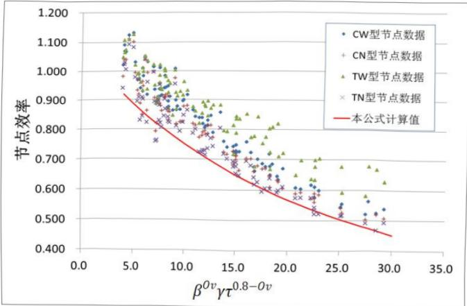

图 11 裙房和地下室的抗震等级

4 关于乙类建筑的抗震等级。根据《建筑工程抗震设防分类标准》GB 50223 的规定，乙类建筑应按提高一度查本规范表 6.1.2 确定抗震等级（内力调整和构造措施）。本规范第 6.1.1 条规定，乙类建筑的钢筋混凝土房屋可按本地区抗震设防烈度确定其适用的最大高度，于是可能出现 7 度乙类的框支结构房屋和

8度乙类的框架结构、框架-抗震墙结构、部分框支抗震墙结构、板柱-抗震墙结构的房屋提高一度后，其高度超过本规范表6.1.2中抗震等级为一级的高度上界。此时，内力调整不提高，只要求抗震构造措施“高于一级”，大体与《高层建筑混凝土结构技术规程》JGJ3中特一级的构造要求相当。

6.1.4 震害表明，本条规定的防震缝宽度的最小值，在强烈地震下相邻结构仍可能局部碰撞而损坏，但宽度过大会给立面处理造成困难。因此，是否设置防震缝应按本规范第3.4.5条的要求判断。

防震缝可以结合沉降缝要求贯通到地基，当无沉降问题时也可以从基础或地下室以上贯通。当有多层地下室，上部结构为带裙房的单塔或多塔结构时，可将裙房用防震缝自地下室以上分隔，地下室顶板应有良好的整体性和刚度，能将地震剪力分布到整个地下室结构。

8、9度框架结构房屋防震缝两侧层高相差较大时，可在防震缝两侧房屋的尽端沿全高设置垂直于防震缝的抗撞墙，通过抗撞墙的损坏减少防震缝两侧碰撞时框架的破坏。本次修订，抗撞墙的长度由2001规范的可不大于一个柱距，修改为“可不大于层高的1/2”。结构单元较长时，抗撞墙可能引起较大温度内力，也可能有较大扭转效应，故设置时应综合分析（图12）。

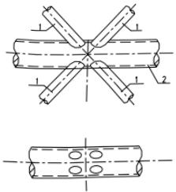

图 12 抗撞墙示意图

6.1.5 梁中线与柱中线之间、柱中线与抗震墙中线之间有较大偏心距时，在地震作用下可能导致核芯区受剪面积不足，对柱带

来不利的扭转效应。当偏心距超过1/4柱宽时，需进行具体分析并采取有效措施，如采用水平加腋梁及加强柱的箍筋等。

2008年局部修订，本条增加了控制单跨框架结构适用范围的要求。框架结构中某个主轴方向均为单跨，也属于单跨框架结构；某个主轴方向有局部的单跨框架，可不作为单跨框架结构对待。一、二层的连廊采用单跨框架时，需要注意加强。框-墙结构中的框架，可以是单跨。

6.1.6 楼、屋盖平面内的变形，将影响楼层水平地震剪力在各抗侧力构件之间的分配。为使楼、屋盖具有传递水平地震剪力的刚度，从78规范起，就提出了不同烈度下抗震墙之间不同类型楼、屋盖的长宽比限值。超过该限值时，需考虑楼、屋盖平面内变形对楼层水平地震剪力分配的影响。本次修订，8度框架-抗震墙结构装配整体式楼、屋盖的长宽比由2.5调整为2；适当放宽板柱-抗震墙结构现浇楼、屋盖的长宽比。

6.1.7 预制板的连接不足时，地震中将造成严重的震害。需要特别加强。在混凝土结构中，本规范仅适用于采用符合要求的装配整体式混凝土楼、屋盖。

6.1.8 在框架-抗震墙结构和板柱-抗震墙结构中，抗震墙是主要抗侧力构件，竖向布置应连续，防止刚度和承载力突变。本次修订，增加结合楼梯间布置抗震墙形成安全通道的要求；将2001规范“横向与纵向的抗震墙宜相连”改为“抗震墙的两端（不包括洞口两侧）宜设置端柱，或与另一方向的抗震墙相连”，明确要求两端设置端柱或翼墙；取消抗震墙设置在不需要开洞部位的规定，以及连梁最大跨高比和最小高度的规定。

6.1.9 本次修订，增加纵横向墙体互为翼墙或设置端柱的要求。

部分框支抗震墙属于抗震不利的结构体系，本规范的抗震措施只限于框支层不超过两层的情况。本次修订，明确部分框支抗震墙结构的底层框架应满足框架-抗震墙结构对框架部分承担地震倾覆力矩的限值——框支层不应设计为少墙框架体系（图 13）。

为提高较长抗震墙的延性，分段后各墙段的总高度与墙宽之比，由不应小于2改为不宜小于3（图14）。

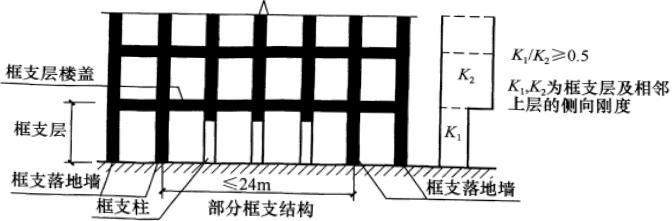

图 13 框支结构示意图

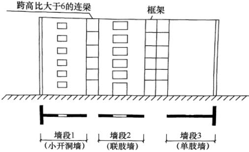

图 14 较长抗震墙的组成示意图

6.1.10 延性抗震墙一般控制在其底部即计算嵌固端以上一定高度范围内屈服、出现塑性铰。设计时，将墙体底部可能出现塑性铰的高度范围作为底部加强部位，提高其受剪承载力，加强其抗震构造措施，使其具有大的弹塑性变形能力，从而提高整个结构的抗地震倒塌能力。

89 规范的底部加强部位与墙肢高度和长度有关，不同长度墙肢的加强部位高度不同。为了简化设计，2001 规范改为底部加强部位的高度仅与墙肢总高度相关。本次修订，将“墙体总高度的 1/8”改为“墙体总高度的 1/10”；明确加强部位的高度一

律从地下室顶板算起；当计算嵌固端位于地面以下时，还需向下延伸，但加强部位的高度仍从地下室顶板算起。

此外，还补充了高度不超过 24m 的多层建筑的底部加强部位高度的规定。

有裙房时，按本规范第6.1.3条的要求，主楼与裙房顶对应的相邻上下层需要加强。此时，加强部位的高度也可以延伸至裙房以上一层。

6.1.12 当地基土较弱，基础刚度和整体性较差，在地震作用下抗震墙基础将产生较大的转动，从而降低了抗震墙的抗侧力刚度，对内力和位移都将产生不利影响。

6.1.13 配合本规范第 4.2.4 条的规定，针对主楼与裙房相连的情况，明确其天然地基底部不宜出现零应力区。

6.1.14 为了能使地下室顶板作为上部结构的嵌固部位，本条规定了地下室顶板和地下一层的设计要求：

地下室顶板必须具有足够的平面内刚度，以有效传递地震基底剪力。地下室顶板的厚度不宜小于180mm，若柱网内设置多个次梁时，板厚可适当减小。这里所指地下室应为完整的地下室，在山（坡）地建筑中出现地下室各边填埋深度差异较大时，宜单独设置支档结构。

框架柱嵌固端屈服时，或抗震墙墙肢的嵌固端屈服时，地下一层对应的框架柱或抗震墙墙肢不应屈服。据此规定了地下一层框架柱纵筋面积和墙肢端部纵筋面积的要求。

“相关范围”一般可从地上结构（主楼、有裙房时含裙房）周边外延不大于20m。

当框架柱嵌固在地下室顶板时，位于地下室顶板的梁柱节点应按首层柱的下端为“弱柱”设计，即地震时首层柱底屈服、出现塑性铰。为实现首层柱底先屈服的设计概念，本规范提供了两种方法：

其一，按下式复核：

 $$ \sum M_{\mathrm{bua}}+M_{\mathrm{cua}}^{\mathrm{t}}\geqslant1.3M_{\mathrm{cua}}^{\mathrm{b}} $$ 

式中： $ \sum M_{bus} $ ——节点左右梁端截面反时针或顺时针方向实配的正截面抗震受弯承载力所对应的弯矩值之和，根据实配钢筋面积（计入梁受压筋和相关楼板钢筋）和材料强度标准值确定；

 $ \sum M_{cu} $ ——地下室柱上端与梁端受弯承载力同一方向实配的正截面抗震受弯承载力所对应的弯矩值，应根据轴力设计值、实配钢筋面积和材料强度标准值等确定；

 $ \sum M_{cua}^{b} $ ——地上一层柱下端与梁端受弯承载力不同方向实配的正截面抗震受弯承载力所对应弯矩值，应根据轴力设计值、实配钢筋面积和材料强度标准值等确定。

设计时，梁柱纵向钢筋增加的比例也可不同，但柱的纵向钢筋至少比地上结构柱下端的钢筋增加10%。

其二，作为简化，当梁按计算分配的弯矩接近柱的弯矩时，地下室顶板的柱上端、梁顶面和梁底面的纵向钢筋均增加10%以上。可满足上式的要求。

6.1.15 本条是新增的。发生强烈地震时，楼梯间是重要的紧急逃生竖向通道，楼梯间（包括楼梯板）的破坏会延误人员撤离及救援工作，从而造成严重伤亡。本次修订增加了楼梯间的抗震设计要求。对于框架结构，楼梯构件与主体结构整浇时，梯板起到斜支撑的作用，对结构刚度、承载力、规则性的影响比较大，应参与抗震计算；当采取措施，如梯板滑动支承于平台板，楼梯构件对结构刚度等的影响较小，是否参与整体抗震计算差别不大。对于楼梯间设置刚度足够大的抗震墙的结构，楼梯构件对结构刚度的影响较小，也可不参与整体抗震计算。

### 6.2 计算要点

6.2.2 框架结构的抗地震倒塌能力与其破坏机制密切相关。试验研究表明，梁端屈服型框架有较大的内力重分布和能量消耗能

力，极限层间位移大，抗震性能较好；柱端屈服型框架容易形成倒塌机制。

在强震作用下结构构件不存在承载力储备，梁端受弯承载力即为实际可能达到的最大弯矩，柱端实际可能达到的最大弯矩也与其偏压下的受弯承载力相等。这是地震作用效应的一个特点。因此，所谓“强柱弱梁”指的是：节点处梁端实际受弯承载力 $ M_{by}^{a} $ 和柱端实际受弯承载力 $ M_{cy}^{a} $ 之间满足下列不等式：

 $$ \Sigma M_{\mathrm{cy}}^{\mathrm{a}}\textgreater\Sigma M_{\mathrm{by}}^{\mathrm{a}} $$ 

这种概念设计，由于地震的复杂性、楼板的影响和钢筋屈服强度的超强，难以通过精确的承载力计算真正实现。

本规范自89规范以来，在梁端实配钢筋不超过计算配筋10%的前提下，将梁、柱之间的承载力不等式转为梁、柱的地震组合内力设计值的关系式，并使不同抗震等级的柱端弯矩设计值有不同程度的差异。采用增大柱端弯矩设计值的方法，只在一定程度上推迟柱端出现塑性铰；研究表明，当计入楼板和钢筋超强影响时，要实现承载力不等式，内力增大系数的取值往往需要大于2。由于地震是往复作用，两个方向的柱端弯矩设计值均要满足要求：当梁端截面为反时针方向弯矩之和时，柱端截面应为顺时针方向弯矩之和；反之亦然。

对于一级框架，89规范除了用增大系数的方法外，还提出了采用梁端实配钢筋面积和材料强度标准值计算的抗震受弯承载力所对应的弯矩值的调整、验算方法。这里，抗震承载力即本规范5章的 $ R_{E}=R/\gamma_{RE}=R/0.75 $ ，此时必须将抗震承载力验算公式取等号转换为对应的内力，即 $ S=R/\gamma_{RE} $ 。当计算梁端抗震受弯承载力时，若计入楼板的钢筋，且材料强度标准值考虑一定的超强系数，则可提高框架“强柱弱梁”的程度。89规范规定，一级的增大系数可根据工程经验估计节点左右梁端顺时针或反时针方向受拉钢筋的实际截面面积与计算面积的比值 $ \lambda_{s}=A_{s}^{a}/A_{s}^{c} $ ，取 $ 1.1\lambda_{s} $ 作为实配增大系数的近似估计，其中的1.1来自钢筋材料标准值与设计值的比值 $ f_{yk}/f_{y} $ 。柱弯矩增大系数值可参考 $ \lambda_{s} $ 的

可能变化范围确定：例如，当梁顶面为计算配筋而梁底面为构造配筋时，一级的  $ \lambda_{s} $  不小于 1.5，于是，柱弯矩增大系数不小于  $ 1.1 \times 1.5 = 1.65 $ ；二级  $ \lambda_{s} $  不小于 1.3，柱弯矩增大系数不小于 1.43。

2001 规范比 89 规范提高了强柱弱梁的弯矩增大系数  $ \eta_{c} $ ，弯矩增大系数  $ \eta_{c} $  考虑了一定的超配钢筋（包括楼板的配筋）和钢筋超强。一级的框架结构及 9 度时，仍应采用框架梁的实际抗震受弯承载力确定柱端组合的弯矩设计值，取二者的较大值。

本次修订，提高了框架结构的柱端弯矩增大系数，而其他结构中框架的柱端弯矩增大系数仍与2001规范相同；并补充了四级框架的柱端弯矩增大系数。对于一级框架结构和9度时的一级框架，明确只需按梁端实配抗震受弯承载力确定柱端弯矩设计值；即使按增大系数的方法比实配方法保守，也可不采用增大系数的方法。对于二、三级框架结构，也可按式（6.2.2-2）的梁端实配抗震受弯承载力确定柱端弯矩设计值，但式中的系数1.2可适当降低，如取1.1即可；这样，有可能比按内力增大系数，即按式（6.2.2-1）调整的方法更经济、合理。计算梁端实配抗震受弯承载力时，还应计入梁两侧有效翼缘范围的楼板。因此，在框架刚度和承载力计算时，所计入的梁两侧有效翼缘范围应相互协调。

即使按“强柱弱梁”设计的框架，在强震作用下，柱端仍有可能出现塑性铰，保证柱的抗地震倒塌能力是框架抗震设计的关键。本规范通过柱的抗震构造措施，使柱具有大的弹塑性变形能力和耗能能力，达到在大震作用下，即使柱端出铰，也不会引起框架倒塌的目标。

当框架底部若干层的柱反弯点不在楼层内时，说明这些层的框架梁相对较弱。为避免在竖向荷载和地震共同作用下变形集中，压屈失稳，柱端弯矩也应乘以增大系数。

对于轴压比小于 0.15 的柱，包括顶层柱在内，因其具有比较大的变形能力，可不满足上述要求；对框支柱，在本规范第

6.2.10 条另有规定。

6.2.3 框架结构计算嵌固端所在层即底层的柱下端过早出现塑性屈服，将影响整个结构的抗地震倒塌能力。嵌固端截面乘以弯矩增大系数是为了避免框架结构柱下端过早屈服。对其他结构中的框架，其主要抗侧力构件为抗震墙，对其框架部分的嵌固端截面，可不作要求。

当仅用插筋满足柱嵌固端截面弯矩增大的要求时，可能造成塑性铰向底层柱的上部转移，对抗震不利。规范提出按柱上下端不利情况配置纵向钢筋的要求。

6.2.4、6.2.5、6.2.8 防止梁、柱和抗震墙底部在弯曲屈服前出现剪切破坏是抗震概念设计的要求，它意味着构件的受剪承载力要大于构件弯曲时实际达到的剪力，即按实际配筋面积和材料强度标准值计算的承载力之间满足下列不等式：

 $$ \begin{aligned}V_{\mathrm{bu}}&>(M_{\mathrm{bu}}^{l}+M_{\mathrm{bu}}^{\mathrm{r}})/l_{\mathrm{bo}}+V_{\mathrm{Gb}}\\V_{\mathrm{cu}}&>(M_{\mathrm{cu}}^{\mathrm{b}}+M_{\mathrm{cu}}^{\mathrm{t}})/H_{\mathrm{cn}}\\V_{\mathrm{wu}}&>(M_{\mathrm{wu}}^{\mathrm{b}}-M_{\mathrm{wu}}^{\mathrm{t}})/H_{\mathrm{wn}}\end{aligned} $$ 

规范在纵向受力钢筋不超过计算配筋10%的前提下，将承载力不等式转为内力设计值表达式，不同抗震等级采用不同的剪力增大系数，使“强剪弱弯”的程度有所差别。该系数同样考虑了材料实际强度和钢筋实际面积这两个因素的影响，对柱和墙还考虑了轴向力的影响，并简化计算。

一级的剪力增大系数，需从上述不等式中导出。直接取实配钢筋面积  $ A_{s}^{a} $  与计算实配筋面积  $ A_{s}^{c} $  之比  $ \lambda_{s} $  的 1.1 倍，是  $ \eta_{v} $  最简单的近似，对梁和节点的“强剪”能满足工程的要求，对柱和墙偏于保守。89 规范在条文说明中给出较为复杂的近似计算公式如下：

 $$ \eta_{vc}\approx\frac{1.1\lambda_{s}+0.58\lambda_{N}(1-0.56\lambda_{N})(f_{c}/f_{y}\rho_{t})}{1.1+0.58\lambda_{N}(1-0.75\lambda_{N})(f_{c}/f_{y}\rho_{t})}\\\eta_{vw}\approx\frac{1.1\lambda_{sw}+0.58\lambda_{N}(1-0.56\lambda_{N}\zeta)(f_{c}/f_{y}\rho_{tw})}{1.1+0.58\lambda_{N}(1-0.75\lambda_{N}\zeta)(f_{c}/f_{y}\rho_{tw})} $$ 

式中， $ \lambda_{N} $  为轴压比， $ \lambda_{sw} $  为墙体实际受拉钢筋（分布筋和集中筋）

截面面积与计算面积之比， $ \zeta $  为考虑墙体边缘构件影响的系数， $ \rho_{tw} $  为墙体受拉钢筋配筋率。

当柱  $ \lambda_{s}\leqslant1.8 $ 、 $ \lambda_{N}\geqslant0.2 $  且  $ \rho_{t}=0.5\%\sim2.5\% $ ，墙  $ \lambda_{sw}\leqslant1.8 $ 、 $ \lambda_{N}\leqslant0.3 $  且  $ \rho_{tw}=0.4\%\sim1.2\% $  时，通过数百个算例的统计分析，能满足工程要求的剪力增大系数  $ \eta_{v} $  的进一步简化计算公式如下：

 $$ \eta_{\mathrm{v c}}\approx0.15+0.7\left[\lambda_{\mathrm{s}}+1/(2.5-\lambda_{\mathrm{N}})\right] $$ 

 $$ \eta_{v w}\approx1.2+(\lambda_{s w}-1)(0.6+0.02/\lambda_{N}) $$ 

2001 规范的框架柱、抗震墙的剪力增大系数  $ \eta_{vc} $ 、 $ \eta_{vw} $ ，即参考上述近似公式确定。此次修订，框架梁、框架结构以外框架的柱、连梁和抗震墙的剪力增大系数与 2001 规范相同，框架结构的柱的剪力增大系数随柱端弯矩增大系数的提高而提高；同时，明确一级的框架结构及 9 度的一级框架，只需满足实配要求，而即使增大系数为偏保守也可不满足。同样，二、三、四级框架结构的框架柱，也可采用实配方法而不采用增大系数的方法，使之较为经济又合理。

注意：柱和抗震墙的弯矩设计值系经本节有关规定调整后的取值；梁端、柱端弯矩设计值之和须取顺时针方向之和以及反时针方向之和两者的较大值；梁端纵向受拉钢筋也按顺时针及反时针方向考虑。

6.2.6 地震时角柱处于复杂的受力状态，其弯矩和剪力设计值的增大系数，比其他柱略有增加，以提高抗震能力。

6.2.7 对一级抗震墙规定调整截面的组合弯矩设计值，目的是通过配筋方式迫使塑性铰区位于墙肢的底部加强部位。89规范要求底部加强部位的组合弯矩设计值均按墙底截面的设计值采用，以上一般部位的组合弯矩设计值按线性变化，对于较高的房屋，会导致与加强部位相邻一般部位的弯矩取值过大。2001规范改为：底部加强部位的弯矩设计值均取墙底部截面的组合弯矩设计值，底部加强部位以上，均采用各墙肢截面的组合弯矩设计值乘以增大系数，但增大后与加强部位紧邻一般部位的弯矩有可能小于相邻加强部位的组合弯矩。本次修订，改为仅加强部位以

上乘以增大系数。主要有两个目的：一是使墙肢的塑性铰在底部加强部位的范围内得到发展，不是将塑性铰集中在底层，甚至集中在底截面以上不大的范围内，从而减轻墙肢底截面附近的破坏程度，使墙肢有较大的塑性变形能力；二是避免底部加强部位紧邻的上层墙肢屈服而底部加强部位不屈服。

当抗震墙的墙肢在多遇地震下出现小偏心受拉时，在设防地震、罕遇地震下的抗震能力可能大大丧失；而且，即使多遇地震下为偏压的墙肢而设防地震下转为偏拉，则其抗震能力有实质性的改变，也需要采取相应的加强措施。

双肢抗震墙的某个墙肢为偏心受拉时，一旦出现全截面受拉开裂，则其刚度退化严重，大部分地震作用将转移到受压墙肢，因此，受压肢需适当增大弯矩和剪力设计值以提高承载能力。注意到地震是往复的作用，实际上双肢墙的两个墙肢，都可能要按增大后的内力配筋。

6.2.9 框架柱和抗震墙的剪跨比可按图 15 及公式进行计算。

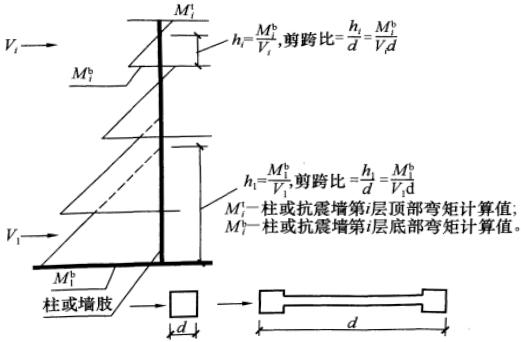

图 15 剪跨比计算简图

6.2.10～6.2.12 这几条规定了部分框支结构设计计算的注意事项。

第 6.2.10 条 1 款的规定，适用于本章 6.1.1 条所指的框支

层不超过2层的情况。本次修订，将本层地震剪力改为底层地震剪力即基底剪力，但主楼与裙房相连时，不含裙房部分的地震剪力，框支柱也不含裙房的框架柱。

框支结构的落地墙，在转换层以下的部位是保证框支结构抗震性能的关键部位，这部位的剪力传递还可能存在矮墙效应。为了保证抗震墙在大震时的受剪承载力，只考虑有拉筋约束部分的混凝土受剪承载力。

无地下室的部分框支抗震墙结构的落地墙，特别是联肢或双肢墙，当考虑不利荷载组合出现偏心受拉时，为了防止墙与基础交接处产生滑移，宜按总剪力的30%设置45°交叉防滑斜筋，斜筋可按单排设在墙截面中部并应满足锚固要求。

6.2.13 本条规定了在结构整体分析中的内力调整：

1 按照框墙结构（不包括少墙框架体系和少框架的抗震墙体系）中框架和墙体协同工作的分析结果，在一定高度以上，框架按侧向刚度分配的剪力与墙体的剪力反号，二者相减等于楼层的地震剪力，此时，框架承担的剪力与底部总地震剪力的比值基本保持某个比例；按多道防线的概念设计要求，墙体是第一道防线，在设防地震、罕遇地震下先于框架破坏，由于塑性内力重分布，框架部分按侧向刚度分配的剪力会比多遇地震下加大。

我国20世纪80年代1/3比例的空间框墙结构模型反复荷载试验及该试验模型的弹塑性分析表明：保持楼层侧向位移协调的情况下，弹性阶段底部的框架仅承担不到5%的总剪力；随着墙体开裂，框架承担的剪力逐步增大；当墙体端部的纵向钢筋开始受拉屈服时，框架承担大于20%总剪力；墙体压坏时框架承担大于33%的总剪力。本规范规定的取值，既体现了多道抗震设防的原则，又考虑了当前的经济条件。对于框架-核心筒结构，尚应符合本规范6.7.1条1款的规定。

此项规定适用于竖向结构布置基本均匀的情况；对塔类结构出现分段规则的情况，可分段调整；对有加强层的结构，不含加强层及相邻上下层的调整。此项规定不适用于部分框架柱不到

顶，使上部框架柱数量较少的楼层。

2 计算地震内力时，抗震墙连梁刚度可折减；计算位移时，连梁刚度可不折减。抗震墙的连梁刚度折减后，如部分连梁尚不能满足剪压比限值，可采用双连梁、多连梁的布置，还可按剪压比要求降低连梁剪力设计值及弯矩，并相应调整抗震墙的墙肢内力。

3 抗震墙应计入腹板与翼墙共同工作。对于翼墙的有效长度，89规范和2001规范有不同的具体规定，本次修订不再给出具体规定。2001规范规定：“每侧由墙面算起可取相邻抗震墙净间距的一半、至门窗洞口的墙长度及抗震墙总高度的15%三者的最小值”，可供参考。

4 对于少墙框架结构，框架部分的地震剪力取两种计算模型的较大值较为妥当。

6.2.14 节点核芯区是保证框架承载力和抗倒塌能力的关键部位。本次修订，增加了三级框架的节点核芯区进行抗震验算的规定。

2001 规范提供了梁宽大于柱宽的框架和圆柱框架的节点核芯区验算方法。梁宽大于柱宽时，按柱宽范围内和范围外分别计算。圆柱的计算公式依据国外资料和国内试验结果提出：

 $$ V_{j}\leqslant\frac{1}{\gamma_{\mathrm{RE}}}\left(1.5\eta_{j}f_{\mathrm{t}}A_{j}+0.05\eta_{j}\frac{N}{D^{2}}A_{j}+1.57f_{\mathrm{yv}}A_{\mathrm{sh}}\frac{h_{\mathrm{b}0}-a_{\mathrm{s}}^{\prime}}{s}\right) $$ 

上式中， $ A_{j} $  为圆柱截面面积， $ A_{sh} $  为核芯区环形箍筋的单根截面面积。去掉  $ \gamma_{RE} $  及  $ \eta_{j} $  附加系数，上式可写为：

 $$ V_{j}\leqslant1.5f_{\mathrm{t}}A_{j}+0.05\frac{N}{D^{2}}A_{j}+1.57f_{\mathrm{yv}}A_{\mathrm{sh}}\frac{h_{\mathrm{b}0}-a_{\mathrm{s}}^{\prime}}{s} $$ 

上式中系数 1.57 来自 ACI Structural Journal, Jan-Feb. 1989, Priestley 和 Paulay 的文章: Seismic strength of circular reinforced concrete columns.

圆形截面柱受剪，环形箍筋所承受的剪力可用下式表达：

 $$ V_{\mathrm{s}}=\frac{\pi A_{\mathrm{sh}}f_{\mathrm{yv}}D^{\prime}}{2s}=1.57f_{\mathrm{yv}}A_{\mathrm{sh}}\frac{D^{\prime}}{s}\approx1.57f_{\mathrm{yv}}A_{\mathrm{sh}}\frac{h_{\mathrm{b}0}-a_{\mathrm{s}}^{\prime}}{s} $$ 

式中： $ A_{sh} $  ——环形箍单肢截面面积；

 $ D' $ ——纵向钢筋所在圆周的直径；

 $ h_{b0} $ ——框架梁截面有效高度；

s——环形箍筋间距。

根据重庆建筑大学 2000 年完成的 4 个圆柱梁柱节点试验，对比了计算和试验的节点核芯区受剪承载力，计算值与试验之比约为 85%，说明此计算公式的可靠性有一定保证。

### 6.3 框架的基本抗震构造措施

6.3.1、6.3.2 合理控制混凝土结构构件的尺寸，是本规范第3.5.4条的基本要求之一。梁的截面尺寸，应从整个框架结构中梁、柱的相互关系，如在强柱弱梁基础上提高梁变形能力的要求等来处理。

为了避免或减小扭转的不利影响，宽扁梁框架的梁柱中线宜重合，并应采用整体现浇楼盖。为了使宽扁梁端部在柱外的纵向钢筋有足够的锚固，应在两个主轴方向都设置宽扁梁。

6.3.3、6.3.4 梁的变形能力主要取决于梁端的塑性转动量，而梁的塑性转动量与截面混凝土相对受压区高度有关。当相对受压区高度为0.25至0.35范围时，梁的位移延性系数可到达3～4。计算梁端截面纵向受拉钢筋时，应采用与柱交界面的组合弯矩设计值，并应计入受压钢筋。计算梁端相对受压区高度时，宜按梁端截面实际受拉和受压钢筋面积进行计算。

梁端底面和顶面纵向钢筋的比值，同样对梁的变形能力有较大影响。梁端底面的钢筋可增加负弯矩时的塑性转动能力，还能防止在地震中梁底出现正弯矩时过早屈服或破坏过重，从而影响承载力和变形能力的正常发挥。

根据试验和震害经验，梁端的破坏主要集中于 $  (1.5 \sim 2.0)  $ 倍梁高的长度范围内；当箍筋间距小于 $ 6d \sim 8d $ （d为纵向钢筋直径）时，混凝土压溃前受压钢筋一般不致压屈，延性较好。因此规定了箍筋加密区的最小长度，限制了箍筋最大肢距；当纵向

受拉钢筋的配筋率超过2%时，箍筋的最小直径相应增大。

本次修订，将梁端纵向受拉钢筋的配筋率不大于2.5%的要求，由强制性改为非强制性，移到6.3.4条。还提高了框架结构梁的纵向受力钢筋伸入节点的握裹要求。

6.3.5 本次修订，根据汶川地震的经验，对一、二、三级且层数超过2层的房屋，增大了柱截面最小尺寸的要求，以有利于实现“强柱弱梁”。

6.3.6 限制框架柱的轴压比主要是为了保证柱的塑性变形能力和保证框架的抗倒塌能力。抗震设计时，除了预计不可能进入屈服的柱外，通常希望框架柱最终为大偏心受压破坏。由于轴压比直接影响柱的截面设计，2001规范仍以89规范的限值为依据，根据不同情况进行适当调整，同时控制轴压比最大值。在框架抗震墙、板柱抗震墙及筒体结构中，框架属于第二道防线，其中框架的柱与框架结构的柱相比，其重要性相对较低，为此可以适当增大轴压比限值。本次修订，将框架结构的轴压比限值减小了0.05，框架抗震墙、板柱抗震墙及筒体中三级框架的柱的轴压比限值也减小了0.05，增加了四级框架的柱的轴压比限值。

利用箍筋对混凝土进行约束，可以提高混凝土的轴心抗压强度和混凝土的受压极限变形能力。但在计算柱的轴压比时，仍取无箍筋约束的混凝土的轴心抗压强度设计值，不考虑箍筋约束对混凝土轴心抗压强度的提高作用。

我国清华大学研究成果和日本 AIJ 钢筋混凝土房屋设计指南都提出，考虑箍筋对混凝土的约束作用时，复合箍筋肢距不宜大于 200mm，箍筋间距不宜大于 100mm，箍筋直径不宜小于 10mm 的构造要求。参考美国 ACI 资料，考虑螺旋箍筋对混凝土的约束作用时，箍筋直径不宜小于 10mm，净螺距不宜大于 75mm。为便于施工，采用螺旋间距不大于 100mm，箍筋直径不小于 12mm。矩形截面柱采用连续矩形复合螺旋箍是一种非常有效的提高延性的措施，这已被西安建筑科技大学的试验研究所证实。根据日本川铁株式会社 1998 年发表的试验报告，相同柱截

面、相同配筋、配箍率、箍距及箍筋肢距，采用连续复合螺旋箍比一般复合箍筋可提高柱的极限变形角25%。采用连续复合矩形螺旋箍可按圆形复合螺旋箍对待。用上述方法提高柱的轴压比后，应按增大的轴压比由本规范表6.3.9确定配箍量，且沿柱全高采用相同的配箍特征值。

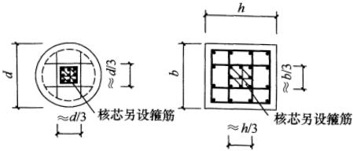

图 16 芯柱尺寸示意图

试验研究和工程经验都证明，在矩形或圆形截面柱内设置矩形核芯柱，不但可以提高柱的受压承载力，还可以提高柱的变形能力。在压、弯、剪作用下，当柱出现弯、剪裂缝，在大变形情况下芯柱可以有效地减小柱的压缩，保持柱的外形和截面承载力，特别对于承受高轴压的短柱，更有利于提高变形能力，延缓倒塌。为了便于梁筋通过，芯柱边长不宜小于柱边长或直径的1/3，且不宜小于250mm（图16）。

6.3.7、6.3.8 柱纵向钢筋的最小总配筋率，89规范的比78规范有所提高，但仍偏低，很多情况小于非抗震配筋率，2001规范适当调整。本次修订，提高了框架结构中柱和边柱纵向钢筋的最小总配筋率的要求。随着高强钢筋和高强混凝土的使用，最小纵向钢筋的配筋率要求，将随混凝土强度和钢筋的强度而有所变化，但表中的数据是最低的要求，必须满足。

当框架柱在地震作用组合下处于小偏心受拉状态时，柱的纵筋总截面面积应比计算值增加25%，是为了避免柱的受拉纵筋屈服后再受压时，由于包兴格效应导致纵筋压屈。

6.3.9 框架柱的弹塑性变形能力，主要与柱的轴压比和箍筋对混凝土的约束程度有关。为了具有大体上相同的变形能力，轴压

比大的柱，要求的箍筋约束程度高。箍筋对混凝土的约束程度，主要与箍筋形式、体积配箍率、箍筋抗拉强度以及混凝土轴心抗压强度等因素有关，而体积配箍率、箍筋强度及混凝土强度三者又可以用配箍特征值表示，配箍特征值相同时，螺旋箍、复合螺旋箍及连续复合螺旋箍的约束程度，比普通箍和复合箍对混凝土的约束更好。因此，规范规定，轴压比大的柱，其配箍特征值大于轴压比低的柱；轴压比相同的柱，采用普通箍或复合箍时的配箍特征值，大于采用螺旋箍、复合螺旋箍或连续复合螺旋箍时的配箍特征值。

89 规范的体积配箍率，是在配箍特征值基础上，对箍筋抗拉强度和混凝土轴心抗压强度的关系做了一定简化得到的，仅适用于混凝土强度在 C35 以下和 HPB235 级钢箍筋。2001 规范直接给出配箍特征值，能够经济合理地反映箍筋对混凝土的约束作用。为了避免配箍率过小，2001 规范还规定了最小体积配箍率。普通箍筋的体积配箍率随轴压比增大而增加的对应关系举例如下：采用符合抗震性能要求的 HRB335 级钢筋且混凝土强度等级大于 C35 时，一、二、三级轴压比分别小于 0.6、0.5 和 0.4 时，体积配箍率取正文中的最小值——分别为 0.8%、0.6% 和 0.4%，轴压比分别超过 0.6、0.5 和 0.4 但在最大轴压比范围内，轴压比每增加 0.1，体积配箍率增加  $ 0.02(f_{c}/f_{y}) \approx 0.0011(f_{c}/16.7) $ ；超过最大轴压比范围，轴压比每增加 0.1，体积配箍率增加  $ 0.03(f_{c}/f_{y}) = 0.0001f_{c} $ 。

本次修订，删除了89规范和2001规范关于复合箍应扣除重叠部分箍筋体积的规定，因重叠部分对混凝土的约束情况比较复杂，如何换算有待进一步研究；箍筋的强度也不限制在标准值400MPa以内。四级框架柱的箍筋加密区的最小体积配箍特征值，与三级框架柱相同。

对于封闭箍筋与两端为135°弯钩的拉筋组成的复合箍，约束效果最好的是拉筋同时钩住主筋和箍筋，其次是拉筋紧靠纵向钢筋并钩住箍筋；当拉筋间距符合箍筋肢距的要求，纵筋与箍筋

有可靠拉结时，拉筋也可紧靠箍筋并钩住纵筋。

考虑到框架柱在层高范围内剪力不变及可能的扭转影响，为避免箍筋非加密区的受剪能力突然降低很多，导致柱的中段破坏，对非加密区的最小箍筋量也作了规定。

箍筋类别参见图 17。

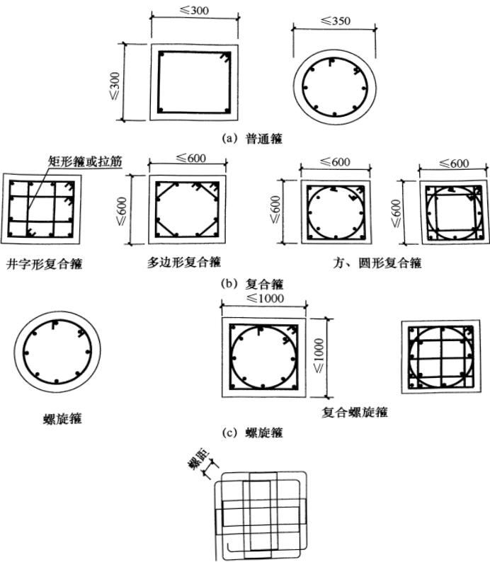

(d) 连续复合螺旋箍（用于矩形截面柱）

图 17 各类箍筋示意图

6.3.10 为使框架的梁柱纵向钢筋有可靠的锚固条件，框架梁柱节点核芯区的混凝土要具有良好的约束。考虑到核芯区内箍筋的作用与柱端有所不同，其构造要求与柱端有所区别。

### 6.4 抗震墙结构的基本抗震构造措施

6.4.1 本次修订，将墙厚与层高之比的要求，由“应”改为“宜”，并增加无支长度的相应规定。无端柱或翼墙是指墙的两端（不包括洞口两侧）为一字形的矩形截面。

试验表明，有边缘构件约束的矩形截面抗震墙与无边缘构件约束的矩形截面抗震墙相比，极限承载力约提高40%，极限层间位移角约增加一倍，对地震能量的消耗能力增大20%左右，且有利于墙板的稳定。对一、二级抗震墙底部加强部位，当无端柱或翼墙时，墙厚需适当增加。

6.4.2 本次修订，将抗震墙的轴压比控制范围，由一、二级扩大到三级，由底部加强部位扩大到全高。计算墙肢轴压力设计值时，不计入地震作用组合，但应取分项系数1.2。

6.4.3 抗震墙，包括抗震墙结构、框架-抗震墙结构、板柱-抗震墙结构及筒体结构中的抗震墙，是这些结构体系的主要抗侧力构件。在强制性条文中，纳入了关于墙体分布钢筋数量控制的最低要求。

美国 ACI 318 规定，当抗震结构墙的设计剪力小于  $ A_{cv}\sqrt{f_{c}} $  （ $ A_{cv} $  为腹板截面面积，该设计剪力对应的剪压比小于 0.02）时，腹板的竖向分布钢筋允许降到同非抗震的要求。因此，本次修订，四级抗震墙的剪压比低于上述数值时，竖向分布筋允许按不小于 0.15% 控制。

对框支结构，抗震墙的底部加强部位受力很大，其分布钢筋应高于一般抗震墙的要求。通过在这些部位增加竖向钢筋和横向的分布钢筋，提高墙体开裂后的变形能力，以避免脆性剪切破坏，改善整个结构的抗震性能。

本次修订，将钢筋最大间距和最小直径的规定，移至本规范

第6.4.4条。

6.4.4 本条包括 2001 规范第 6.4.2 条、6.4.4 条的内容和部分 6.4.3 条的内容，对抗震墙分布钢筋的最大间距和最小直径作了调整。

6.4.5 对于开洞的抗震墙即联肢墙，强震作用下合理的破坏过程应当是连梁首先屈服，然后墙肢的底部钢筋屈服、形成塑性铰。抗震墙墙肢的塑性变形能力和抗地震倒塌能力，除了与纵向配筋有关外，还与截面形状、截面相对受压区高度或轴压比、墙两端的约束范围、约束范围内的箍筋配箍特征值有关。当截面相对受压区高度或轴压比较小时，即使不设约束边缘构件，抗震墙也具有较好的延性和耗能能力。当截面相对受压区高度或轴压比大到一定值时，就需设置约束边缘构件，使墙肢端部成为箍筋约束混凝土，具有较大的受压变形能力。当轴压比更大时，即使设置约束边缘构件，在强烈地震作用下，抗震墙有可能压溃、丧失承担竖向荷载的能力。因此，2001规范规定了一、二级抗震墙在重力荷载代表值作用下的轴压比限值；当墙底截面的轴压比超过一定值时，底部加强部位墙的两端及洞口两侧应设置约束边缘构件，使底部加强部位有良好的延性和耗能能力；考虑到底部加强部位以上相邻层的抗震墙，其轴压比可能仍较大，将约束边缘构件向上延伸一层；还规定了构造边缘构件和约束边缘构件的具体构造要求。

2010年修订的主要内容是：

1 将设置约束边缘构件的要求扩大至三级抗震墙。

2 约束边缘构件的尺寸及其配箍特征值，根据轴压比的大小确定。当墙体的水平分布钢筋满足锚固要求且水平分布钢筋之间设置足够的拉筋形成复合箍时，约束边缘构件的体积配箍率可计入分布筋，考虑水平筋同时为抗剪受力钢筋，且竖向间距往往大于约束边缘构件的箍筋间距，需要另增一道封闭箍筋，故计入的水平分布钢筋的配箍特征值不宜大于0.3倍总配箍特征值。

3 对于底部加强区以上的一般部位，带翼墙时构造边缘构

件的总长度改为与矩形端相同，即不小于墙厚和400mm；转角墙在内侧改为不小于200mm。在加强部位与一般部位的过渡区（可大体取加强部位以上与加强部位的高度相同的范围），边缘构件的长度需逐步过渡。

此次局部修订，补充约束边缘构件的端柱有集中荷载时的设计要求。

6.4.6 当抗震墙的墙肢长度不大于墙厚的 3 倍时，要求应按柱的有关要求进行设计。本次修订，降低了小墙肢的箍筋全高加密的要求。

6.4.7 高连梁设置水平缝，使一根连梁成为大跨高比的两根或多根连梁，其破坏形态从剪切破坏变为弯曲破坏。

### 6.5 框架-抗震墙结构的基本抗震构造措施

6.5.1 框架-抗震墙结构中的抗震墙，是作为该结构体系第一道防线的主要的抗侧力构件，需要比一般的抗震墙有所加强。

其抗震墙通常有两种布置方式：一种是抗震墙与框架分开，抗震墙围成筒，墙的两端没有柱；另一种是抗震墙嵌入框架内，有端柱、有边框梁，成为带边框抗震墙。第一种情况的抗震墙，与抗震墙结构中的抗震墙、筒体结构中的核心筒或内筒墙体区别不大。对于第二种情况的抗震墙，如果梁的宽度大于墙的厚度，则每一层的抗震墙有可能成为高宽比小的矮墙，强震作用下发生剪切破坏，同时，抗震墙给柱端施加很大的剪力，使柱端剪坏，这对抗震倒塌是非常不利的。2005年，日本完成了一个1/3比例的6层2跨、3开间的框架-抗震墙结构模型的振动台试验，抗震墙嵌入框架内。最后，首层抗震墙剪切破坏，抗震墙的端柱剪坏，首层其他柱的两端出塑性铰，首层倒塌。2006年，日本完成了一个足尺的6层2跨、3开间的框架-抗震墙结构模型的振动台试验。与1/3比例的模型相比，除了模型比例不同外，嵌入框架内的抗震墙采用开缝墙。最后，首层开缝墙出现弯曲破坏和剪切斜裂缝，没有出现首层倒塌的破坏现象。

本次修订，对墙厚与层高之比的要求，由“应”改为“宜”；对于有端柱的情况，不要求一定设置边框梁。

6.5.2 本次修订，增加了抗震墙分布钢筋的最小直径和最大间距的规定，拉筋具体配置方式的规定可参照本规范第6.4.4条。

6.5.3 楼面梁与抗震墙平面外连接，主要出现在抗震墙与框架分开布置的情况。试验表明，在往复荷载作用下，锚固在墙内的梁的纵筋有可能产生滑移，与梁连接的墙面混凝土有可能拉脱。

6.5.4 少墙框架结构中抗震墙的地位不同于框架-抗震墙，不需要按本节的规定设计其抗震墙。

### 6.6 板柱-抗震墙结构抗震设计要求

6.6.2 规定了板柱-抗震墙结构中抗震墙的最小厚度；放松了楼、电梯洞口周边设置边框梁的要求。按柱纵筋直径16倍控制托板或柱帽根部的厚度是为了保证板柱节点的抗弯刚度。

6.6.3 本次修订，对高度不超过 12m 的板柱-抗震墙结构，放松抗震墙所承担的地震剪力的要求；新增板柱节点冲切承载力的抗震验算要求。

无柱帽平板在柱上板带中按本规范要求设置构造暗梁时，不可把平板作为有边梁的双向板进行设计。

6.6.4 为了防止强震作用下楼板脱落，穿过柱截面的板底两个方向钢筋的受拉承载力应满足该层楼板重力荷载代表值作用下的柱轴压力设计值。试验研究表明，抗剪栓钉的抗冲切效果优于抗冲切钢筋。

### 6.7 筒体结构抗震设计要求

6.7.1 本条新增框架-核心筒结构框架部分地震剪力的要求，以避免外框太弱。框架-核心筒结构框架部分的地震剪力应同时满足本条与第6.2.13条的规定。

框架-核心筒结构的核心筒与周边框架之间采用梁板结构时，各层梁对核心筒有一定的约束，可不设加强层，梁与核心筒连接

应避开核心筒的连梁。当楼层采用平板结构且核心筒较柔，在地震作用下不能满足变形要求，或筒体由于受弯产生拉力时，宜设置加强层，其部位应结合建筑功能设置。为了避免加强层周边框架柱在地震作用下由于强梁带来的不利影响，加强层的大梁或桁架与周边框架不宜刚性连接。9度时不应采用加强层。核心筒的轴向压缩及外框架的竖向温度变形对加强层产生附加内力，在加强层与周边框架柱之间采取后浇连接及有效的外保温措施是必要的。

筒中筒结构的外筒可采取下列措施提高延性：

1 采用非结构幕墙。当采用钢筋混凝土裙墙时，可在裙墙与柱连接处设置受剪控制缝。

2 外筒为壁式筒体时，在裙墙与窗间墙连接处设置受剪控制缝，外筒按联肢抗震墙设计；三级的壁式筒体可按壁式框架设计，但壁式框架柱除满足计算要求外，尚需满足本章第6.4.5条的构造要求；支承大梁的壁式筒体在大梁支座宜设置壁柱，一级时，由壁柱承担大梁传来的全部轴力，但验算轴压比时仍取全部截面。

3 受剪控制缝的构造如图 18 所示。

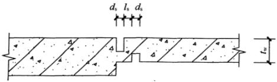

缝宽  $ d_{s} $  大于 5mm；两缝间距  $ l_{s} $  大于 50mm

图 18 外筒裙墙受剪控制缝构造

6.7.2 框架-核心筒结构的核心筒、筒中筒结构的内筒，都是由抗震墙组成的，也都是结构的主要抗侧力竖向构件，其抗震构造措施应符合本章第6.4节和第6.5节的规定，包括墙的最小厚度、分布钢筋的配置、轴压比限值、边缘构件的要求等，以使简体具有足够大的抗震能力。

框架-核心筒结构的框架较弱，宜加强核心筒的抗震能力；核心筒连梁的跨高比一般较小，墙的整体作用较强。因此，核心筒角部的抗震构造措施予以加强。

6.7.4 试验表明，跨高比小的连梁配置斜向交叉暗柱，可以改善其的抗剪性能，但施工比较困难，本次修订，将2001规范设置交叉暗柱、交叉构造钢筋的要求，由“宜”改为“可”。

# 7 多层砌体房屋和底部框架砌体房屋

### 7.1 一般规定

7.1.1 考虑到黏土砖被限用，本章的适用范围由黏土砖砌体改为各类砖砌体，包括非黏土烧结砖、蒸压砖砌体，并增加混凝土类砖，该类砖已有产品国标。对非黏土烧结砖和蒸压砖，仍按2001规范的规定依据其抗剪强度区别对待。

对于配筋混凝土小砌块承重房屋的抗震设计，仍然在本规范的附录 F 中予以规定。

本次修订，明确本章的规定，原则上也可用于单层非空旷砌体房屋的抗震设计。

砌体结构房屋抗震设计的适用范围，随国家经济的发展而不断改变。89规范删去了“底部内框架砖房”的结构形式；2001规范删去了混凝土中型砌块和粉煤灰中型砌块的规定，并将“内框架砖房”限制于多排柱内框架；本次修订，考虑到“内框架砖房”已很少使用且抗震性能较低，取消了相关内容。

7.1.2 砌体房屋的高度限制，是十分敏感且深受关注的规定。基于砌体材料的脆性性质和震害经验，限制其层数和高度是主要的抗震措施。

多层砖房的抗震能力，除依赖于横墙间距、砖和砂浆强度等级、结构的整体性和施工质量等因素外，还与房屋的总高度有直接的联系。

历次地震的宏观调查资料说明：二、三层砖房在不同烈度区的震害，比四、五层的震害轻得多，六层及六层以上的砖房在地震时震害明显加重。海城和唐山地震中，相邻的砖房，四、五层的比二、三层的破坏严重，倒塌的百分比亦高得多。

国外在地震区对砖结构房屋的高度限制较严。不少国家在7

度及以上地震区不允许采用无筋砖结构，前苏联等国对配筋和无筋砖结构的高度和层数作了相应的限制。结合我国具体情况，砌体房屋的高度限制是指设置了构造柱的房屋高度。

多层砌块房屋的总高度限制，主要是依据计算分析、部分震害调查和足尺模型试验，并参照多层砖房确定的。

2008 局部修订时，补充了属于乙类的多层砌体结构房屋按当地设防烈度查表 7.1.2 的高度和层数控制要求。本条在 2008 年局部修订基础上作下列变动：

1 偏于安全，6 度的普通砖砌体房屋的高度和层数适当降低。

2 明确补充规定了 7 度（0.15g）和 8 度（0.30g）的高度和层数限值。

3 底部框架-抗震墙砌体房屋，不允许用于乙类建筑和8度（0.3g）的丙类建筑。表7.1.2中底部框架-抗震墙砌体房屋的最小砌体墙厚系指上部砌体房屋部分。

4 横墙较少的房屋，按规定的措施加强后，总层数和总高度不变的适用范围，比2001规范有所调整：扩大到丙类建筑；根据横墙较少砖砌体房屋的试设计结果，当砖墙厚度为240mm时，7度（0.1g和0.15g）纵横墙计算承载力基本满足；8度（0.2g）六层时纵墙承载力大多不能满足，五层时部分纵墙承载力不满足；8度（0.3g）五层时纵横墙承载力均不能满足要求。故本次修订，规定仅6、7度时允许总层数和总高度不降低。

5 补充了横墙很少的多层砌体房屋的定义。对各层横墙很少的多层砌体房屋，其总层数应比横墙较少时再减少一层，由于层高的限值，总高度也有所降低。

需要注意：

表 7.1.2 的注 2 表明，房屋高度按有效数字控制。当室内外高差不大于 0.6m 时，房屋总高度限值按表中数据的有效数字控制，则意味着可比表中数据增加 0.4m；当室内外高差大于 0.6m 时，虽然房屋总高度允许比表中的数据增加不多于 1.0m，实际

上其增加量只能少于0.4m。

坡屋面阁楼层一般仍需计入房屋总高度和层数；但属于本规范第5.2.4条规定的出屋面小建筑范围时，不计入层数和高度的控制范围。斜屋面下的“小建筑”通常按实际有效使用面积或重力荷载代表值小于顶层30%控制。

对于半地下室和全地下室的嵌固条件，仍与2001规范相同。

7.1.3 本条在2008局部修订中作了修改，以适应教学楼等需要层高3.9m的使用要求。约束砌体，大体上指间距接近层高的构造柱与圈梁组成的砌体、同时拉结网片符合相应的构造要求，可参见本规范第7.3.14、7.5.4、7.5.5条等。

对于采用约束砌体抗震墙的底框房屋，根据试设计结果，底层的层高也比2001规范有所减少。

7.1.4 若砌体房屋考虑整体弯曲进行验算，目前的方法即使在7度时，超过三层就不满足要求，与大量的地震宏观调查结果不符。实际上，多层砌体房屋一般可以不做整体弯曲验算，但为了保证房屋的稳定性，限制了其高宽比。

7.1.5 多层砌体房屋的横向地震力主要由横墙承担，地震中横墙间距大小对房屋倒塌影响很大，不仅横墙需具有足够的承载力，而且楼盖须具有传递地震力给横墙的水平刚度，本条规定是为了满足楼盖对传递水平地震力所需的刚度要求。

对于多层砖房，历来均沿用78规范的规定；对砌块房屋则参照多层砖房给出，且不宜采用木楼、屋盖。

纵墙承重的房屋，横墙间距同样应满足本条规定。

地震中，横墙间距大小对房屋倒塌影响很大，本次修订，考虑到原规定的抗震横墙最大间距在实际工程中一般也不需要这么大，故减小（2～3）m。

鉴于基本不采用木楼盖，将“木楼、屋盖”改为“木屋盖”。

多层砌体房屋顶层的横墙最大间距，在采用钢筋混凝土屋盖时允许适当放宽，大致指大房间平面长宽比不大于2.5，最大抗震横墙间距不超过表7.1.5中数值的1.4倍及18m。此时，抗震

横墙除应满足抗震承载力计算要求外，相应的构造柱需要加强并至少向下延伸一层。

7.1.6 砌体房屋局部尺寸的限制，在于防止因这些部位的失效，而造成整栋结构的破坏甚至倒塌，本条系根据地震区的宏观调查资料分析规定的，如采用另增设构造柱等措施，可适当放宽。本次修订进一步明确了尺寸不足的小墙段的最小值限制。

外墙尽端指，建筑物平面凸角处（不包括外墙总长的中部局部凸折处）的外墙端头，以及建筑物平面凹角处（不包括外墙总长的中部局部凹折处）未与内墙相连的外墙端头。

7.1.7 本条对多层砌体房屋的建筑布置和结构体系作了较详细的规定，是对本规范第3章关于建筑结构规则布置的补充。

根据历次地震调查统计，纵墙承重的结构布置方案，因横向支承较少，纵墙较易受弯曲破坏而导致倒塌，为此，要优先采用横墙承重的结构布置方案。

纵横墙均匀对称布置，可使各墙垛受力基本相同，避免薄弱部位的破坏。

震害调查表明，不设防震缝造成的房屋破坏，一般多只是局部的，在7度和8度地区，一些平面较复杂的一、二层房屋，其震害与平面规则的同类房屋相比，并无明显的差别，同时，考虑到设置防震缝所耗的投资较多，所以89规范以来，对设置防震缝的要求比78规范有所放宽。

楼梯间墙体缺少各层楼板的侧向支承，有时还因为楼梯踏步削弱楼梯间的墙体，尤其是楼梯间顶层，墙体有一层半楼层的高度，震害加重。因此，在建筑布置时尽量不设在尽端，或对尽端开间采取专门的加强措施。

本次修订，除按2008年局部修订外，有关烟道、预制挑檐板移入第13章。对建筑结构体系的规则性增加了下列要求：

1 为保证房屋纵向的抗震能力，并根据本规范第3.5.3条两个主轴方向振动特性不宜相差过大的要求，规定多层砌体的纵横向墙体数量不宜相差过大，在房屋宽度的中部（约1/3宽度范

围）应有内纵墙，且多道内纵墙开洞后累计长度不宜小于房屋纵向长度的60%。“宜”表示，当房屋层数很少时，还可比60%适当放宽。

2 避免采用混凝土墙与砌体墙混合承重的体系，防止不同材料性能的墙体被各个击破。

3 房屋转角处不应设窗，避免局部破坏严重。

4 根据汶川地震的经验，外纵墙体开洞率不应过大，宜按55%左右控制。

5 明确砌体结构的楼板外轮廓、开大洞、较大错层等不规则的划分，以及设计要求。考虑到砌体墙的抗震性能不及混凝土墙，相应的不规则界限比混凝土结构有所加严。

6 本条规定同一轴线（直线或弧线）上的窗间墙宽度宜均匀，包括与同一直线或弧线上墙段平行错位净距离不超过2倍墙厚的墙段上的窗间墙（此时错位处两墙段之间连接墙的厚度不应小于外墙厚度），在满足本规范第7.1.6条的局部尺寸要求的情况下，墙体的立面开洞率亦应进行控制。

7.1.8 本次修订，将 2001 规范 “基本对齐” 明确为 “除楼梯间附近的个别墙段外”，并明确上部砌体侧向刚度应计入构造柱影响的要求。

底层采用砌体抗震墙的情况，仅允许用于6度设防时，且明确应采用约束砌体加强，但不应采用约束多孔砖砌体，有关的构造要求见本章第7.5节；6、7度时，也允许采用配筋小砌块墙体。还需注意，砌体抗震墙应对称布置，避免或减少扭转效应，不作为抗震墙的砌体墙，应按填充墙处理，施工时后砌。

底部抗震墙的基础，不限定具体的基础形式，明确为“整体性好的基础”。

7.1.9 底部框架-抗震墙房屋的钢筋混凝土结构部分，其抗震要求原则上均应符合本规范第6章的要求，抗震等级与钢筋混凝土结构的框支层相当。但考虑到底部框架-抗震墙房屋高度较低，底部的钢筋混凝土抗震墙应按低矮墙或开竖缝设计，构造上有所区别。

### 7.2 计算要点

7.2.1 砌体房屋层数不多，刚度沿高度分布一般比较均匀，并以剪切变形为主，因此可采用底部剪力法计算。底部框架-抗震墙房屋属于竖向不规则结构，层数不多，仍可采用底部剪力法简化计算，但应考虑一系列的地震作用效应调整，使之较符合实际。

自承重墙体（如横墙承重方案中的纵墙等），如按常规方法进行抗震验算，往往比承重墙还要厚，但抗震安全性的要求可以考虑降低，为此，利用 $ \gamma_{RE} $ 适当调整。

7.2.2 根据一般的设计经验，抗震验算时，只需对纵、横向的不利墙段进行截面验算，不利墙段为：①承担地震作用较大的；②竖向压应力较小的；③局部截面较小的墙段。

7.2.3 在楼层各墙段间进行地震剪力的分配和截面验算时，根据层间墙段的不同高宽比（一般墙段和门窗洞边的小墙段，高宽比按本条“注”的方法分别计算），分别按剪切或弯剪变形同时考虑，较符合实际情况。

砌体的墙段按门窗洞口划分、小开口墙等效刚度的计算方法等内容同2001规范。

本次修订明确，关于开洞率的定义及适用范围，系参照原行业标准《设置钢筋混凝土构造柱多层砖房抗震技术规程》JGJ/T 13的相关内容得到的，该表仅适用于带构造柱的小开口墙段。当本层门窗过梁及以上墙体的合计高度小于层高的20%时，洞口两侧应分为不同的墙段。

7.2.4、7.2.5 底部框架-抗震墙砌体房屋是我国现阶段经济条件下特有的一种结构。强烈地震的震害表明，这类房屋设计不合理时，其底部可能发生变形集中，出现较大的侧移而破坏，甚至坍塌。近十多年来，各地进行了许多试验研究和分析计算，对这类结构有进一步的认识。但总体上仍需持谨慎的态度。其抗震计算上需注意：

1 继续保持 2001 规范对底层框架-抗震墙砌体房屋地震作用效应调整的要求。按第二层与底层侧移刚度的比例相应地增大底层的地震剪力，比例越大，增加越多，以减少底层的薄弱程度。通常，增大系数可依据刚度比用线性插值法近似确定。

底层框架-抗震墙砌体房屋，二层以上全部为砌体墙承重结构，仅底层为框架-抗震墙结构，水平地震剪力要根据对应的单层的框架-抗震墙结构中各构件的侧移刚度比例，并考虑塑性内力重分布来分配。

作用于房屋二层以上的各楼层水平地震力对底层引起的倾覆力矩，将使底层抗震墙产生附加弯矩，并使底层框架柱产生附加轴力。倾覆力矩引起构件变形的性质与水平剪力不同，本次修订，考虑实际运算的可操作性，近似地将倾覆力矩在底层框架和抗震墙之间按它们的有效侧移刚度比例分配。需注意，框架部分的倾覆力矩近似按有效侧向刚度分配计算，所承担的倾覆力矩略偏少。

2 底部两层框架-抗震墙砌体房屋的地震作用效应调整原则，同底层框架-抗震墙砌体房屋。

3 该类房屋底部托墙梁在抗震设计中的组合弯矩计算方法：

考虑到大震时墙体严重开裂，托墙梁与非抗震的墙梁受力状态有所差异，当按静力的方法考虑两端框架柱落地的托梁与上部墙体组合作用时，若计算系数不变会导致不安全，应调整计算参数。作为简化计算，偏于安全，在托墙梁上部各层墙体不开洞和跨中1/3范围内开一个洞口的情况，也可采用折减荷载的方法：托墙梁弯矩计算时，由重力荷载代表值产生的弯矩，四层以下全部计入组合，四层以上可有所折减，取不小于四层的数值计入组合；对托墙梁剪力计算时，由重力荷载产生的剪力不折减。

4 本次修订，增加考虑楼盖平面内变形影响的要求。

7.2.6 砌体材料抗震强度设计值的计算，继续保持 89 规范的规定：

地震作用下砌体材料的强度指标，因不同于静力，宜单独给

出。其中砖砌体强度是按震害调查资料综合估算并参照部分试验给出的，砌块砌体强度则依据试验。为了方便，当前仍继续沿用静力指标。但是，强度设计值和标准值的关系则是针对抗震设计的特点按《统一标准》可靠度分析得到的，并采用调整静强度设计值的形式。

关于砌体结构抗剪承载力的计算，有两种半理论半经验的方法——主拉和剪摩。在砂浆等级＞M2.5且在 $ 1<\sigma_{0}/f_{v}\leq4 $ 时，两种方法结果相近。本规范采用正应力影响系数的形式，将两种方法用同样的表达方式给出。

对砖砌体，此系数与89规范相同，继续沿用78规范的方法，采用在震害统计基础上的主拉公式得到，以保持规范的延续性：

 $$ \zeta_{\mathrm{N}}=\frac{1}{1.2}\sqrt{1+0.45\sigma_{0}/f_{\mathrm{v}}} $$ 

对于混凝土小砌块砌体，其  $ f_{v} $  较低， $ \sigma_{0}/f_{v} $  相对较大，两种方法差异也大，震害经验又较少，根据试验资料，正应力影响系数由剪摩公式得到：

 $$ \zeta_{\mathrm{N}}=1+0.23\sigma_{0}/f_{\mathrm{v}}\qquad(\sigma_{0}/f_{\mathrm{v}}\leqslant6.5) $$ 

 $$ \zeta_{\mathrm{N}}=1.52+0.15\sigma_{0}/f_{\mathrm{v}}\quad(6.5<\sigma_{0}/f_{\mathrm{v}}\leqslant16) $$ 

本次修订，根据砌体规范  $ f_{v} $  取值的变化，对表内数据作了调整，使  $ f_{vE} $  与  $ \sigma_{0} $  的函数关系基本不变。根据有关试验资料，当  $ \sigma_{0}/f_{v} \geqslant 16 $  时，小砌块砌体的正应力影响系数如仍按剪摩公式线性增加，则其值偏高，偏于不安全。因此当  $ \sigma_{0}/f_{v} $  大于 16 时，小砌块砌体的正应力影响系数都按  $ \sigma_{0}/f_{v} = 16 $  时取 3.92。

7.2.7 继续沿用了 2001 规范关于设置构造柱墙段抗震承载力验算方法：

一般情况下，构造柱仍不以显式计入受剪承载力计算中，抗震承载力验算的公式与89规范完全相同。

当构造柱的截面和配筋满足一定要求后，必要时可采用显

式计入墙段中部位置处构造柱对抗震承载力的提高作用。有关构造柱规程、地方规程和有关的资料，对计入构造柱承载力的计算方法有三种：其一，换算截面法，根据混凝土和砌体的弹性模量比折算，刚度和承载力均按同一比例换算，并忽略钢筋的作用；其二，并联叠加法，构造柱和砌体分别计算刚度和承载力，再将二者相加，构造柱的受剪承载力分别考虑了混凝土和钢筋的承载力，砌体的受剪承载力还考虑了小间距构造柱的约束提高作用；其三，混合法，构造柱混凝土的承载力以换算截面并入砌体截面计算受剪承载力，钢筋的作用单独计算后再叠加。在三种方法中，对承载力抗震调整系数 $ \gamma_{RE} $ 的取值各有不同。由于不同的方法均根据试验成果引入不同的经验修正系数，使计算结果彼此相差不大，但计算基本假定和概念在理论上不够理想。

收集了国内许多单位所进行的一系列两端设置、中间设置1～3根构造柱及开洞砖墙体，并有不同截面、不同配筋、不同材料强度的试验成果，通过累计百余个试验结果的统计分析，结合混凝土构件抗剪计算方法，提出了抗震承载力简化计算公式。此简化公式的主要特点是：

（1）墙段两端的构造柱对承载力的影响，仍按89规范仅采用承载力抗震调整系数 $ \gamma_{RE} $ 反映其约束作用，忽略构造柱对墙段刚度的影响，仍按门窗洞口划分墙段，使之与现行国家标准的方法有延续性。

（2）引入中部构造柱参与工作系数及构造柱对墙体的约束修正系数，本次修订时该系数取1.1时的构造柱间距由2001规范的不大于2.8m调整为3.0m，以和7.3.14条的构造措施相对应。

（3）构造柱的承载力分别考虑了混凝土和钢筋的抗剪作用，但不能随意加大混凝土的截面和钢筋的用量。

（4）该公式是简化方法，计算的结果与试验结果相比偏于保守，供必要时利用。

横墙较少房屋及外纵墙的墙段计入其中部构造柱参与工作，抗震承载力可有所提高。

砖砌体横向配筋的抗剪验算公式是根据试验资料得到的。钢筋的效应系数随墙段高宽比在0.07～0.15之间变化，水平配筋的适用范围是0.07%～0.17%。

本次修订，增加了同时考虑水平钢筋和中部构造柱对墙体受剪承载力贡献的简化计算方法。

7.2.8 混凝土小砌块的验算公式，系根据混凝土小砌块技术规程的基础资料，无芯柱时取  $ \gamma_{RE}=1.0 $  和  $ \zeta_{c}=0.0 $ ，有芯柱时取  $ \gamma_{RE}=0.9 $ ，按《统一标准》的原则要求分析得到的。

2001 规范修订时进行了同时设置芯柱和构造柱的墙片试验。结果发现，只要把式（7.2.8）的芯柱截面（ $ 120mm \times 120mm $ ）用构造柱截面（如  $ 180mm \times 240mm $ ）替代，芯柱钢筋截面（如  $ 1\phi12 $ ）用构造柱钢筋（如  $ 4\phi12 $ ）替代，则计算结果与试验结果基本一致。于是，2001 规范对式（7.2.8）的适用范围作了调整，也适用于同时设置芯柱和构造柱的情况。

7.2.9 底层框架-抗震墙房屋中采用砖砌体作为抗震墙时，砖墙和框架成为组合的抗侧力构件，直接引用89规范在试验和震害调查基础上提出的抗侧力砖填充墙的承载力计算方法。由砖抗震墙-周边框架所承担的地震作用，将通过周边框架向下传递，故底层砖抗震墙周边的框架柱还需考虑砖墙的附加轴向力和附加剪力。

本次修订，比2001版增加了底框房屋采用混凝土小砌块的约束砌体抗震墙承载力验算的内容。这类由混凝土边框与约束砌体墙组成的抗震构件，在满足上下层刚度比2.5的前提下，数量较少而需承担全楼层100%的地震剪力（6度时约为全楼总重力的4%）。因此，虽然仅适用于6度设防，为判断其安全性，仍应进行抗震验算。

### 7.3 多层砖砌体房屋抗震构造措施

7.3.1、7.3.2 钢筋混凝土构造柱在多层砖砌体结构中的应用，

根据历次大地震的经验和大量试验研究，得到了比较一致的结论，即：①构造柱能够提高砌体的受剪承载力10%～30%左右，提高幅度与墙体高宽比、竖向压力和开洞情况有关；②构造柱主要是对砌体起约束作用，使之有较高的变形能力；③构造柱应当设置在震害较重、连接构造比较薄弱和易于应力集中的部位。

本次修订继续保持2001规范的规定，根据房屋的用途、结构部位、烈度和承担地震作用的大小来设置构造柱。当房屋高度接近本规范表7.1.2的总高度和层数限值时，纵、横墙中构造柱间距的要求不变。对较长的纵、横墙需有构造柱来加强墙体的约束和抗倒塌能力。

由于钢筋混凝土构造柱的作用主要在于对墙体的约束，构造上截面不必很大，但需与各层纵横墙的圈梁或现浇楼板连接，才能发挥约束作用。

为保证钢筋混凝土构造柱的施工质量，构造柱须有外露面。一般利用马牙槎外露即可。

当 6、7 度房屋的层数少于本规范表 7.2.1 规定时，如 6 度二、三层和 7 度二层且横墙较多的丙类房屋，只要合理设计、施工质量好，在地震时可到达预期的设防目标，本规范对其构造柱设置未作强制性要求。注意到构造柱有利于提高砌体房屋抗地震倒塌能力，这些低层、小规模且设防烈度低的房屋，可根据具体条件和可能适当设置构造柱。

2008年局部修订时，增加了不规则平面的外墙对应转角（凸角）处设置构造柱的要求；楼梯斜段上下端对应墙体处增加四根构造柱，与在楼梯间四角设置的构造柱合计有八根构造柱，再与本规范7.3.8条规定的楼层半高的钢筋混凝土带等可组成应急疏散安全岛。

本次修订，在2008年局部修订的基础上作下列修改：

① 文字修改，明确适用于各类砖砌体，包括蒸压砖、烧结砖和混凝土砖。

② 对横墙很少的多层砌体房屋，明确按增加二层的层数设

置构造柱。

③ 调整了 6 度设防时 7 层砖房的构造柱设置要求。

④ 提高了隔 15m 内横墙与外纵墙交接处设置构造柱的要求，调整至 12m；同时增加了楼梯间对应的另一侧内横墙与外纵墙交接处设置构造柱的要求。间隔 12m 和楼梯间相对的内外墙交接处的要求二者取一。

⑤ 增加了较大洞口的说明。对于内外墙交接处的外墙小墙段，其两端存在较大洞口时，在内外墙交接处按规定设置构造柱，考虑到施工时难以在一个不大的墙段内设置三根构造柱，墙段两端可不再设置构造柱，但小墙段的墙体需要加强，如拉结钢筋网片通长设置，间距加密。

⑥ 原规定拉结筋每边伸入墙内不小于1m，构造柱间距4m，中间只剩下2m无拉结筋。为加强下部楼层墙体的抗震性能，本次修订将下部楼层构造柱间的拉结筋贯通，拉结筋与 $ \phi4 $ 钢筋在平面内点焊组成拉结网片，提高抗倒塌能力。

7.3.3、7.3.4 圈梁能增强房屋的整体性，提高房屋的抗震能力，是抗震的有效措施，本次修订，提高了对楼层内横墙圈梁间距的要求，以增强房屋的整体性能。

74、78规范根据震害调查结果，明确现浇钢筋混凝土楼盖不需要设置圈梁。89规范和2001规范均规定，现浇或装配整体式钢筋混凝土楼、屋盖与墙体有可靠连接的房屋，允许不另设圈梁，但为加强砌体房屋的整体性，楼板沿抗震墙体周边均应加强配筋并应与相应的构造柱钢筋可靠连接。

圈梁的截面和配筋等构造要求，与2001规范保持一致。

7.3.5、7.3.6 砌体房屋楼、屋盖的抗震构造要求，包括楼板搁置长度，楼板与圈梁、墙体的拉结，屋架（梁）与墙、柱的锚固、拉结等等，是保证楼、屋盖与墙体整体性的重要措施。

本次修订，在2008年局部修订的基础上，提高了6～8度时预制板相互拉结的要求，同时取消了独立砖柱的做法。在装配式楼板伸入墙（梁）内长度的规定中，明确了硬架支模的做法（硬

架支模的施工方法是：先架设梁或圈梁的模板，再将预制楼板支承在具有一定刚度的硬支架上，然后浇筑梁或圈梁、现浇叠合层等的混凝土）。

组合砌体的定义见砌体设计规范。

7.3.7 由于砌体材料的特性，较大的房间在地震中会加重破坏程度，需要局部加强墙体的连接构造要求。本次修订，将拉结筋的长度改为通长，并明确为拉结网片。

7.3.8 历次地震震害表明，楼梯间由于比较空旷常常破坏严重，必须采取一系列有效措施。本条在2008年局部修订时改为强制性条文。本次修订增加8、9度时不应采用装配式楼梯段的要求。

突出屋顶的楼、电梯间，地震中受到较大的地震作用，因此在构造措施上也需要特别加强。

7.3.9 坡屋顶与平屋顶相比，震害有明显差别。硬山搁檩的做法不利于抗震，2001规范修订提高了硬山搁檩的构造要求。屋架的支撑应保证屋架的纵向稳定。出入口处要加强屋盖构件的连接和锚固，以防脱落伤人。

7.3.10 砌体结构中的过梁应采用钢筋混凝土过梁，本次修订，明确不能采用砖过梁，不论是配筋还是无筋。

7.3.11 预制的悬挑构件，特别是较大跨度时，需要加强与现浇构件的连接，以增强稳定性。本次修订，对预制阳台的限制有所加严。

7.3.12 本次修订，将 2001 规范第 7.1.7 条有关风道等非结构构件的规定移入第 13 章。

7.3.13 房屋的同一独立单元中，基础底面最好处于同一标高，否则易因地面运动传递到基础不同标高处而造成震害。如有困难时，则应设基础圈梁并放坡逐步过渡，不宜有高差上的过大突变。

对于软弱地基上的房屋，按本规范第3章的原则，应在外墙及所有承重墙下设置基础圈梁，以增强抵抗不均匀沉陷和加强房屋基础部分的整体性。

7.3.14 本条对应于本规范第7.1.2条第3款，2001规范规定为住宅类房屋，本次修订扩大为所有丙类建筑中横墙较少的多层砌体房屋（6、7度时）。对于横墙间距大于4.2m的房间超过楼层总面积40%且房屋总高度和层数接近本章表7.1.2规定限值的砌体房屋，其抗震设计方法大致包括以下方面：

（1）墙体的布置和开洞大小不妨碍纵横墙的整体连接的要求；

（2）楼、屋盖结构采用现浇钢筋混凝土板等加强整体性的构造要求；

（3）增设满足截面和配筋要求的钢筋混凝土构造柱并控制其间距、在房屋底层和顶层沿楼层半高处设置现浇钢筋混凝土带，并增大配筋数量，以形成约束砌体墙段的要求；

（4）按本规范7.2.7条第3款计入墙段中部钢筋混凝土构造柱的承载力。

本次修订，根据试设计结果，要求横墙较少时构造柱的间距，纵横墙均不大于3m。

### 7.4 多层砌块房屋抗震构造措施

7.4.1、7.4.2 为了增加混凝土小型空心砌块砌体房屋的整体性和延性，提高其抗震能力，结合空心砌块的特点，规定了在墙体的适当部位设置钢筋混凝土芯柱的构造措施。这些芯柱设置要求均比砖房构造柱设置严格，且芯柱与墙体的连接要采用钢筋网片。

芯柱伸入室外地面下 500mm，地下部分为砖砌体时，可采用类似于构造柱的方法。

本次修订，按多层砖房的本规范表7.3.1的要求，增加了楼、电梯间的芯柱或构造柱的布置要求；并补充9度的设置要求。

砌块房屋墙体交接处、墙体与构造柱、芯柱的连接，均要设钢筋网片，保证连接的有效性。本次修订，将原7.4.5条有关拉结钢筋网片设置要求调整至本规范第7.4.2、7.4.3条中。要求

拉结钢筋网片沿墙体水平通长设置。为加强下部楼层墙体的抗震性能，将下部楼层墙体的拉结钢筋网片沿墙高的间距加密，提高抗倒塌能力。

7.4.3 本条规定了替代芯柱的构造柱的基本要求，与砖房的构造柱规定大致相同。小砌块墙体在马牙槎部位浇灌混凝土后，需形成无插筋的芯柱。

试验表明。在墙体交接处用构造柱代替芯柱，可较大程度地提高对砌块砌体的约束能力，也为施工带来方便。

7.4.4 本次修订，小砌块房屋的圈梁设置位置的要求同砖砌体房屋，直接引用而不重复。

7.4.5 根据振动台模拟试验的结果，作为砌块房屋的层数和高度达到与普通砖房屋相同的加强措施之一，在房屋的底层和顶层，沿楼层半高处增设一道通长的现浇钢筋混凝土带，以增强结构抗震的整体性。

本次修订，补充了可采用槽形砌块作为模板的做法，便于施工。

7.4.6 本条为新增条文。与多层砖砌体横墙较少的房屋一样，当房屋高度和层数接近或达到本规范表7.1.2的规定限值，丙类建筑中横墙较少的多层小砌块房屋应满足本章第7.3.14条的相关要求。本条对墙体中部替代增设构造柱的芯柱给出了具体规定。

7.4.7 砌块砌体房屋楼盖、屋盖、楼梯间、门窗过梁和基础等的抗震构造要求，则基本上与多层砖房相同。其中，墙体的拉结构造，沿墙体竖向间距按砌块模数修改。

### 7.5 底部框架-抗震墙砌体房屋抗震构造措施

7.5.1 总体上看，底部框架-抗震墙砌体房屋比多层砌体房屋抗震性能稍弱，因此构造柱的设置要求更严格。本次修订，增加了上部为混凝土小砌块砌体墙的相关要求。上部小砌块墙体内代替芯柱的构造柱，考虑到模数的原因，构造柱截面不再加大。

7.5.2 本条为新增条文。过渡层即与底部框架-抗震墙相邻的上一砌体楼层，其在地震时破坏较重，因此，本次修订将关于过渡层的要求集中在一条内叙述并予以特别加强。

1 增加了过渡层墙体为混凝土小砌块砌体墙时芯柱设置及插筋的要求。

2 加强了过渡层构造柱或芯柱的设置间距要求。

3 过渡层构造柱纵向钢筋配置的最小要求，增加了6度时的加强要求，8度时考虑到构造柱纵筋根数与其截面的匹配性，统一取为4根。

4 增加了过渡层墙体在窗台标高处设置通长水平现浇钢筋混凝土带的要求；加强了墙体与构造柱或芯柱拉结措施。

5 过渡层墙体开洞较大时，要求在洞口两侧增设构造柱或单孔芯柱。

6 对于底部次梁转换的情况，过渡层墙体应另外采取加强措施。

7.5.3 底框房屋中的钢筋混凝土抗震墙，是底部的主要抗侧力构件，而且往往为低矮抗震墙。对其构造上提出了更为严格的要求，以加强抗震能力。

由于底框中的混凝土抗震墙为带边框的抗震墙且总高度不超过二层，其边缘构件只需要满足构造边缘构件的要求。

7.5.4 对 6 度底层采用砌体抗震墙的底框房屋，补充了约束砖砌体抗震墙的构造要求，切实加强砖抗震墙的抗震能力，并在使用中不致随意拆除更换。

7.5.5 本条是新增的，主要适用于6度设防时上部为小砌块墙体的底层框架-抗震墙砌体房屋。

7.5.6 本条是新增的。规定底框房屋的框架柱不同于一般框架-抗震墙结构中的框架柱的要求，大体上接近框支柱的有关要求。柱的轴压比、纵向钢筋和箍筋要求，参照本规范第6章对框架结构柱的要求，同时箍筋全高加密。

7.5.7 底部框架-抗震墙房屋的底部与上部各层的抗侧力结构体

系不同，为使楼盖具有传递水平地震力的刚度，要求过渡层的底板为现浇钢筋混凝土板。

底部框架-抗震墙砌体房屋上部各层对楼盖的要求，同多层砖房。

7.5.8 底部框架的托墙梁是极其重要的受力构件，根据有关试验资料和工程经验，对其构造作了较多的规定。

7.5.9 针对底框房屋在结构上的特殊性，提出了有别于一般多层房屋的材料强度等级要求。本次修订，提高了过渡层砌筑砂浆强度等级的要求。

# 附录 F 配筋混凝土小型空心砌块抗震墙房屋抗震设计要求

F.1 一般规定

F.1.1 国内外有关试验研究结果表明，配筋混凝土小砌块抗震墙的最小分布钢筋仅为混凝土抗震墙的一半，但承载力明显高于普通砌体，而竖向和水平灰缝使其具有较大的耗能能力，结构的设计计算方法与钢筋混凝土抗震墙结构基本相似。从安全、经济诸方面综合考虑，对于满灌的配筋混凝土小砌块抗震墙房屋，本附录所适用高度可比2001规范适当增加，同时补充了7度（0.15g）、8度（0.30g）和9度的有关规定。当横墙较少时，类似多层砌体房屋，也要求其适用高度有所降低。

当经过专门研究，有可靠技术依据，采取必要的加强措施，按住房和城乡建设部的有关规定进行专项审查，房屋高度可以适当增加。

配筋混凝土小砌块房屋高宽比限制在一定范围内时，有利于房屋的稳定性，减少房屋发生整体弯曲破坏的可能性。配筋砌块砌体抗震墙抗拉相对不利，限制房屋高宽比，可使墙肢在多遇地震下不致出现小偏心受拉状况，本次修订对6度时的高宽比限制适当加严。根据试验研究和计算分析，当房屋的平面布置和竖向布置不规则时，会增大房屋的地震反应，应适当减小房屋高宽比以保证在地震作用下结构不会发生整体弯曲破坏。

F.1.2 配筋小砌块砌体抗震墙房屋的抗震等级是确定其抗震措施的重要设计参数，依据抗震设防分类、烈度和房屋高度等划分抗震等级。本次修订，参照现浇钢筋混凝土房屋以24m为界划分抗震等级的规定，对2001规范的规定作了调整，并增加了9度的有关规定。

F.1.3 根据本规范第 3.4 节的规则性要求，提出配筋混凝土小砌块房屋平面和竖向布置简单、规则、抗震墙拉通对直的要求，从结构体型的设计上保证房屋具有较好的抗震性能。

本次修订，对墙肢长度提出了具体的要求。考虑到抗震墙结构应具有延性，高宽比大于2的延性抗震墙，可避免脆性的剪切破坏，要求墙段的长度（即墙段截面高度）不宜大于8m。当墙很长时，可通过开设洞口将长墙分成长度较小、较均匀的超静定次数较高的联肢墙，洞口连梁宜采用约束弯矩较小的弱连梁（其跨高比宜大于6）。由于配筋小砌块砌体抗震墙的竖向钢筋设置在砌块孔洞内（距墙端约100mm），墙肢长度很短时很难充分发挥作用，因此设计时墙肢长度也不宜过短。

楼、屋盖平面内的变形，将影响楼层水平地震作用在各抗侧力构件之间的分配，为了保证配筋小砌块砌体抗震墙结构房屋的整体性，楼、屋盖宜采用现浇钢筋混凝土楼、屋盖，横墙间距也不应过大，使楼盖具备传递地震力给横墙所需的水平刚度。

根据试验研究结果，由于配筋小砌块砌体抗震墙存在水平灰缝和垂直灰缝，其结构整体刚度小于钢筋混凝土抗震墙，因此防震缝的宽度要大于钢筋混凝土抗震墙房屋。

F.1.4 本条是新增条文。试验研究表明，抗震墙的高度对抗震墙出平面偏心受压强度和变形有直接关系，控制层高主要是为了保证抗震墙出平面的强度、刚度和稳定性。由于小砌块墙体的厚度是190mm，当房屋的层高为3.2m～4.8m时，与现浇钢筋混凝土抗震墙的要求基本相当。

F.1.5 本条是新增条文，对配筋小砌块砌体抗震墙房屋中的短肢墙布置作了规定。虽然短肢抗震墙有利于建筑布置，能扩大使用空间，减轻结构自重，但是其抗震性能较差，因此在整个结构中应设置足够数量的一般抗震墙，形成以一般抗震墙为主、短肢抗震墙与一般抗震墙相结合共同抵抗水平力的结构体系，保证房屋的抗震能力。本条参照有关规定，对短肢抗震墙截面面积与同一层内所有抗震墙截面面积的比例作了规定。

一字形短肢抗震墙的延性及平面外稳定均相对较差，因此规定不宜布置单侧楼、屋面梁与之平面外垂直或斜交，同时要求短肢抗震墙应尽可能设置翼缘，保证短肢抗震墙具有适当的抗震能力。

### F.2 计算要点

F.2.1 本条是新增条文。配筋小砌块砌体抗震墙存在水平灰缝和垂直灰缝，在地震作用下具有较好的耗能能力，而且灌孔砌体的强度和弹性模量也要低于相对应的混凝土，其变形比普通钢筋混凝土抗震墙大。根据同济大学、哈尔滨工业大学、湖南大学等有关单位的试验研究结果，综合参考了钢筋混凝土抗震墙弹性层间位移角限值，规定了配筋小砌块砌体抗震墙结构在多遇地震作用下的弹性层间位移角限值为1/800，底层承受的剪力最大且主要是剪切变形，其弹性层间位移角限值要求相对较高，取1/1200。

F.2.2～F.2.7 配筋小砌块砌体抗震墙房屋的抗震计算分析，包括内力调整和截面应力计算方法，大多参照钢筋混凝土结构的有关规定，并针对配筋小砌块砌体结构的特点做了修改。

在配筋小砌块砌体抗震墙房屋抗震设计计算中，抗震墙底部的荷载作用效应最大，因此应根据计算分析结果，对底部截面的组合剪力设计值采用按不同抗震等级确定剪力放大系数的形式进行调整，以使房屋的最不利截面得到加强。

条文中规定配筋小砌块砌体抗震墙的截面抗剪能力限制条件，是为了规定抗震墙截面尺寸的最小值，或者说是限制了抗震墙截面的最大名义剪应力值。试验研究结果表明，抗震墙的名义剪应力过高，灌孔砌体会在早期出现斜裂缝，水平抗剪钢筋不能充分发挥作用，即使配置很多水平抗剪钢筋，也不能有效地提高抗震墙的抗剪能力。

配筋小砌块砌体抗震墙截面应力控制值，类似于混凝土抗压强度设计值，采用“灌孔小砌块砌体”的抗压强度，它不同于砌

体抗压强度，也不同于混凝土抗压强度。

配筋小砌块砌体抗震墙截面受剪承载力由砌体、竖向和水平分布筋三者共同承担，为使水平分布钢筋不致过小，要求水平分布筋应承担一半以上的水平剪力。

配筋小砌块砌体由于受其块型、砌筑方法和配筋方式的影响，不适宜做跨高比较大的梁构件。而在配筋小砌块砌体抗震墙结构中，连梁是保证房屋整体性的重要构件，为了保证连梁与抗震墙节点处在弯曲屈服前不会出现剪切破坏和具有适当的刚度和承载能力，对于跨高比大于2.5的连梁宜采用受力性能更好的钢筋混凝土连梁，以确保连梁构件的“强剪弱弯”。对于跨高比小于2.5的连梁（主要指窗下墙部分），新增了允许采用配筋小砌块砌体连梁的规定。

### F.3 抗震构造措施

F.3.1 灌孔混凝土是指由水泥、砂、石等主要原材料配制的大流动性细石混凝土，石子粒径控制在（5～16）mm之间，坍落度控制在（230～250）mm。过高的灌孔混凝土强度与混凝土小砌块块材的强度不匹配，由此组成的灌孔砌体的性能不能充分发挥，而且低强度的灌孔混凝土其和易性也较差，施工质量无法保证。

F.3.2 本条是新增条文。配筋小砌块砌体抗震墙是一个整体，必须全部灌孔。在配筋小砌块砌体抗震墙结构的房屋中，允许有部分墙体不灌孔，但不灌孔的墙体只能按填充墙对待并后砌。

F.3.3 本条根据有关的试验研究结果、配筋小砌块砌体的特点和试点工程的经验，并参照了国内外相应的规范等资料，规定了配筋小砌块砌体抗震墙中配筋的最低构造要求。本次修改把原条文规定改为表格形式，同时对抗震等级为一、二级的配筋要求略有提高，并新增加了9度的配筋率不应小于0.2%的规定。

F.3.4 配筋小砌块砌体抗震墙在重力荷载代表值作用下的轴压比控制是为了保证配筋小砌块砌体在水平荷载作用下的延性和强

度的发挥，同时也是为了防止墙片截面过小、配筋率过高，保证抗震墙结构延性。本次修订对一般墙、短肢墙、一字形短肢墙的轴压比限值做了区别对待；由于短肢墙和无翼缘的一字形短肢墙的抗震性能较差，因此其轴压比限值更为严格。

F.3.5 在配筋小砌块砌体抗震墙结构中，边缘构件在提高墙体承载力方面和变形能力方面的作用都非常明显，因此参照混凝土抗震墙结构边缘构件设置的要求，结合配筋小砌块砌体抗震墙的特点，规定了边缘构件的配筋要求。

配筋小砌块砌体抗震墙的水平筋放置于砌块横肋的凹槽和灰缝中，直径不小于6mm且不大于8mm比较合适。因此一级的水平筋最小直径为 $ \phi8 $ ，二～四级为 $ \phi6 $ ，为了适当弥补钢筋直径小的影响，抗震等级为一、二、三级时，应采用不低于HRB335级的热轧钢筋。

本次修订，还增加了一、二级抗震墙的底部加强部位设置约束边缘构件的要求。当房屋高度接近本附录表 F.1.1-1 的限值时，也可以采用钢筋混凝土边框柱作为约束边缘构件来加强对墙体的约束，边框柱截面沿墙体方向的长度可取 400mm。在设计时还应注意，过于强大的边框柱可能会造成墙体与边框柱的受力和变形不协调，使边框柱和配筋小砌块墙体的连接处开裂，影响整片墙体的抗震性能。

F.3.6 根据配筋小砌块砌体抗震墙的施工特点，墙内的竖向钢筋布置无法绑扎搭接，钢筋的搭接长度应比普通混凝土构件的搭接长度长些。

F.3.7 本条是新增条文，规定了水平分布钢筋的锚固要求。根据国内外有关试验研究成果，砌块砌体抗震墙的水平钢筋，当采用围绕墙端竖向钢筋180°加12d延长段锚固时，施工难度较大，而一般做法可将该水平钢筋末端弯钩锚于灌孔混凝土中，弯入长度不小于200mm，在试验中发现这样的弯折锚固长度已能保证该水平钢筋能达到屈服。因此，考虑不同的抗震等级和施工因素，分别规定相应的锚固长度。

F.3.8 本条是根据国内外试验研究成果和经验、以及配筋砌块砌体连梁的特点而制定的。

F.3.9 本次修订，进一步细化了对圈梁的构造要求。在配筋小砌块砌体抗震墙和楼、屋盖的结合处设置钢筋混凝土圈梁，可进一步增加结构的整体性，同时该圈梁也可作为建筑竖向尺寸调整的手段。钢筋混凝土圈梁作为配筋小砌块砌体抗震墙的一部分，其强度应和灌孔小砌块砌体强度基本一致，相互匹配，其纵筋配筋量不应小于配筋小砌块砌体抗震墙水平筋的数量，其腰筋间距不应大于配筋小砌块砌体抗震墙水平筋间距，并宜适当加密。

F.3.10 对于预制板的楼盖，配筋混凝土小型空心砌块砌体抗震墙房屋与其他结构类型房屋一样，均要求楼、屋盖有足够的刚度和整体性。

# 8 多层和高层钢结构房屋

8.1 一般规定

8.1.1 本章主要适用于民用建筑，多层工业建筑不同于民用建筑的部分，由附录 H 予以规定。用冷弯薄壁型钢作为主要承重结构的房屋，构件截面较小，自重较轻，可不执行本章的规定。

本章不适用于上层为钢结构下层为钢筋混凝土结构的混合型结构。对于混凝土核心筒-钢框架混合结构，在美国主要用于非抗震设防区，且认为不宜大于150m。在日本，1992年建了两幢，其高度分别为78m和107m，结合这两项工程开展了一些研究，但并未推广。据报道，日本规定采用这类体系要经建筑中心评定和建设大臣批准。

我国自20世纪80年代在当时不设防的上海希尔顿酒店采用混合结构以来，应用较多，除大量应用于7度和6度地区外，也用于8度地区。由于这种体系主要由混凝土核心筒承担地震作用，钢框架和混凝土筒的侧向刚度差异较大，国内对其抗震性能虽有一些研究，尚不够完善。本次修订，将混凝土核心筒-钢框架结构做了一些原则性的规定，列入附录G第G.2节中。

本次修订，将框架-偏心支撑（延性墙板）单列，有利于促进它的推广应用。筒体和巨型框架以及框架-偏心支撑的适用最大高度，与国内现有建筑已达到的高度相比是保守的，需结合超限审查要求确定。AISC抗震规程对B、C等级（大致相当于我国0.10g及以下）的结构，不要求执行规定的抗震构造措施，明显放宽。据此，对7度按设计基本地震加速度划分。对8度也按设计基本地震加速度作了划分。

8.1.2 国外20世纪70年代及以前建造的高层钢结构，高宽比较大的，如纽约世界贸易中心双塔，为6.6，其他建筑很少超过

此值的。注意到美国东部的地震烈度很小，《高层民用建筑钢结构技术规程》JGJ 99 据此对高宽比作了规定。本规范考虑到市场经济发展的现实，在合理的前提下比高层钢结构规程适当放宽高宽比要求。

本次修订，按《高层民用建筑钢结构技术规程》JGJ 99 增加了表注，规定了底部有大底盘的房屋高度的取法。

8.1.3 将 2001 规范对不同烈度、不同层数所规定的“作用效应调整系数”和“抗震构造措施”共 7 种，调整、归纳、整理为四个不同的要求，称之为抗震等级。2001 规范以 12 层为界区分改为 50m 为界。对 6 度高度不超过 50m 的钢结构，与 2001 规范相同，其“作用效应调整系数”和“抗震构造措施”可按非抗震设计执行。

不同的抗震等级，体现不同的延性要求。可借鉴国外相应的抗震规范，如欧洲 Eurocode8、美国 AISC、日本 BCJ 的高、中、低等延性要求的规定。而且，按抗震设计等能量的概念，当构件的承载力明显提高，能满足烈度高一度的地震作用的要求时，延性要求可适当降低，故允许降低其抗震等级。

甲、乙类设防的建筑结构，其抗震设防标准的确定，按现行国家标准《建筑工程抗震设防分类标准》GB 50223的规定处理，不再重复。

8.1.5 本次修订，将2001规范的12层和烈度的划分方法改为抗震等级划分。所以本章对钢结构房屋的抗震措施，一般以抗震等级区分。凡未注明的规定，则各种高度、各种烈度的钢结构房屋均要遵守。

本次修订，补充了控制单跨框架结构适用范围的要求。

8.1.6 三、四级且高度不大于50m的钢结构房屋宜优先采用交叉支撑，它可按拉杆设计，较经济。若采用受压支撑，其长细比及板件宽厚比应符合有关规定。

大量研究表明，偏心支撑具有弹性阶段刚度接近中心支撑框架，弹塑性阶段的延性和消能能力接近于延性框架的特点，是一

种良好的抗震结构。常用的偏心支撑形式如图 19 所示。

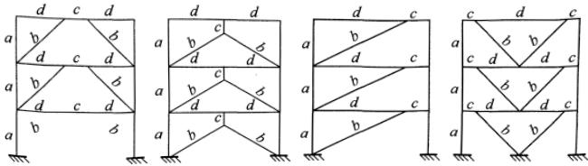

图 19 偏心支撑示意图

a—柱；b—支撑；c—消能梁段；d—其他梁段

偏心支撑框架的设计原则是强柱、强支撑和弱消能梁段，即在大震时消能梁段屈服形成塑性铰，且具有稳定的滞回性能，即使消能梁段进入应变硬化阶段，支撑斜杆、柱和其余梁段仍保持弹性。因此，每根斜杆只能在一端与消能梁段连接，若两端均与消能梁段相连，则可能一端的消能梁段屈服，另一端消能梁段不屈服，使偏心支撑的承载力和消能能力降低。

本次修订，考虑了设置屈曲约束支撑框架的情况。屈曲约束支撑是由芯材、约束芯材屈曲的套管和位于芯材和套管间的无粘结材料及填充材料组成的一种支撑构件。这是一种受拉时同普通支撑而受压时承载力与受拉时相当且具有某种消能机制的支撑，采用单斜杆布置时宜成对设置。屈曲约束支撑在多遇地震下不发生屈曲，可按中心支撑设计；与 V 形、 $ \Lambda $  形支撑相连的框架梁可不考虑支撑屈曲引起的竖向不平衡力。此时，需要控制屈曲约束支撑轴力设计值：

 $$ \begin{aligned}N\leqslant&0.9N_{ysc}/\eta_{y}\\N_{ysc}=&\eta_{y}f_{ay}A_{1}\end{aligned} $$ 

式中：N——屈曲约束支撑轴力设计值；

 $ N_{ysc} $ ——芯板的受拉或受压屈服承载力，根据芯材约束屈服段的截面面积来计算；

 $ A_{1} $ ——约束屈服段的钢材截面面积；

 $ f_{ay} $  —— 芯板钢材的屈服强度标准值；

 $ \eta_{y} $  ——芯板钢材的超强系数，Q235 取 1.25，Q195 取 1.15，低屈服点钢材（ $ f_{ay}<160 $ ）取 1.1，其实测值不应大于上述数值的 15%。

作为消能构件时，其设计参数、性能检验、计算方法的具体要求需按专门的规定执行，主要内容如下：

1 屈曲约束支撑的性能要求：

1）芯材钢材应有明显的屈服台阶，屈服强度不宜大于 $ 235kN/mm^{2} $ ，伸长率不应小于25%；

2）钢套管的弹性屈曲承载力不宜小于屈曲约束支撑极限承载力计算值的1.2倍；

3）屈曲约束支撑应能在2倍设计层间位移角的情况下，限制芯材的局部和整体屈曲。

2 屈曲约束支撑应按照同一工程中支撑的构造形式、约束屈服段材料和屈服承载力分类进行抽样试验检验，构造形式和约束屈服段材料相同且屈服承载力在50%至150%范围内的屈曲约束支撑划分为同一类别。每种类别抽样比例为2%，且不少于一根。试验时，依次在1/300，1/200，1/150，1/100支撑长度的拉伸和压缩往复各3次变形。试验得到的滞回曲线应稳定、饱满，具有正的增量刚度，且最后一级变形第3次循环的承载力不低于历经最大承载力的85%，历经最大承载力不高于屈曲约束支撑极限承载力计算值的1.1倍。

3 计算方法可按照位移型阻尼器的相关规定执行。

8.1.9 支撑桁架沿竖向连续布置，可使层间刚度变化较均匀。支撑桁架需延伸到地下室，不可因建筑方面的要求而在地下室移动位置。支撑在地下室是否改为混凝土抗震墙形式，与是否设置钢骨混凝土结构层有关，设置钢骨混凝土结构层时采用混凝土墙较协调。该抗震墙是否由钢支撑外包混凝土构成还是采用混凝土墙，由设计确定。

日本在高层钢结构的下部（地下室）设钢骨混凝土结构层，目的是使内力传递平稳，保证柱脚的嵌固性，增加建筑底部刚性、

整体性和抗倾覆稳定性；而美国无此要求。本规范对此不作规定。

多层钢结构与高层钢结构不同，根据工程情况可设置或不设置地下室。当设置地下室时，房屋一般较高，钢框架柱宜伸至地下一层。

钢结构的基础埋置深度，参照高层混凝土结构的规定和上海的工程经验确定。

### 8.2 计算要点

8.2.1 钢结构构件按地震组合内力设计值进行抗震验算时，钢材的各种强度设计值需除以本规范规定的承载力抗震调整系数 $ \gamma_{RE} $ ，以体现钢材动静强度和抗震设计与非抗震设计可靠指标的不同。国外采用许用应力设计的规范中，考虑地震组合时钢材的强度通常规定提高1/3或30%，与本规范 $ \gamma_{RE} $ 的作用类似。

8.2.2 2001 规范的钢结构阻尼比偏严，本次修订依据试验结果适当放宽。采用屈曲约束支撑的钢结构，阻尼比按本规范第 12 章消能减震结构的规定采用。

采用该阻尼比后，地震影响系数均按本规范第 5 章的规定采用。

8.2.3 本条规定了钢结构内力和变形分析的一些原则要求。

1 钢结构考虑二阶效应的计算，《钢结构设计规范》GB 50017-2003 第 3.2.8 条的规定，应计入构件初始缺陷（初倾斜、初弯曲、残余应力等）对内力的影响，其影响程度可通过在框架每层柱顶作用有附加的假想水平力来体现。

2 对工字形截面柱，美国 NEHRP 抗震设计手册（第二版）2000 年节点域考虑剪切变形的方法如下，可供参考：

考虑节点域剪切变形对层间位移角的影响，可近似将所得层间位移角与由节点域在相应楼层设计弯矩下的剪切变形角平均值相加求得。节点域剪切变形角的楼层平均值可按下式计算。

 $$ \Delta\gamma_{i}=\frac{1}{n}\sum\frac{M_{j,i}}{GV_{pe,ji}},\quad(j=1,2,\cdots n) $$ 

式中： $ \Delta\gamma_{i} $ ——第i层钢框架在所考虑的受弯平面内节点域剪切变形引起的变形角平均值；

 $ M_{j,i} $ ——第i层框架的第j个节点域在所考虑的受弯平面内的不平衡弯矩，由框架分析得出，即 $ M_{ji}=M_{bl}+M_{b2} $ ;

 $ V_{pe,ji} $ ——第i层框架的第j个节点域的有效体积；

 $ M_{b1} $ 、 $ M_{b2} $ ——分别为受弯平面内第 i 层第 j 个节点左、右梁端同方向地震作用组合下的弯矩设计值。

对箱形截面柱节点域变形较小，其对框架位移的影响可略去不计。

3 本款修订依据多道防线的概念设计，框架-支撑体系中，支撑框架是第一道防线，在强烈地震中支撑先屈服，内力重分布使框架部分承担的地震剪力必需增大，二者之和应大于弹性计算的总剪力；如果调整的结果框架部分承担的地震剪力不适当增大，则不是“双重体系”而是按刚度分配的结构体系。美国 IBC 规范中，这两种体系的延性折减系数是不同的，适用高度也不同。日本在钢支撑-框架结构设计中，去掉支撑的纯框架按总剪力的 40% 设计，远大于 25% 总剪力。这一规定体现了多道设防的原则，抗震分析时可通过框架部分的楼层剪力调整系数来实现，也可采用删去支撑框架进行计算来实现。

4 为使偏心支撑框架仅在耗能梁段屈服，支撑斜杆、柱和非耗能梁段的内力设计值应根据耗能梁段屈服时的内力确定并考虑耗能梁段的实际有效超强系数，再根据各构件的承载力抗震调整系数，确定斜杆、柱和非耗能梁段保持弹性所需的承载力。2005AISC抗震规程规定，位于消能梁段同一跨的框架梁和框架柱的内力设计值增大系数不小于1.1，支撑斜杆的内力增大系数不小于1.25。据此，对2001规范的规定适当调整，梁和柱由原来的8度不小于1.5和9度不小于1.6调整为二级不小于1.2和一级不小于1.3，支撑斜杆由原来的8度不小于1.4和9度不小于1.5调整为二级不小于1.3和一级不小于1.4。

8.2.5 本条是实现“强柱弱梁”抗震概念设计的基本要求。

1 轴压比较小时可不验算强柱弱梁。条文所要求的是按2倍的小震地震作用的地震组合得出的内力设计值，而不是取小震地震组合轴向力的2倍。

参考美国规定增加了梁端塑性铰外移的强柱弱梁验算公式。骨形连接(RBS)连接的塑性铰至柱面距离，参考FEMA350的规定，取 $ (0.5\sim0.75)b_{\mathrm{f}}+(0.65\sim0.85)h_{\mathrm{b}}/2 $ （其中， $ b_{f} $ 和 $ h_{b} $ 分别为梁翼缘宽度和梁截面高度）；梁端扩大型和加盖板的连接按日本规定，取净跨的1/10和梁高二者的较大值。强柱系数建议以7度 $ (0.10g) $ 作为低烈度区分界，大致相当于AISC的等级C，按AISC抗震规程，等级B、C是低烈度区，可不执行该标准规定的抗震构造措施。强柱系数实际上已隐含系数1.15。本次修订，只是将强柱系数，按抗震等级作了相应的划分，基本维持了2001规范的数值。

2 关于节点域。日本规定节点板域尺寸自梁柱翼缘中心线算起，AISC 的节点域稳定公式规定自翼缘内侧算起。本次修订，拟取自翼缘中心线算起。

美国节点板域稳定公式为高度和宽度之和除以90，历次修订此式未变；我国同济大学和哈尔滨工业大学做过试验，结果都是1/70，考虑到试件板厚有一定限制，过去对高层用1/90，对多层用1/70。板的初始缺陷对平面内稳定影响较大，特别是板厚有限时，一次试验也难以得出可靠结果。考虑到该式一般不控制，本次修订拟统一采用美国的参数1/90。

研究表明，节点域既不能太厚，也不能太薄，太厚了使节点域不能发挥其耗能作用，太薄了将使框架侧向位移太大，规范使用折减系数来设计。取0.7是参考日本研究结果采用。《高层民用建筑钢结构技术规程》JGJ 99-98规定在7度时改用0.6，是考虑到我国7度地区较大，可减少节点域加厚。日本第一阶段设计相当于我国8度；考虑7度可适当降低要求，所以按抗震等级划分拟就了系数。

当两侧梁不等高时，节点域剪应力计算公式可参阅《钢结构设计规范》管理组编著的《钢结构设计计算示例》p582页，中国计划出版社，2007年3月。

#### 8.2.6 本条规定了支撑框架的验算。

1 考虑循环荷载时的强度降低系数，是高钢规编制时陈绍蕃教授提出的。考虑中心支撑长细比限值改动较大，拟保留此系数。

2 当人字支撑的腹杆在大震下受压屈曲后，其承载力将下降，导致横梁在支撑处出现向下的不平衡集中力，可能引起横梁破坏和楼板下陷，并在

横梁两端出现塑性铰；此不平衡集中力取受拉支撑的竖向分量减去受压支撑屈曲压力竖向分量的30%。V形支撑情况类似，仅当斜杆失稳时楼板不是下陷而是向上隆起，不平衡力与前

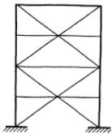

(a)人字和V形支撑交替布置

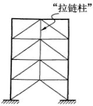

(b) “拉链柱”

图 20 人字支撑的布置

种情况相反。设计单位反映，考虑不平衡力后梁截面过大。条文中的建议是 AISC 抗震规程中针对此情况提出的，具有实用性，参见图 20。

8.2.7 偏心支撑框架的设计计算，主要参考 AISC 于 1997 年颁布的《钢结构房屋抗震规程》并根据我国情况作了适当调整。

当消能梁段的轴力设计值不超过 0.15Af 时，按 AISC 规定，忽略轴力影响，消能梁段的受剪承载力取腹板屈服时的剪力和梁段两端形成塑性铰时的剪力两者的较小值。本规范根据我国钢结构设计规范关于钢材拉、压、弯强度设计值与屈服强度的关系，取承载力抗震调整系数为 1.0，计算结果与 AISC 相当；当轴力设计值超过 0.15Af 时，则降低梁段的受剪承载力，以保证该梁段具有稳定的滞回性能。

为使支撑斜杆能承受消能梁段的梁端弯矩，支撑与梁段的连

接应设计成刚接（图 21）。

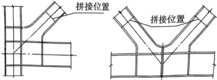

图 21 支撑端部刚接构造示意图

8.2.8 构件的连接，需符合强连接弱构件的原则。

1 需要对连接作二阶段设计。第一阶段，要求按构件承载力而不是设计内力进行连接计算，是考虑设计内力较小时将导致连接件型号和数量偏少，或焊缝的有效截面尺寸偏小，给第二阶段连接（极限承载力）设计带来困难。另外，高强度螺栓滑移对钢结构连接的弹性设计是不允许的。

2 框架梁一般为弯矩控制，剪力控制的情况很少，其设计剪力应采用与梁屈服弯矩相应的剪力，2001规范规定采用腹板全截面屈服时的剪力，过于保守。另一方面，2001规范用1.3代替1.2考虑竖向荷载往往偏小，故作了相应修改。采用系数1.2，是考虑梁腹板的塑性变形小于翼缘的变形要求较多，当梁截面受剪力控制时，该系数宜适当加大。

3 钢结构连接系数修订，系参考日本建筑学会《钢结构连接设计指南》（2001/2006）的下列规定拟定。

<table border=1 style='margin: auto; width: max-content;'><tr><td rowspan="2">母材牌号</td><td colspan="2">梁端连接时</td><td colspan="2">支撑连接/构件拼接</td><td rowspan="2" colspan="2">柱 脚</td></tr><tr><td style='text-align: center;'>母材破断</td><td style='text-align: center;'>螺栓破断</td><td style='text-align: center;'>母材破断</td><td colspan="3">螺栓破断</td></tr><tr><td style='text-align: center;'>SS400</td><td style='text-align: center;'>1.40</td><td style='text-align: center;'>1.45</td><td style='text-align: center;'>1.25</td><td style='text-align: center;'>1.30</td><td style='text-align: center;'>埋入式</td><td style='text-align: center;'>1.2</td></tr><tr><td style='text-align: center;'>SM490</td><td style='text-align: center;'>1.35</td><td style='text-align: center;'>1.40</td><td style='text-align: center;'>1.20</td><td style='text-align: center;'>1.25</td><td style='text-align: center;'>外包式</td><td style='text-align: center;'>1.2</td></tr><tr><td style='text-align: center;'>SN400</td><td style='text-align: center;'>1.30</td><td style='text-align: center;'>1.35</td><td style='text-align: center;'>1.15</td><td style='text-align: center;'>1.20</td><td style='text-align: center;'>外露式</td><td style='text-align: center;'>1.0</td></tr><tr><td style='text-align: center;'>SN490</td><td style='text-align: center;'>1.25</td><td style='text-align: center;'>1.30</td><td style='text-align: center;'>1.10</td><td style='text-align: center;'>1.15</td><td style='text-align: center;'>—</td><td style='text-align: center;'>—</td></tr></table>

注：螺栓是指高强度螺栓，极限承载力计算时按承压型连接考虑。

表中的连接系数包括了超强系数和应变硬化系数；SS是碳素结构钢，SM是焊接结构钢，SN是抗震结构钢，其性能是逐步提高的。连接系数随钢种的性能提高而递减，也随钢材的强度等级递增而递减，是以钢材超强系数统计数据为依据的，而应变硬化系数各国普遍取1.1。该文献说明，梁端连接的塑性变形要求最高，连接系数也最高，而支撑连接和构件拼接的塑性变形相对较小，故连接系数可取较低值。螺栓连接受滑移的影响，且钉孔使截面减弱，影响了承载力。美国和欧盟规范中，连接系数都没有这样细致的划分和规定。我国目前对建筑钢材的超强系数还没有作过统计，本规范表8.2.8是按上述文献2006版列出的，它比2001规范对螺栓破断的规定降低了0.05。借鉴日本上述规定，将构件承载力抗震调整系数中的焊接连接和螺栓连接都取0.75，连接系数在连接承载力计算表达式中统一考虑，有利于按不同情况区别对待，也有利于提高连接系数的直观性。对于Q345钢材，连接系数 $ 1.30<f_{u}/f_{y}=470/345=1.36 $ ，解决了2001规范所规定综合连接系数偏高，材料强度不能充分利用的问题。另外，对于外露式柱脚，考虑在我国应用较多，适当提高抗震设计时的承载力是必要的，采用了1.1系数。本规范表8.2.8与日本规定相当接近。

### 8.3 钢框架结构的抗震构造措施

8.3.1 框架柱的长细比关系到钢结构的整体稳定。研究表明，钢结构高度加大时，轴力加大，竖向地震对框架柱的影响很大。本条规定与2001规范相比，高于50m时，7、8度有所放松；低于50m时，8、9度有所加严。

8.3.2 框架梁、柱板件宽厚比的规定，是以结构符合强柱弱梁为前提，考虑柱仅在后期出现少量塑性不需要很高的转动能力，综合美国和日本规定制定的。陈绍蕃教授指出，以轴压比0.37为界的12层以下梁腹板宽厚比限值的计算公式，适用于采用塑性内力重分布的连续组合梁负弯矩区，如果不考虑出现塑性铰后

的内力重分布，宽厚比限值可以放宽。据此，将2001规范对梁宽厚比限值中的 $ (N_{b}/Af<0.37) $ 和 $ (N_{b}/Af\geqslant0.37) $ 两个限值条件取消。考虑到按刚性楼盖分析时，得不出梁的轴力，但在进入弹塑性阶段时，上翼缘的负弯矩区楼板将退出工作，迫使钢梁翼缘承受一定轴力，不考虑是不安全的。注意到日本对梁腹板宽厚比限值的规定为60（65），括号内为缓和值，不考虑轴力影响；AISC 341-05规定，当梁腹板轴压比为0.125时其宽厚比限值为75。据此，梁腹板宽厚比限值对一、二、三、四抗震等级分别取上限值（60、65、70、75） $ \sqrt{235/f_{ay}} $ 。

本次修订按抗震等级划分后，12层以下柱的板件宽厚比几乎不变，12层以上有所放松：8度由10、43、35放松为11、45、36；7度由11、43、37放松为12、48、38；6度由13、43、39放松为13、52、40。

注意，从抗震设计的角度，对于板件宽厚比的要求，主要是地震下构件端部可能的塑性铰范围，非塑性铰范围的构件宽厚比可有所放宽。

8.3.3 当梁上翼缘与楼板有可靠连接时，简支梁可不设置侧向支承，固端梁下翼缘在梁端0.15倍梁跨附近宜设置隅撑。梁端采用梁端扩大、加盖板或骨形连接时，应在塑性区外设置竖向加劲肋，隅撑与偏置的竖向加劲肋相连。梁端翼缘宽度较大，对梁下翼缘侧向约束较大时，也可不设隅撑。朱聘儒著《钢-混凝土组合梁设计原理》（第二版）一书，对负弯矩区段组合梁钢部件的稳定性作了计算分析，指出负弯矩区段内的梁部件名义上虽是压弯构件，由于其截面轴压比较小，稳定问题不突出。李国强著《多高层建筑钢结构设计》第203页介绍了提供侧向约束的几种方法，也可供参考。首先验算钢梁受压区长细比 $ \lambda_{y} $ 是否满足：

 $$ \lambda_{y}\leqslant60\sqrt{235/f_{y}} $$ 

若不满足可按图 22 所示方法设置侧向约束。

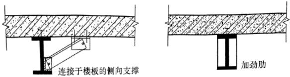

图 22 钢梁受压翼缘侧向约束

8.3.4 本条规定了梁柱连接构造要求。

1 电渣焊时壁板最小厚度 16mm，是征求日本焊接专家意见并得到国内钢结构制作专家的认同。贯通式隔板是和冷成形箱形柱配套使用的，柱边缘受拉时要求对其采用 Z 向钢制作，限于设备条件，目前我国应用不多，其构造要求可参见现行行业标准《高层民用建筑钢结构技术规程》JGJ 99。隔板厚度一般不宜小于翼缘厚度。

2 现场连接时焊接孔如规范条文图 8.3.4-1 所示，应严格按规定形状和尺寸用刀具加工。FEMA 中推荐的孔形如下（图 23），美国规定为必须采用之孔形。其最大应力不出现在腹板与翼缘连接处，香港学者做过有限元分析比较，认为是当前国际上最佳孔形，且与梁腹板连接方便。有条件时也可采用该焊接孔形。

3 日本规定腹板连接板  $ t_{w} \leqslant 16m $  时采用双面角焊缝，焊缝

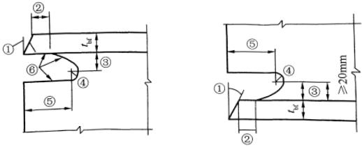

说明：

①坡口角度符合有关规定；②翼缘厚度或12mm，取小者；

③(1~0.75)倍翼缘厚度；④最小半径19mm；⑤3倍翼缘厚度( $ \pm12mm $ )；⑥表面平整。圆弧开口不大于25°。

图 23 FEMA 推荐的焊接孔形

计算厚度取5mm； $ t_{w} $  大于16mm时用K形坡口对接焊缝，端部均要求绕焊。美国将梁腹板连接板连接焊缝列为重要焊缝，要求符合与翼缘焊缝同等的低温冲击韧性指标。本条不要求符合较高冲击韧性指标，但要求用气保焊和板端绕焊。

4 日本普遍采用梁端扩大形，不采用 RBS 形；美国主要采用 RBS 形。RBS 形加工要求较高，且需在关键截面削减部分钢材，国内技术人员表示难以接受。现将二者都列出供选用。此外，还有梁端用矩形加强板、加腋等形式加强的方案，这里列入常用的四种形式（图 24）。梁端扩大部分的直角边长比可取 1:2

 $$ b=(0.65\sim0.85)h_{b},c=0.25b_{f},R=(4c^{2}+b^{2})/8c $$ 

(b) 骨形连接 (RBS)

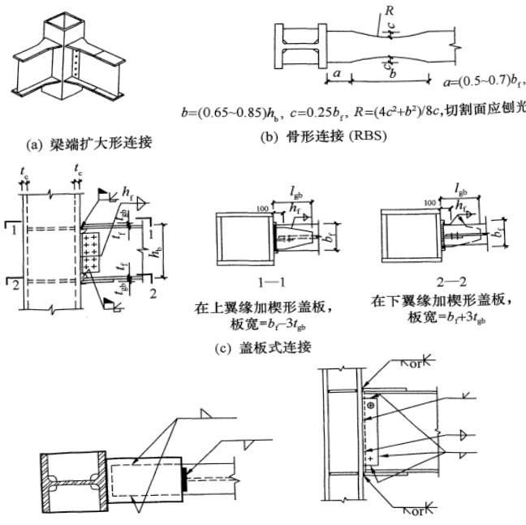

(c) 盖板式连接

(d) 翼缘板式连接

图 24 梁端扩大形连接、骨形连接、盖板式连接和翼缘板式连接

至1:3。AISC将7度（0.15g）及以上列入强震区，宜按此要求对梁端采用塑性铰外移构造。

5 日本在梁高小于 700 mm 时，采用本规范图 8.3.4-2 的悬臂梁段式连接。

6 AISC 规定，隔板与柱壁板的连接，也可用角焊缝加强的双面部分熔透焊缝连接，但焊缝的承载力不应小于隔板与柱翼缘全截面连接时的承载力。

8.3.5 当节点域的体积不满足第 8.2.5 条有关规定时，参考日本规定和美国 AISC 钢结构抗震规程 1997 年版的规定，提出了加厚节点域和贴焊补强板的加强措施：

（1）对焊接组合柱，宜加厚节点板，将柱腹板在节点域范围更换为较厚板件。加厚板件应伸出柱横向加劲肋之外各150mm，并采用对接焊缝与柱腹板相连；

（2）对轧制 H 形柱，可贴焊补强板加强。补强板上下边缘可不伸过横向加劲肋或伸过柱横向加劲肋之外各 150mm。当补强板不伸过横向加劲肋时，加劲肋应与柱腹板焊接，补强板与加劲肋之间的角焊缝应能传递补强板所分担的剪力，且厚度不小于 5mm；当补强板伸过加劲肋时，加劲肋仅与补强板焊接，此焊缝应能将加劲肋传来的力传递给补强板，补强板的厚度及其焊缝应按传递力的要求设计。补强板侧边可采用角焊缝与柱翼缘相连，其板面尚应采用塞焊与柱腹板连成整体。塞焊点之间的距离，不应大于相连板件中较薄板件厚度的  $ 21\sqrt{235/f_{y}} $  倍。

8.3.6 罕遇地震作用下，框架节点将进入塑性区，保证结构在塑性区的整体性是很必要的。参考国外关于高层钢结构的设计要求，提出相应规定。

8.3.7 本条规定主要考虑柱连接接头放在柱受力小的位置。本次修订增加了对净高小于2.6m柱的接头位置要求。

8.3.8 本条要求，对 8、9 度有所放松。外露式只能用于 6、7 度高度不超过 50m 的情况。

### 8.4 钢框架-中心支撑结构的抗震构造措施

8.4.1 本节规定了中心支撑框架的构造要求，主要用于高度50m以上的钢结构房屋。

AISC 341-05 抗震规程，特殊中心支撑框架和普通中心支撑框架的支撑长细比限值均规定不大于  $ 120\sqrt{235/f_{y}} $  。本次修订作了相应修改。

本次修订，按抗震等级划分后，支撑板件宽厚限值也作了适当修改和补充。对50m以上房屋的工字形截面构件有所放松：9度由7，21放松为8，25；8度时由8，23放松为9，26；7度时由8，23放松为10，27；6度时由9，25放松为13，33。

8.4.2 美国规定，加速度 0.15g 以上的地区，支撑框架结构的梁与柱连接不应采用铰接。考虑到双重抗侧力体系对高层建筑抗震很重要，且梁与柱铰接将使结构位移增大，故规定一、二、三级不应铰接。

支撑与节点板嵌固点保留一个小距离，可使节点板在大震时产生平面外屈曲，从而减轻对支撑的破

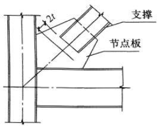

图 25 支撑端部节点板的构造示意图

坏，这是 AISC-97（补充）的规定，如图 25 所示。

### 8.5 钢框架-偏心支撑结构的抗震构造措施

8.5.1 本节规定了保证消能梁段发挥作用的一系列构造要求。

为使消能梁段有良好的延性和消能能力，其钢材应采用Q235、Q345或Q345GJ。

板件宽厚比参照 AISC 的规定作了适当调整。当梁上翼缘与楼板固定但不能表明其下翼缘侧向固定时，仍需设置侧向支撑。

8.5.3 为使消能梁段在反复荷载作用下具有良好的滞回性能，

需采取合适的构造并加强对腹板的约束：

1 支撑斜杆轴力的水平分量成为消能梁段的轴向力，当此轴向力较大时，除降低此梁段的受剪承载力外，还需减少该梁段的长度，以保证它具有良好的滞回性能。

2 由于腹板上贴焊的补强板不能进入弹塑性变形，因此不能采用补强板；腹板上开洞也会影响其弹塑性变形能力。

3 消能梁段与支撑斜杆的连接处，需设置与腹板等高的加劲肋，以传递梁段的剪力并防止梁腹板屈曲。

4 消能梁段腹板的中间加劲肋，需按梁段的长度区别对待，较短时为剪切屈服型，加劲肋间距小些；较长时为弯曲屈服型，需在距端部1.5倍的翼缘宽度处配置加劲肋；中等长度时需同时满足剪切屈服型和弯曲屈服型的要求。

偏心支撑的斜杆中心线与梁中心线的交点，一般在消能梁段的端部，也允许在消能梁段内，此时将产生与消能梁段端部弯矩方向相反的附加弯矩，从而减少消能梁段和支撑杆的弯矩，对抗震有利；但交点不应在消能梁段以外，因此时将增大支撑和消能梁段的弯矩，于抗震不利（图26）。

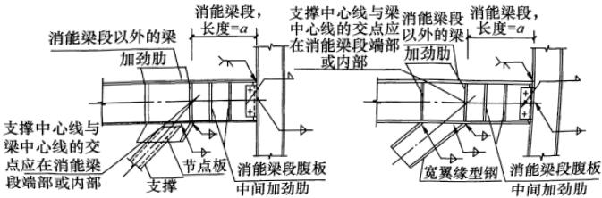

图 26 偏心支撑构造

8.5.5 消能梁段两端设置翼缘的侧向隅撑，是为了承受平面外扭转。

8.5.6 与消能梁段处于同一跨内的框架梁，同样承受轴力和弯矩，为保持其稳定，也需设置翼缘的侧向隅撑。

# 附录 G 钢支撑-混凝土框架和钢框架-钢筋混凝土核心筒结构房屋抗震设计要求

### G.1 钢支撑-钢筋混凝土框架

G.1.1 我国的钢支撑-混凝土框架结构，钢支撑承担较大的水平力，但不及抗震墙，其适用高度不宜超过框架结构和框剪结构二者最大适用高度的平均值。

本节的规定，除抗震等级外也可适用于房屋高度在混凝土框架结构最大适用高度内的情况。

G.1.2 由于房屋高度超过本规范第 6.1.1 条混凝土框架结构的最大适用高度，故参照框剪结构提高抗震等级。

G.1.3 本条规定了钢支撑-混凝土框架结构不同于钢支撑结构、混凝土框架结构的设计要求，主要参照混凝土框架-抗震墙结构的要求，将钢支撑框架在整个结构中的地位类比于混凝土框架抗震墙结构中的抗震墙。

G.1.4 混合结构的阻尼比，取决于混凝土结构和钢结构在总变形能中所占比例的大小。采用振型分解反应谱法时，不同振型的阻尼比可能不同。当简化估算时，可取0.045。

按照多道防线的概念设计，支撑是第一道防线，混凝土框架需适当增大按刚度分配的地震作用，可取两种模型计算的较大值。

### G.2 钢框架-钢筋混凝土核心筒结构

G.2.1 我国的钢框架-钢筋混凝土核心筒，由钢筋混凝土筒体承担主要水平力，其适用高度应低于高层钢结构而高于钢筋混凝土结构，参考《高层建筑混凝土结构技术规程》JGJ 3-2002 第11章的规定，其最大适用高度不大于二者的平均值。

G.2.2 本条抗震等级的划分，基本参照《高层建筑混凝土结构技术规程》JGJ 3-2002 的第 11 章和本规范第 6.1.2、8.1.3 条的规定。

G.2.3 本条规定了钢框架-钢筋混凝土核心筒结构体系设计中不同于混凝土结构、钢结构的一些基本要求：

1 近年来的试验和计算分析，对钢框架部分应承担的最小地震作用有些新的认识：框架部分承担一定比例的地震作用是非常重要的，如果钢框架部分按计算分配的地震剪力过少，则混凝土、筒体的受力状态和地震下的表现与普通钢筋混凝土结构几乎没有差别，甚至混凝土墙体更容易破坏。

清华大学土木系选择了一幢国内的钢框架-混凝土核心筒结构，变换其钢框架部分和混凝土核心筒的截面尺寸，并将它们进行不同组合，分析了共20个截面尺寸互不相同的结构方案，进行了在地震作用下的受力性能研究和比较，提出了钢框架部分剪力分担率的设计建议。

考虑钢框架-钢筋混凝土核心筒的总高度大于普通的钢筋混凝土框架-核心筒房屋，为给混凝土墙体留有一定的安全储备，规定钢框架按刚度分配的最小地震作用。当小于规定时，混凝土筒承担的地震作用和抗震构造均应适当提高。

2 钢框架柱的应力一般较高，而混凝土墙体大多由位移控制，墙的应力较低，而且两种材料弹性模量不等，此外，混凝土存在徐变和收缩，因此会使钢框架和混凝土筒体间存在较大变形。为了其差异变形不致使结构产生过大的附加内力，国外这类结构的楼盖梁大多两端都做成铰接。我国的习惯做法是，楼盖梁与周边框架刚接，但与钢筋混凝土墙体做成铰接，当墙体内设置连接用的构造型钢时，也可采用刚接。

3 试验表明，混凝土墙体与钢梁连接处存在局部弯矩及轴向力，但墙体平面外刚度较小，很容易出现裂缝；设置构造型钢有助于提高墙体的局部性能，也便于钢结构的安装。

4 底部或下部楼层用型钢混凝土柱，上部楼层用钢柱，可

提高结构刚度和节约钢材，是常见的做法。阪神地震表明，此时应避免刚度突变引起的破坏，设置过渡层使结构刚度逐渐变化，可以减缓此种效应。

5 要使钢框架与混凝土核心筒能协同工作，其楼板的刚度和大震作用下的整体性是十分重要的，本条要求其楼板应采用现浇实心板。

G.2.4 本条规定了抗震计算中，不同于钢筋混凝土结构的要求：

1 混合结构的阻尼比，取决于混凝土结构和钢结构在总变形能中所占比例的大小。采用振型分解反应谱法时，不同振型的阻尼比可能不同。必要时，可参照本规范第10章关于大跨空间钢结构与混凝土支座综合阻尼比的换算方法确定，当简化估算时，可取0.045。

2 根据多道抗震防线的要求，钢框架部分应按其刚度承担一定比例的楼层地震力。

按美国 IBC 2006 规定，凡在设计时考虑提供所需要的抵抗地震力的结构部件所组成的体系均为抗震结构体系。其中，由剪力墙和框架组成的结构有以下三类：①双重体系是“抗弯框架（moment frame）具有至少提供抵抗25%设计力（design forces）的能力，而总地震抗力由抗弯框架和剪力墙按其相对刚度的比例共同提供”；由中等抗弯框架和普通剪力墙组成的双重体系，其折减系数 R=5.5，不许用于加速度大于0.20g的地区。②在剪力墙-框架协同体系中，“每个楼层的地震力均由墙体和框架按其相对刚度的比例并考虑协同工作共同承担”；其折减系数也是 R=5.5，但不许用于加速度大于0.13g的地区。③当设计中不考虑框架部分承受地震力时，称为房屋框架（building frame）体系；对于普通剪力墙和建筑框架的体系，其折减系数 R=5，不许用于加速度大于0.20g的地区。

关于双重体系中钢框架部分的剪力分担率要求，美国UBC85已经明确为“不少于所需侧向力的25%”，在UBC97是

“应能独立承受至少25%的设计基底剪力”。我国在2001抗震规范修订时，第8章多高层钢结构房屋的设计规定是“不小于钢框架部分最大楼层地震剪力的1.8倍和25%结构总地震剪力二者的较小值”。考虑到混凝土核心筒的刚度远大于支撑钢框架或钢筒体，参考混凝土核心筒结构的相关要求，本条规定调整后钢框架承担的剪力至少达到底部总剪力的15%。

## 9 单层工业厂房

### 9.1 单层钢筋混凝土柱厂房

(Ⅰ) 一般规定

9.1.1 本规范关于单层钢筋混凝土柱厂房的规定，系根据20世纪60年代以来装配式单层工业厂房的震害和工程经验总结得到的。因此，对于现浇的单层钢筋混凝土柱厂房，需注意本节针对装配式结构的某些规定不适用。

根据震害经验，厂房结构布置应注意的问题是：

1 历次地震的震害表明，不等高多跨厂房有高振型反应，不等长多跨厂房有扭转效应，破坏较重；均对抗震不利，故多跨厂房宜采用等高和等长。

2 地震的震害表明，单层厂房的毗邻建筑任意布置是不利的，在厂房纵墙与山墙交汇的角部是不允许布置的。在地震作用下，防震缝处排架柱的侧移量大，当有毗邻建筑时，相互碰撞或变位受约束的情况严重；地震中有不少倒塌、严重破坏等加重震害的震例，因此，在防震缝附近不宜布置毗邻建筑。

3 大柱网厂房和其他不设柱间支撑的厂房，在地震作用下侧移量较设置柱间支撑的厂房大，防震缝的宽度需适当加大。

4 地震作用下，相邻两个独立的主厂房的振动变形可能不同步协调，与之相连接的过渡跨的屋盖常倒塌破坏；为此过渡跨至少应有一侧采用防震缝与主厂房脱开。

5 上吊车的铁梯，晚间停放吊车时，增大该处排架侧移刚度，加大地震反应，特别是多跨厂房各跨上吊车的铁梯集中在同一横向轴线时，会导致震害破坏，应避免。

6 工作平台或刚性内隔墙与厂房主体结构连接时，改变了

主体结构的工作性状，加大地震反应；导致应力集中，可能造成短柱效应，不仅影响排架柱，还可能涉及柱顶的连接和相邻的屋盖结构，计算和加强措施均较困难，故以脱开为佳。

7 不同形式的结构，振动特性不同，材料强度不同，侧移刚度不同。在地震作用下，往往由于荷载、位移、强度的不均衡，而造成结构破坏。山墙承重和中间有横墙承重的单层钢筋混凝土柱厂房和端砖壁承重的天窗架，在地震中均有较重破坏，为此，厂房的一个结构单元内，不宜采用不同的结构形式。

8 两侧为嵌砌墙，中柱列设柱间支撑；一侧为外贴墙或嵌砌墙，另一侧为开敞；一侧为嵌砌墙，另一侧为外贴墙等各柱列纵向刚度严重不均匀的厂房，由于各柱列的地震作用分配不均匀，变形不协调，常导致柱列和屋盖的纵向破坏，在7度区就有这种震害反映，在8度和大于8度区，破坏就更普遍且严重，不少厂房柱倒屋塌，在设计中应予以避免。

9.1.2 根据震害经验，天窗架的设置应注意下列问题：

1 突出屋面的天窗架对厂房的抗震带来很不利的影响，因此，宜采用突出屋面较小的避风型天窗。采用下沉式天窗的屋盖有良好的抗震性能，唐山地震中甚至经受了10度地震的考验，不仅是8度区，有条件时均可采用。

2 第二开间起开设天窗，将使端开间每块屋面板与屋架无法焊接或焊连的可靠性大大降低而导致地震时掉落，同时也大大降低屋面纵向水平刚度。所以，如果山墙能够开窗，或者采光要求不太高时，天窗从第三开间起设置。

天窗架从厂房单元端第三柱间开始设置，虽增强屋面纵向水平刚度，但对建筑通风、采光不利，考虑到6度和7度区的地震作用效应较小，且很少有屋盖破坏的震例，本次修订改为对6度和7度区不做此要求。

3 历次地震经验表明，不仅是天窗屋盖和端壁板，就是天窗侧板也宜采用轻型板材。

9.1.3 根据震害经验，厂房屋盖结构的设置应注意下列问题：

1 轻型大型屋面板无檩屋盖和钢筋混凝土有檩屋盖的抗震性能好，经过8～10度强烈地震考验，有条件时可采用。

2 唐山地震震害统计分析表明，屋盖的震害破坏程度与屋盖承重结构的形式密切相关，根据8～11度地震的震害调查统计发现：梯形屋架屋盖共调查91跨，全部或大部倒塌41跨，部分或局部倒塌11跨，共计52跨，占56.7%；拱形屋架屋盖共调查151跨，全部或大部倒塌13跨，部分或局部倒塌16跨，共计29跨，占19.2%；屋面梁屋盖共调查168跨，全部或大部倒塌11跨，部分或局部倒塌17跨，共计28跨，占16.7%。

另外，采用下沉式屋架的屋盖，经8～10度强烈地震的考验，没有破坏的震例。为此，提出厂房宜采用低重心的屋盖承重结构。

3 拼块式的预应力混凝土和钢筋混凝土屋架（屋面梁）的结构整体性差，在唐山地震中其破坏率和破坏程度均较整榀式重得多。因此，在地震区不宜采用。

4 预应力混凝土和钢筋混凝土空腹桁架的腹杆及其上弦节点均较薄弱，在天窗两侧竖向支撑的附加地震作用下，容易产生节点破坏、腹杆折断的严重破坏，因此，不宜采用有突出屋面天窗架的空腹桁架屋盖。

5 随着经济的发展，组合屋架已很少采用，本次修订继续保持89规范、2001规范的规定，不列入这种屋架的规定。

本次修订，根据震害经验，建议在高烈度（8度0.30g和9度）且跨度大于24m的厂房，不采用重量大的大型屋面板。

9.1.4 不开孔的薄壁工字形柱、腹板开孔的普通工字形柱以及管柱，均存在抗震薄弱环节，故规定不宜采用。

## (Ⅱ) 计算要点

9.1.7、9.1.8 对厂房的纵横向抗震分析，本规范明确规定，一般情况下，采用多质点空间结构分析方法。

关于横向计算：

当符合本规范附录 J 的条件时可采用平面排架简化方法，但计算所得的排架地震内力应考虑各种效应调整。本规范附录 J 的调整系数有以下特点：

1 适用于 7～8 度柱顶标高不超过 15m 且砖墙刚度较大等情况的厂房，9 度时砖墙开裂严重，空间工作影响明显减弱，一般不考虑调整。

2 计算地震作用时，采用经过调整的排架计算周期。

3 调整系数采用了考虑屋盖平面内剪切刚度、扭转和砖墙开裂后刚度下降影响的空间模型，用振型分解法进行分析，取不同屋盖类型、各种山墙间距、各种厂房跨度、高度和单元长度，得出了统计规律，给出了较为合理的调整系数。因排架计算周期偏长，地震作用偏小，当山墙间距较大或仅一端有山墙时，按排架分析的地震内力需要增大而不是减小。对一端山墙的厂房，所考虑的排架一般指无山墙端的第二榀，而不是端榀。

4 研究发现，对不等高厂房高低跨交接处支承低跨屋盖牛腿以上的中柱截面，其地震作用效应的调整系数随高、低跨屋盖重力的比值是线性下降，要由公式计算。公式中的空间工作影响系数与其他各截面（包括上述中柱的下柱截面）的作用效应调整系数含义不同，分别列于不同的表格，要避免混淆。

5 地震中，吊车桥架造成了厂房局部的严重破坏。为此，把吊车桥架作为移动质点，进行了大量的多质点空间结构分析，并与平面排架简化分析比较，得出其放大系数。使用时，只乘以吊车桥架重力荷载在吊车梁顶标高处产生的地震作用，而不乘以截面的总地震作用。

关于纵向计算：

历次地震，特别是海城、唐山地震，厂房沿纵向发生破坏的例子很多，而且中柱列的破坏普遍比边柱列严重得多。在计算分析和震害总结的基础上，规范提出了厂房纵向抗震计算原则和简化方法。

钢筋混凝土屋盖厂房的纵向抗震计算，要考虑围护墙有效刚

度、强度和屋盖的变形，采用空间分析模型。本规范附录K第K.1节的实用计算方法，仅适用于柱顶标高不超过15m且有纵向砖围护墙的等高厂房，是选取多种简化方法与空间分析计算结果比较而得到的。其中，要用经验公式计算基本周期。考虑到随着烈度的提高，厂房纵向侧移加大，围护墙开裂加重，刚度降低明显，故一般情况，围护墙的有效刚度折减系数，在7、8、9度时可近似取0.6、0.4和0.2。不等高和纵向不对称厂房，还需考虑厂房扭转的影响，尚无合适的简化方法。

9.1.9、9.1.10 地震震害表明，没有考虑抗震设防的一般钢筋混凝土天窗架，其横向受损并不明显，而纵向破坏却相当普遍。计算分析表明，常用的钢筋混凝土带斜腹杆的天窗架，横向刚度很大，基本上随屋盖平移，可以直接采用底部剪力法的计算结果，但纵向则要按跨数和位置调整。

有斜撑杆的三铰拱式钢天窗架的横向刚度也较厂房屋盖的横向刚度大很多，也是基本上随屋盖平移，故其横向抗震计算方法可与混凝土天窗架一样采用底部剪力法。由于钢天窗架的强度和延性优于混凝土天窗架，且可靠度高，故当跨度大于9m或9度时，钢天窗架的地震作用效应不必乘以增大系数1.5。

本规范明确关于突出屋面天窗架简化计算的适用范围为有斜杆的三铰拱式天窗架，避免与其他桁架式天窗架混淆。

对于天窗架的纵向抗震分析，继续保持89规范的相关规定。9.1.11 关于大柱网厂房的双向水平地震作用，89规范规定取一个主轴方向100%加上相应垂直方向的30%的不利组合，相当于两个方向的地震作用效应完全相同时按本规范5.2节规定计算的结果，因此是一种略偏安全的简化方法。为避免与本规范5.2节的规定不协调，保持2001规范的规定，不再专门列出。

位移引起的附加弯矩，即“ $ P-\Delta $ ”效应，按本规范3.6节的规定计算。

9.1.12 不等高厂房支承低跨屋盖的柱牛腿在地震作用下开裂较多，甚至牛腿面预埋板向外位移破坏。在重力荷载和水平地震作

用下的柱牛腿纵向水平受拉钢筋的计算公式，第一项为承受重力荷载纵向钢筋的计算，第二项为承受水平拉力纵向钢筋的计算。

9.1.13 震害和试验研究表明：交叉支撑杆件的最大长细比小于200时，斜拉杆和斜压杆在支撑桁架中是共同工作的。支撑中的最大作用相当于单压杆的临界状态值。据此，在本规范的附录K第K.2节中规定了柱间支撑的设计原则和简化方法：

1 支撑侧移的计算：按剪切构件考虑，支撑任一点的侧移等于该点以下各节间相对侧移值的叠加。它可用以确定厂房纵向柱列的侧移刚度及上、下支撑地震作用的分配。

2 支撑斜杆抗震验算：试验结果发现，支撑的水平承载力，相当于拉杆承载力与压杆承载力乘以折减系数之和的水平分量。此折减系数即本规范附录 K 中的“压杆卸载系数”，可以线性内插；亦可直接用下列公式确定斜拉杆的净截面  $ A_{n} $ 

 $$ A_{\mathrm{n}}\geqslant\gamma_{\mathrm{RE}}l_{i}V_{\mathrm{bi}}/\left[(1+\psi_{\mathrm{c}}\phi_{i})s_{\mathrm{c}}f_{\mathrm{at}}\right] $$ 

3 震害表明，单层钢筋混凝土柱厂房的柱间支撑虽有一定数量的破坏，但这些厂房大多数未考虑抗震设防。据计算分析，抗震验算的柱间支撑斜杆内力大于非抗震设计时的内力几倍。

4 柱间支撑与柱的连接节点在地震反复荷载作用下承受拉弯剪和压弯剪，试验表明其承载力比单调荷载作用下有所降低；在抗震安全性综合分析基础上，提出了确定预埋板钢筋截面面积的计算公式，适用于符合本规范第9.1.25条5款构造规定的情况。

5 提出了柱间支撑节点预埋件采用角钢时的验算方法。

本规范第9.1.23条对下柱柱间支撑的下节点位置有明确的规定，一般将节点位置置于基础顶标高处。6、7度时地震力较小，采取加强措施后可设在基础顶面以上；本次修订明确，必要时也可沿纵向柱列进行柱根的斜截面受剪承载力验算来确定加强措施。

9.1.14 本条规定了与厂房次要构件有关的计算。

1 地震震害表明：8度和9度区，不少抗风柱的上柱和下

柱根部开裂、折断，导致山尖墙倒塌，严重的抗风柱连同山墙全部向外倾倒、抗风柱虽非单层厂房的主要承重构件，但它却是厂房纵向抗震中的重要构件，对保证厂房的纵向抗震安全，具有不可忽视的作用，补充规定8、9度时需进行平面外的截面抗震验算。

2 当抗风柱与屋架下弦相连接时，虽然此类厂房均在厂房两端第一开间设置下弦横向支撑，但当厂房遭到地震作用时，高大山墙引起的纵向水平地震作用具有较大的数值，由于阶形抗风柱的下柱刚度远大于上柱刚度，大部分水平地震作用将通过下柱的上端连接传至屋架下弦，但屋架下弦支撑的强度和刚度往往不能满足要求，从而导致屋架下弦支撑杆件压曲。1966年邢台地震6度区、1975年海城地震8度区均出现过这种震害。故要求进行相应的抗震验算。

3 当工作平台、刚性内隔墙与厂房主体结构相连时，将提高排架的侧移刚度，改变其动力特性，加大地震作用，还可能造成应力和变形集中，加重厂房的震害。地震中由此造成排架柱折断或屋盖倒塌，其严重程度因具体条件而异，很难作出统一规定。因此抗震计算时，需采用符合实际的结构计算简图，并采取相应的措施。

4 震害表明，上弦有小立柱的拱形和折线形屋架及上弦节间长和节间矢高较大的屋架，在地震作用下屋架上弦将产生附加扭矩，导致屋架上弦破坏。为此，8、9度在这种情况下需进行截面抗扭验算。

## （Ⅲ）抗震构造措施

9.1.15 本节所指有檩屋盖，主要是波形瓦（包括石棉瓦及槽瓦）屋盖。这类屋盖只要设置保证整体刚度的支撑体系，屋面瓦与檩条间以及檩条与屋架间有牢固的拉结，一般均具有一定的抗震能力，甚至在唐山10度地震区也基本完好地保存下来。但是，如果屋面瓦与檩条或檩条与屋架拉结不牢，在7度地震区也会出

现严重震害，海城地震和唐山地震中均有这种例子。

89 规范对有檩屋盖的规定，系针对钢筋混凝土体系而言。2001 规范增加了对钢结构有檩体系的要求。本次修订，未作修改。

9.1.16 无檩屋盖指的是各类不用檩条的钢筋混凝土屋面板与屋架（梁）组成的屋盖。屋盖的各构件相互间联成整体是厂房抗震的重要保证，这是根据唐山、海城震害经验提出的总要求。鉴于我国目前仍大量采用钢筋混凝土大型屋面板，故重点对大型屋面板与屋架（梁）焊连的屋盖体系作了具体规定。

这些规定中，屋面板和屋架（梁）可靠焊连是第一道防线，为保证焊连强度，要求屋面板端头底面预埋板和屋架端部顶面预埋件均应加强锚固；相邻屋面板吊钩或四角顶面预埋铁件间的焊连是第二道防线；当制作非标准屋面板时，也应采取相应的措施。

设置屋盖支撑是保证屋盖整体性的重要抗震措施，基本沿用了89规范的规定。

根据震害经验，8度区天窗跨度等于或大于9m和9度区天窗架宜设置上弦横向支撑。

9.1.17 本规范在进一步总结地震经验的基础上，对有檩和无檩屋盖支撑布置的规定作适当的补充。

9.1.18 唐山地震震害表明，采用刚性焊连构造时，天窗立柱普遍在下挡和侧板连接处出现开裂和破坏，甚至倒塌，刚性连接仅在支撑很强的情况下才是可行的措施，故规定一般单层厂房宜用螺栓连接。

9.1.19 屋架端竖杆和第一节间上弦杆，静力分析中常作为非受力杆件而采用构造配筋，截面受弯、受剪承载力不足，需适当加强。对折线形屋架为调整屋面坡度而在端节间上弦顶面设置的小立柱，也要适当增大配筋和加密箍筋。以提高其拉弯剪能力。

9.1.20 根据震害经验，排架柱的抗震构造，增加了箍筋肢距的要求，并提高了角柱柱头的箍筋构造要求。

1 柱子在变位受约束的部位容易出现剪切破坏，要增加箍筋。变位受约束的部位包括：设有柱间支撑的部位、嵌砌内隔墙、侧边贴建披屋、靠山墙的角柱、平台连接处等。

2 唐山地震震害表明：当排架柱的变位受平台，刚性横隔墙等约束，其影响的严重程度和部位，因约束条件而异，有的仅在约束部位的柱身出现裂缝；有的造成屋架上弦折断、屋盖坍落（如天津拖拉机厂冲压车间）；有的导致柱头和连接破坏屋盖倒塌（如天津第一机床厂铸工车间配砂间）。必须区别情况从设计计算和构造上采取相应的有效措施，不能统一采用局部加强排架柱的箍筋，如高低跨柱的上柱的剪跨比较小时就应全高加密箍筋，并加强柱头与屋架的连接。

3 为了保证排架柱箍筋加密区的延性和抗剪强度，除箍施的最小直径和最大间距外，增加对箍筋最大肢距的要求。

4 在地震作用下，排架柱的柱头由于构造上的原因，不是完全的铰接；而是处于压弯剪的复杂受力状态，在高烈度地区，这种情况更为严重，排架柱头破坏较重，加密区的箍筋直径需适当加大。

5 厂房角柱的柱头处于双向地震作用，侧向变形受约束和压弯剪的复杂受力状态，其抗震强度和延性较中间排架柱头弱得多，地震中，6度区就有角柱顶开裂的破坏；8度和大于8度时，震害就更多，严重的柱头折断，端屋架塌落，为此，厂房角柱的柱头加密箍筋宜提高一度配置。

6 本次修订，增加了柱侧向受约束且剪跨比不大于 2 的排架柱柱顶的构造要求。

9.1.21 大柱网厂房的抗震性能是唐山地震中发现的新问题，其震害特征是：①柱根出现对角破坏，混凝土酥碎剥落，纵筋压曲，说明主要是纵、横两个方向或斜向地震作用的影响，柱根的强度和延性不足；②中柱的破坏率和破坏程度均大于边柱，说明与柱的轴压比有关。

本次修订，保持了2001规范对大柱网厂房的抗震验算规定，

包括轴压比和相应的箍筋构造要求。其中的轴压比限值，考虑到柱子承受双向压弯剪和 $ P-\Delta $ 效应的影响，受力复杂，参照了钢筋混凝土框支柱的要求，以保证延性；大柱网厂房柱仅承受屋盖（包括屋面、屋架、托架、悬挂吊车）和柱的自重，尚不致因控制轴压比而给设计带来困难。

9.1.22 对抗风柱，除了提出验算要求外，还提出纵筋和箍筋的构造规定。

地震中，抗风柱的柱头和上、下柱的根部都有产生裂缝、甚至折断的震害，另外，柱肩产生劈裂的情况也不少。为此，柱头和上、下柱根部需加强箍筋的配置，并在柱肩处设置纵向受拉钢筋，以提高其抗震能力。

9.1.23 柱间支撑的抗震构造，本次修订基本保持2001规范对89规范的改进：

①支撑杆件的长细比限值随烈度和场地类别而变化；本次修订，调整了8、9度下柱支撑的长细比要求；②进一步明确了支撑柱子连接节点的位置和相应的构造；③增加了关于交叉支撑节点板及其连接的构造要求。

柱间支撑是单层钢筋混凝土柱厂房的纵向主要抗侧力构件，当厂房单元较长或8度Ⅲ、Ⅳ类场地和9度时，纵向地震作用效应较大，设置一道下柱支撑不能满足要求时，可设置两道下柱支撑，但应注意：两道下柱支撑宜设置在厂房单元中间三分之一区段内，不宜设置在厂房单元的两端，以避免温度应力过大；在满足工艺条件的前提下，两者靠近设置时，温度应力小；在厂房单元中部三分之一区段内，适当拉开设置则有利于缩短地震作用的传递路线，设计中可根据具体情况确定。

交叉式柱间支撑的侧移刚度大，对保证单层钢筋混凝土柱厂房在纵向地震作用下的稳定性有良好的效果，但在与下柱连接的节点处理时，会遇到一些困难。

9.1.25 本条规定厂房各构件连接节点的要求，具体贯彻了本规范第3.5节的原则规定，包括屋架与柱的连接，柱顶锚件；抗风

柱、牛腿（柱肩）、柱与柱间支撑连接处的预埋件：

1 柱顶与屋架采用钢板铰，在原苏联的地震中经受了考验，效果较好；建议在9度时采用。

2 为加强柱牛腿（柱肩）预埋板的锚固，要把相当于承受水平拉力的纵向钢筋（即本节第9.1.12公式中的第2项）与预埋板焊连。

3 在设置柱间支撑的截面处（包括柱顶、柱底等），为加强锚固，发挥支撑的作用，提出了节点预埋件采用角钢加端板锚固的要求，埋板与锚件的焊接，通常用埋弧焊或开锥形孔塞焊。

4 抗风柱的柱顶与屋架上弦的连接节点，要具有传递纵向水平地震力的承载力和延性。抗风柱顶与屋架（屋面梁）上弦可靠连接，不仅保证抗风柱的强度和稳定，同时也保证山墙产生的纵向地震作用的可靠传递，但连接点必须在上弦横向支撑与屋架的连接点，否则将使屋架上弦产生附加的节间平面外弯矩。由于现在的预应力混凝土和钢筋混凝土屋架，一般均不符合抗风柱布置间距的要求，故补充规定以引起注意，当遇到这种情况时，可以采用在屋架横向支撑中加设次腹杆或型钢横梁，使抗风柱顶的水平力传递至上弦横向支撑的节点。

### 9.2 单层钢结构厂房

## (Ⅰ) 一般规定

9.2.1 国内外的多次地震经验表明，钢结构的抗震性能一般比其他结构的要好。总体上说，单层钢结构厂房在地震中破坏较轻，但也有损坏或坍塌的。因此，单层钢结构厂房进行抗震设防是必要的。

本次修订，仍不包括轻型钢结构厂房。

9.2.2 从单层钢结构厂房的震害实例分析，在7~9度的地震作用下，其主要震害是柱间支撑的失稳变形和连接节点的断裂或拉脱，柱脚锚栓剪断和拉断，以及锚栓锚固过短所致的拔出破坏。

亦有少量厂房的屋盖支撑杆件失稳变形或连接节点板开裂破坏。

9.2.3 原则上，单层钢结构厂房的平面、竖向布置的抗震设计要求，是使结构的质量和刚度分布均匀，厂房受力合理、变形协调。

钢结构厂房的侧向刚度小于混凝土柱厂房，其防震缝缝宽要大于混凝土柱厂房。当设防烈度高或厂房较高时，或当厂房坐落在较软弱场地土或有明显扭转效应时，尚需适当增加。

## （Ⅱ）抗震验算

9.2.5 通常设计时，单层钢结构厂房的阻尼比与混凝土柱厂房相同。本次修订，考虑到轻型围护的单层钢结构厂房，在弹性状态工作的阻尼比较小，根据单层、多层到高层钢结构房屋的阻尼比由大到小变化的规律，建议阻尼比按屋盖和围护墙的类型区别对待。

9.2.6 本条保持2001规范的规定。单层钢结构厂房的围护墙类型较多。围护墙的自重和刚度主要由其类型、与厂房柱的连接所决定。因此，为使厂房的抗震计算更符合实际情况、更合理，其自重和刚度取值应结合所采用的围护墙类型、与厂房柱的连接方式来决定。对于与柱贴砌的普通砖墙围护厂房，除需考虑墙体的侧移刚度外，尚应考虑墙体开裂而对其侧移刚度退化的影响。当为外贴式砖砌纵墙，7、8、9度设防时，其等效系数分别可取0.6、0.4、0.2。

9.2.7、9.2.8 单层钢结构厂房的地震作用计算，应根据厂房的竖向布置（等高或不等高）、起重机设置、屋盖类别等情况，采用能反映出厂房地震反应特点的单质点、两质点和多质点的计算模型。总体上，单层钢结构厂房地震作用计算的单元划分、质量集中等，可参照钢筋混凝土柱厂房的执行。但对于不等高单层钢结构厂房，不能采用底部剪力法计算，而应采用多质点模型振型分解反应谱法计算。

轻型墙板通过墙架构件与厂房框架柱连接，预制混凝土大型

墙板可与厂房框架柱柔性连接。这些围护墙类型和连接方式对框架柱纵向侧移的影响较小。亦即，当各柱列的刚度基本相同时，其纵向柱列的变位亦基本相同。因此，等高单跨或多跨厂房的纵向抗震计算时，对无檩屋盖可按柱列刚度分配；对有檩屋盖可按柱列所承受的重力荷载代表值比例分配和按单柱列计算，并取两者之较大值。而当采用与柱贴砌的砖围护墙时，其纵向抗震计算与混凝土柱厂房的基本相同。

按底部剪力法计算纵向柱列的水平地震作用时，所得的中间柱列纵向基本周期偏长，可利用周期折减系数予以修正。

单层钢结构厂房纵向主要由柱间支撑抵抗水平地震作用，是震害多发部位。在地震作用下，柱间支撑可能屈曲，也可能不屈曲。柱间支撑处于屈曲状态或者不屈曲状态，对与支撑相连的框架柱的受力差异较大，因此需针对支撑杆件是否屈曲的两种状态，分别验算设置支撑的纵向柱列的受力。当然，目前采用轻型围护结构的单层钢结构厂房，在风荷载较大时，7、8度的柱间支撑杆件在7、8度也可处于不屈曲状态。这种情况可不进行支撑屈曲后状态的验算。

9.2.9 屋盖的竖向支承桁架可包括支承天窗架的竖向桁架、竖向支撑桁架等。屋盖竖向支承桁架承受的作用力包括屋盖自重产生的地震力，尚需将其传递给主框架，故其杆件截面需由计算确定。

屋盖水平支撑交叉斜杆，在地震作用下，考虑受压斜杆失稳而需按拉杆设计，故其连接的承载力不应小于支撑杆的全塑性承载力。条文参考上海市的规定给出。

参照冶金部门的规定，支承跨度大于24m屋面横梁的托架系直接传递地震竖向作用的构件，应考虑屋架传来的竖向地震作用。

对于厂房屋面设置荷重较大的设备等情况，不论厂房跨度大小，都应对屋盖横梁进行竖向地震作用验算。

9.2.10 单层钢结构厂房的柱间支撑一般采用中心支撑。X形柱

间支撑用料省，抗震性能好，应首先考虑采用。但单层钢结构厂房的柱距，往往比单层混凝土柱厂房的基本柱距（6m）要大几倍，V或A形也是常用的几种柱间支撑形式，下柱柱间支撑也有用单斜杆的。

支撑杆件屈曲后状态支撑框架按本规范第5章的规定进行抗震验算。本条卸载系数主要依据日本、美国的资料导出，与附录K第K.2节对我国混凝土柱厂房柱间支撑规定的卸载系数有所不同。但同样适用于支撑杆件长细比大于 $ 60\sqrt{235/f_{y}} $ 的情况，长细比大于200时不考虑压杆卸载影响。

与 V 或  $ \Lambda $  形支撑相连的横梁，除了轻型围护结构的厂房满足设防地震下不屈曲的支撑外，通常需要按本规范第 8.2.6 条计入支撑屈曲后的不平衡力的影响。即横梁截面  $ A_{br} $  满足：

 $$ M_{\mathrm{b p},\mathrm{N}}\geqslant\frac{1}{4}S_{\mathrm{c}}\sin\theta(1-0.3\varphi_{i})A_{\mathrm{b r}}f/\gamma_{\mathrm{R E}} $$ 

式中： $ M_{bp,N} $  ——考虑轴力作用的横梁全截面塑性抗弯承载力；

 $ S_{c} $ ——支撑所在柱间的净距。

9.2.11 设计经验表明，跨度不很大的轻型屋盖钢结构厂房，如仅从新建的一次投资比较，采用实腹屋面梁的造价略比采用屋架的高些。但实腹屋面梁制作简便，厂房施工期和使用期的涂装、维护量小而方便，且质量好、进度快。如按厂房全寿命的支出比较，这些跨度不很大的厂房采用实腹屋面梁比采用屋架要合理一些。实腹屋面梁一般与柱刚性连接。这种刚架结构应用日益广泛。

1 受运输条件限制，较高厂房柱有时需在上柱拼接接长。条文给出的拼接承载力要求是最小要求，有条件时可采用等强度拼接接长。

2 梁柱刚性连接、拼接的极限承载力验算及相应的构造措施（如潜在塑性铰位置的侧向支承），应针对单层刚架厂房的受力特征和遭遇强震时可能形成的极限机构进行。一般情况下，单跨横向刚架的最大应力区在梁底上柱截面，多跨横向刚架在中间

柱列处也可出现在梁端截面。这是钢结构单层刚架厂房的特征。柱顶和柱底出现塑性铰是单层刚架厂房的极限承载力状态之一，故可放弃“强柱弱梁”的抗震概念。

条文中的刚架梁端的最大应力区，可按距梁端1/10梁净跨和1.5倍梁高中的较大值确定。实际工程中，受构件运输条件限制，梁的现场拼接往往在梁端附近，即最大应力区，此时，其极限承载力验算应与梁柱刚性连接的相同。

## （Ⅲ）抗震构造措施

9.2.12 屋盖支撑系统（包括系杆）的布置和构造应满足的主要功能是：保证屋盖的整体性（主要指屋盖各构件之间不错位）和屋盖横梁平面外的稳定性，保证屋盖和山墙水平地震作用传递路线的合理、简捷，且不中断。本次修订，针对钢结构厂房的特点规定了不同于钢筋混凝土柱厂房的屋盖支撑布置要求：

1 一般情况下，屋盖横向支撑应对应于上柱柱间支撑布置，故其间距取决于柱间支撑间距。表 9.2.12 屋盖横向支撑间距限值可按本节第 9.2.15 条的柱间支撑间距限值执行。

2 无檩屋盖（重型屋盖）是指通用的  $ 1.5 \, m \times 6.0 \, m $  预制大型屋面板。大型屋面板与屋架的连接需保证三个角点牢固焊接，才能起到上弦水平支撑的作用。

屋架的主要横向支撑应设置在传递厂房框架支座反力的平面内。即，当屋架为端斜杆上承式时，应以上弦横向支撑为主；当屋架为端斜杆下承式时，以下弦横向支撑为主。当主要横向支撑设置在屋架的下弦平面区间内时，宜对应地设置上弦横向支撑；当采用以上弦横向支撑为主的屋架区间内时，一般可不设置对应的下弦横向支撑。

3 有檩屋盖（轻型屋盖）主要是指彩色涂层压形钢板、硬质金属面夹芯板等轻型板材和高频焊接薄壁型钢檩条组成的屋盖。在轻型屋盖中，高频焊接薄壁型钢等型钢檩条一般都可兼作上弦系杆，故在表9.2.12中未列入。

对于有檩屋盖，宜将主要横向支撑设置在上弦平面，水平地震作用通过上弦平面传递，相应的，屋架亦应采用端斜杆上承式。在设置横向支撑开间的柱顶刚性系杆或竖向支撑、屋面檩条应加强，使屋盖横向支撑能通过屋面檩条、柱顶刚性系杆或竖向支撑等构件可靠地传递水平地震作用。但当采用下沉式横向天窗时，应在屋架下弦平面设置封闭的屋盖水平支撑系统。

48、9度时，屋盖支撑体系（上、下弦横向支撑）与柱间支撑应布置在同一开间，以便加强结构单元的整体性。

5 支撑设置还需注意：当厂房跨度不很大时，压型钢板轻型屋盖比较适合于采用与柱刚接的屋面梁。压型钢板屋面的坡度较平缓，跨变效应可略去不计。

对轻型有檩屋盖，亦可采用屋架端斜杆为上承式的铰接框架，柱顶水平力通过屋架上弦平面传递。屋盖支撑布置也可参照实腹屋面梁的，隅撑间距宜按屋架下弦的平面外长细比小于240确定，但横向支撑开间的屋架两端应设置竖向支撑。

檩条隅撑系统布置时，需考虑合理的传力路径，檩条及其两端连接应足以承受隅撑传至的作用力。

屋盖纵向水平支撑的布置比较灵活。设计时，应据具体情况综合分析，以达到合理布置的目的。

9.2.13 单层钢结构厂房的最大柱顶位移限值、吊车梁顶面标高处的位移限值，一般已可控制出现长细比过大的柔韧厂房。

本次修订，参考美国、欧洲、日本钢结构规范和抗震规范，结合我国现行钢结构设计规范的规定和设计习惯，按轴压比大小对厂房框架柱的长细比限值适当调整。

9.2.14 板件的宽厚比，是保证厂房框架延性的关键指标，也是影响单位面积耗钢量的关键指标。本次修订，对重屋盖和轻屋盖予以区别对待。重屋盖参照多层钢结构低于50m的抗震等级采用，柱的宽厚比要求比2001规范有所放松。

对于采用压型钢板轻型屋盖的单层钢结构厂房，对于设防烈度8度（0.20g）及以下的情况，即使按设防烈度的地震动参数

进行弹性计算，也经常出现由非地震组合控制厂房框架受力的情况。因此，根据实际工程的计算分析，发现如果采用性能化设计的方法，可以分别按“高延性，低弹性承载力”或“低延性，高弹性承载力”的抗震设计思路来确定板件宽厚比。即通过厂房框架承受的地震内力与其具有的弹性抗力进行比较来选择板件宽厚比：

当构件的强度和稳定的承载力均满足高承载力——2倍多遇地震作用下的要求 $ \left(\gamma_{\mathrm{G}}S_{\mathrm{GE}}+\gamma_{\mathrm{Eh}}2S_{\mathrm{E}}\leqslant R/\gamma_{\mathrm{RE}}\right) $  时，可采用现行《钢结构设计规范》GB 50017 弹性设计阶段的板件宽厚比限值，即 C 类；当强度和稳定的承载力均满足中等承载力——1.5 倍多遇地震作用下的要求 $ \left(\gamma_{\mathrm{G}}S_{\mathrm{GE}}+\gamma_{\mathrm{Eh}}1.5S_{\mathrm{E}}\leqslant R/\gamma_{\mathrm{RE}}\right) $  时，可按表 6 中 B 类采用；其他情况，则按表 6 中 A 类采用。

表 6 柱、梁构件的板件宽厚比限值

<table border=1 style='margin: auto; width: max-content;'><tr><td style='text-align: center;'>构件</td><td colspan="2">板件名称</td><td style='text-align: center;'>A类</td><td style='text-align: center;'>B类</td></tr><tr><td rowspan="5">柱</td><td rowspan="2">I形截面</td><td style='text-align: center;'>翼缘b/t</td><td style='text-align: center;'>10</td><td style='text-align: center;'>12</td></tr><tr><td style='text-align: center;'>腹板h0/tw</td><td style='text-align: center;'>44</td><td style='text-align: center;'>50</td></tr><tr><td rowspan="2">箱形截面</td><td style='text-align: center;'>壁板、腹板间翼缘b/t</td><td style='text-align: center;'>33</td><td style='text-align: center;'>37</td></tr><tr><td style='text-align: center;'>腹板h0/tw</td><td style='text-align: center;'>44</td><td style='text-align: center;'>48</td></tr><tr><td style='text-align: center;'>圆形截面</td><td style='text-align: center;'>外径壁厚比D/t</td><td style='text-align: center;'>50</td><td style='text-align: center;'>70</td></tr><tr><td rowspan="4">梁</td><td rowspan="2">I形截面</td><td style='text-align: center;'>翼缘b/t</td><td style='text-align: center;'>9</td><td style='text-align: center;'>11</td></tr><tr><td style='text-align: center;'>腹板h0/tw</td><td style='text-align: center;'>65</td><td style='text-align: center;'>72</td></tr><tr><td rowspan="2">箱形截面</td><td style='text-align: center;'>腹板间翼缘b/t</td><td style='text-align: center;'>30</td><td style='text-align: center;'>36</td></tr><tr><td style='text-align: center;'>腹板h0/tw</td><td style='text-align: center;'>65</td><td style='text-align: center;'>72</td></tr></table>

注：表列数值适用于 Q235 钢。当材料为其他钢号时，除圆管的外径壁厚比应乘以  $ 235/f_{y} $  外，其余应乘以  $ \sqrt{235/f_{y}} $ 。

A、B、C三类宽厚比的数值，系参照欧、日、美等国家的抗震规范选定。大体上，A类可达全截面塑性且塑性铰在转动过程中承载力不降低；B类可达全截面塑性，在应力强化开始前

足以抵抗局部屈曲发生，但由于局部屈曲使塑性铰的转动能力有限。C类是指现行《钢结构设计规范》GB 50017按弹性准则设计时腹板不发生局部屈曲的情况，如双轴对称H形截面翼缘需满足 $ b/t\leqslant15\sqrt{235/f_{y}} $ ，受弯构件腹板需满足 $ 72\sqrt{235/f_{y}}<h_{0}/t_{w}\leqslant130\sqrt{235/f_{y}} $ ，压弯构件腹板应符合《钢结构设计规范》GB 50017-2003式（5.4.2）的要求。

上述板件宽厚比与地震作用的对应关系，系根据底部剪力相当的条件，与欧洲 EC8 规范、日本 BCJ 规范给出的板件宽厚比限值与地震作用的对应关系大致持平。

鉴于单跨单层厂房横向刚架的耗能区（潜在塑性铰区），一般在上柱梁底截面附近，因此，即使遭遇强烈地震在上柱梁底区域形成塑性铰，并考虑塑性铰区钢材应变硬化，屋面梁仍可能处于弹性状态工作。所以框架塑性耗能区外的构件区段（即使遭遇强烈地震，截面应力始终在弹性范围内波动的构件区段），可采用C类截面。

设计经验表明，就目前广泛采用轻型围护材料的情况，采用上述方法确定宽厚比，虽然增加了一些计算工作量，但充分利用了构件自身所具有的承载力，在6、7度设防时可以较大地降低耗钢量。

9.2.15 柱间支撑对整个厂房的纵向刚度、自振特性、塑性铰产生部位都有影响。柱间支撑的布置应合理确定其间距，合理选择和配置其刚度以减小厂房整体扭转。

1 柱间支撑长细比限值，大于细柔长细比下限值  $ 130\sqrt{235/f_{y}} $  （考虑  $ 0.5f_{y} $  的残余应力）时，不需作钢号修正。

2 采用焊接型钢时，应采用整根型钢制作支撑杆件；但当采用热轧型钢时，采用拼接板加强才能达到等强接长。

3 对于大型屋面板无檩屋盖，柱顶的集中质量往往要大于各层吊车梁处的集中质量，其地震作用对各层柱间支撑大体相同，因此，上层柱间支撑的刚度、强度宜接近下层柱间支

撑的。

4 压型钢板等轻型墙屋面围护，其波形垂直厂房纵向，对结构的约束较小，故可放宽厂房柱间支撑的间距。条文参考冶金部门的规定，对轻型围护厂房的柱间支撑间距作出规定。

9.2.16 震害表明，外露式柱脚破坏的特征是锚栓剪断、拉断或拔出。由于柱脚锚栓破坏，使钢结构倾斜，严重者导致厂房坍塌。外包式柱脚表现为顶部箍筋不足的破坏。

1 埋入式柱脚，在钢柱根部截面容易满足塑性铰的要求。当埋入深度达到钢柱截面高度2倍的深度，可认为其柱脚部位的恢复力特性基本呈纺锤形。插入式柱脚引用冶金部门的有关规定。埋入式、插入式柱脚应确保钢柱的埋入深度和钢柱埋入部分的周边混凝土厚度。

2 外包式柱脚的力学性能主要取决于外包钢筋混凝土的力学性能。所以，外包短柱的钢筋应加强，特别是顶部箍筋，并确保外包混凝土厚度。

3 一般的外露式柱脚，从力学的角度看，作为半刚性考虑更加合适。与钢柱根部截面的全截面屈服承载力相比，柱脚在多数情况下由锚栓屈服所决定的塑性弯矩较小。这种柱脚受弯时的力学性能，主要由锚栓的性能决定。如锚栓受拉屈服后能充分发展塑性，则承受反复荷载作用时，外露式柱脚的恢复力特性呈典型的滑移型滞回特性。但实际的柱脚，往往在锚栓截面未削弱部分屈服前，螺纹部分就发生断裂，难以有充分的塑性发展。并且，当钢柱截面大到一定程度时，设计大于柱截面受弯承载力的外露式柱脚往往是困难的。因此，当柱脚承受的地震作用大时，采用外露式不经济，也不合适。采用外露式柱脚时，与柱间支撑连接的柱脚，不论计算是否需要，都必须设置剪力键，以可靠抵抗水平地震作用。

此次局部修订，进一步补充说明外露式柱脚的承载力验算要求，明确为“极限承载力不宜小于柱截面塑性屈服承载力的1.2倍”。

### 9.3 单层砖柱厂房

(Ⅰ) 一般规定

9.3.1 本次修订明确本节适用范围为 6～8 度（0.20g）的烧结普通砖（黏土砖、页岩砖）、混凝土普通砖砌体。

在历次大地震中，变截面砖柱的上柱震害严重又不易修复，故规定砖柱厂房的适用范围为等高的中小型工业厂房。超出此范围的砖柱厂房，要采取比本节规定更有效的措施。

9.3.2 针对中小型工业厂房的特点，对钢筋混凝土无檩屋盖的砖柱厂房，要求设置防震缝。对钢、木等有檩屋盖的砖柱厂房，则明确可不设防震缝。

防震缝处需设置双柱或双墙，以保证结构的整体稳定性和刚性。

本次修订规定，屋盖设置天窗时，天窗不应通到端开间，以免过多削弱屋盖的整体性。天窗采用端砖壁时，地震中较多严重破坏，甚至倒塌，不应采用。

9.3.3 厂房的结构选型应注意：

1 历次大地震中，均有相当数量不配筋的无阶形柱的单层砖柱厂房，经受8度地震仍基本完好或轻微损坏。分析认为，当砖柱厂房山墙的间距、开洞率和高宽比均符合砌体结构静力计算的“刚性方案”条件且山墙的厚度不小于240mm时，即：

①厂房两端均设有承重山墙且山墙和横墙间距，对钢筋混凝土无檩屋盖不大于32m，对钢筋混凝土有檩屋盖、轻型屋盖和有密铺望板的木屋盖不大于20m；

②山墙或横墙上洞口的水平截面面积不应超过山墙或横墙截面面积的50%；

③山墙和横墙的长度不小于其高度。

不配筋的砖排架柱仍可满足8度的抗震承载力要求。仅从承载力方面，8度地震时可不配筋；但历次的震害表明，当遭遇9

度地震时，不配筋的砖柱大多数倒塌，按照“大震不倒”的设计原则，本次修订强调，8度（0.20g）时不应采用无筋砖柱。即仍保留78规范、89规范关于8度设防时至少应设置“组合砖柱”的规定，且多跨厂房在8度Ⅲ、Ⅳ类场地时，中柱宜采用钢筋混凝土柱，仅边柱可略放宽为采用组合砖柱。

2 震害表明，单层砖柱厂房的纵向也要有足够的强度和刚度，单靠独立砖柱是不够的，像钢筋混凝土柱厂房那样设置交叉支撑也不妥，因为支撑吸引来的地震剪力很大，将会剪断砖柱。比较经济有效的办法是，在柱间砌筑与柱整体连接的纵向砖墙井设置砖墙基础，以代替柱间支撑加强厂房的纵向抗震能力。

采用钢筋混凝土屋盖时，由于纵向水平地震作用较大，不能单靠屋盖中的一般纵向构件传递，所以要求在无上述抗震墙的砖柱顶部处设压杆（或用满足压杆构造的圈梁、天沟或檩条等代替）。

3 强调隔墙与抗震墙合并设置，目的在于充分利用墙体的功能，并避免非承重墙对柱及屋架与柱连接点的不利影响。当不能合并设置时，隔墙要采用轻质材料。

单层砖柱厂房的纵向隔墙与横向内隔墙一样，也宜做成抗震墙，否则会导致主体结构的破坏，独立的纵向、横向内隔墙，受震后容易倒塌，需采取保证其平面外稳定性的措施。

## (Ⅱ) 计算要点

9.3.4 本次修订基本保持了2001规范可不进行纵向抗震验算的条件。明确为7度（0.10g）的情况，不适用于7度（0.15g）的情况。

9.3.5、9.3.6 在本节适用范围内的砖柱厂房，纵、横向抗震计算原则与钢筋混凝土柱厂房基本相同，故可参照本章第9.1节所提供的方法进行计算。其中，纵向简化计算的附录K不适用，而屋盖为钢筋混凝土或密铺望板的瓦木屋盖时，2001规范规定，横向平面排架计算同样考虑厂房的空间作用影响。理由如下：

① 根据国家标准《砌体结构设计规范》GB 50003 的规定：密铺望板瓦木屋盖与钢筋混凝土有檩屋盖属于同一种屋盖类型，静力计算中，符合刚弹性方案的条件时（20～48）m 均可考虑空间工作，但 89 抗震规范规定：钢筋混凝土有檩屋盖可以考虑空间工作，而密铺望板的瓦木屋盖不可以考虑空间工作，二者不协调。

②历次地震，特别是辽南地震和唐山地震中，不少密铺望板瓦木屋盖单层砖柱厂房反映了明显的空间工作特性。

③ 根据王光远教授《建筑结构的振动》的分析结论，不仅仅钢筋混凝土无檩屋盖和有檩屋盖（大波瓦、槽瓦）厂房；就是石棉瓦和黏土瓦屋盖厂房在地震作用下，也有明显的空间工作。

④从具有木望板的瓦木屋盖单层砖柱厂房的实测可以看出：实测厂房的基本周期均比按排架计算周期为短，同时其横向振型与钢筋混凝土屋盖的振型基本一致。

⑤ 山楼墙间距小于 24m 时，其空间工作更明显，且排架柱的剪力和弯矩的折减有更大的趋势，而单层砖柱厂房山、楼墙间距小于 24m 的情况，在工程建设中也是常见的。

根据以上分析，本次修订继续保持2001规范对单层砖柱厂房的空间工作的如下修订：

1）7度和8度时，符合砌体结构刚弹性方案（20～48）m的密铺望板瓦木屋盖单层砖柱厂房与钢筋混凝土有檩屋盖单层砖柱厂房一样，也可考虑地震作用下的空间工作。

2）附录 J “砖柱考虑空间工作的调整系数” 中的 “两端山墙间距” 改为 “山墙、承重（抗震）横墙的间距”；并将小于 24m 分为 24m、18m、12m。

3）单层砖柱厂房考虑空间工作的条件与单层钢筋混凝土柱厂房不同，在附录 K 中加以区别和修正。

9.3.8 砖柱的抗震验算，在现行国家标准《砌体结构设计规范》

GB 50003 的基础上，按可靠度分析，同样引入承载力调整系数后进行验算。

## （Ⅲ）抗震构造措施

9.3.9 砖柱厂房一般多采用瓦木屋盖，89 规范关于木屋盖的规定基本上是合理的，本次修订，保持 89 规范、2001 规范的规定；并依据木结构设计规范的规定，明确 8 度时的木屋盖不宜设置天窗。

木屋盖的支撑布置中，如端开间下弦水平系杆与山墙连接，地震后容易将山墙顶坏，故不宜采用。木天窗架需加强与屋架的连接，防止受震后倾倒。

当采用钢筋混凝土和钢屋盖时，可参照第 9.1、9.2 节的规定。

9.3.10 檩条与山墙连接不好，地震时将使支承处的砌体错动，甚至造成山尖墙倒塌，檩条伸出山墙的出山屋面有利于加强檩条与山墙的连接，对抗震有利，可以采用。

9.3.12 震害调查发现，预制圈梁的抗震性能较差，故规定在屋架底部标高处设置现浇钢筋混凝土圈梁。为加强圈梁的功能，规定圈梁的截面高度不应小于180mm；宽度习惯上与砖墙同宽。

9.3.13 震害还表明，山墙是砖柱厂房抗震的薄弱部位之一，外倾、局部倒塌较多；甚至有全部倒塌的。为此，要求采用卧梁并加强锚拉的措施。

9.3.14 屋架（屋面梁）与柱顶或墙顶的圈梁锚固的修订如下：

1 震害表明：屋架（屋面梁）和柱子可用螺栓连接，也可采用焊接连接。

2 对垫块的厚度和配筋作了具体规定。垫块厚度太薄或配筋太少时，本身可能局部承压破坏，且埋件锚固不足。

9.3.15 根据设计需要，本次修订规定了砖柱的抗震要求。

9.3.16 钢筋混凝土屋盖单层砖柱厂房，在横向水平地震作用

下，由于空间工作的因素，山墙、横墙将负担较大的水平地震剪力，为了减轻山墙、横墙的剪切破坏，保证房屋的空间工作，对山墙、横墙的开洞面积加以限制，8度时宜在山墙、横墙的两端设置构造柱。

9.3.17 采用钢筋混凝土无檩屋盖等刚性屋盖的单层砖柱厂房，地震时砖墙往往在屋盖处圈梁底面下一至四皮砖范围内出现周围水平裂缝。为此，对于高烈度地区刚性屋盖的单层砖柱厂房，在砖墙顶部沿墙长每隔1m左右埋设一根φ8竖向钢筋，并插入顶部圈梁内，以防止柱周围水平裂缝，甚至墙体错动破坏的产生。

## 附录 H 多层工业厂房抗震设计要求

### H.1 钢筋混凝土框排架结构厂房

H.1.1 多层钢筋混凝土厂房结构特点：柱网为（6～12）m、跨度大，层高高（4～8）m，楼层荷载大（10～20）kN/m²，可能会有错层，有设备振动扰力、吊车荷载，隔墙少，竖向质量、刚度不均匀，平面扭转。框排架结构是多、高层工业厂房的一种特殊结构，其特点是平面、竖向布置不规则、不对称，纵向、横向和竖向的质量分布很不均匀，结构的薄弱环节较多；地震反应特征和震害要比框架结构和排架结构复杂，表现出更显著的空间作用效应，抗震设计有特殊要求。

H.1.2 为减少与国家标准《构筑物抗震设计规范》GB 50191 重复，本附录主要针对上下排列的框排架的特点予以规定。

针对框排架厂房的特点，其抗震措施要求更高。震害表明，同等高度设有贮仓的比不设贮仓的框架在地震中破坏的严重。钢筋混凝土贮仓竖壁与纵横向框架柱相连，以竖壁的跨高比来确定贮仓的影响，当竖壁的跨高比大于2.5时，竖壁为浅梁，可按不设贮仓的框架考虑。

H.1.3 对于框排架结构厂房，如在排架跨采用有檩或其他轻屋盖体系，与结构的整体刚度不协调，会产生过大的位移和扭转，为了提高抗扭刚度，保证变形尽量趋于协调，使排架柱列与框架柱列能较好地共同工作，本条规定目的是保证排架跨屋盖的水平刚度；山墙承重属结构单元内有不同的结构形式，造成刚度、荷载、材料强度不均衡，本条规定借鉴单层厂房的规定和震害调查制订。

H.1.5 在地震时，成品或原料堆积楼面荷载、设备和料斗及管道内的物料等可变荷载的遇合概率较大，应根据行业特点和使用

条件，取用不同的组合值系数；厂房除外墙外，一般内隔墙较少，结构自振周期调整系数建议取0.8～0.9；框排架结构的排架柱，是厂房的薄弱部位或薄弱层，应进行弹塑性变形验算；高大设备、料斗、贮仓的地震作用对结构构件和连接的影响不容忽视，其重力荷载除参与结构整体分析外，还应考虑水平地震作用下产生的附加弯矩。式（H.1.5）为设备水平地震作用的简化计算公式。

H.1.6 支承贮仓竖壁的框架柱的上端截面，在地震作用下如果过早屈服，将影响整体结构的变形能力。对于上述部位的组合弯矩设计值，在第6章规定基础上再增大1.1倍。

与排架柱相连的顶层框架节点处，框架梁端、柱端组合的弯矩设计值乘以增大系数，是为了提高节点承载力。排架纵向地震作用将通过纵向柱间支撑传至下部框架柱，本条参照框支柱要求调整构件内力。

竖向框排架结构的排架柱，是厂房的薄弱部位，需进行弹塑性变形验算。

针对框排架厂房节点两侧梁高通常不等的特点，为防止柱端和小核芯区剪切破坏，提出了高差大于大梁25%或500mm时的承载力验算公式。

H.1.7 框架柱的剪跨比不大于1.5时，为超短柱，破坏为剪切脆性型破坏。抗震设计应尽量避免采用超短柱，但由于工艺使用要求，有时不可避免（如有错层等情况），应采取特殊构造措施。在短柱内配置斜钢筋，可以改善其延性，控制斜裂缝发展。

### H.2 多层钢结构厂房

H.2.1 考虑多层厂房受力复杂，其抗震等级的高度分界比民用建筑有所降低。

H.2.2 当设备、料斗等设备穿过楼层时，由于各楼层梁的竖向挠度难以同步，如采用分层支承，则各楼层结构的受力不明确。同时，在水平地震作用下，各层的层间位移对设备、料斗产生附

加作用效应，严重时可损坏设备。

细而高的设备必须借助厂房楼层侧向支承才能稳定，楼层与设备之间应采用能适应层间位移差异的柔性连接。

装料后的设备、料斗总重心接近楼层的支承点处，是为了降低设备或料斗的地震作用对支承结构所产生的附加效应。

H.2.3 结构布置合理的支撑位置，往往与工艺布置冲突，支撑布置难以上下贯通，支撑平面布置错位。在保证支撑能把水平地震作用通过适当的途径，可靠地传递至基础前提下，支撑位置也可不设置在同一柱间。

H.2.6 本条与2001规范相比，主要增加关于阻尼比的规定：

在众值烈度的地震作用下，结构处于弹性阶段。根据33个冶金钢结构厂房用脉动法和吊车刹车进行大位移自由衰减阻尼比测试结果，钢结构厂房小位移阻尼比为0.012～0.029之间，平均阻尼比0.018；大位移阻尼比为0.0188～0.0363之间，平均阻尼比0.026。与本规范第8.2.2条协调，规定多遇地震作用计算的阻尼比取0.03～0.04。板件宽厚比限值的选择计算的阻尼比也取此值。当结构经受强烈地震作用（如中震、大震等）时，考虑到结构已可能进入非弹性阶段，结构以延性耗能为主。因此，罕遇地震分析的阻尼比可适当取大一些。

H.2.7 “强柱弱梁”抗震概念，考虑的不仅是单独的梁柱连接部位，在更大程度上是反映结构的整体性能。多层工业厂房中，由于工艺设备布置的要求，有时较难做到“强柱弱梁”要求，因此，应着眼于结构整体的角度全面考虑和计算分析。

对梁柱节点左右梁端和上下柱端的全塑性承载力的验算要求，比本规范第8.2.5条增加两种例外情况：

①单层或多层结构顶层的低轴力柱，弹塑性软弱层的影响不明显，不需要满足要求。

②柱列中允许占一定比例的柱，当轴力较小而足以限制其在地震下出现不利反应且仍有可接受的刚度时，可不必满足强柱弱梁要求（如在厂房钢结构的一些大跨梁处、民用建筑转换大梁

处）。条文中的柱列，指一个单线柱列或垂直于该柱列方向平面尺寸10%范围内的几列平行的柱列。

H.2.8 框架柱长细比限值大小对钢结构耗钢量有较大影响。构件长细比增加，往往误解为承载力退化严重。其实，这时的比较对象是构件的强度承载力，而不是稳定承载力。构件长细比属于稳定设计的范畴（实质上是位移问题）。构件长细比愈大，设计可使用的稳定承载力则愈小。在此基础上的比较表明，长细比增加，并不表现出稳定承载力退化趋势加重的迹象。

显然，框架柱的长细比增大，结构层间刚度减小，整体稳定性降低。但这些概念上已由结构的最大位移限值、层间位移限值、二阶效应验算以及限制软弱层、薄弱层、平面和竖向布置的抗震概念措施等所控制。美国 AISC 钢结构规范在提示中述及受压构件的长细比不应超过 200，钢结构抗震规范未作规定；日本 BCJ 抗震规范规定柱的长细比不得超过 200。条文参考美国、欧洲、日本钢结构规范和抗震规范，结合我国钢结构设计习惯，对框架柱的长细比限值作出规定。

当构件长细比不大于  $ 125\sqrt{235/f_{ay}} $  （弹塑性屈曲范围）时，长细比的钢号修正项才起作用。

抗侧力结构构件的截面板件宽厚比，是抗震钢结构构件局部延性要求的关键指标。板件宽厚比对工程设计的耗钢量影响很大。考虑多层钢结构厂房的特点，其板件宽厚比的抗震等级分界，比民用建筑降低10m。

多层钢结构厂房的支撑布置往往受工艺要求制约，故增大其地震组合设计值。为避免出现过度刚强的支撑而吸引过多的地震作用，其长细比宜在弹性屈曲范围内选用。条文给出的柱间支撑长细比限值，下限值与欧洲规范的X形支撑、美国规范特殊中心支撑框架（SCBF）、日本规范的BB级支撑相当，上限值要稍严些。条文限定支撑长细比下限值的原因是，长细比在部分弹塑性屈曲范围 $ (60\sqrt{235/f_{ay}}\leq\lambda\leq125\sqrt{235/f_{ay}}) $ 中心受压构件，表现为承载力值不稳定，滞回环波动大。

# 10 空旷房屋和大跨屋盖建筑

### 10.1 单层空旷房屋

(Ⅰ) 一般规定

单层空旷房屋是一组不同类型的结构组成的建筑，包含有单层的观众厅和多层的前后左右的附属用房。无侧厅的食堂，可参照本规范第9章设计。

观众厅与前后厅之间、观众厅与两侧厅之间一般不设缝，震害较轻；个别房屋在观众厅与侧厅处留缝，反而破坏较重。因此，在单层空旷房屋中的观众厅与侧厅、前后厅之间可不设防震缝，但根据本规范第3章的要求，布置要对称，避免扭转，并按本章采取措施，使整组建筑形成相互支持和有良好联系的空间结构体系。

本节主要规定了单层空旷房屋大厅抗震设计中有别于单层厂房的要求，对屋盖选型、构造、非承重隔墙及各种结构类型的附属房屋的要求，见其他各有关章节。

大厅人员密集，抗震要求较高，故观众厅有挑台，或房屋高、跨度大，或烈度高，需要采用钢筋混凝土框架或门式刚架结构等。根据震害调查及分析，为进一步提高其抗震安全性，本次修订对第10.1.3条进行了修改，对砖柱承重的情况作了更为严格的限制：

① 增加了 7 度（0.15g）时不应采用砖柱的规定；

②鉴于现阶段各地区经济发展不平衡，对于设防烈度6度、7度（0.10g），经济条件不足的地区，还不宜全部取消砖柱承重，只是在跨度和柱顶高度方面较2001规范限制更加严格。

## (Ⅱ) 计算要点

本次修订对计算要点的规定未作修改，同2001规范。

单层空旷房屋的平面和体型均较复杂，尚难以采用符合实际工作状态的假定和合理的模型进行整体计算分析。为了简化，从工程设计的角度考虑，可将整个房屋划为若干个部分，分别进行计算，然后从构造上和荷载的局部影响上加以考虑，互相协调。例如，通过周期的经验修正，使各部分的计算周期趋于一致；横向抗震分析时，考虑附属房屋的结构类型及其与大厅的连接方式，选用排架、框排架或排架-抗震墙的计算简图，条件合适时亦可考虑空间工作的影响，交接处的柱子要考虑高振型的影响；纵向抗震分析时，考虑屋盖的类型和前后厅等影响，选用单柱列或空间协同分析模型。

根据宏观震害调查分析，单层空旷房屋中，舞台后山墙等高大山墙的壁柱，地震中容易破坏。为减少其破坏，特别强调，高烈度时高大山墙应进行出平面的抗震验算。验算要求可参考本规范第9章，即壁柱在水平地震力作用下的偏心距超过规定值时，应设置组合壁柱，并验算其偏心受压的承载力。

## （Ⅲ）抗震构造措施

单层空旷房屋的主要抗震构造措施如下：

16、7度时，中、小型单层空旷房屋的大厅，无筋的纵墙壁柱虽可满足承载力的设计要求，但考虑到大厅使用上的重要性，仍要求采用配筋砖柱或组合砖柱。

本次修订，在第10.1.3条不允许8度Ⅰ、Ⅱ类场地和7度（0.15g）采用砖柱承重，故在第10.1.14条删去了2001规范的有关规定。

当大厅采用钢筋混凝土柱时，其抗震等级不应低于二级。当附属房屋低于大厅柱顶标高时，大厅柱成为短柱，则其箍筋应全高加密。

2 前厅与大厅、大厅与舞台之间的墙体是单层空旷房屋的主要抗侧力构件，承担横向地震作用。因此，应根据抗震设防烈度及房屋的跨度、高度等因素，设置一定数量的抗震墙。采用钢筋混凝土抗震墙时，其抗震等级不应低于二级。与此同时，还应加强墙上的大梁及其连接的构造措施。

舞台口梁为悬梁，上部支承有舞台上的屋架，受力复杂，而且舞台口两侧墙体为一端自由的高大悬墙，在舞台口处不能形成一个门架式的抗震横墙，在地震作用下破坏较多。因此，舞台口墙要加强与大厅屋盖体系的拉结，用钢筋混凝土墙体、立柱和水平圈梁来加强自身的整体性和稳定性。9度时不应采用舞台口砌体悬墙承重。本次修订，进一步明确9度时舞台口悬墙应采用轻质墙体。

3 大厅四周的墙体一般较高，需增设多道水平圈梁来加强整体性和稳定性。特别是墙顶标高处的圈梁更为重要。

4 大厅与两侧的附属房屋之间一般不设防震缝，其交接处受力较大，故要加强相互间的连接，以增强房屋的整体性。本次修订，与本规范第7章对砌体结构的规定相协调，进一步提高了拉结措施——间距不大于400mm，且采用由拉结钢筋与分布短筋在平面内焊接而成的钢筋网片。

5 二层悬挑式挑台不但荷载大，而且悬挑跨度也较大，需要进行专门的抗震设计计算分析。

### 10.2 大跨屋盖建筑

(Ⅰ) 一般规定

10.2.1 近年来，大跨屋盖的建筑工程越来越广泛。为适应该类结构抗震设计的要求，本次修订增加了大跨屋盖建筑结构抗震设计的相关规定，并形成单独一节。

本条规定了本规范适用的屋盖结构范围及主要结构形式。本规范的大跨屋盖建筑是指与传统板式、梁板式屋盖结构相区别，

具有更大跨越能力的屋盖体系，不应单从跨度大小的角度来理解大跨屋盖建筑结构。

大跨屋盖的结构形式多样，新形式也不断出现，本规范适用于一些常用结构形式，包括：拱、平面桁架、立体桁架、网架、网壳、张弦梁和弦支穹顶等七类基本形式以及由这些基本形式组合而成的结构。相应的，针对于这些屋盖结构形式的抗震研究开展较多，也积累了一定的抗震设计经验。

对于悬索结构、膜结构、索杆张力结构等柔性屋盖体系，由于几何非线性效应，其地震作用计算方法和抗震设计理论目前尚不成熟，本次修订暂不纳入。此外，大跨屋盖结构基本以钢结构为主，故本节也未对混凝土薄壳、组合网架、组合网壳等屋盖结构形式作出具体规定。

还需指出的是，对于存在拉索的预张拉屋盖结构，总体可分为三类：预应力结构，如预应力桁架、网架或网壳等；悬挂（斜拉）结构，如悬挂（斜拉）桁架、网架或网壳等；张弦结构，主要指张弦梁结构和弦支穹顶结构。本节中，预应力结构、悬挂（斜拉）结构归类在其依托的基本形式中。考虑到张弦结构的受力性能与常规预应力结构、悬挂（斜拉）结构有较大的区别，且是近些年发展起来的一类大跨屋盖结构新体系，因此将其作为基本形式列入。

大跨屋盖的结构新形式不断出现、体型复杂化、跨度极限不断突破，为保证结构的安全性，避免抗震性能差、受力很不合理的结构形式被采用，有必要对超出适用范围的大型建筑屋盖结构进行专门的抗震性能研究和论证，这也是国际上通常采用的技术保障措施。根据当前工程实践经验，对于跨度大于120m、结构单元长度大于300m或悬挑长度大于40m的屋盖结构，需要进行专门的抗震性能研究和论证。同时由于抗震设计经验的缺乏，新出现的屋盖结构形式也需要进行专门的研究和论证。

对于可开启屋盖，也属于非常用形式之一，其抗震设计除满足本节的规定外，与开闭功能有关的设计也需要另行研究和

论证。

10.2.2 本条规定为抗震概念设计的主要原则，是本规范第3.4节和第3.5节规定的补充。

大跨屋盖结构的选型和布置首先应保证屋盖的地震效应能够有效地通过支座节点传递给下部结构或基础，且传递途径合理。

屋盖结构的地震作用不仅与屋盖自身结构相关，而且还与支承条件以及下部结构的动力性能密切相关，是整体结构的反应。根据抗震概念设计的基本原则，屋盖结构及其支承点的布置宜均匀对称，具有合理的刚度和承载力分布。同时下部结构设计也应充分考虑屋盖结构地震响应的特点，避免采用很不规则的结构布置而造成屋盖结构产生过大的地震扭转效应。

屋盖自身的结构形式宜优先采用两个水平方向刚度均衡、整体刚度良好的网架、网壳、双向立体桁架、双向张弦梁或弦支穹顶等空间传力体系。同时宜避免局部削弱或突变的薄弱部位。对于可能出现的薄弱部位，应采取措施提高抗震能力。

10.2.3 本条针对屋盖体系自身传递地震作用的主要特点，对两类结构的布置要求作了规定。

1 单向传力体系的抗震薄弱环节是垂直于主结构（桁架、拱、张弦梁）方向的水平地震力传递以及主结构的平面外稳定性，设置可靠的屋盖支撑是重要的抗震措施。在单榀立体桁架中，与屋面支撑同层的两（多）根主弦杆间也应设置斜杆。这一方面可提高桁架的平面外刚度，同时也使得纵向水平地震内力在同层主弦杆中分布均匀，避免薄弱区域的出现。

当桁架支座采用下弦节点支承时，必须采取有效措施确保支座处桁架不发生平面外扭转，设置纵向桁架是一种有效的做法，同时还可保证纵向水平地震力的有效传递。

2 空间传力结构体系具有良好的整体性和空间受力特点，抗震性能优于单向传力体系。对于平面形状为矩形且三边支承一边开口的屋盖结构，可以通过在开口边局部增加层数来形成边桁架，以提高开口边的刚度和加强结构整体性。对于两向正交正放

网架和双向张弦梁，屋盖平面内的水平刚度较弱。为保证结构的整体性及水平地震作用的有效传递与分配，应沿上弦周边网格设置封闭的水平支撑。当结构跨度较大或下弦周边支承时，下弦周边网格也应设置封闭的水平支撑。

10.2.4 当屋盖分区域采用不同抗震性能的结构形式时，在结构交界区域通常会产生复杂的地震响应，一般避免采用此类结构。如确要采用，应对交界区域的杆件和节点采用加强措施。如果建筑设计和下部支承条件允许，设置防震缝也是可采用的有效措施。此时，由于实际工程情况复杂，为避免其两侧结构在强烈地震中碰撞，条文规定的防震缝宽度可能不足，最好按设防烈度下两侧独立结构在交界线上的相对位移最大值来复核。对于规则结构，缝宽也可将多遇地震下的最大相对变形值乘以不小于3的放大系数近似估计。

## (Ⅱ) 计算要点

10.2.6 本条规定屋盖结构可不进行地震作用计算的范围。

1 研究表明，单向平面桁架和单向立体桁架是否受沿桁架方向的水平地震效应控制主要取决于矢跨比的大小。对于矢跨比小于1/5的该类结构，水平地震效应较小，7度时可不进行沿桁架的水平向和竖向地震作用计算。但是由于垂直桁架方向的水平地震作用主要由屋盖支撑承担，本节并没有对支撑的布置进行详细规定，因此对于7度及7度以上的该类体系，均应进行垂直于桁架方向的水平地震作用计算并对支撑构件进行验算。

2 网架属于平板形屋盖结构。大量计算分析结果表明，当支承结构刚度较大时，网架结构以竖向振动为主。7度时，网架结构的设计往往由非地震作用工况控制，因此可不进行地震作用计算，但应满足相应的抗震措施的要求。

#### 10.2.7 本条规定抗震计算模型。

1 屋盖结构自身的地震效应是与下部结构协同工作的结果。由于下部结构的竖向刚度一般较大，以往在屋盖结构的竖向地震

作用计算时通常习惯于仅单独以屋盖结构作为分析模型。但研究表明，不考虑屋盖结构与下部结构的协同工作，会对屋盖结构的地震作用，特别是水平地震作用计算产生显著影响，甚至得出错误结果。即便在竖向地震作用计算时，当下部结构给屋盖提供的竖向刚度较弱或分布不均匀时，仅按屋盖结构模型所计算的结果也会产生较大的误差。因此，考虑上下部结构的协同作用是屋盖结构地震作用计算的基本原则。

考虑上下部结构协同工作的最合理方法是按整体结构模型进行地震作用计算。因此对于不规则的结构，抗震计算应采用整体结构模型。当下部结构比较规则时，也可以采用一些简化方法（譬如等效为支座弹性约束）来计入下部结构的影响。但是，这种简化必须依据可靠且符合动力学原理。

2 研究表明，对于跨度较大的张弦梁和弦支穹顶结构，由预张力引起的非线性几何刚度对结构动力特性有一定的影响。此外，对于某些布索方案（譬如肋环型布索）的弦支穹顶结构，撑杆和下弦拉索系统实际上是需要依靠预张力来保证体系稳定性的几何可变体系，且不计入几何刚度也将导致结构总刚矩阵奇异。因此，这些形式的张弦结构计算模型就必须计入几何刚度。几何刚度一般可取重力荷载代表值作用下的结构平衡态的内力（包括预张力）贡献。

10.2.8 本条规定了整体、协同计算时的阻尼比取值。

屋盖钢结构和下部混凝土支承结构的阻尼比不同，协同分析时阻尼比取值方面的研究较少。工程设计中阻尼比取值大多在0.025～0.035间，具体数值一般认为与屋盖钢结构和下部混凝土支承结构的组成比例有关。下面根据位能等效原则提供两种计算整体结构阻尼比的方法，供设计中采用。

方法一：振型阻尼比法。振型阻尼比是指针对于各阶振型所定义的阻尼比。组合结构中，不同材料的能量耗散机理不同，因此相应构件的阻尼比也不相同，一般钢构件取0.02，混凝土构件取0.05。对于每一阶振型，不同构件单元对于振型阻尼比的

贡献认为与单元变形能有关，变形能大的单元对该振型阻尼比的贡献较大，反之则较小。所以，可根据该阶振型下的单元变形能，采用加权平均的方法计算出振型阻尼比 $ \zeta_{i} $ ：

 $$ \zeta_{i}=\sum_{s=1}^{n}\zeta_{s}W_{si}/\sum_{s=1}^{n}W_{si} $$ 

式中： $ \zeta_{i} $ ——结构第i阶振型的阻尼比；

 $ \zeta_{s} $ ——第 s 个单元阻尼比，对钢构件取 0.02；对混凝土构件取 0.05；

n——结构的单元总数；

 $ W_{s} $ ——第 s 个单元对应于第 i 阶振型的单元变形能。

方法二：统一阻尼比法。依然采用方法一的公式，但并不针对各振型i分别计算单元变形能 $ W_{s} $ ，而是取各单元在重力荷载代表值作用下的变形能 $ W_{s} $ ，这样便求得对应于整体结构的一个阻尼比。

在罕遇地震作用下，一些实际工程的计算结果表明，屋盖钢结构也仅有少量构件能进入塑性屈服状态，所以阻尼比仍建议与多遇地震下的结构阻尼比取值相同。

10.2.9 本条规定水平地震作用的计算方向和宜考虑水平多向地震作用计算的范围。

不同于单向传力体系，空间传力体系的屋盖结构通常难以明确划分为沿某个方向的抗侧力构件，通常需要沿两个水平主轴方向同时计算水平地震作用。对于平面为圆形、正多边形的屋盖结构，可能存在两个以上的主轴方向，此时需要根据实际情况增加地震作用的计算方向。另外，当屋盖结构、支承条件或下部结构的布置明显不对称时，也应增加水平地震作用的计算方向。

10.2.10 本条规定了屋盖结构地震作用计算的方法。

本节适用的大跨屋盖结构形式属于线性结构范畴，因此振型分解反应谱法依然可作为是结构弹性地震效应计算的基本方法。随着近年来结构动力学理论和计算技术的发展，一些更为精确的动力学计算方法逐步被接受和应用，包括多向地震反应谱法、时

程分析法，甚至多向随机振动分析方法。对于结构动力响应复杂和跨度较大的结构，应该鼓励采用这些方法进行地震作用计算，以作为振型分解反应谱法的补充。

自振周期分布密集是大跨屋盖结构区别于多高层结构的重要特点。在采用振型分解反应谱法时，一般应考虑更多阶振型的组合。研究表明，在不按上下部结构整体模型进行计算时，网架结构的组合振型数宜至少取前（10～15）阶，网壳结构宜至少取前（25～30）阶。对于体型复杂的屋盖结构或按上下部结构整体模型计算时，应取更多阶组合振型。对于存在明显扭转效应的屋盖结构，组合应采用完全二次型方根（CQC）法。

10.2.11 对于单向传力体系，结构的抗侧力构件通常是明确的。桁架构件抵抗其面内的水平地震作用和竖向地震作用，垂直桁架方向的水平地震作用则由屋盖支撑承担。因此，可针对各向抗侧力构件分别进行地震作用计算。

除单向传力体系外，一般屋盖结构的构件难以明确划分为沿某个方向的抗侧力构件，即构件的地震效应往往包含三向地震作用的结果，因此其构件验算应考虑三向（两个水平向和竖向）地震作用效应的组合，其组合值系数可按本规范第5章的规定采用。这也是基本原则。

10.2.12 多遇地震作用下的屋盖结构变形限值部分参考了《空间网格结构技术规程》的相关规定。

10.2.13 本条规定屋盖构件及其连接的抗震验算。

大跨屋盖结构由于其自重轻、刚度好，所受震害一般要小于其他类型的结构。但震害情况也表明，支座及其邻近构件发生破坏的情况较多，因此通过放大地震作用效应来提高该区域杆件和节点的承载力，是重要的抗震措施。由于通常该区域的节点和杆件数量不多，对于总工程造价的增加是有限的。

拉索是预张拉结构的重要构件。在多遇地震作用下，应保证拉索不发生松弛而退出工作。在设防烈度下，也宜保证拉索在各地震作用参与的工况组合下不出现松弛。

## （Ⅲ）抗震构造措施

#### 10.2.14 本条规定了杆件的长细比限值。

杆件长细比限值参考了国家现行标准《钢结构设计规范》GB 50017 和《空间网格结构技术规程》JGJ 7 的相关规定，并作了适当加强。

#### 10.2.15 本条规定了节点的构造要求。

节点选型要与屋盖结构的类型及整体刚度等因素结合起来，采用的节点要便于加工、制作、焊接。设计中，结构杆件内力的正确计算，必须用有效的构造措施来保证，其中节点构造应符合计算假定。

在地震作用下，节点应不先于杆件破坏，也不产生不可恢复的变形，所以要求节点具有足够的强度和刚度。杆件相交于节点中心将不产生附加弯矩，也使模型计算假定更加符合实际情况。

#### 10.2.16 本条规定了屋盖支座的抗震构造。

支座节点是屋盖地震作用传递给下部结构的关键部件，其构造应与结构分析所取的边界条件相符，否则将使结构实际内力与计算内力出现较大差异，并可能危及结构的整体安全。

支座节点往往是地震破坏的部位，属于前面定义的关键节点的范畴，应予加强。在节点验算方面，对地震作用效应进行了必要的提高（第10.2.13条）。此外根据延性设计的要求，支座节点在超过设防烈度的地震作用下，应有一定的抗变形能力。但对于水平可滑动的支座节点，较难得到保证。因此建议按设防烈度计算值作为可滑动支座的位移限值（确定支承面的大小），在罕遇地震作用下采用限位措施确保不致滑移出支承面。

对于8、9度时多遇地震下竖向仅受压的支座节点，考虑到在强烈地震作用（如中震、大震）下可能出现受拉，因此建议采用构造上也能承受拉力的拉压型支座形式，且预埋锚筋、锚栓也按受拉情况进行构造配置。

## 11 土、木、石结构房屋

### 11.1 一般规定

本节是在2001规范基础上增加的内容。主要依据云南丽江、普洱、大姚地震，新疆巴楚、伽师地震，河北张北地震，内蒙古西乌旗地震，江西九江-瑞昌地震，浙江文成地震，四川道孚、汶川等地震灾区房屋震害调查资料，对土木石房屋具有共性的震害问题进行了总结，在此基础上提出了本节的有关规定。本章其他条款也据此做了部分改动与细化。

11.1.1 形状比较简单、规则的房屋，在地震作用下受力明确、简洁，同时便于进行结构分析，在设计上易于处理。震害经验也充分表明，简单、规整的房屋在遭遇地震时破坏也相对较轻。

墙体均匀、对称布置，在平面内对齐、竖向连续是传递地震作用的要求，这样沿主轴方向的地震作用能够均匀对称地分配到各个抗侧力墙段，避免出现应力集中或因扭转造成部分墙段受力过大而破坏、倒塌。我国不少地区的二、三层房屋，外纵墙在一、二层上下不连续，即二层外纵墙外挑，在7度地震影响下二层墙体开裂严重。

板式单边悬挑楼梯在墙体开裂后会因嵌固端破坏而失去承载能力，容易造成人员跌落伤亡。

震害调查发现，有的房屋纵横墙采用不同材料砌筑，如纵墙用砖砌筑、横墙和山墙用土坯砌筑，这类房屋由于两种材料砌块的规格不同，砖与土坯之间不能咬槎砌筑，不同材料墙体之间为通缝，导致房屋整体性差，在地震中破坏严重；又如有些地区采用的外砖里坯（亦称里生外熟）承重墙，地震中墙体倒塌现象较为普遍。这里所说的不同墙体混合承重，是指同一高度左右相邻不同材料的墙体，对于下部采用砖（石）墙，上部采用土坯墙，

或下部采用石墙，上部采用砖或土坯墙的做法则不受此限制，但这类房屋的抗震承载力应按上部相对较弱的墙体考虑。

调查发现，一些村镇房屋设有较宽的外挑檐，在屋檐外挑梁的上面砌筑用于搁置檩条的小段墙体，甚至砌成花格状，没有任何拉结措施，地震时中容易破坏掉落伤人，因此明确规定不得采用。该位置可采用三角形小屋架或设瓜柱解决外挑部位檩条的支承问题。

11.1.2 木楼、屋盖房屋刚性较弱，加强木楼、屋盖的整体性可以有效地提高房屋的抗震性能，各构件之间的拉结是加强整体性的重要措施。试验研究表明，木屋盖加设竖向剪刀撑可增强木屋架纵向稳定性。

纵向通长水平系杆主要用于竖向剪刀撑、横墙、山墙的拉结。

采用墙揽将山墙与屋盖构件拉结牢固，可防止山墙外闪破坏；内隔墙稳定性差，墙顶与梁或屋架下弦拉结是防止其平面外失稳倒塌的有效措施。

11.1.3 本条规定了木楼、屋盖构件在屋架和墙上的最小支承长度和对应的连接方式。

11.1.4 本条规定了门窗洞口过梁的支承长度。

11.1.5 地震中坡屋面溜瓦是瓦屋面常见的破坏现象，冷摊瓦屋面的底瓦浮搁在椽条上时更容易发生溜瓦，掉落伤人。因此，本条要求冷摊瓦屋面的底瓦与椽条应有锚固措施。根据地震现场调查情况，建议在底瓦的弧边两角设置钉孔，采用铁钉与椽条钉牢。盖瓦可用石灰或水泥砂浆压垄等做法与底瓦粘结牢固。该项措施还可以防止暴风对冷摊瓦屋面造成的破坏。四川汶川地震灾区恢复重建中已有平瓦预留了锚固钉孔。

11.1.6 本条对突出屋面的烟囱、女儿墙等易倒塌构件的出屋面高度提出了限值。

11.1.7 本条对土木石房屋的结构材料提出了基本要求。

11.1.8 本条对土木石房屋施工中钢筋端头弯钩和外露铁件防锈

处理提出要求。

### 11.2 生土房屋

11.2.1 本次修订，根据生土房屋在不同地震烈度下的震害情况，将本节生土房屋的适用范围较2001规范降低一度。

11.2.2 生土房屋的层数，因其抗震能力有限，一般仅限于单层；本次修订，生土房屋的高度和开间尺寸限制保持不变。

灰土墙指掺有石灰的土坯砌筑或灰土夯筑而成的墙体，其承载力明显高于土墙。1970年云南通海地震，7、8度区两层及两层以下的土墙房屋仅轻微损坏。1918年广东南澳大地震，汕头为8度，一些由贝壳煅烧的白灰夯筑的2、3层灰土承重房屋，包括医院和办公楼，受到轻微损坏，修复后继续使用。因此，灰土墙承重房屋采取适当的措施后，7度设防时可建二层房屋。

11.2.3 生土房屋的屋面采用轻质材料，可减轻地震作用；提倡用双坡和弧形屋面，可降低山墙高度，增加其稳定性；单坡屋面的后纵墙过高，稳定性差，平屋面防水有问题，不宜采用。

由于土墙抗压强度低，支承屋面构件部位均应有垫板或圈梁。檩条要满搭在墙上或椽子上，端檩要出檐，以使外墙受荷均匀，增加接触面积。

11.2.4 抗震墙上开洞过大会削弱墙体抗震能力，因此对门窗洞口宽度进行限制。

当一个洞口采用多根木杆组成过梁时，在木杆上表面采用木板、扒钉、钢丝等将各根木杆连接成整体可避免地震时局部破坏塌落。

生土墙在纵横墙交接处沿高度每隔 500mm 左右设一层荆条、竹片、树条等拉结网片，可以加强转角处和内外墙交接处墙体的连接，约束该部位墙体，提高墙体的整体性，减轻地震时的破坏。震害表明，较细的多根荆条、竹片编制的网片，比较粗的几根竹竿或木杆的拉结效果好。原因是网片与墙体的接触面积

大，握裹好。

11.2.5 调查表明，村镇房屋墙体非地震作用开裂现象普遍，主要原因是不重视地基处理和基础的砌筑质量，导致地基不均匀沉降使墙体开裂。因此，本条要求对房屋的地基应夯实，并对基础的材料和砌筑砂浆提出了相应要求。设置防潮层以防止生土墙体酥落。

11.2.6 土坯的土质和成型方法，决定了土坯质量的好坏并最终决定土墙的强度，应予以重视。

11.2.7 为加强灰土墙房屋的整体性，要求设置圈梁。圈梁可用配筋砖带或木圈梁。

11.2.8 提高土拱房的抗震性能，主要是拱脚的稳定、拱圈的牢固和整体性。若一侧为崖体一侧为人工土墙，会因软硬不同导致破坏。

11.2.9 土窑洞有一定的抗震能力，在宏观震害调查时看到，土体稳定、土质密实、坡度较平缓的土窑洞在7度区有较完好的例子。因此，对土窑洞来说，首先要选择良好的建筑场地，应避开易产生滑坡、崩塌的地段。

崖窑前不要接砌土坯或其他材料的前脸，否则前脸部分将极易遭到破坏。

有些地区习惯开挖层窑，一般来说比较危险，如需要时应注意间隔足够的距离，避免一旦土体破坏时发生连锁反应，造成大面积坍塌。

### 11.3 木结构房屋

11.3.1 本节所规定的木结构房屋，不适用于木柱与屋架（梁）铰接的房屋。因其柱子上、下端均为铰接，是不稳定的结构体系。

11.3.2 木柱与砖柱或砖墙在力学性能上是完全不同的材料，木柱属于柔性材料，变形能力强，砖柱或砖墙属于脆性材料，变形能力差。若两者混用，在水平地震作用下变形不协调，将使房屋

产生严重破坏。

震害表明，无端屋架山墙往往容易在地震中破坏，导致端开间塌落，故要求设置端屋架（木梁），不得采用硬山搁檩做法。

11.3.3 由于结构构造的不同，各种木结构房屋的抗震性能也有一定的差异。其中穿斗木构架和木柱木屋架房屋结构性能较好，通常采用重量较轻的瓦屋面，具有结构重量轻、延性与整体性较好的优点，其抗震性能比木柱木梁房屋要好，6～8度可建造两层房屋。

木柱木梁房屋一般为重量较大的平屋盖泥被屋顶，通常为粗梁细柱，梁、柱之间连接简单，从震害调查结果看，其抗震性能低于穿斗木构架和木柱木屋架房屋，一般仅建单层房屋。

11.3.4 四柱三跨木排架指的是中间有一个较大的主跨，两侧各有一个较小边跨的结构，是大跨空旷木柱房屋较为经济合理的方案。

震害表明，15m～18m宽的木柱房屋，若仅用单跨，破坏严重，甚至倒塌；而采用四柱三跨的结构形式，甚至出现地裂缝，主跨也安然无恙。

11.3.5 木结构房屋无承重山墙，故本规范第9.3节规定的房屋两端第二开间设置屋盖支撑的要求需向外移到端开间。

11.3.6～11.3.8 木柱与屋架（梁）设置斜撑，目的是控制横向侧移和加强整体性，穿斗木构架房屋整体性较好，有相当的抗倒力和变形能力，故可不必采用斜撑来限制侧移，但平面外的稳定性还需采用纵向支撑来加强。

震害表明，木柱与木屋架的斜撑若用夹板形式，通过螺栓与屋架下弦节点和上弦处紧密连接，则基本完好，而斜撑连接于下弦任意部位时，往往倒塌或严重破坏。

为保证排架的稳定性，加强柱脚和基础的锚固是十分必要的，可采用拉结铁件和螺栓连接的方式，或有石销键的柱础，也可对柱脚采取防腐处理后埋入地面以下。

11.3.9 本条对木构件截面尺寸、开榫、接头等的构造提出了

要求。

11.3.10 震害表明，木结构围护墙是非常容易破坏和倒塌的构件。木构架和砌体围护墙的质量、刚度有明显差异，自振特性不同，在地震作用下变形性能和产生的位移不一致，木构件的变形能力大于砌体围护墙，连接不牢时两者不能共同工作，甚至会相互碰撞，引起墙体开裂、错位，严重时倒塌。本条的目的是尽可能使围护墙在采取适当措施后不倒塌，以减轻人员伤亡和地震损失。

1 沿墙高每隔 500mm 采用 8 号钢丝将墙体内的水平拉结筋或拉结网片与木柱拉结，配筋砖圈梁、配筋砂浆带等与木柱采用  $ \phi6 $  钢筋或 8 号钢丝拉结，可以使木构架与围护墙协同工作，避免两者相互碰撞破坏。振动台试验表明，在较强地震作用下即使墙体因抗剪承载力不足而开裂，在与木柱有可靠拉结的情况下也不致倒塌。

2 对土坯、砖等砌筑的围护墙洞口的宽度提出了限制。

3 完全包裹在土坯、砖等砌筑的围护墙中的木柱不通风，较易腐蚀，且难于检查木柱的变质情况。

### 11.4 石结构房屋

11.4.1、11.4.2 多层石房震害经验不多，唐山地区多数是二层，少数三、四层，而昭通地区大部分是二、三层，仅泉州石结构古塔高达48.24m，经过1604年8级地震（泉州烈度为8度）的考验至今犹存。

多层石房高度限值相对于砖房是较小的，这是考虑到石块加工不平整，性能差别很大，且目前石结构的地震经验还不足。2008年局部修订将总高度和层数限值由“不宜”，改为“不应”，要求更加严格了。

11.4.6 从宏观震害和试验情况来看，石墙体的破坏特征和砖结构相近，石墙体的抗剪承载力验算可与多层砌体结构采用同样的方法。但其承载力设计值应由试验确定。

11.4.7 石结构房屋的构造柱设置要求，系参照89规范混凝土中型砌块房屋对芯柱的设置要求规定的，而构造柱的配筋构造等要求，需参照多层黏土砖房的规定。

11.4.8 洞口是石墙体的薄弱环节，因此需对其洞口的面积加以限制。

11.4.9 多层石房每层设置钢筋混凝土圈梁，能够提高其抗震能力，减轻震害，例如，唐山地震中，10度区有5栋设置了圈梁的二层石房，震后基本完好，或仅轻微破坏。

与多层砖房相比，石墙体房屋圈梁的截面加大，配筋略有增加，因为石墙材料重量较大。在每开间及每道墙上，均设置现浇圈梁是为了加强墙体间的连接和整体性。

11.4.10 石墙在交接处用条石无垫片砌筑，并设置拉结钢筋网片，是根据石墙材料的特点，为加强房屋整体性而采取的措施。

11.4.11 本条为新增条文。石板多有节理缺陷，在建房过程中常因堆载断裂造成人员伤亡事故。因此，明确不得采用对抗震不利的料石作为承重构件。

## 12 隔震和消能减震设计

### 12.1 一般规定

12.1.1 隔震和消能减震是建筑结构减轻地震灾害的有效技术。

隔震体系通过延长结构的自振周期能够减少结构的水平地震作用，已被国外强震记录所证实。国内外的大量试验和工程经验表明：隔震一般可使结构的水平地震加速度反应降低60%左右，从而消除或有效地减轻结构和非结构的地震损坏，提高建筑物及其内部设施和人员的地震安全性，增加了震后建筑物继续使用的功能。

采用消能减震的方案，通过消能器增加结构阻尼来减少结构在风作用下的位移是公认的事实，对减少结构水平和竖向的地震反应也是有效的。

适应我国经济发展的需要，有条件地利用隔震和消能减震来减轻建筑结构的地震灾害，是完全可能的。本章主要吸收国内外研究成果中较成熟的内容，目前仅列入橡胶隔震支座的隔震技术和关于消能减震设计的基本要求。

2001 规范隔震层位置仅限于基础与上部结构之间，本次修订，隔震设计的适用范围有所扩大，考虑国内外已有隔震建筑的隔震层不仅是设置在基础上，而且设置在一层柱顶等下部结构或多塔楼的底盘上。

12.1.2 隔震技术和消能减震技术的主要使用范围，是可增加投资来提高抗震安全的建筑。进行方案比较时，需对建筑的抗震设防分类、抗震设防烈度、场地条件、使用功能及建筑、结构的方案，从安全和经济两方面进行综合分析对比。

考虑到随着技术的发展，隔震和消能减震设计的方案分析不需要特别的论证，本次修订不作为强制性条文，只保留其与本规

范第 3.5.1 条关于抗震设计的规定不同的特点——与抗震设计方案进行对比，这是确定隔震设计的水平向减震系数和减震设计的阻尼比所需要的，也能显示出隔震和减震设计比抗震设计在提高结构抗震能力上的优势。

12.1.3 本次修订，对隔震设计的结构类型不作限制，修改2001版规定的基本周期小于1s和采用底部剪力法进行非隔震设计的结构。在隔震设计的方案比较和选择时仍应注意：

1 隔震技术对低层和多层建筑比较合适，日本和美国的经验表明，不隔震时基本周期小于1.0s的建筑结构效果最佳；建筑结构基本周期的估计，普通的砌体房屋可取0.4s，钢筋混凝土框架取 $ T_{1}=0.075H^{3/4} $ ，钢筋混凝土抗震墙结构取 $ T_{1}=0.05H^{3/4} $ 。但是，不应仅限于基本自振周期在1s内的结构，因为超过1s的结构采用隔震技术有可能同样有效，国外大量隔震建筑也验证了此点，故取消了2001规范要求结构周期小于1s的限制。

2 根据橡胶隔震支座抗拉屈服强度低的特点，需限制非地震作用的水平荷载，结构的变形特点需符合剪切变形为主且房屋高宽比小于4或有关规范、规程对非隔震结构的高宽比限制要求。现行规范、规程有关非隔震结构高宽比的规定如下：

高宽比大于4的结构小震下基础不应出现拉应力；砌体结构，6、7度不大于2.5，8度不大于2.0，9度不大于1.5；混凝土框架结构，6、7度不大于4，8度不大于3，9度不大于2；混凝土抗震墙结构，6、7度不大于6，8度不大于5，9度不大于4。

对高宽比大的结构，需进行整体倾覆验算，防止支座压屈或出现拉应力超过1MPa。

3 国外对隔震工程的许多考察发现：硬土场地较适合于隔震房屋；软弱场地滤掉了地震波的中高频分量，延长结构的周期将增大而不是减小其地震反应，墨西哥地震就是一个典型的例子。2001规范的要求仍然保留，当在Ⅳ类场地建造隔震房屋时，

应进行专门研究和专项审查。

4 隔震层防火措施和穿越隔震层的配管、配线，有与隔震要求相关的专门要求。2008年汶川地震中，位于7、8度区的隔震建筑，上部结构完好，但隔震层的管线受损，故需要特别注意改进。

#### 12.1.4 消能减震房屋最基本的特点是：

1 消能装置可同时减少结构的水平和竖向的地震作用，适用范围较广，结构类型和高度均不受限制；

2 消能装置使结构具有足够的附加阻尼，可满足罕遇地震下预期的结构位移要求；

3 由于消能装置不改变结构的基本形式，除消能部件和相关部件外的结构设计仍可按本规范各章对相应结构类型的要求执行。这样，消能减震房屋的抗震构造，与普通房屋相比不降低，其抗震安全性可有明显的提高。

12.1.5 隔震支座、阻尼器和消能减震部件在长期使用过程中需要检查和维护。因此，其安装位置应便于维护人员接近和操作。

为了确保隔震和消能减震的效果，隔震支座、阻尼器和消能减震部件的性能参数应严格检验。

按照国家产品标准《橡胶支座 第3部分：建筑隔震橡胶支座》GB 20688.3-2006的规定，橡胶支座产品在安装前应对工程中所用的各种类型和规格的原型部件进行抽样检验，其要求是：

采用随机抽样方式确定检测试件。若有一件抽样的一项性能不合格，则该次抽样检验不合格。

对一般建筑，每种规格的产品抽样数量应不少于总数的20%；若有不合格，应重新抽取总数的50%，若仍有不合格，则应100%检测。

一般情况下，每项工程抽样总数不少于 20 件，每种规格的产品抽样数量不少于 4 件。

尚没有国家标准和行业标准的消能部件中的消能器，应采用

本章第 12.3 节规定的方法进行检验。对黏滞流体消能器等可重复利用的消能器，抽检数量适当增多，抽检的消能器可用于主体结构；对金属屈服位移相关型消能器等不可重复利用的消能器，在同一类型中抽检数量不少于 2 个，抽检合格率为 100%，抽检后不能用于主体结构。

型式检验和出厂检验应由第三方完成。

12.1.6 本条明确提出，可采用隔震、减震技术进行结构的抗震性能化设计。此时，本章的规定应依据性能化目标加以调整。

### 12.2 房屋隔震设计要点

12.2.1 本规范对隔震的基本要求是：通过隔震层的大变形来减少其上部结构的地震作用，从而减少地震破坏。隔震设计需解决的主要问题是：隔震层位置的确定，隔震垫的数量、规格和布置，隔震层在罕遇地震下的承载力和变形控制，隔震层不隔离竖向地震作用的影响，上部结构的水平向减震系数及其与隔震层的连接构造等。

隔震层的位置通常位于第一层以下。当位于第一层及以上时，隔震体系的特点与普通隔震结构可有较大差异，隔震层以下的结构设计计算也更复杂。

为便于我国设计人员掌握隔震设计方法，本规范提出了“水平向减震系数”的概念。按减震系数进行设计，隔震层以上结构的水平地震作用和抗震验算，构件承载力留有一定的安全储备。对于丙类建筑，相应的构造要求也可有所降低。但必须注意，结构所受的地震作用，既有水平向也有竖向，目前的橡胶隔震支座只具有隔离水平地震的功能，对竖向地震没有隔震效果，隔震后结构的竖向地震力可能大于水平地震力，应予以重视并做相应的验算，采取适当的措施。

12.2.2 本条规定了隔震体系的计算模型，且一般要求采用时程分析法进行设计计算。在附录 L 中提供了简化计算方法。

图 12.2.2 是对应于底部剪力法的等效剪切型结构的示意图；

其他情况，质点 j 可有多个自由度，隔震装置也有相应的多个自由度。

本次修订，当隔震结构位于发震断裂主断裂带10km以内时，要求各个设防类别的房屋均应计及地震近场效应。

###### 12.2.3、 12.2.4 规定了隔震层设计的基本要求。

1 关于橡胶隔震支座的压应力和最大拉应力限值。

1）根据 Haringx 弹性理论，按稳定要求，以压缩荷载下叠层橡胶水平刚度为零的压应力作为屈曲应力  $ \sigma_{cr} $ ，该屈曲应力取决于橡胶的硬度、钢板厚度与橡胶厚度的比值、第一形状参数  $ s_{1} $  （有效直径与中央孔洞直径之差  $ D-D_{0} $  与橡胶层 4 倍厚度  $ 4t_{\tau} $  之比）和第二形状参数  $ s_{2} $  （有效直径 D 与橡胶层总厚度  $ n t_{r} $  之比）等。

通常，隔震支座中间钢板厚度是单层橡胶厚度的一半，取比值为0.5。对硬度为30～60共七种橡胶，以及 $ s_{1}=11 $ 、13、15、17、19、20和 $ s_{2}=3 $ 、4、5、6、7，累计210种组合进行了计算。结果表明：满足 $ s_{1}\geqslant15 $ 和 $ s_{2}\geqslant5 $ 且橡胶硬度不小于40时，最小的屈曲应力值为34.0MPa。

将橡胶支座在地震下发生剪切变形后上下钢板投影的重叠部分作为有效受压面积，以该有效受压面积得到的平均应力达到最小屈曲应力作为控制橡胶支座稳定的条件，取容许剪切变形为0.55D（D为支座有效直径），则可得本条规定的丙类建筑的压应力限值

 $$ \sigma_{max}=0.45\sigma_{cr}=15.0MPa $$ 

对  $ s_{2}<5 $  且橡胶硬度不小于 40 的支座，当  $ s_{2}=4 $ ， $ \sigma_{max}=12.0MPa $ ；当  $ s_{2}=3 $ ， $ \sigma_{max}=9.0MPa $ 。因此规定，当  $ s_{2}<5 $  时，平均压应力限值需予以降低。

2）规定隔震支座控制拉应力，主要考虑下列三个因素：

①橡胶受拉后内部有损伤，降低了支座的弹性性能；

②隔震支座出现拉应力，意味着上部结构存在倾覆

危险；

③规定隔震支座拉应力 $ \sigma_{t}<1MPa $ 理由是：1）广州大学工程抗震研究中心所做的橡胶垫的抗拉试验中，其极限抗拉强度为（2.0～2.5）MPa；2）美国UBC规范采用的容许抗拉强度为1.5MPa。

2 关于隔震层水平刚度和等效黏滞阻尼比的计算方法，系根据振动方程的复阻尼理论得到的。其实部为水平刚度，虚部为等效黏滞阻尼比。

本次修订，考虑到随着橡胶隔震支座的制作工艺越来越成熟，隔震支座的直径越来越大，建议在隔震支座选型时尽量选用大直径的支座，对300mm直径的支座，由于其直径小，稳定性差，故将其设计承载力由12MPa降低到10MPa。

橡胶支座随着水平剪切变形的增大，其容许竖向承载能力将逐渐减小，为防止隔震支座在大变形的情况下失去承载能力，故要求支座的剪切变形应满足 $ \sigma\leqslant\sigma_{\mathrm{cr}}(1-\gamma/s_{2}) $ ，式中， $ \gamma $ 为水平剪切变形， $ s_{2} $ 为支座第二形状系数， $ \sigma $ 为支座竖向面压， $ \sigma_{cr} $ 为支座极限抗压强度。同时支座的竖向压应力不大于30MPa，水平变形不大于0.55D和300%的较小值。

隔震支座直径较大时，如直径不小于600mm，考虑实际工程隔震后的位移和现有试验设备的条件，对于罕遇地震位移验算时的支座设计参数，可取水平剪切变形100%的刚度和阻尼。

还需注意，橡胶材料是非线性弹性体，橡胶隔震支座的有效刚度与振动周期有关，动静刚度的差别甚大。因此，为了保证隔震的有效性，最好取相应于隔震体系基本周期的刚度进行计算。本次修订，将2001规范隐含加载频率影响的“动刚度”改为“等效刚度”，用语更明确，方便同国家标准《橡胶支座》接轨；之所以去掉有关频率对刚度影响的语句，因相关的产品标准已有明确的规定。

12.2.5 隔震后，隔震层以上结构的水平地震作用可根据水平向减震系数确定。对于多层结构，层间地震剪力代表了水平地震作

用取值及其分布，可用来识别结构的水平向减震系数。

考虑到隔震层不能隔离结构的竖向地震作用，隔震结构的竖向地震力可能大于其水平地震力，竖向地震的影响不可忽略，故至少要求9度时和8度水平向减震系数为0.30时应进行竖向地震作用验算。

本次修订，拟对水平向减震系数的概念作某些调整：直接将“隔震结构与非隔震结构最大水平剪力的比值”改称为“水平向减震系数”，采用该概念力图使其意义更明确，以方便设计人员理解和操作（美国、日本等国也同样采用此方法）。

隔震后上部结构按本规范相关结构的规定进行设计时，地震作用可以降低，降低后的地震影响系数曲线形式参见本规范5.1.5条，仅地震影响系数最大值 $ \alpha_{maxl} $ 减小。

2001 规范确定隔震后水平地震作用时所考虑的安全系数 1.4，对于当时隔震支座的性能是合适的。当前，在国家产品标准《橡胶支座 第3部分：建筑隔震橡胶支座》GB 20688.3—2006 中，橡胶支座按剪切性能允许偏差分为 S-A 和 S-B 两类，其中 S-A 类的允许偏差为  $ \pm 15\% $ ，S-B 类的允许偏差为  $ \pm 25\% $ 。因此，随着隔震支座产品性能的提高，该系数可适当减少。本次修订，按照《建筑结构可靠度设计统一标准》GB 50068 的要求，确定设计用的水平地震作用的降低程度，需根据概率可靠度分析提供一定的概率保证，一般考虑 1.645 倍变异系数。于是，依据支座剪变刚度与隔震后体系周期及对应地震总剪力的关系，由支座刚度的变异导出地震总剪力的变异，再乘以 1.645，则大致得到不同支座的  $ \psi $  值，S-A 类为 0.85，S-B 类为 0.80。当设置阻尼器时还需要附加与阻尼器有关的变异系数， $ \psi $  值相应减少，对于 S-A 类，取 0.80，对于 S-B 类，取 0.75。

隔震后的上部结构用软件计算时，直接取  $ \alpha_{maxl} $  进行结构计算分析。从宏观的角度，可以将隔震后结构的水平地震作用大致归纳为比非隔震时降低半度、一度和一度半三个档次，如表7所示（对于一般橡胶支座）；而上部结构的抗震构造，只能按降低一度

分档，即以  $ \beta=0.40 $  分档。

表 7 水平向减震系数与隔震后结构水平地震作用所对应烈度的分档

<table border=1 style='margin: auto; width: max-content;'><tr><td rowspan="2">本地区设防烈度 （设计基本地震加速度）</td><td colspan="3">水平向减震系数β</td></tr><tr><td style='text-align: center;'>0.53≥β≥0.40</td><td style='text-align: center;'>0.40＞β＞0.27</td><td style='text-align: center;'>β≤0.27</td></tr><tr><td style='text-align: center;'>9（0.40g）</td><td style='text-align: center;'>8（0.30g）</td><td style='text-align: center;'>8（0.20g）</td><td style='text-align: center;'>7（0.15g）</td></tr><tr><td style='text-align: center;'>8（0.30g）</td><td style='text-align: center;'>8（0.20g）</td><td style='text-align: center;'>7（0.15g）</td><td style='text-align: center;'>7（0.10g）</td></tr><tr><td style='text-align: center;'>8（0.20g）</td><td style='text-align: center;'>7（0.15g）</td><td style='text-align: center;'>7（0.10g）</td><td style='text-align: center;'>7（0.10g）</td></tr><tr><td style='text-align: center;'>7（0.15g）</td><td style='text-align: center;'>7（0.10g）</td><td style='text-align: center;'>7（0.10g）</td><td style='text-align: center;'>6（0.05g）</td></tr><tr><td style='text-align: center;'>7（0.10g）</td><td style='text-align: center;'>7（0.10g）</td><td style='text-align: center;'>6（0.05g）</td><td style='text-align: center;'>6（0.05g）</td></tr></table>

本次修订对 2001 规范的规定，还有下列变化：

1 计算水平减震系数的隔震支座参数，橡胶支座的水平剪切应变由 50% 改为 100%，大致接近设防地震的变形状态，支座的等效刚度比 2001 规范减少，计算的隔震的效果更明显。

2 多层隔震结构的水平地震作用沿高度矩形分布改为按重力荷载代表值分布。还补充了高层隔震建筑确定水平向减震系数的方法。

3 对 8 度设防考虑竖向地震的要求有所加严，由 “宜” 改为 “应”。

12.2.7 隔震后上部结构的抗震措施可以适当降低，一般的橡胶支座以水平向减震系数0.40为界划分，并明确降低的要求不得超过一度，对于不同的设防烈度如表8所示：

表 8 水平向减震系数与隔震后上部结构抗震措施所对应烈度的分档

<table border=1 style='margin: auto; width: max-content;'><tr><td rowspan="2">本地区设防烈度
(设计基本地震加速度)</td><td colspan="2">水平向减震系数</td></tr><tr><td style='text-align: center;'>$ \beta \geq 0.40 $</td><td style='text-align: center;'>$ \beta &lt; 0.40 $</td></tr><tr><td style='text-align: center;'>9 (0.40g)</td><td style='text-align: center;'>8 (0.30g)</td><td style='text-align: center;'>8 (0.20g)</td></tr><tr><td style='text-align: center;'>8 (0.30g)</td><td style='text-align: center;'>8 (0.20g)</td><td style='text-align: center;'>7 (0.15g)</td></tr><tr><td style='text-align: center;'>8 (0.20g)</td><td style='text-align: center;'>7 (0.15g)</td><td style='text-align: center;'>7 (0.10g)</td></tr><tr><td style='text-align: center;'>7 (0.15g)</td><td style='text-align: center;'>7 (0.10g)</td><td style='text-align: center;'>7 (0.10g)</td></tr><tr><td style='text-align: center;'>7 (0.10g)</td><td style='text-align: center;'>7 (0.10g)</td><td style='text-align: center;'>6 (0.05g)</td></tr></table>

需注意，本规范的抗震措施，一般没有8度（0.30g）和7度（0.15g）的具体规定。因此，当 $ \beta\geqslant0.40 $ 时抗震措施不降低，对于7度（0.15g）设防时，即使 $ \beta<0.40 $ ，隔震后的抗震措施基本上不降低。

砌体结构隔震后的抗震措施，在附录 L 中有较为具体的规定。对混凝土结构的具体要求，可直接按降低后的烈度确定，本次修订不再给出具体要求。

考虑到隔震层对竖向地震作用没有隔振效果，隔震层以上结构的抗震构造措施应保留与竖向抗力有关的要求。本次修订，与抵抗竖向地震有关的措施用条注的方式予以明确。

12.2.8 本次修订，删去2001规范关于墙体下隔震支座的间距不宜大于2m的规定，使大直径的隔震支座布置更为合理。

为了保证隔震层能够整体协调工作，隔震层顶部应设置平面内刚度足够大的梁板体系。当采用装配整体式钢筋混凝土楼盖时，为使纵横梁体系能传递竖向荷载并协调横向剪力在每个隔震支座的分配，支座上方的纵横梁体系应为现浇。为增大隔震层顶部梁板的平面内刚度，需加大梁的截面尺寸和配筋。

隔震支座附近的梁、柱受力状态复杂，地震时还会受到冲切，应加密箍筋，必要时配置网状钢筋。

上部结构的底部剪力通过隔震支座传给基础结构。因此，上部结构与隔震支座的连接件、隔震支座与基础的连接件应具有传递上部结构最大底部剪力的能力。

12.2.9 对隔震层以下的结构部分，主要设计要求是：保证隔震设计能在罕遇地震下发挥隔震效果。因此，需进行与设防地震、罕遇地震有关的验算，并适当提高抗液化措施。

本次修订，增加了隔震层位于下部或大底盘顶部时对隔震层以下结构的规定，进一步明确了按隔震后而不是隔震前的受力和变形状态进行抗震承载力和变形验算的要求。

### 12.3 房屋消能减震设计要点

12.3.1 本规范对消能减震的基本要求是：通过消能器的设置来控制预期的结构变形，从而使主体结构构件在罕遇地震下不发生严重破坏。消能减震设计需解决的主要问题是：消能器和消能部件的选型，消能部件在结构中的分布和数量，消能器附加给结构的阻尼比估算，消能减震体系在罕遇地震下的位移计算，以及消能部件与主体结构的连接构造和其附加的作用等等。

罕遇地震下预期结构位移的控制值，取决于使用要求，本规范第5.5节的限值是针对非消能减震结构“大震不倒”的规定。采用消能减震技术后，结构位移的控制可明显小于第5.5节的规定。

消能器的类型甚多，按 ATC-33.03 的划分，主要分为位移相关型、速度相关型和其他类型。金属屈服型和摩擦型属于位移相关型，当位移达到预定的启动限才能发挥消能作用，有些摩擦型消能器的性能有时不够稳定。黏滞型和黏弹性型属于速度相关型。消能器的性能主要用恢复力模型表示，应通过试验确定，并需根据结构预期位移控制等因素合理选用。位移要求愈严，附加阻尼愈大，消能部件的要求愈高。

12.3.2 消能部件的布置需经分析确定。设置在结构的两个主轴方向，可使两方向均有附加阻尼和刚度；设置于结构变形较大的部位，可更好发挥消耗地震能量的作用。

本次修订，将2001规范规定框架结构的层间弹塑性位移角不应大于1/80改为符合预期的变形控制要求，宜比不设置消能器的结构适当减小，设计上较为合理，仍体现消能减震提高结构抗震能力的优势。

12.3.3 消能减震设计计算的基本内容是：预估结构的位移，并与未采用消能减震结构的位移相比，求出所需的附加阻尼，选择消能部件的数量、布置和所能提供的阻尼大小，设计相应的消能部件，然后对消能减震体系进行整体分析，确认其是否满足位移

控制要求。

消能减震结构的计算方法，与消能部件的类型、数量、布置及所提供的阻尼大小有关。理论上，大阻尼比的阻尼矩阵不满足振型分解的正交性条件，需直接采用恢复力模型进行非线性静力分析或非线性时程分析计算。从实用的角度，ATC-33建议适当简化；特别是主体结构基本控制在弹性工作范围内时，可采用线性计算方法估计。

12.3.4 采用底部剪力法或振型分解反应谱法计算消能减震结构时，需要通过强行解耦，然后计算消能减震结构的自振周期、振型和阻尼比。此时，消能部件附加给结构的阻尼，参照 ATC-33，用消能部件本身在地震下变形所吸收的能量与设置消能器后结构总地震变形能的比值来表征。

消能减震结构的总刚度取为结构刚度和消能部件刚度之和，消能减震结构的阻尼比按下列公式近似估算：

 $$ \begin{aligned}\boldsymbol{\zeta}_{j}&=\boldsymbol{\zeta}_{sj}+\boldsymbol{\zeta}_{cj}\\\boldsymbol{\zeta}_{cj}&=\frac{T_{j}}{4\pi M_{j}}\boldsymbol{\varPhi}_{j}^{\mathrm{T}}\boldsymbol{C}_{c}\boldsymbol{\varPhi}_{j}\end{aligned} $$ 

式中： $ \zeta_{j} $ 、 $ \zeta_{sj} $ 、 $ \zeta_{cj} $ ——分别为消能减震结构的j振型阻尼比、原结构的j振型阻尼比和消能器附加的j振型阻尼比；

 $ T_{j} $ 、 $ \Phi_{j} $ 、 $ M_{j} $ ——消能减震结构第j自振周期、振型和广义质量；

 $ C_{c} $ ——消能器产生的结构附加阻尼矩阵。

国内外的一些研究表明，当消能部件较均匀分布且阻尼比不大于0.20时，强行解耦与精确解的误差，大多数可控制在5%以内。

12.3.5 本次修订，增加了对黏弹性材料总厚度以及极限位移、极限速度的规定。

12.3.6 本次修订，根据实际工程经验，细化了2001版的检测要求，试验的循环次数，由60圈改为30圈。性能的衰减程度，

由 10% 降低为 15%。

12.3.7 本次修订，进一步明确消能器与主结构连接部件应在弹性范围内工作。

12.3.8 本条是新增的。当消能减震的地震影响系数不到非消能减震的50%时，可降低一度。

## 附录 L 隔震设计简化计算和砌体结构隔震措施

1 对于剪切型结构，可根据基本周期和规范的地震影响系数曲线估计其隔震和不隔震的水平地震作用。此时，分别考虑结构基本周期不大于特征周期和大于特征周期两种情况，在每一种情况中又以5倍特征周期为界加以区分。

1）不隔震结构的基本周期不大于特征周期 $ T_{g} $ 的情况：

设隔震结构的地震影响系数为  $ \alpha $ ，不隔震结构的地震影响系数为  $ \alpha' $ ，则对隔震结构，整个体系的基本周期为  $ T_{1} $ ，当不大于  $ 5T_{g} $  时地震影响系数

 $$ \alpha=\eta_{2}(T_{\mathrm{g}}/T_{1})^{\gamma}\alpha_{\mathrm{m a x}} $$ 

由于不隔震结构的基本周期小于或等于特征周期，其地震影响系数

 $$ \alpha^{^{\prime}}=\alpha_{max} $$ 

式中： $ \alpha_{max} $  ——阻尼比0.05的不隔震结构的水平地震影响系数最大值；

 $ \eta_{2} $ 、 $ \gamma $ ——分别为与阻尼比有关的最大值调整系数和曲线下

降段衰减指数，见本规范第5.1节条文说明。

按照减震系数的定义，若水平向减震系数为  $ \beta $ ，则隔震后结构的总水平地震作用为不隔震结构总水平地震作用的  $ \beta $  倍，即

 $$ \begin{aligned}\alpha\leqslant\beta\alpha^{\prime}\\\beta\geqslant\eta_{2}(T_{g}/T_{1})^{\gamma}\end{aligned} $$ 

于是

根据 2001 规范试设计的结果，简化法的减震系数小于时程法，采用 1.2 的系数可接近时程法，故规定：

 $$ \beta=1.2\eta_{2}(T_{\mathrm{g}}/T_{1})^{r} $$ 

当隔震后结构基本周期  $ T_{1} > 5T_{g} $  时，地震影响系数为倾斜

下降段且要求不小于  $ 0.2\alpha_{max} $ ，确定水平向减震系数需专门研究，往往不易实现。例如要使水平向减震系数为 0.25，需有：

 $$ T_{1}/T_{\mathrm{g}}=5+(\eta_{2}0.2^{\gamma}-0.175)/(\eta_{1}T_{\mathrm{g}}) $$ 

对Ⅱ类场地  $ T_{g}=0.35s $ ，阻尼比 0.05，相应的  $ T_{1} $  为 4.7s 但此时  $ \alpha=0.175\alpha_{max} $ ，不满足  $ \alpha\geqslant0.2\alpha_{max} $  的要求。

2）结构基本周期大于特征周期的情况：

不隔震结构的基本周期  $ T_{0} $  大于特征周期  $ T_{g} $  时，地震影响系数为

 $$ \alpha^{\prime}=(T_{\mathrm{g}}/T_{0})^{0.9}\alpha_{\mathrm{max}} $$ 

为使隔震结构的水平向减震系数达到  $ \beta $ ，同样考虑 1.2 的调整系数，需有

 $$ \beta=1.2\eta_{2}(T_{\mathrm{g}}/T_{1})^{\gamma}(T_{0}/T_{\mathrm{g}})^{0.9} $$ 

当隔震后结构基本周期  $ T_{1} > 5T_{g} $  时，也需专门研究。

注意，若在  $ T_{0} \leqslant T_{g} $  时，取  $ T_{0} = T_{g} $ ，则式（12）可转化为式（10），意味着也适用于结构基本周期不大于特征周期的情况。

多层砌体结构的自振周期较短，对多层砌体结构及与其基本周期相当的结构，本规范按不隔震时基本周期不大于0.4s考虑。于是，在上述公式中引入“不隔震结构的计算周期 $ T_{0} $ ”表示不隔震的基本周期，并规定多层砌体取0.4s和特征周期二者的较

大值，其他结构取计算基本周期和特征周期的较大值，即得到规范条文中的公式：砌体结构用式（L.1.1-1）表达；与砌体周期相当的结构用式（L.1.1-2）表达。

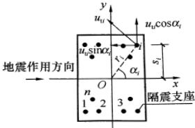

2 本条提出的隔震层扭转影响系数是简化计算（图 27）。在隔震层顶板为刚性的假定下，

图 27 隔震层扭转计算简图

由几何关系，第i支座的水平位移可写为：

 $$ u_{i}=\sqrt{(u_{c}+u_{t i}\sin\alpha_{i})^{2}+(u_{t i}\cos\alpha_{i})^{2}} $$ 

 $$ \sqrt{u_{c}^{2}+2u_{c}u_{t i}\sin\alpha_{i}+u_{t i}^{2}} $$ 

略去高阶量，可得：

 $$ \begin{aligned}&u_{i}=\eta_{i}u_{c}\\&\eta_{i}=1+(u_{t i}/u_{c})\sin\alpha_{i}\\ \end{aligned} $$ 

另一方面，在水平地震下 i 支座的附加位移可根据楼层的扭转角与支座至隔震层刚度中心的距离得到

 $$ \frac{u_{\mathrm{t i}}}{u_{\mathrm{c}}}=\frac{k_{\mathrm{h}}}{\sum k_{j}r_{j}^{2}}r_{i}e_{\mathrm{~i~}}\\ \eta_{i}=1+\frac{k_{\mathrm{h}}}{\sum k_{j}r_{j}^{2}}r_{i}e\sin\alpha_{i} $$ 

如果将隔震层平移刚度和扭转刚度用隔震层平面的几何尺寸表述，并设隔震层平面为矩形且隔震支座均匀布置，可得

 $$ \begin{aligned}k_{\mathrm{h}}&\propto ab\\\sum k_{j}r_{j}^{2}&\propto ab(a^{2}+b^{2})/12\\\eta_{i}&=1+12es_{i}/(a^{2}+b^{2})\end{aligned} $$ 

于是

对于同时考虑双向水平地震作用的扭转影响的情况，由于隔震层在两个水平方向的刚度和阻尼特性相同，若两方向隔震层顶部的水平力近似认为相等，均取为 $ F_{Ek} $ ，可有地震扭矩

 $$ M_{\mathrm{tx}}=F_{\mathrm{EK}}e_{\mathrm{y}},\quad M_{\mathrm{ty}}=F_{\mathrm{EK}}e_{\mathrm{x}} $$ 

同时作用的地震扭矩取下列二者的较大：

记为

 $$ M_{\mathrm{t}}=\sqrt{M_{\mathrm{tx}}^{2}+(0.85M_{\mathrm{ty}})^{2}}\quad\text{和}\quad M_{\mathrm{t}}=\sqrt{M_{\mathrm{ty}}^{2}+(0.85M_{\mathrm{tx}})^{2}}\quad M_{\mathrm{tx}}=F_{\mathrm{EK}}e $$ 

其中，偏心距 e 为下列二式的较大值：

 $$ e=\sqrt{e_{x}^{2}+(0.85e_{y})^{2}} 和 e=\sqrt{e_{y}^{2}+(0.85e_{x})^{2}} $$ 

考虑到施工的误差，地震剪力的偏心距 e 宜计入偶然偏心距的影响，与本规范第 5.2 节的规定相同，隔震层也采用限制扭转影响系数最小值的方法处理。由于隔震结构设计有助于减轻结构扭转反应，建议偶然偏心距可根据隔震层的情况取值，不一定取垂直

于地震作用方向边长的5%。

3 对于砌体结构，其竖向抗震验算可简化为墙体抗震承载力验算时在墙体的平均正应力  $ \sigma_{0} $  计入竖向地震应力的不利影响。

4 考虑到隔震层对竖向地震作用没有隔震效果，上部砌体结构的构造应保留与竖向抗力有关的要求。对砌体结构的局部尺寸、圈梁配筋和构造柱、芯柱的最大间距作了原则规定。

## 13 非结构构件

### 13.1 一般规定

13.1.1 非结构的抗震设计所涉及的设计领域较多，本章主要涉及与主体结构设计有关的内容，即非结构构件与主体结构的连接件及其锚固的设计。

非结构构件（如墙板、幕墙、广告牌、机电设备等）自身的抗震，系以其不受损坏为前提的，本章不直接涉及这方面的内容。

本章所列的建筑附属设备，不包括工业建筑中的生产设备和相关设施。

13.1.2 非结构构件的抗震设防目标列于本规范第3.7节。与主体结构三水准设防目标相协调，容许建筑非结构构件的损坏程度略大于主体结构，但不得危及生命。

建筑非结构构件和建筑附属机电设备支架的抗震设防分类，各国的抗震规范、标准有不同的规定，本规范大致分为高、中、低三个层次：

高要求时，外观可能损坏而不影响使用功能和防火能力，安全玻璃可能裂缝，可经受相连结构构件出现1.4倍以上设计挠度的变形，即功能系数取≥1.4；

中等要求时，使用功能基本正常或可很快恢复，耐火时间减少1/4，强化玻璃破碎，其他玻璃无下落，可经受相连结构构件出现设计挠度的变形，功能系数取1.0；

一般要求，多数构件基本处于原位，但系统可能损坏，需修理才能恢复功能，耐火时间明显降低，容许玻璃破碎下落，只能经受相连结构构件出现0.6倍设计挠度的变形，功能系数取0.6。

世界各国的抗震规范、规定中，要求对非结构的地震作用进行计算的有60%，而仅有28%对非结构的构造作出规定。考虑到我国设计人员的习惯，首先要求采取抗震措施，对于抗震计算的范围由相关标准规定，一般情况下，除了本规范第5章有明确规定的非结构构件，如出屋面女儿墙、长悬臂构件（雨篷等）外，尽量减少非结构构件地震作用计算和构件抗震验算的范围。例如，需要进行抗震验算的非结构构件大致如下：

17～9度时，基本上为脆性材料制作的幕墙及各类幕墙的连接；

28、9度时，悬挂重物的支座及其连接、出屋面广告牌和类似构件的锚固；

3 附着于高层建筑的重型商标、标志、信号等的支架；

48、9度时，乙类建筑的文物陈列柜的支座及其连接；

57～9度时，电梯提升设备的锚固件、高层建筑的电梯构件及其锚固；

67～9度时，建筑附属设备自重超过1.8kN或其体系自振周期大于0.1s的设备支架、基座及其锚固。

13.1.3 很多情况下，同一部位有多个非结构构件，如出入口通道可包括非承重墙体、悬吊顶棚、应急照明和出入信号四个非结构构件；电气转换开关可能安装在非承重隔墙上等。当抗震设防要求不同的非结构构件连接在一起时，要求低的构件也需按较高的要求设计，以确保较高设防要求的构件能满足规定。

### 13.2 基本计算要求

13.2.1 本条明确了结构专业所需考虑的非结构构件的影响，包括如何在结构设计中计入相关的重力、刚度、承载力和必要的相互作用。结构构件设计时仅计入支承非结构部位的集中作用并验算连接件的锚固。

13.2.2 非结构构件的地震作用，除了自身质量产生的惯性力外，还有支座间相对位移产生的附加作用；二者需同时组合

计算。

非结构构件的地震作用，除了本规范第5章规定的长悬臂构件外，只考虑水平方向。其基本的计算方法是对应于“地面反应谱”的“楼面谱”，即反映支承非结构构件的主体结构体系自身动力特性、非结构构件所在楼层位置和支点数量、结构和非结构阻尼特性对地面地震运动的放大作用；当非结构构件的质量较大时或非结构体系的自振特性与主结构体系的某一振型的振动特性相近时，非结构体系还将与主结构体系的地震反应产生相互影响。一般情况下，可采用简化方法，即等效侧力法计算；同时计入支座间相对位移产生的附加内力。对刚性连接于楼盖上的设备，当与楼层并为一个质点参与整个结构的计算分析时，也不必另外用楼面谱进行其地震作用计算。

要求进行楼面谱计算的非结构构件，主要是建筑附属设备，如巨大的高位水箱、出屋面的大型塔架等。采用第二代楼面谱计算可反映非结构构件对所在建筑结构的反作用，不仅导致结构本身地震反应的变化，固定在其上的非结构的地震反应也明显不同。

计算楼面谱的基本方法是随机振动法和时程分析法，当非结构构件的材料与结构体系相同时，可直接利用一般的时程分析软件得到；当非结构构件的质量较大，或材料阻尼特性明显不同，或在不同楼层上有支点，需采用第二代楼面谱的方法进行验算。此时，可考虑非结构与主体结构的相互作用，包括“吸振效应”，计算结果更加可靠。采用时程分析法和随机振动法计算楼面谱需有专门的计算软件。

13.2.3 非结构构件的抗震计算，最早见于 ACT-3，采用了静力法。

等效侧力法在第一代楼面谱（以建筑的楼面运动作为地震输入，将非结构构件作为单自由度系统，将其最大反应的均值作为楼面谱，不考虑非结构构件对楼层的反作用）基础上做了简化。各国抗震规范的非结构构件的等效侧力法，一般由设计加速度、

功能（或重要）系数、构件类别系数、位置系数、动力放大系数和构件重力六个因素所决定。

设计加速度一般取相当于设防烈度的地面运动加速度；与本规范各章协调，这里仍取多遇地震对应的加速度。

部分非结构构件的功能系数和类别系数参见本规范附录 M 第 M.2 节。

位置系数，一般沿高度为线性分布，顶点的取值，UBC97为4.0，欧洲规范为2.0，日本取3.3。根据强震观测记录的分析，对多层和一般的高层建筑，顶部的加速度约为底层的二倍；当结构有明显的扭转效应或高宽比较大时，房屋顶部和底部的加速度比例大于2.0。因此，凡采用时程分析法补充计算的建筑结构，此比值应依据时程分析法相应调整。

状态系数，取决于非结构体系的自振周期，UBC97在不同场地条件下，以周期1s时的动力放大系数为基础再乘以2.5和1.0两档，欧洲规范要求计算非结构体系的自振周期 $ T_{a} $ ，取值为 $ 3/\left[1+(1-T_{a}/T_{1})^{2}\right] $ ，日本取1.0、1.5和2.0三档。本规范不要求计算体系的周期，简化为两种极端情况，1.0适用于非结构的体系自振周期不大于0.06s等体系刚度较大的情况，其余按 $ T_{a} $ 接近于 $ T_{1} $ 的情况取值。当计算非结构体系的自振周期时，则可按 $ 2/\left[1+(1-T_{a}/T_{1})^{2}\right] $ 采用。

由此得到的地震作用系数(取位置、状态和构件类别三个系数的乘积)的取值范围，与主体结构体系相比，UBC97按场地不同为 $ 0.7\sim4.0 $ 倍[若以硬土条件下结构周期1.0s为1.0，则为 $ 0.5\sim5.6 $ 倍]，欧洲规范为 $ 0.75\sim6.0 $ 倍[若以硬土条件下结构周期1.0s为1.0，则为 $ 1.2\sim10 $ 倍]。我国一般为 $ 0.6\sim4.8 $ 倍[若以 $ T_{g}=0.4s $ 、结构周期1.0s为1.0，则为 $ 1.3\sim11 $ 倍]。

13.2.4 非结构构件支座间相对位移的取值，凡需验算层间位移者，除有关标准的规定外，一般按本规范规定的位移限值采用。

对建筑非结构构件，其变形能力相差较大。砌体材料构成的非结构构件，由于变形能力较差而限制在要求高的场所使用，国

外的规范也只有构造要求而不要求进行抗震计算；金属幕墙和高级装修材料具有较大的变形能力，国外通常由生产厂家按主体结构设计的变形要求提供相应的材料，而不是由材料决定结构的变形要求；对玻璃幕墙，《建筑幕墙》标准中已规定其平面内变形分为五个等级，最大1/100，最小1/400。

对设备支架，支座间相对位移的取值与使用要求有直接联系。例如，要求在设防烈度地震下保持使用功能（如管道不破碎等），取设防烈度下的变形，即功能系数可取2～3，相应的变形限值取多遇地震的（3～4）倍；要求在罕遇地震下不造成次生灾害，则取罕遇地震下的变形限值。

13.2.5 本条规定非结构构件地震作用效应组合和承载力验算的原则。强调不得将摩擦力作为抗震设计的抗力。

### 13.3 建筑非结构构件的基本抗震措施

89 规范各章中有关建筑非结构构件的构造要求如下：

1 砌体房屋中，后砌隔墙、楼梯间砖砌栏板的规定；

2 多层钢筋混凝土房屋中，围护墙和隔墙材料、砖填充墙布置和连接的规定；

3 单层钢筋混凝土柱厂房中，天窗端壁板、围护墙、高低跨封墙和纵横跨悬墙的材料和布置的规定，砌体隔墙和围护墙、墙梁、大型墙板等与排架柱、抗风柱的连接构造要求；

4 单层砖柱厂房中，隔墙的选型和连接构造规定；

5 单层钢结构厂房中，围护墙选型和连接要求。

2001 规范将上述规定加以合并整理，形成建筑非结构构件材料、选型、布置和锚固的基本抗震要求。还补充了吊车走道板、天沟板、端屋架与山墙间的填充小屋面板，天窗端壁板和天窗侧板下的填充砌体等非结构件与支承结构可靠连接的规定。

玻璃幕墙已有专门的规程，预制墙板、顶棚及女儿墙、雨篷等附属构件的规定，也由专门的非结构抗震设计规程加以规定。

本次修订的主要内容如下：

13.3.3 将砌体房屋中关于烟道、垃圾道的规定移入本节。

13.3.4 增加了框架楼梯间等处填充墙设置钢丝网面层加强的要求。

13.3.5 进一步明确厂房围护墙的设置应注意下列问题：

1 唐山地震震害经验表明：嵌砌墙的墙体破坏较外贴墙轻得多，但对厂房的整体抗震性能极为不利，在多跨厂房和外纵墙不对称布置的厂房中，由于各柱列的纵向侧移刚度差别悬殊，导致厂房纵向破坏，倒塌的震例不少，即使两侧均为嵌砌墙的单跨厂房，也会由于纵向侧移刚度的增加而加大厂房的纵向地震作用效应，特别是柱顶地震作用的集中对柱顶节点的抗震很不利，容易造成柱顶节点破坏，危及屋盖的安全，同时由于门窗洞口处刚度的削弱和突变，还会导致门窗洞口处柱子的破坏，因此，单跨厂房也不宜在两侧采用嵌砌墙。

2 砖砌体的高低跨封墙和纵横向厂房交接处的悬墙，由于质量大、位置高，在水平地震作用特别是高振型影响下，外甩力大，容易发生外倾、倒塌，造成高砸低的震害，不仅砸坏低屋盖，还可能破坏低跨设备或伤人，危害严重，唐山地震中，这种震害的发生率很高，因此，宜采用轻质墙板，当必须采用砖砌体时，应加强与主体结构的锚拉。

3 高低跨封墙直接砌在低跨屋面板上时，由于高振型和上、下变形不协调的影响，容易发生倒塌破坏，并砸坏低跨屋盖，邢台地震7度区就有这种震例。

4 砌体女儿墙的震害较普遍，故规定需设置时，应控制其高度，并采取防地震时倾倒的构造措施。

5 不同墙体材料的质量、刚度不同，对主体结构的地震影响不同，对抗震不利，故不宜采用。必要时，宜采用相应的措施。

13.3.6 本条文字表达略有修改。轻型板材是指彩色涂层压型钢板、硬质金属面夹芯板，以及铝合金板等轻型板材。

降低厂房屋盖和围护结构的重量，对抗震十分有利。震害调

查表明，轻型墙板的抗震效果很好。大型墙板围护厂房的抗震性能明显优于砌体围护墙厂房。大型墙板与厂房柱刚性连接，对厂房的抗震不利，并对厂房的纵向温度变形、厂房柱不均匀沉降以及各种振动也都不利。因此，大型墙板与厂房柱间应优先采用柔性连接。

嵌砌砌体墙对厂房的纵向抗震不利，故一般不应采用。

### 13.4 建筑附属机电设备支架的基本抗震措施

本规范仅规定对附属机电设备支架的基本要求。并参照美国UBC规范的规定，给出了可不作抗震设防要求的一些小型设备和小直径的管道。

建筑附属机电设备的种类繁多，参照美国 UBC97 规范，要求自重超过 1.8kN（400 磅）或自振周期大于 0.1s 时，要进行抗震计算。计算自振周期时，一般采用单质点模型。对于支承条件复杂的机电设备，其计算模型应符合相关设备标准的要求。

## 附录 M 实现抗震性能设计目标的参考方法

### M.1 结构构件抗震性能设计方法

M.1.1 本条依据震害，尽可能将结构构件在地震中的破坏程度，用构件的承载力和变形的状态做适当的定量描述，以作为性能设计的参考指标。

关于中等破坏时构件变形的参考值，大致取规范弹性限值和弹塑性限值的平均值；构件接近极限承载力时，其变形比中等破坏小些；轻微损坏，构件处于开裂状态，大致取中等破坏的一半。不严重破坏，大致取规范不倒塌的弹塑性变形限值的90%。

不同性能要求的位移及其延性要求，参见图28。从中可见，对于非隔震、减震结构，性能1，在罕遇地震时层间位移可按线性弹性计算，约为 $ \left[\Delta u_{e}\right] $ ，震后基本不存在残余变形；性能2，震时位移小于 $ 2\left[\Delta u_{e}\right] $ ，震后残余变形小于 $ 0.5\left[\Delta u_{e}\right] $ ；性能3，考虑阻尼有所增加，震时位移约为 $ (4\sim5)\left[\Delta u_{e}\right] $ ，按退化刚度估计震后残余变形约 $ \left[\Delta u_{e}\right] $ ；性能4，考虑等效阻尼加大和刚度退化，震时位移约为 $ (7\sim8)\left[\Delta u_{e}\right] $ ，震后残余变形约 $ 2\left[\Delta u_{e}\right] $ 。

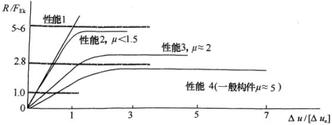

图 28 不同性能要求的位移和延性需求示意图

从抗震能力的等能量原理，当承载力提高一倍时，延性要求减少一半，故构造所对应的抗震等级大致可按降低一度的规定采

用。延性的细部构造，对混凝土构件主要指箍筋、边缘构件和轴压比等构造，不包括影响正截面承载力的纵向受力钢筋的构造要求；对钢结构构件主要指长细比、板件宽厚比、加劲肋等构造。

M.1.2 本条列出了实现不同性能要求的构件承载力验算表达式，中震和大震均不考虑地震效应与风荷载效应的组合。

设计值复核，需计入作用分项系数、抗力的材料分项系数、承载力抗震调整系数，但计入和不计入不同抗震等级的内力调整系数时，其安全性的高低略有区别。

标准值和极限值复核，不计入作用分项系数、承载力抗震调整系数和内力调整系数，但材料强度分别取标准值和最小极限值。其中，钢材强度的最小极限值 $ f_{u} $  按《高层民用建筑钢结构技术规程》JGJ 99 采用，约为钢材屈服强度的（1.35～1.5）倍；钢筋最小极限强度参照本规范第3.9.2条，取钢筋屈服强度 $ f_{y} $  的1.25倍；混凝土最小极限强度参照《混凝土结构设计规范》GB 50011-2002 第4.1.3条的说明，考虑实际结构混凝土强度与试件混凝土强度的差异，取立方强度的0.88倍。

#### M.1.3 本条给出竖向构件弹塑性变形验算的注意事项。

对于不同的破坏状态，弹塑性分析的地震作用和变形计算的方法也不同，需分别处理。

地震作用下构件弹塑性变形计算时，必须依据其实际的承载力——取材料强度标准值、实际截面尺寸（含钢筋截面）、轴向力等计算，考虑地震强度的不确定性，构件材料动静强度的差异等等因素的影响，从工程的角度，构件弹塑性参数可仍按杆件模型适当简化，参照 IBC 的规定，建议混凝土构件的初始刚度取短期或长期刚度，至少按  $ 0.85E_{c}I $  简化计算。

结构的竖向构件在不同破坏状态下层间位移角的参考控制目标，若依据试验结果并扣除整体转动影响，墙体的控制值要远小于框架柱。从工程应用的角度，参照常规设计时各楼层最大层间位移角的限值，若干结构类型按本条正文规定得到的变形最大的楼层中竖向构件最大位移角限值，如表9所示。

表 9 结构竖向构件对应于不同破坏状态的最大层间位移角参考控制目标

<table border=1 style='margin: auto; width: max-content;'><tr><td style='text-align: center;'>结构类型</td><td style='text-align: center;'>完好</td><td style='text-align: center;'>轻微损坏</td><td style='text-align: center;'>中等破坏</td><td style='text-align: center;'>不严重破坏</td></tr><tr><td style='text-align: center;'>钢筋混凝土框架</td><td style='text-align: center;'>1/550</td><td style='text-align: center;'>1/250</td><td style='text-align: center;'>1/120</td><td style='text-align: center;'>1/60</td></tr><tr><td style='text-align: center;'>钢筋混凝土抗震墙、筒中筒</td><td style='text-align: center;'>1/1000</td><td style='text-align: center;'>1/500</td><td style='text-align: center;'>1/250</td><td style='text-align: center;'>1/135</td></tr><tr><td style='text-align: center;'>钢筋混凝土框架-抗震墙、板柱-抗震墙、框架-核心筒</td><td style='text-align: center;'>1/800</td><td style='text-align: center;'>1/400</td><td style='text-align: center;'>1/200</td><td style='text-align: center;'>1/110</td></tr><tr><td style='text-align: center;'>钢筋混凝土框支层</td><td style='text-align: center;'>1/1000</td><td style='text-align: center;'>1/500</td><td style='text-align: center;'>1/250</td><td style='text-align: center;'>1/135</td></tr><tr><td style='text-align: center;'>钢结构</td><td style='text-align: center;'>1/300</td><td style='text-align: center;'>1/200</td><td style='text-align: center;'>1/100</td><td style='text-align: center;'>1/55</td></tr><tr><td style='text-align: center;'>钢框架-钢筋混凝土内筒、型钢混凝土框架-钢筋混凝土内筒</td><td style='text-align: center;'>1/800</td><td style='text-align: center;'>1/400</td><td style='text-align: center;'>1/200</td><td style='text-align: center;'>1/110</td></tr></table>

### M.2 建筑构件和建筑附属设备支座抗震性能设计方法

各类建筑构件在强烈地震下的性能，一般允许其损坏大于结构构件，在大震下损坏不对生命造成危害。固定于结构的各类机电设备，则需考虑使用功能保持的程度，如检修后照常使用、一般性修理后恢复使用、更换部分构件的大修后恢复使用等。

本附录的表 M.2.2 和表 M.2.3 来自 2001 规范第 13.2.3 条的条文说明，主要参考国外的相关规定。

关于功能系数，UBC97分1.5和1.0两档，欧洲规范分1.5、1.4、1.2、1.0和0.8五档，日本取1.0，2/3，1/2三档。本附录按设防类别和使用要求确定，一般分为三档，取≥1.4、1.0和0.6。

关于构件类别系数，美国早期的 ATC-3 分 0.6、0.9、1.5、2.0、3.0 五档，UBC97 称反应修正系数，无延性材料或采用胶粘剂的锚固为 1.0，其余分为 2/3、1/3、1/4 三档，欧洲规范分 1.0 和 1/2 两档。本附录分 0.6、0.9、1.0 和 1.2 四档。

### M.3 建筑构件和建筑附属设备抗震计算的楼面谱方法

非结构抗震设计的楼面谱，即从具体的结构及非结构所在的

楼层在地震下的运动（如实际加速度记录或模拟加速度时程）得到具体的加速度谱，体现非结构动力特性对所处环境（场地条件、结构特性、非结构位置等）地震反应的再次放大效果。对不同的结构或同一结构的不同楼层，其楼面谱均不相同，在与结构体系主要振动周期相近的若干周期段，均有明显的放大效果。下面给出北京长富宫的楼面谱，可以看到上述特点。

北京长富宫为地上25层的钢结构，前六个自振周期为3.45s、1.15s、0.66s、0.48s、0.46s、0.35s。采用随机振动法计算的顶层楼面反应谱如图29所示，说明非结构的支承条件不同时，与主体结构的某个振型发生共振的机会是较多的。

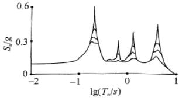

图 29 长富宫顶层的楼面反应谱

## 14 地下建筑

### 14.1 一般规定

14.1.1 本章是新增加的，主要规定地下建筑不同于地面建筑的抗震设计要求。

地下建筑种类较多，有的抗震能力强，有的使用要求高，有的服务于人流、车流，有的服务于物资储藏，抗震设防应有不同的要求。本章的适用范围为单建式地下建筑，且不包括地下铁道和城市公路隧道，因为地下铁道和城市公路隧道等属于交通运输类工程。

高层建筑的地下室（包括设置防震缝与主楼对应范围分开的地下室）属于附建式地下建筑，其性能要求通常与地面建筑一致，可按本规范有关章节所提出的要求设计。

随着城市建设的快速发展，单建式地下建筑的规模正在增大，类型正在增多，其抗震能力和抗震设防要求也有差异，需要在工程设计中进一步研究，逐步解决。

14.1.2 建设场地的地形、地质条件对地下建筑结构的抗震性能均有直接或间接的影响。选择在密实、均匀、稳定的地基上建造，有利于结构在经受地震作用时保持稳定。

14.1.3、14.1.4 对称、规则并具有良好的整体性，及结构的侧向刚度宜自下而上逐渐减小等是抗震结构建筑布置的常见要求。地下建筑与地面建筑的区别是，地下建筑结构尤应力求体型简单，纵向、横向外形平顺，剖面形状、构件组成和尺寸不沿纵向经常变化，使其抗震能力提高。

关于钢筋混凝土结构的地下建筑的抗震等级，其要求略高于高层建筑的地下室，这是由于：

① 高层建筑地下室，在楼房倒塌后一般即弃之不用，单建

式地下建筑则在附近房屋倒塌后仍常有继续服役的必要，其使用功能的重要性常高于高层建筑地下室；

② 地下结构一般不宜带缝工作，尤其是在地下水位较高的场合，其整体性要求高于地面建筑；

③ 地下空间通常是不可再生的资源，损坏后一般不能推倒重来，需原地修复，而难度较大。

本条的具体规定主要针对乙类、丙类设防的地下建筑，其他设防类别，除有具体规定外，可按本规范相关规定提高或降低。

14.1.5 岩石地下建筑的口部结构往往是抗震能力薄弱的部位，洞口的地形、地质条件则对口部结构的抗震稳定性有直接的影响，故应特别注意洞口位置和口部结构类型的选择的合理性。

### 14.2 计算要点

14.2.1 本条根据当前的工程经验，确定抗震设计中可不进行计算分析的地下建筑的范围。

设防烈度为 7 度时Ⅰ、Ⅱ类场地中的丙类建筑可不计算，主要是参考唐山地震中天津市人防工程震害调查的资料。

设防烈度为8度（0.20g）Ⅰ、Ⅱ类场地中层数不多于2层、体型简单、跨度不大、构件连结整体性好的丙类建筑，其结构刚度相对较大，抗震能力相对较强，具有设计经验时也可不进行地震作用计算。

14.2.2 本条规定地下建筑抗震计算的模型和相应的计算方法。

1 地下建筑结构抗震计算模型的最大特点是，除了结构自身受力、传力途径的模拟外，还需要正确模拟周围土层的影响。

长条形地下结构按横截面的平面应变问题进行抗震计算的方法，一般适用于离端部或接头的距离达1.5倍结构跨度以上的地下建筑结构。端部和接头部位等的结构受力变形情况较复杂，进行抗震计算时原则上应按空间结构模型进行分析。

结构形式、土层和荷载分布的规则性对结构的地震反应都有影响，差异较大时地下结构的地震反应也将有明显的空间效应。

此时，即使是外形相仿的长条形结构，也宜按空间结构模型进行抗震计算和分析。

2 对地下建筑结构，反应位移法、等效水平地震加速度法或等效侧力法，作为简便方法，仅适用于平面应变问题的地震反应分析；其余情况，需要采用具有普遍适用性的时程分析法。

3 反应位移法。采用反应位移法计算时，将土层动力反应位移的最大值作为强制位移施加于结构上，然后按静力原理计算内力。土层动力反应位移的最大值可通过输入地震波的动力有限元计算确定。

以长条形地下结构为例，其横截面的等效侧向荷载为由两侧土层变形形成的侧向力 $ p(z) $ 、结构自重产生的惯性力及结构与周围土层间的剪切力 $ \tau $ 三者的总和（图30）。地下结构本身的惯性力，可取结构的质量乘以最大加速度，并施加在结构重心上。

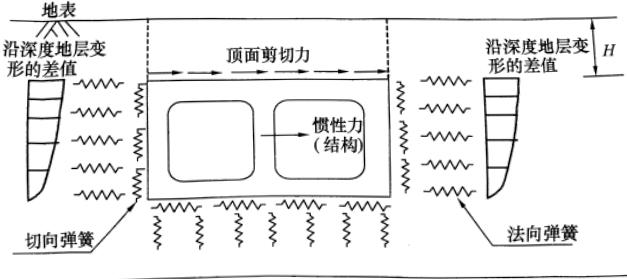

计算区域的底部边界

图 30 反应位移法的等效荷载

 $ p(z) $  和  $ \tau $  可按下列公式计算：

 $$ \tau=\frac{G}{\pi H}S_{\mathrm{v}}T_{\mathrm{s}} $$ 

 $$ p(z)=k_{\mathrm{h}}\left[u(z)-u(z_{\mathrm{b}})\right] $$ 

式中， $ \tau $  为地下结构顶板上表面与土层接触处的剪切力；G 为土层的动剪变模量，可采用结构周围地层中应变水平为  $ 10^{-4} $  量级

的地层的剪切刚度，其值约为初始值的70%~80%；H为顶板以上土层的厚度， $ S_{v} $ 为基底上的速度反应谱，可由地面加速度反应谱得到； $ T_{s} $ 为顶板以上土层的固有周期； $ p(z) $ 为土层变形形成的侧向力， $ u(z) $ 为距地表深度z处的地震土层变形； $ z_{b} $ 为地下结构底面距地表面的深度； $ k_{h} $ 为地震时单位面积的水平向土层弹簧系数，可采用不包含地下结构的土层有限元网格，在地下结构处施加单位水平力然后求出对应的水平变形得到。

4 等效水平地震加速度法。此法将地下结构的地震反应简化为沿垂直向线性分布的等效水平地震加速度的作用效应，计算采用的数值方法常为有限元法；等效侧力法将地下结构的地震反应简化为作用在节点上的等效水平地震惯性力的作用效应，从而可采用结构力学方法计算结构的动内力。两种方法都较简单，尤其是等效侧力法。但二者需分别得出等效水平地震加速度荷载系数和等效侧力系数等的取值，普遍适用性较差。

5 时程分析法。根据软土地区的研究成果，平面应变问题时程分析法网格划分时，侧向边界宜取至离相邻结构边墙至少3倍结构宽度处，底部边界取至基岩表面，或经时程分析试算结果趋于稳定的深度处，上部边界取至地表。计算的边界条件，侧向边界可采用自由场边界，底部边界离结构底面较远时可取为可输入地震加速度时程的固定边界，地表为自由变形边界。

采用空间结构模型计算时，在横截面上的计算范围和边界条件可与平面应变问题的计算相同，纵向边界可取为离结构端部距离为2倍结构横断面面积当量宽度处的横剖面，边界条件均宜为自由场边界。

14.2.3 本条规定地下结构抗震计算的主要设计参数：

1 地下结构的地震作用方向与地面建筑的区别。首先是对于长条形地下结构，作用方向与其纵轴方向斜交的水平地震作用，可分解为横断面上和沿纵轴方向作用的水平地震作用，二者强度均将降低，一般不可能单独起控制作用。因而对其按平面应变问题分析时，一般可仅考虑沿结构横向的水平地震作用；对地

下空间综合体等体型复杂的地下建筑结构，宜同时计算结构横向和纵向的水平地震作用。其次是对竖向地震作用的要求，体型复杂的地下空间结构或地基地质条件复杂的长条形地下结构，都易产生不均匀沉降并导致结构裂损，因而即使设防烈度为7度，必要时也需考虑竖向地震作用效应的综合作用。

2 地面以下地震作用的大小。地面下设计基本地震加速度值随深度逐渐减小是公认的，但取值各国有不同的规定；一般在基岩面取地表的 1/2，基岩至地表按深度线性内插。我国《水工建筑物抗震设计规范》DL 5073 第 9.1.2 条规定地表为基岩面时，基岩面下 50m 及其以下部位的设计地震加速度代表值可取为地表规定值的 1/2，不足 50m 处可按深度由线性插值确定。对于进行地震安全性评价的场地，则可根据具体情况按一维或多维的模型进行分析后确定其减小的规律。

3 地下结构的重力荷载代表值。地下建筑结构静力设计时，水、土压力是主要荷载，故在确定地下建筑结构的重力荷载的代表值时，应包含水、土压力的标准值。

4 土层的计算参数。软土的动力特性采用 Davidenkov 模型表述时，动剪变模量 G、阻尼比  $ \lambda $  与动剪应变  $ \gamma_{d} $  之间满足关系式：

 $$ \frac{G}{G_{\max}}=1-\left[\frac{(\gamma_{\mathrm{d}}/\gamma_{0})^{2B}}{1+(\gamma_{\mathrm{d}}/\gamma_{0})^{2B}}\right]^{A} $$ 

 $$ \frac{\lambda}{\lambda_{max}}=\left[1-\frac{G}{G_{max}}\right]^{\beta} $$ 

式中， $ G_{max} $  为最大动剪变模量， $ \gamma_{0} $  为参考应变， $ \lambda_{max} $  为最大阻尼比，A、B、 $ \beta $  为拟合参数。

以上参数可由土的动力特性试验确定，缺乏资料时也可按下列经验公式估算。

 $$ G_{\mathrm{max}}=\rho c_{\mathrm{s}}^{2} $$ 

 $$ \lambda_{\mathrm{max}}=\alpha_{2}-\alpha_{3}(\sigma_{\mathrm{v}}^{\prime})^{\frac{1}{2}} $$ 

 $$ \sigma_{\mathrm{v}}^{\prime}=\sum_{i=1}^{n}\gamma_{i}^{\prime}h_{i} $$ 

式中， $ \rho $  为质量密度， $ c_{s} $  为剪切波速， $ \sigma_{v}^{\prime} $  为有效上覆压力， $ \gamma_{i}^{\prime} $  为第 i 层土的有效重度， $ h_{i} $  为第 i 层土的厚度， $ \alpha_{2} $ 、 $ \alpha_{3} $  为经验常数，可由当地试验数据拟合分析确定。

14.2.4 地下建筑不同于地面建筑的抗震验算内容如下：

1 一般应进行多遇地震下承载力和变形的验算。

2 考虑地下建筑修复的难度较大，将罕遇地震作用下混凝土结构弹塑性层间位移角的限值取为  $ \left[\theta_{p}\right]=1/250 $  。由于多遇地震作用下按结构弹性状态计算得到的结果可能不满足罕遇地震作用下的弹塑性变形要求，建议进行设防地震下构件承载力和结构变形验算，使其在设防地震下可安全使用，在罕遇地震下能满足抗震变形验算的要求。

3 在有可能液化的地基中建造地下建筑结构时，应注意检验其抗浮稳定性，并在必要时采取措施加固地基，以防地震时结构周围的场地液化。鉴于经采取措施加固后地基的动力特性将有变化，本条要求根据实测标准贯入锤击数与临界锤击数的比值确定液化折减系数，并进而计算地下连续墙和抗拔桩等的摩阻力。

### 14.3 抗震构造措施和抗液化措施

14.3.1 地下钢筋混凝土框架结构构件的尺寸常大于同类地面结构的构件，但因使用功能不同的框架结构要求不一致，因而本条仅提构件最小尺寸应至少符合同类地面建筑结构构件的规定，而未对其规定具体尺寸。

地下钢筋混凝土结构按抗震等级提出的构造要求，第3款为根据“强柱弱梁”的设计概念适当加强框架柱的措施。

此次局部修订进行文字调整，以明确最小总配筋率取值规定。

14.3.2 本条规定比地上板柱结构有所加强，旨在便于协调安全受力和方便施工的需要。为加快施工进度，减少基坑暴露时间，地下建筑结构的底板、顶板和楼板常采用无梁肋结构，由此使底

板、顶板和楼板等的受力体系不再是板梁体系，故在必要时宜通过在柱上板带中设置暗梁对其加强。

为加强楼盖结构的整体性，第2款提出加强周边墙体与楼板的连接构造的措施。

水平地震作用下，地下建筑侧墙、顶板和楼板开孔都将影响结构体系的抗震承载能力，故有必要适当限制开孔面积，并辅以必要的措施加强孔口周围的构件。

此次局部修订进行文字调整，明确暗梁的设置范围。

14.3.3 根据单建式地下建筑结构的特点，提出遇到液化地基时可采用的处理技术和要求。

对周围土体和地基中存在的液化土层，注浆加固和换土等技术措施可有效地消除或减轻液化危害。

对液化土层未采取措施时，应考虑其上浮的可能性，验算方法及要求见本章第14.2节，必要时应采取抗浮措施。

地基中包含薄的液化土夹层时，以加强地下结构而不是加固地基为好。当基坑开挖中采用深度大于20m的地下连续墙作为围护结构时，坑内土体将因受到地下连续墙的挟持包围而形成较好的场地条件，地震时一般不可能液化。这两种情况，周围土体都存在液化土，在承载力及抗浮稳定性验算中，仍应计入周围土层液化引起的土压力增加和摩阻力降低等因素的影响。

14.3.4 当地下建筑不可避免地必须通过滑坡和地质条件剧烈变化的地段时，本条给出了减轻地下建筑结构地震作用效应的构造措施。

14.3.5 汶川地震中公路隧道的震害调查表明，当断层破碎带的复合式支护采用素混凝土内衬时，地震下内衬结构严重裂损并大量坍塌，而采用钢筋混凝土内衬结构的隧道口部地段，复合式支护的内衬结构仅出现裂缝。因此，要求在断层破碎带中采用钢筋混凝土内衬结构。